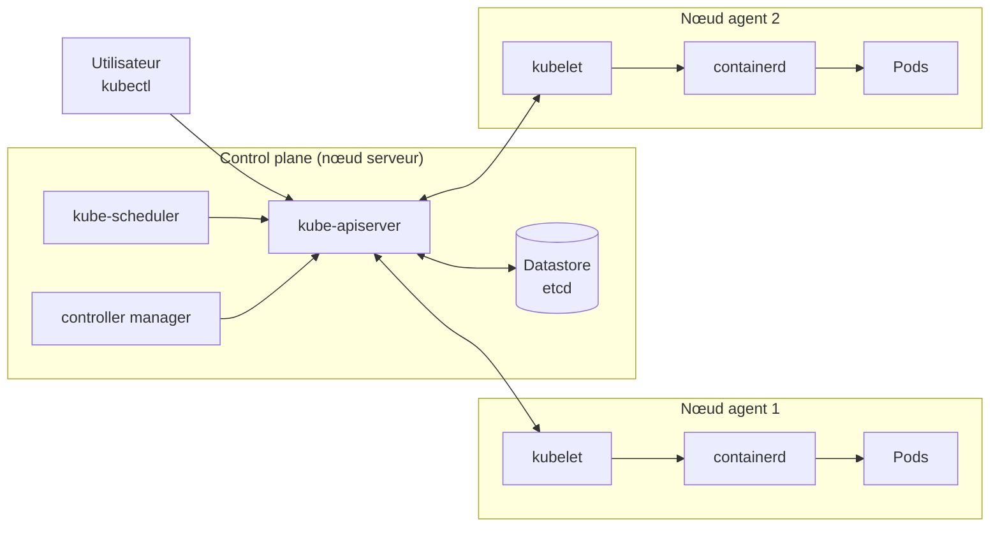
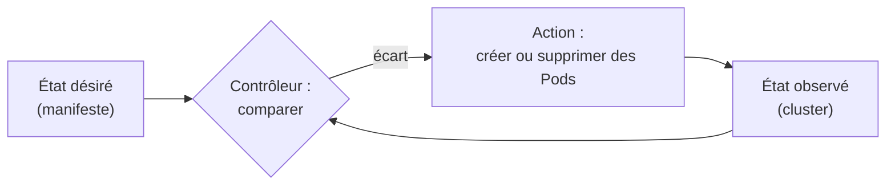

# Chapitre 1 : Architecture de Kubernetes

!!! abstract "Objectifs du chapitre"
    - Expliquer pourquoi on orchestre des conteneurs
    - Décrire les composants du control plane et d'un nœud
    - Expliquer le modèle déclaratif et la boucle de réconciliation
    - Situer k3s par rapport à Kubernetes
    - Acquis d'apprentissage visé : **AA1**

## 1. Du conteneur à l'orchestration

Un conteneur isole un processus et embarque tout ce dont il a besoin dans une image portable. Sur une seule machine, quelques commandes suffisent. En production, de nouvelles questions apparaissent :

- que faire quand un conteneur ou une machine tombe en panne ?
- comment répartir les conteneurs sur plusieurs machines ?
- comment augmenter ou réduire le nombre d'instances selon la charge ?
- comment mettre à jour une application sans interrompre le service ?
- comment les applications se retrouvent-elles entre elles ?

Un **orchestrateur** automatise ces tâches. **Kubernetes** (abrégé « K8s ») est un projet open source, devenu le standard de fait, aujourd'hui hébergé par la Cloud Native Computing Foundation (CNCF).

## 2. Architecture d'un cluster

Un cluster est un ensemble de machines (les **nœuds**) pilotées par un **control plane**.



| Composant | Rôle |
|---|---|
| **kube-apiserver** | Point d'entrée unique (API REST). Tout passe par lui : `kubectl`, les autres composants, les applications. |
| **etcd** (datastore) | Base clé-valeur qui conserve l'état du cluster. |
| **kube-scheduler** | Choisit le nœud qui exécutera chaque nouveau Pod. |
| **controller manager** | Exécute les boucles de contrôle (maintien du nombre de réplicas, surveillance des nœuds…). |
| **kubelet** | Agent présent sur chaque nœud : démarre les conteneurs des Pods qui lui sont assignés et remonte leur état. |
| **kube-proxy** | Programme les règles réseau qui permettent aux Services d'atteindre les Pods. |
| **Runtime de conteneurs** | Exécute réellement les conteneurs (ici **containerd**). |

## 3. Le modèle déclaratif

On ne dit pas à Kubernetes *comment* faire, mais *quel état* on veut : « je veux 3 réplicas de cette application ». Cet **état désiré** est décrit dans un fichier YAML (un **manifeste**) envoyé à l'API. Les contrôleurs comparent en permanence l'état désiré à l'**état observé** et corrigent l'écart : c'est la **boucle de réconciliation**.



Exemple : si un des 3 Pods disparaît, le contrôleur constate qu'il n'y en a plus que 2 et en recrée un, sans intervention humaine.

## 4. Les objets de base

| Objet | Rôle | Étudié au |
|---|---|---|
| **Pod** | Plus petite unité déployable : un ou plusieurs conteneurs qui partagent réseau et stockage | Chapitre 2 |
| **ReplicaSet** | Maintient un nombre donné de Pods identiques | Chapitre 2 |
| **Deployment** | Gère les ReplicaSets : mises à jour progressives, retour arrière | Chapitre 2 |
| **Service** | Adresse stable pour joindre un groupe de Pods | Chapitre 3 |
| **Namespace** | Espace de noms qui isole des ressources au sein du cluster | Chapitre 1 |

Tout manifeste comporte quatre champs principaux :

```yaml
apiVersion: v1          # version de l'API pour cet objet
kind: Pod               # type d'objet
metadata:               # identité : nom, labels, namespace
  name: web
  labels:
    app: web
spec:                   # état désiré
  containers:
    - name: web
      image: nginx:alpine
      ports:
        - containerPort: 80
```

## 5. Et k3s ?

**k3s** est une distribution Kubernetes certifiée, conçue pour être légère : le control plane tient dans un **binaire unique**, ce qui la rend idéale pour des machines virtuelles modestes, l'apprentissage ou la périphérie (edge). Elle fournit par défaut :

| Besoin | Composant inclus dans k3s |
|---|---|
| Runtime de conteneurs | containerd |
| Réseau entre Pods | Flannel |
| DNS du cluster | CoreDNS |
| Ingress | Traefik |
| Service de type LoadBalancer | ServiceLB |
| Stockage | local-path-provisioner |
| Métriques | metrics-server |

Les nœuds ont deux rôles : **server** (control plane, qui peut aussi exécuter des Pods) et **agent** (exécute les Pods). Avec un seul serveur, le datastore est SQLite ; en haute disponibilité (chapitre 8), k3s utilise un etcd embarqué.

!!! tip "À retenir"
    - Kubernetes orchestre des conteneurs : placement, redémarrage, mise à l'échelle, mises à jour.
    - Le **control plane** décide, les **nœuds** exécutent.
    - On décrit un **état désiré** ; les contrôleurs le maintiennent.
    - Un manifeste = `apiVersion`, `kind`, `metadata`, `spec`.
    - **k3s** = Kubernetes allégé, avec Traefik, ServiceLB et local-path déjà installés.

## Pour vérifier votre compréhension

??? question "Quel composant décide sur quel nœud sera exécuté un nouveau Pod ?"
    Le **kube-scheduler**. Le kubelet du nœud choisi démarre ensuite les conteneurs.

??? question "Un Pod d'un Deployment à 3 réplicas est supprimé à la main. Que se passe-t-il, et pourquoi ?"
    Un nouveau Pod est créé automatiquement : la boucle de réconciliation détecte l'écart entre l'état désiré (3) et l'état observé (2).

??? question "Pourquoi tous les composants passent-ils par le kube-apiserver ?"
    Il est le point d'entrée unique et le seul à dialoguer avec le datastore : il centralise l'authentification, la validation et la mise à jour de l'état.

## Labs du chapitre

- [Lab 1.1 : Installer k3s et explorer le cluster](lab-1-1-installer-k3s.md)
- [Lab 1.2 : Prise en main de kubectl](lab-1-2-kubectl.md)
