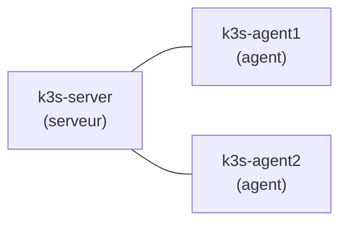

# Lab 1.1 : Installer k3s et explorer le cluster

| | |
|---|---|
| **Durée** | 60 à 75 min |
| **Niveau** | Guidé |
| **Prérequis** | 3 VMs Ubuntu Server (voir [Environnement VMware](../../annexes/environnement-vmware.md)), accès Internet, droits `sudo` |
| **Acquis visés** | AA1 |

!!! abstract "Objectifs"
    - Installer un cluster k3s à 1 serveur et 2 agents
    - Vérifier l'état des nœuds
    - Repérer les composants du cluster dans le namespace `kube-system`

## Contexte et schéma

Vous disposez de trois machines virtuelles. L'une devient le **serveur** (control plane), les deux autres des **agents** qui exécuteront vos applications.



## Étapes

### Étape 1 : Préparer les trois machines

Sur chaque VM, donnez un **nom d'hôte unique** (indispensable : deux nœuds de même nom ne peuvent pas rejoindre le cluster) puis notez son adresse IP :

```bash
sudo hostnamectl set-hostname k3s-server     # k3s-agent1 et k3s-agent2 sur les deux autres
hostname
ip -4 addr show | grep inet
```

Vérifiez que les VMs se joignent entre elles (`ping`) et accèdent à Internet.

!!! warning "Pare-feu"
    Si `ufw` est actif, désactivez-le pour le TP (`sudo ufw disable`) ou ouvrez au minimum : **6443/tcp** (API), **8472/udp** (réseau Flannel) et **10250/tcp** (kubelet).

### Étape 2 : Installer le serveur

Sur `k3s-server` :

```bash
curl -sfL https://get.k3s.io | sh -
sudo systemctl status k3s --no-pager
sudo k3s kubectl get nodes
```

!!! success "Point de contrôle"
    - [ ] Le service `k3s` est `active (running)`
    - [ ] Un nœud `k3s-server` apparaît à l'état `Ready`

### Étape 3 : Récupérer le jeton d'adhésion

Toujours sur le serveur :

```bash
sudo cat /var/lib/rancher/k3s/server/node-token
```

Copiez ce jeton (c'est un secret : ne le publiez pas) et notez l'IP du serveur.

### Étape 4 : Joindre les deux agents

Sur `k3s-agent1`, puis sur `k3s-agent2` (remplacez les deux valeurs) :

```bash
curl -sfL https://get.k3s.io | K3S_URL=https://<IP_SERVEUR>:6443 K3S_TOKEN=<JETON> sh -
sudo systemctl status k3s-agent --no-pager
```

### Étape 5 : Vérifier le cluster

Retour sur le serveur :

```bash
sudo k3s kubectl get nodes -o wide
```

!!! success "Point de contrôle"
    - [ ] Trois nœuds sont à l'état `Ready`
    - [ ] Les rôles et les adresses IP correspondent à votre plan

### Étape 6 : Utiliser kubectl sans `sudo`

Copiez le fichier d'accès (kubeconfig) dans votre dossier personnel :

```bash
mkdir -p ~/.kube
sudo cp /etc/rancher/k3s/k3s.yaml ~/.kube/config
sudo chown $USER:$USER ~/.kube/config
chmod 600 ~/.kube/config
kubectl get nodes
```

### Étape 7 : Explorer le cluster

```bash
kubectl cluster-info
kubectl get namespaces
kubectl get pods -A -o wide
kubectl get all -n kube-system
sudo ls /var/lib/rancher/k3s/server/manifests/
```

Repérez : CoreDNS, Traefik, metrics-server, local-path-provisioner. Observez sur quels nœuds ils s'exécutent.

!!! success "Point de contrôle"
    - [ ] Tous les Pods de `kube-system` sont `Running` ou `Completed`
    - [ ] Vous avez identifié le Pod Traefik et le Service associé

## Questions de réflexion

??? question "Quel composant joue le rôle de Ingress controller dans k3s, et dans quel namespace est-il ?"
    **Traefik**, dans `kube-system`.

??? question "Pourquoi le jeton d'adhésion est-il sensible ?"
    Quiconque le possède peut ajouter un nœud au cluster et recevoir des charges de travail.

??? question "Où se trouve le datastore du cluster dans cette installation à un seul serveur ?"
    Dans une base **SQLite** gérée par k3s sur le serveur (un etcd embarqué n'est utilisé qu'en haute disponibilité).

## Dépannage

| Symptôme | Pistes |
|---|---|
| Un agent n'apparaît pas dans `get nodes` | `sudo journalctl -u k3s-agent -n 50` ; vérifier l'IP et le port 6443, le jeton, le pare-feu |
| Un nœud reste `NotReady` | Attendre 1 à 2 minutes ; `kubectl describe node <nom>` ; vérifier l'accès Internet de la VM |
| Deux nœuds portent le même nom | Changer le nom d'hôte, puis désinstaller et réinstaller k3s sur cette VM |
| `kubectl` renvoie une erreur de connexion | Vérifier que `~/.kube/config` existe et contient l'IP du serveur |

## Nettoyage et reprise

Pour repartir de zéro (ou après une erreur) :

```bash
/usr/local/bin/k3s-uninstall.sh          # sur le serveur
/usr/local/bin/k3s-agent-uninstall.sh    # sur chaque agent
```

!!! tip "Conseil"
    Une fois le cluster fonctionnel, faites un **snapshot** de chaque VM dans VMware Workstation : vous pourrez revenir à cet état propre avant chaque séance.
