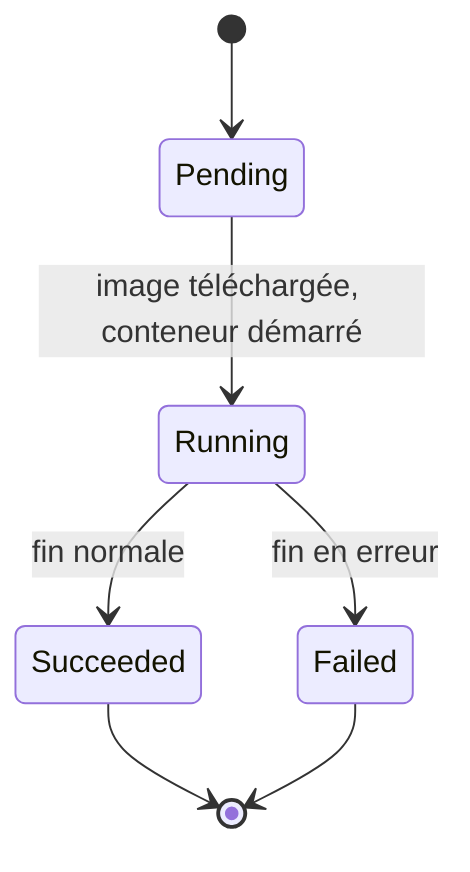
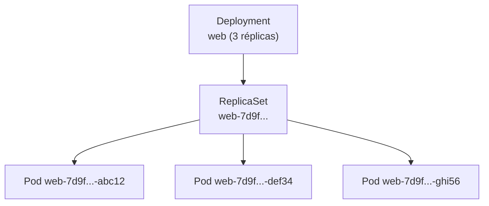
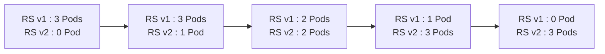

# Chapitre 2 : Pods et Deployments

!!! abstract "Objectifs du chapitre"
    - Décrire ce qu'est un Pod et les grandes étapes de son cycle de vie
    - Expliquer le rôle des labels et des sélecteurs
    - Expliquer la chaîne Deployment, ReplicaSet, Pods
    - Décrire une mise à jour progressive (rolling update) et un retour arrière
    - Acquis d'apprentissage visés : **AA1**, **AA2**

## 1. Le Pod

Le **Pod** est la plus petite unité que Kubernetes déploie et planifie. Il contient un ou plusieurs conteneurs qui partagent :

- la même **adresse IP** et le même espace de ports ;
- les mêmes **volumes** (chapitre 5).

Dans la grande majorité des cas, un Pod contient **un seul conteneur**. Les Pods à plusieurs conteneurs répondent à des besoins particuliers (chapitre 6).

Un Pod est **éphémère** : s'il est supprimé ou si son nœud tombe, il n'est pas réparé, il est **remplacé** par un nouveau Pod, avec un nouveau nom et une **nouvelle adresse IP**. C'est pourquoi on ne crée presque jamais de Pod isolé en production : on confie ce travail à un Deployment (section 4) et on utilise un Service pour obtenir une adresse stable (chapitre 3).

### Cycle de vie

Le champ `status.phase` résume l'état d'un Pod.

| Phase | Signification |
|---|---|
| `Pending` | Le Pod est accepté, mais ses conteneurs ne sont pas encore démarrés (planification, téléchargement de l'image). |
| `Running` | Le Pod est placé sur un nœud et au moins un conteneur est en cours d'exécution. |
| `Succeeded` | Tous les conteneurs se sont terminés avec succès et ne seront pas relancés. |
| `Failed` | Tous les conteneurs sont terminés et au moins un a échoué. |
| `Unknown` | L'état ne peut pas être obtenu (par exemple, nœud injoignable). |



Le champ `STATUS` affiché par `kubectl get pods` est plus détaillé que la phase. Quelques valeurs à connaître pour le dépannage :

| Statut affiché | Cause fréquente |
|---|---|
| `ContainerCreating` | Image en cours de téléchargement, volume en cours de préparation |
| `ImagePullBackOff` / `ErrImagePull` | Nom ou tag d'image erroné, image inaccessible |
| `CrashLoopBackOff` | Le conteneur démarre, puis s'arrête en boucle : lire `kubectl logs` |
| `Completed` | Le conteneur s'est terminé normalement |

La **politique de redémarrage** (`restartPolicy`) indique ce que fait le kubelet quand un conteneur s'arrête : `Always` (valeur par défaut), `OnFailure` ou `Never`. Elle s'applique aux conteneurs **du Pod**, sur le même nœud : ce n'est pas le remplacement d'un Pod disparu.

## 2. Labels et sélecteurs

Un **label** est une paire clé-valeur attachée à un objet (`app: web`, `tier: frontend`). Les labels ne changent pas le comportement d'un objet : ils servent à **le retrouver et à le regrouper**.

Un **sélecteur** est une requête sur les labels. C'est le mécanisme qui relie les objets entre eux : un Deployment retrouve ses Pods, et un Service (chapitre 3) retrouvera les Pods à joindre.

```bash
kubectl get pods --show-labels
kubectl get pods -l app=web
kubectl get pods -l 'app=web,tier=frontend'
```

!!! warning "Attention"
    Un sélecteur qui ne correspond à aucun Pod, ou qui correspond à des Pods qui ne sont pas les bons, est l'une des erreurs les plus fréquentes. Choisissez des labels cohérents et distincts pour chaque application.

## 3. Le ReplicaSet

Un **ReplicaSet** garantit qu'un nombre donné de Pods identiques est toujours en fonctionnement. Il applique la boucle de réconciliation vue au chapitre 1 : si un Pod disparaît, il en crée un autre ; s'il y en a trop, il en supprime.

Il se compose de trois éléments : le nombre de réplicas souhaité, un **sélecteur** pour reconnaître ses Pods, et un **modèle de Pod** (`template`) pour en créer de nouveaux.

On manipule rarement un ReplicaSet directement : il est créé et géré par un Deployment.

## 4. Le Deployment

Un **Deployment** décrit l'état désiré d'une application **sans état local** : quelle image, combien de réplicas, comment mettre à jour. Il crée un ReplicaSet, qui crée les Pods.



Le nom des Pods reflète cette chaîne : `<deployment>-<hash du modèle>-<suffixe aléatoire>`.

### Manifeste

```yaml
apiVersion: apps/v1
kind: Deployment
metadata:
  name: web
  labels:
    app: web
spec:
  replicas: 3
  selector:
    matchLabels:
      app: web              # doit correspondre aux labels du modèle
  template:                 # modèle de Pod
    metadata:
      labels:
        app: web
    spec:
      containers:
        - name: web
          image: nginx:1.26-alpine
          ports:
            - containerPort: 80
```

Trois points à retenir :

- `spec.selector` et `spec.template.metadata.labels` **doivent correspondre**, sinon l'API refuse le Deployment ;
- le sélecteur d'un Deployment **ne peut plus être modifié** après sa création ;
- `spec.template` a la même structure que la partie `spec` et `metadata` d'un Pod.

### Opérations courantes

| Besoin | Commande |
|---|---|
| Créer ou mettre à jour | `kubectl apply -f web.yaml` |
| Générer un squelette | `kubectl create deployment web --image=nginx:1.26-alpine --dry-run=client -o yaml` |
| Changer le nombre de réplicas | `kubectl scale deployment web --replicas=5` |
| Changer l'image (rapide) | `kubectl set image deployment/web web=nginx:1.27-alpine` |
| Voir l'état | `kubectl get deployment,replicaset,pods` |

En pratique, modifiez de préférence le **manifeste** puis réappliquez-le : le fichier reste la source de vérité (approche déclarative).

## 5. Mises à jour progressives et retour arrière

Quand vous modifiez le **modèle de Pod** (par exemple l'image), le Deployment crée un **nouveau ReplicaSet** et déplace progressivement les Pods de l'ancien vers le nouveau. C'est le **rolling update**, la stratégie par défaut (`RollingUpdate`). Changer seulement le nombre de réplicas ne déclenche pas de mise à jour.



Deux paramètres règlent le rythme :

| Paramètre | Rôle | Valeur par défaut |
|---|---|---|
| `maxSurge` | Nombre de Pods supplémentaires autorisés pendant la mise à jour | 25 % |
| `maxUnavailable` | Nombre de Pods pouvant être indisponibles pendant la mise à jour | 25 % |

```yaml
spec:
  strategy:
    type: RollingUpdate
    rollingUpdate:
      maxSurge: 1
      maxUnavailable: 0     # aucune baisse de capacité
```

Avec `maxUnavailable: 0`, Kubernetes ne supprime un ancien Pod qu'après avoir démarré un nouveau Pod. Pour que « prêt » ait un sens précis, Kubernetes utilisera les sondes de disponibilité, étudiées au chapitre 9.

L'autre stratégie, `Recreate`, supprime tous les anciens Pods avant de créer les nouveaux : elle provoque une **coupure**, mais convient quand deux versions ne doivent jamais coexister.

L'ancien ReplicaSet n'est pas supprimé : il est conservé à zéro Pod, ce qui permet le **retour arrière**.

| Besoin | Commande |
|---|---|
| Suivre la mise à jour | `kubectl rollout status deployment/web` |
| Voir l'historique | `kubectl rollout history deployment/web` |
| Revenir à la version précédente | `kubectl rollout undo deployment/web` |
| Relancer les Pods sans changer l'image | `kubectl rollout restart deployment/web` |

!!! tip "À retenir"
    - Un **Pod** est éphémère : s'il disparaît, il est remplacé, pas réparé.
    - Les **labels** identifient les objets ; les **sélecteurs** les retrouvent.
    - **Deployment → ReplicaSet → Pods** : on décrit le Deployment, les deux autres suivent.
    - Une modification du **modèle de Pod** déclenche un rolling update ; l'ancien ReplicaSet est conservé pour le retour arrière.
    - `maxSurge` et `maxUnavailable` règlent le compromis entre vitesse et disponibilité.
    - Premier réflexe de diagnostic : `get`, `describe` (section Events), `logs`.

## Pour vérifier votre compréhension

??? question "Pourquoi ne déploie-t-on pas directement des Pods isolés en production ?"
    Un Pod isolé n'est pas recréé s'il disparaît (suppression, panne du nœud). Un Deployment, via son ReplicaSet, maintient en permanence le nombre de Pods demandé.

??? question "Quel est le rôle du sélecteur d'un Deployment ?"
    Il indique quels Pods appartiennent au Deployment (via leurs labels). Il doit correspondre aux labels du modèle de Pod.

??? question "Vous passez `replicas` de 3 à 5. Un nouveau ReplicaSet est-il créé ?"
    Non. Seule une modification du modèle de Pod (image, par exemple) crée un nouveau ReplicaSet. Ici, le ReplicaSet existant crée 2 Pods supplémentaires.

??? question "Avec 3 réplicas, `maxSurge: 1` et `maxUnavailable: 0`, combien de Pods existent au maximum pendant la mise à jour, et combien sont disponibles au minimum ?"
    Au maximum 4 Pods (3 + 1) ; au minimum 3 Pods disponibles, donc aucune baisse de capacité.

??? question "Un Pod est en `ImagePullBackOff`. Où chercher la cause ?"
    Dans `kubectl describe pod <nom>`, section Events : elle indique l'erreur de téléchargement (nom ou tag d'image incorrect, image inaccessible).

## Labs du chapitre

- [Lab 2.1 : Mon premier Pod](lab-2-1-premier-pod.md)
- [Lab 2.2 : Deployments et mises à jour](lab-2-2-deployments-mises-a-jour.md)