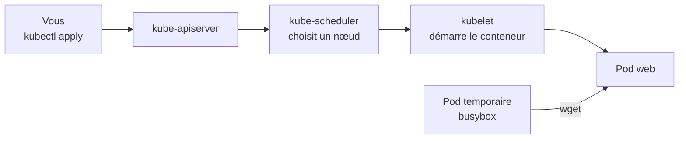

# Lab 2.1 : Mon premier Pod

| | |
|---|---|
| **Durée** | 45 à 60 min |
| **Niveau** | Guidé |
| **Prérequis** | [Lab 1.2](../ch01-architecture/lab-1-2-kubectl.md) réalisé (alias `k`, notion de manifeste), [cours du chapitre 2](cours.md) lu, cluster à 3 nœuds `Ready` |
| **Acquis visés** | AA1, AA2 |

!!! abstract "Objectifs"
    - Écrire et appliquer un manifeste de Pod
    - Observer le cycle de vie d'un Pod et lire ses événements
    - Constater qu'un Pod isolé n'est pas recréé et que son adresse IP change
    - Reconnaître et diagnostiquer `ImagePullBackOff` et `CrashLoopBackOff`
    - Utiliser les labels et les sélecteurs

## Contexte et schéma

Au Lab 1.2, vous avez généré un manifeste avec `kubectl run`. Cette fois, vous **écrivez vous-même** le manifeste, puis vous observez le comportement d'un Pod dans des situations normales et en panne.



## Étapes

### Étape 1 : Préparer le namespace

```bash
k create namespace tp-k8s
k config set-context --current --namespace=tp-k8s
k config view --minify | grep namespace
```

!!! note "Si le namespace existe déjà"
    Si `tp-k8s` a été conservé du Lab 1.2, l'erreur `AlreadyExists` est sans gravité. Vérifiez simplement qu'il est vide avec `k get all`.

### Étape 2 : Écrire et appliquer un manifeste de Pod

Créez le fichier `web.yaml` :

```bash
cat <<'EOF' > web.yaml
apiVersion: v1
kind: Pod
metadata:
  name: web
  labels:
    app: web
    tier: frontend
spec:
  containers:
    - name: web
      image: nginx:1.26-alpine
      ports:
        - containerPort: 80
EOF
```

Relisez-le : repérez `apiVersion`, `kind`, `metadata` et `spec`, puis appliquez-le en surveillant les changements d'état (touche `Ctrl+C` pour quitter la surveillance) :

```bash
k apply -f web.yaml
k get pod web -w
```

Observez la progression `ContainerCreating` puis `Running`. Lisez ensuite les événements :

```bash
k describe pod web
```

Dans la section **Events**, repérez dans l'ordre : `Scheduled`, `Pulling`, `Pulled`, `Created`, `Started`.

!!! success "Point de contrôle"
    - [ ] Le Pod `web` est `Running` (colonne `READY` à `1/1`)
    - [ ] Vous avez identifié l'événement `Scheduled` et le nœud choisi
    - [ ] Vous avez identifié l'événement qui correspond au téléchargement de l'image

### Étape 3 : Joindre le Pod depuis un autre Pod

Récupérez l'adresse IP du Pod, puis appelez-la depuis un Pod temporaire (supprimé automatiquement à la fin) :

```bash
k get pod web -o wide
IP=$(k get pod web -o jsonpath='{.status.podIP}')
echo $IP
k run test --rm -it --image=busybox:1.36 --restart=Never -- wget -qO- http://$IP
```

Vous devez voir la page d'accueil de nginx. Le Pod `test` a été créé, a exécuté la commande, puis a disparu.

!!! success "Point de contrôle"
    - [ ] La page « Welcome to nginx! » s'affiche
    - [ ] `k get pods` ne montre plus le Pod `test`

### Étape 4 : Constater qu'un Pod isolé n'est pas recréé

```bash
k delete pod web
k get pods
```

Le Pod a disparu et **rien ne le recrée** : aucun contrôleur ne le surveille. Recréez-le puis comparez l'adresse IP :

```bash
k apply -f web.yaml
k get pod web -o wide
echo "Ancienne IP : $IP"
```

!!! success "Point de contrôle"
    - [ ] Après la suppression, aucun Pod `web` n'existait
    - [ ] Vous avez comparé l'ancienne et la nouvelle adresse IP (elle peut différer ; ne comptez jamais sur elle)

### Étape 5 : Provoquer et diagnostiquer `ImagePullBackOff`

Créez un Pod dont l'image n'existe pas :

```bash
cat <<'EOF' > bad-image.yaml
apiVersion: v1
kind: Pod
metadata:
  name: bad-image
spec:
  containers:
    - name: web
      image: nginx:inexistant
EOF
k apply -f bad-image.yaml
k get pod bad-image -w
```

Attendez l'apparition de `ErrImagePull` puis `ImagePullBackOff` (environ 30 secondes), puis quittez avec `Ctrl+C`. Cherchez la cause :

```bash
k describe pod bad-image
```

Dans **Events**, lisez le message d'échec du téléchargement. Corrigez en supprimant le Pod, en réparant le tag dans le fichier (`nginx:1.26-alpine`), puis en réappliquant :

```bash
k delete pod bad-image
sed -i 's|nginx:inexistant|nginx:1.26-alpine|' bad-image.yaml
k apply -f bad-image.yaml
k get pod bad-image
```

!!! success "Point de contrôle"
    - [ ] Vous avez lu dans `describe` la cause de l'échec
    - [ ] Après correction, le Pod `bad-image` passe à `Running`

### Étape 6 : Provoquer et diagnostiquer `CrashLoopBackOff`

Cette fois, l'image existe mais le conteneur s'arrête en erreur :

```bash
cat <<'EOF' > crash.yaml
apiVersion: v1
kind: Pod
metadata:
  name: crash
spec:
  containers:
    - name: app
      image: busybox:1.36
      command: ["sh", "-c", "echo demarrage; sleep 2; echo erreur fatale; exit 1"]
EOF
k apply -f crash.yaml
k get pod crash -w
```

Laissez tourner environ une minute : observez la colonne `RESTARTS` augmenter et le statut passer par `Error` puis `CrashLoopBackOff`. Quittez avec `Ctrl+C`, puis :

```bash
k logs crash
k logs crash --previous
k describe pod crash | grep -A8 "Last State"
```

Les logs expliquent **pourquoi** le conteneur s'arrête ; `describe` donne le code de sortie. Le kubelet redémarre le conteneur (politique `Always` par défaut), en espaçant de plus en plus les tentatives.

!!! success "Point de contrôle"
    - [ ] Vous avez observé `RESTARTS` supérieur à 0
    - [ ] Vous avez retrouvé le message `erreur fatale` dans les logs
    - [ ] Vous avez lu le code de sortie (`Exit Code`) dans `describe`

### Étape 7 : Politique de redémarrage et phases d'un Pod

Créez deux Pods qui ne se relancent pas (`restartPolicy: Never`) : l'un se termine bien, l'autre en erreur.

```bash
cat <<'EOF' > fin.yaml
apiVersion: v1
kind: Pod
metadata:
  name: fin-ok
spec:
  restartPolicy: Never
  containers:
    - name: app
      image: busybox:1.36
      command: ["sh", "-c", "echo bonjour; exit 0"]
---
apiVersion: v1
kind: Pod
metadata:
  name: fin-erreur
spec:
  restartPolicy: Never
  containers:
    - name: app
      image: busybox:1.36
      command: ["sh", "-c", "echo oups; exit 1"]
EOF
k apply -f fin.yaml
sleep 15
k get pods
k get pod fin-ok -o jsonpath='{.status.phase}'; echo
k get pod fin-erreur -o jsonpath='{.status.phase}'; echo
```

!!! success "Point de contrôle"
    - [ ] `fin-ok` est `Completed` (phase `Succeeded`) et n'a pas redémarré
    - [ ] `fin-erreur` est `Error` (phase `Failed`) et n'a pas redémarré
    - [ ] `crash` a continué à redémarrer, contrairement à `fin-erreur`

### Étape 8 : Labels et sélecteurs

Créez un second Pod avec d'autres labels, puis interrogez par sélecteur :

```bash
k run web2 --image=nginx:1.26-alpine --labels="app=web,tier=backend"
k get pods --show-labels
k get pods -l app=web
k get pods -l tier=frontend
k get pods -l 'app=web,tier=backend'
```

Modifiez un label, puis agissez sur un groupe de Pods par sélecteur :

```bash
k label pod web2 tier=frontend --overwrite
k get pods -l tier=frontend
k delete pods -l app=web
k get pods
```

!!! success "Point de contrôle"
    - [ ] Chaque requête `-l` a renvoyé les Pods attendus
    - [ ] Après `delete -l app=web`, les Pods `web` et `web2` ont disparu, les autres sont restés

## Questions de réflexion

??? question "Pourquoi le Pod `web` n'a-t-il pas été recréé après sa suppression ?"
    Il n'est géré par aucun contrôleur (ReplicaSet ou Deployment). Un Pod isolé disparaît définitivement. Le Lab 2.2 montre comment un Deployment résout ce problème.

??? question "Quelle commande vous a donné la cause de `ImagePullBackOff`, et laquelle celle de `CrashLoopBackOff` ?"
    `kubectl describe pod` (section Events) pour l'image introuvable ; `kubectl logs` (avec `--previous` si besoin) pour le conteneur qui plante, complété par le code de sortie dans `describe`.

??? question "Pourquoi `crash` redémarre-t-il en boucle alors que `fin-erreur` reste en erreur ?"
    Leur `restartPolicy` diffère : `Always` (défaut) pour `crash`, `Never` pour `fin-erreur`. Le kubelet ne relance que si la politique le permet.

??? question "Pourquoi ne faut-il pas utiliser l'adresse IP d'un Pod pour le joindre durablement ?"
    L'IP est propre à chaque Pod ; un Pod remplacé en reçoit une nouvelle. C'est la raison d'être des Services (chapitre 3).

## Dépannage

| Symptôme | Pistes |
|---|---|
| `AlreadyExists` à la création d'un Pod | Le Pod existe déjà : `k delete pod <nom>` puis réappliquer |
| Pod bloqué en `ContainerCreating` | Téléchargement lent ; `k describe pod` ; vérifier l'accès Internet des VMs |
| `k run test --rm ...` reste sans réponse | Vérifier l'IP avec `echo $IP` ; la variable est vide si vous avez ouvert un nouveau terminal |
| `wget: can't connect` | Le Pod `web` n'est pas `Running`, ou l'IP a changé après recréation |
| Rien ne s'affiche dans `k logs crash` | Le conteneur vient de redémarrer : utiliser `--previous` |
| `The Pod "..." is invalid` à la réapplication | Certains champs d'un Pod ne se modifient pas ; supprimer puis recréer le Pod |

## Nettoyage

```bash
k delete pod --all
k get pods
k delete namespace tp-k8s
k config set-context --current --namespace=default
```