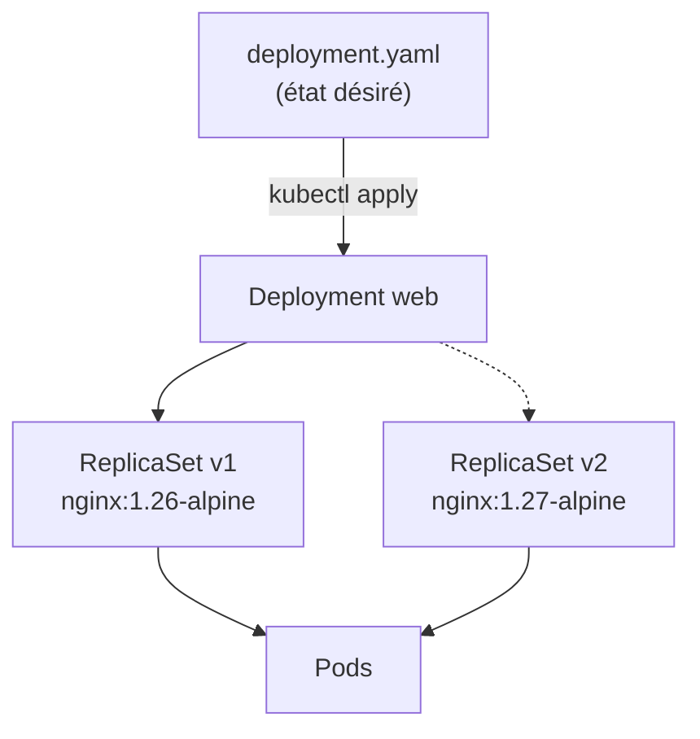

# Lab 2.2 : Deployments et mises à jour

|                  |                                                                                                                                                 |
| ---------------- | ----------------------------------------------------------------------------------------------------------------------------------------------- |
| **Durée**        | 60 à 75 min                                                                                                                                     |
| **Niveau**       | Guidé                                                                                                                                           |
| **Prérequis**    | [Lab 2.1](lab-2-1-premier-pod.md) réalisé, [cours du chapitre 2](cours.md) lu, cluster à 3 nœuds `Ready`, deux terminaux ouverts sur le serveur |
| **Acquis visés** | AA1, AA2                                                                                                                                        |

!!! abstract "Objectifs" - Déployer une application avec un Deployment et lire la chaîne Deployment, ReplicaSet, Pods - Observer l'auto-réparation et changer le nombre de réplicas - Réaliser une mise à jour progressive, puis un retour arrière - Diagnostiquer une mise à jour qui échoue - Comprendre le rôle du sélecteur et des labels

## Contexte et schéma

Au Lab 2.1, un Pod isolé n'était pas recréé après sa suppression. Vous confiez maintenant l'application à un **Deployment**, qui maintient le nombre de Pods voulu et gère les changements de version.



!!! note "Mesurer l'absence de coupure"
Sans Service (chapitre 3), vous ne pouvez pas encore envoyer de requêtes continues à l'application. Ici, vous observez le **mécanisme** de mise à jour (Pods et ReplicaSets). Vous mesurerez l'absence de coupure par des requêtes dans le Mini-projet 1, une fois les Services et l'Ingress maîtrisés.

## Étapes

### Étape 1 : Préparer le namespace

```bash
k create namespace tp-k8s
k config set-context --current --namespace=tp-k8s
k get all
```

!!! tip "Deux terminaux"
Gardez un second terminal ouvert sur le serveur pour les commandes de surveillance (`k get pods -w`). Dans ce second terminal, l'alias `k` et le namespace sont déjà configurés.

### Étape 2 : Créer un Deployment

```bash
cat <<'EOF' > deployment.yaml
apiVersion: apps/v1
kind: Deployment
metadata:
  name: web
  labels:
    app: web
spec:
  replicas: 3
  selector:
    matchLabels:
      app: web
  template:
    metadata:
      labels:
        app: web
    spec:
      containers:
        - name: web
          image: nginx:1.26-alpine
          ports:
            - containerPort: 80
EOF
k apply -f deployment.yaml
k get deployment,replicaset,pods -o wide
```

Repérez le nom du ReplicaSet (`web-<hash>`) et celui des Pods (`web-<hash>-<suffixe>`). Lisez ensuite la description :

```bash
k describe deployment web
```

Notez les lignes `Selector`, `Replicas`, `StrategyType` et `RollingUpdateStrategy`.

!!! success "Point de contrôle" - [ ] `READY 3/3` pour le Deployment, un ReplicaSet et trois Pods `Running` - [ ] Vous avez retrouvé le hash du ReplicaSet dans le nom des Pods - [ ] Vous avez lu la stratégie par défaut (`RollingUpdate`, 25 % max unavailable, 25 % max surge)

### Étape 3 : Observer l'auto-réparation

Dans le **second terminal**, lancez la surveillance :

```bash
k get pods -w
```

Dans le **premier terminal**, supprimez un Pod :

```bash
POD=$(k get pods -l app=web -o jsonpath='{.items[0].metadata.name}')
echo $POD
k delete pod $POD
```

Observez, dans le second terminal, la création immédiate d'un Pod de remplacement. Interrompez ensuite la surveillance avec `Ctrl+C`.

!!! success "Point de contrôle" - [ ] Un nouveau Pod, avec un autre suffixe, a remplacé le Pod supprimé - [ ] Le Deployment est revenu à `3/3`

### Étape 4 : Changer le nombre de réplicas

D'abord de façon impérative, puis de façon déclarative :

```bash
k scale deployment web --replicas=5
k get pods
k get rs
```

Votre fichier `deployment.yaml` indique toujours 3 réplicas. Réappliquez-le :

```bash
k apply -f deployment.yaml
k get pods
```

!!! note "Impératif ou déclaratif"
`scale` modifie directement le cluster, pas votre fichier. En réappliquant `deployment.yaml` (qui indique 3), vous ramenez le cluster à ce que le fichier décrit : **le fichier reste la source de vérité**.

!!! success "Point de contrôle" - [ ] Avec 5 réplicas, `k get rs` montrait toujours **un seul** ReplicaSet - [ ] Après `apply`, il reste 3 Pods

### Étape 5 : Mettre à jour l'application (rolling update)

Dans le **second terminal**, surveillez les ReplicaSets :

```bash
k get rs -w
```

Dans le **premier terminal**, changez la version de l'image dans le fichier, puis appliquez :

```bash
sed -i 's|nginx:1.26-alpine|nginx:1.27-alpine|' deployment.yaml
k apply -f deployment.yaml
k rollout status deployment/web
```

Observez dans le second terminal l'ancien ReplicaSet qui se vide pendant que le nouveau se remplit. Quittez avec `Ctrl+C`, puis :

```bash
k annotate deployment web kubernetes.io/change-cause="passage a nginx 1.27"
k get rs
k rollout history deployment/web
k get pods -o wide
```

!!! success "Point de contrôle" - [ ] Deux ReplicaSets existent : l'ancien à 0 Pod, le nouveau à 3 Pods - [ ] L'historique affiche deux révisions - [ ] Les Pods portent un nouveau hash dans leur nom

### Étape 6 : Revenir en arrière

Inspectez une ancienne révision, puis revenez à celle-ci :

```bash
k rollout history deployment/web --revision=1
k rollout undo deployment/web --to-revision=1
k rollout status deployment/web
k get deployment web -o jsonpath='{.spec.template.spec.containers[0].image}'; echo
k get rs
k rollout history deployment/web
```

L'image est revenue à `nginx:1.26-alpine`, et l'ancien ReplicaSet a été **réutilisé** (pas recréé).

Votre fichier `deployment.yaml` indique encore `1.27-alpine` : il n'est plus aligné avec le cluster. Remettez-le d'accord :

```bash
sed -i 's|nginx:1.27-alpine|nginx:1.26-alpine|' deployment.yaml
k apply -f deployment.yaml
```

!!! success "Point de contrôle" - [ ] L'image du Deployment est `nginx:1.26-alpine` - [ ] Les numéros de révision de l'historique ont changé après le retour arrière - [ ] Le fichier et le cluster sont de nouveau alignés

### Étape 7 : Diagnostiquer une mise à jour qui échoue

Appliquez volontairement une version inexistante :

```bash
sed -i 's|nginx:1.26-alpine|nginx:inexistant|' deployment.yaml
k apply -f deployment.yaml
k rollout status deployment/web --timeout=30s
k get pods
k get rs
```

La commande `rollout status` s'interrompt au bout de 30 secondes sans avoir terminé. Observez : le nouveau Pod est en `ImagePullBackOff`, mais **les trois anciens Pods sont toujours `Running`**. Cherchez la cause :

```bash
k describe pod -l app=web | grep -B2 -A6 "Failed"
```

Revenez à la version saine, puis réalignez le fichier :

```bash
k rollout undo deployment/web
k rollout status deployment/web
k get pods
sed -i 's|nginx:inexistant|nginx:1.26-alpine|' deployment.yaml
```

!!! success "Point de contrôle" - [ ] Pendant l'échec, trois Pods de l'ancienne version restaient disponibles - [ ] Vous avez trouvé la cause dans les événements du nouveau Pod - [ ] Après `rollout undo`, tous les Pods sont `Running`, sans Pod en erreur

### Étape 8 : Labels, sélecteur et Pods orphelins

Retirez un Pod du périmètre du Deployment en changeant son label :

```bash
k get pods --show-labels
POD=$(k get pods -l app=web -o jsonpath='{.items[0].metadata.name}')
k label pod $POD app=autre --overwrite
k get pods --show-labels
```

Le ReplicaSet ne reconnaît plus ce Pod : il en crée un autre pour retrouver 3 réplicas. Le Pod modifié existe toujours, mais n'est plus géré par personne. Supprimez-le :

```bash
k get pods -l app=web
k get pods -l app=autre
k delete pod $POD
k get pods
```

!!! success "Point de contrôle" - [ ] Pendant quelques instants, il y avait 4 Pods (3 gérés, 1 orphelin) - [ ] Après suppression, il reste 3 Pods gérés par le Deployment

## Questions de réflexion

??? question "Combien de ReplicaSets existent après deux mises à jour successives, et pourquoi les anciens sont-ils conservés ?"
Un par version du modèle de Pod (jusqu'à la limite d'historique). Les anciens, ramenés à 0 Pod, permettent le retour arrière sans tout recréer.

??? question "Pourquoi les anciens Pods sont-ils restés `Running` pendant la mise à jour échouée ?"
Avec 3 réplicas et les valeurs par défaut, le Deployment ne retire pas d'ancien Pod tant que le nouveau n'est pas disponible : la mise à jour est bloquée, mais le service reste assuré.

??? question "Quelle différence entre `kubectl scale` et la modification de `replicas` dans le fichier ?"
`scale` agit directement sur le cluster sans modifier le fichier, ce qui crée un écart. Modifier le fichier puis `apply` garde la source de vérité à jour et reproductible.

??? question "Après `rollout undo`, que se passe-t-il si vous réappliquez `deployment.yaml` sans le corriger ?"
Le fichier indique encore l'ancienne version : `apply` la redéploie et annule le retour arrière. C'est pourquoi le fichier doit toujours refléter l'état voulu.

??? question "Pourquoi le Pod dont vous avez changé le label n'a-t-il pas été supprimé par le Deployment ?"
Le ReplicaSet ne gère que les Pods qui correspondent à son sélecteur. Un Pod qui n'y correspond plus est ignoré, et un remplaçant est créé.

## Dépannage

| Symptôme                                  | Pistes                                                                                             |
| ----------------------------------------- | -------------------------------------------------------------------------------------------------- |
| `selector does not match template labels` | Les labels de `spec.selector.matchLabels` et de `template.metadata.labels` doivent être identiques |
| `field is immutable` à l'`apply`          | Le sélecteur d'un Deployment ne se modifie pas : supprimer le Deployment puis le recréer           |
| `rollout status` ne se termine jamais     | Nouveau Pod en erreur : `k get pods`, `k describe pod`, puis `k rollout undo`                      |
| `rollout undo` ne change rien             | Vous êtes déjà sur la révision demandée : consulter `k rollout history`                            |
| Le nombre de Pods ne revient pas à 3      | Vérifier `k get deployment web` ; relire le champ `replicas` du fichier appliqué                   |
| Pod bloqué en `ContainerCreating`         | Téléchargement lent : `k describe pod`, accès Internet des VMs                                     |

## Pour aller plus loin (facultatif)

Observez la stratégie `Recreate`, qui provoque une coupure :

```bash
cat <<'EOF' > recreate.yaml
apiVersion: apps/v1
kind: Deployment
metadata:
  name: web-recreate
spec:
  replicas: 3
  strategy:
    type: Recreate
  selector:
    matchLabels:
      app: web-recreate
  template:
    metadata:
      labels:
        app: web-recreate
    spec:
      containers:
        - name: web
          image: nginx:1.26-alpine
EOF
k apply -f recreate.yaml
k rollout status deployment/web-recreate
```

Dans le second terminal, lancez `k get pods -l app=web-recreate -w`, puis dans le premier :

```bash
k set image deployment/web-recreate web=nginx:1.27-alpine
```

Constatez que tous les anciens Pods s'arrêtent avant que les nouveaux démarrent.

## Nettoyage

```bash
k delete namespace tp-k8s
k config set-context --current --namespace=default
```
