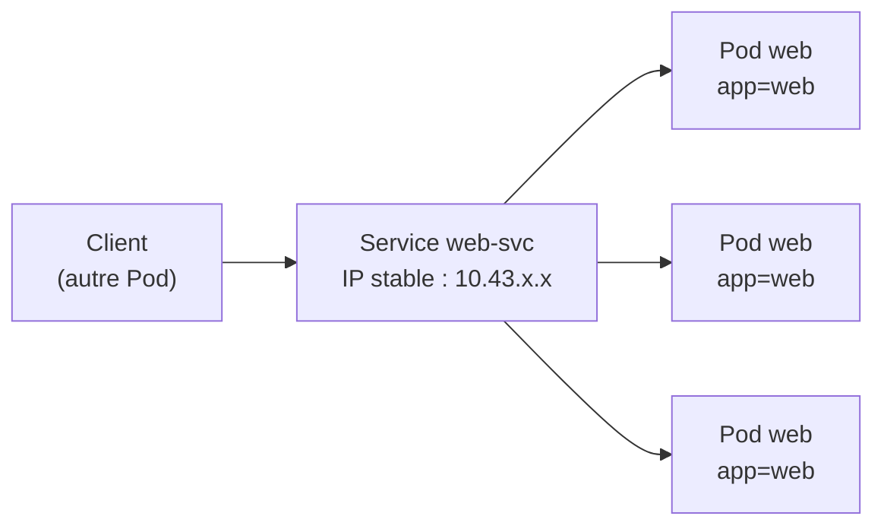
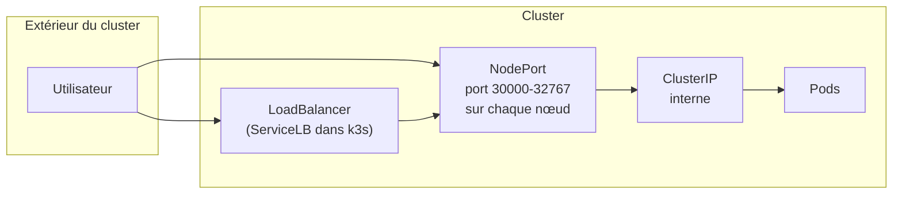
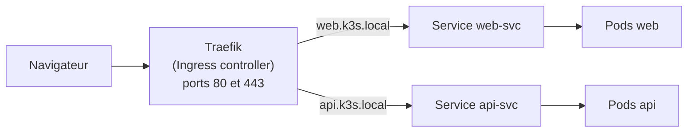

# Chapitre 3 : Services et réseau

!!! abstract "Objectifs du chapitre"
    - Expliquer pourquoi les Pods ont besoin d'un Service pour être joints
    - Choisir entre ClusterIP, NodePort et LoadBalancer
    - Utiliser le DNS interne pour faire communiquer des applications
    - Expliquer le rôle d'un Ingress et d'un Ingress controller
    - Situer la Gateway API par rapport à Ingress
    - Acquis d'apprentissage visé : **AA3**

## 1. Pourquoi un Service ?

Au chapitre 2, vous avez vu qu'un Pod est éphémère : lorsqu'il est remplacé, il reçoit une **nouvelle adresse IP**. Un Deployment peut aussi compter plusieurs Pods identiques. Aucune application ne peut donc s'appuyer sur l'adresse d'un Pod.

Un **Service** fournit un point d'accès **stable** à un groupe de Pods :

- une adresse IP virtuelle qui ne change pas tant que le Service existe ;
- un nom DNS ;
- une **répartition de charge** entre les Pods du groupe.

Le Service retrouve ses Pods grâce à un **sélecteur de labels**, comme le Deployment au chapitre 2.



Lorsqu'un Pod est remplacé, le Service met à jour la liste des Pods vers lesquels il envoie le trafic. Seuls les Pods **prêts** la reçoivent (la notion de disponibilité est précisée au chapitre 9). Côté nœud, c'est `kube-proxy` (chapitre 1) qui programme les règles réseau correspondantes.

## 2. Définir un Service

```yaml
apiVersion: v1
kind: Service
metadata:
  name: web-svc
spec:
  type: ClusterIP          # valeur par défaut
  selector:
    app: web               # les Pods ciblés
  ports:
    - port: 80             # port du Service
      targetPort: 80       # port du conteneur
```

| Champ | Rôle |
|---|---|
| `selector` | Labels des Pods ciblés : doit correspondre aux labels du modèle de Pod du Deployment |
| `port` | Port sur lequel le Service écoute |
| `targetPort` | Port du conteneur vers lequel le trafic est envoyé |

Pour générer un squelette :

```bash
kubectl expose deployment web --port=80 --target-port=80 --dry-run=client -o yaml
```

### Vérifier que le Service trouve ses Pods

La liste des adresses de Pods ciblés s'appelle les **endpoints**. Une liste vide signifie presque toujours un sélecteur qui ne correspond à aucun Pod.

```bash
kubectl get service web-svc
kubectl get endpoints web-svc
kubectl get endpointslices
```

!!! note "Endpoints et EndpointSlices"
    Les versions récentes de Kubernetes stockent ces informations dans des **EndpointSlices**. Selon la version, `kubectl get endpoints` peut afficher un avertissement de dépréciation tout en restant utilisable.

## 3. Les types de Service



| Type | Accessible depuis | Usage typique |
|---|---|---|
| **ClusterIP** (défaut) | Le cluster uniquement | Communication entre applications (frontend vers API, API vers base) |
| **NodePort** | L'extérieur, via `IP_d'un_nœud:port` (30000 à 32767 par défaut) | Tests, démonstrations |
| **LoadBalancer** | L'extérieur, via une adresse externe | Exposition d'un service à l'aide d'un répartiteur de charge |

Les trois types sont **cumulatifs** : un NodePort crée aussi un ClusterIP, et un LoadBalancer crée aussi un NodePort.

Dans un cloud, un Service LoadBalancer demande un répartiteur de charge au fournisseur. Sur k3s, **ServiceLB** joue ce rôle : il utilise les adresses IP des nœuds. Traefik lui-même est exposé ainsi (ports 80 et 443), ce qui explique pourquoi vous pouvez le joindre sur l'adresse d'un nœud.

!!! warning "Un NodePort par application, ce n'est pas une solution"
    Chaque application exposée avec un NodePort consomme un port élevé, difficile à retenir et à sécuriser. Pour des applications web, on préfère un **Ingress** (section 5).

## 4. Le DNS interne

Le DNS du cluster est assuré par **CoreDNS** (installé par k3s). Chaque Service reçoit automatiquement un nom :

```text
<service>.<namespace>.svc.cluster.local
```

| Depuis | Nom utilisable pour joindre `web-svc` du namespace `tp-k8s` |
|---|---|
| Un Pod du même namespace | `web-svc` |
| Un Pod d'un autre namespace | `web-svc.tp-k8s` (ou le nom complet) |

Les applications utilisent donc **le nom du Service**, jamais une adresse IP. Exemple de test depuis un Pod temporaire :

```bash
kubectl run test --rm -it --image=busybox:1.36 --restart=Never -- wget -qO- http://web-svc
```

## 5. Ingress

Un Service NodePort ou LoadBalancer travaille aux niveaux TCP/UDP. Pour des applications web, on veut router selon le **nom d'hôte** et le **chemin** HTTP, et partager un seul point d'entrée : c'est le rôle d'**Ingress**.

Il faut distinguer deux éléments :

| Élément | Rôle |
|---|---|
| **Ingress** (objet) | Décrit des règles : « tel hôte et tel chemin vont vers tel Service » |
| **Ingress controller** | Programme qui lit ces règles et route réellement le trafic. Dans k3s : **Traefik** |

Un objet Ingress seul ne fait rien sans controller.



```yaml
apiVersion: networking.k8s.io/v1
kind: Ingress
metadata:
  name: web-ingress
spec:
  ingressClassName: traefik
  rules:
    - host: web.k3s.local
      http:
        paths:
          - path: /
            pathType: Prefix
            backend:
              service:
                name: web-svc
                port:
                  number: 80
```

Points à connaître :

- le **backend** d'un Ingress est un **Service**, pas un Pod ;
- `pathType: Prefix` fait correspondre tous les chemins qui commencent par `path` ;
- `ingressClassName` désigne le controller (voir `kubectl get ingressclass`) ;
- le nom d'hôte doit être résolu vers l'adresse d'un nœud : fichier `hosts` de votre poste Windows, ou en-tête `Host` avec `curl.exe` (voir [Environnement VMware](../../annexes/environnement-vmware.md)).

L'Ingress gère aussi la terminaison **TLS** (HTTPS) ; elle est abordée au chapitre 13.

## 6. Gateway API (aperçu)

L'API Ingress est simple, mais limitée : les fonctions avancées dépendent d'annotations propres à chaque controller. La **Gateway API** est son successeur, plus expressive et conçue pour séparer les rôles :

| Objet | Rôle |
|---|---|
| **GatewayClass** | Type d'implémentation, fourni par l'infrastructure |
| **Gateway** | Point d'entrée réseau (ports, protocoles), géré par l'équipe plateforme |
| **HTTPRoute** | Règles de routage HTTP, gérées par les équipes applicatives |

Dans ce cours, vous utilisez **Ingress avec Traefik**. La Gateway API est présentée pour que vous sachiez la situer dans votre veille technique.

!!! tip "À retenir"
    - Un Pod change d'adresse IP : on passe par un **Service**, qui cible les Pods avec un **sélecteur de labels**.
    - **ClusterIP** pour l'interne, **NodePort** pour des tests, **LoadBalancer** pour une adresse externe (ServiceLB dans k3s).
    - Les applications se joignent par le **nom DNS du Service** : `<service>.<namespace>.svc.cluster.local`.
    - Un **Ingress** route le trafic HTTP par hôte et par chemin vers des Services ; **Traefik** est le controller de k3s.
    - Diagnostic d'un Service : `get service`, puis `get endpoints` (liste vide = sélecteur incorrect).

## Pour vérifier votre compréhension

??? question "Pourquoi une application ne doit-elle pas utiliser l'adresse IP d'un Pod ?"
    Un Pod remplacé reçoit une nouvelle adresse. Le Service offre une adresse et un nom stables, et répartit la charge entre les Pods.

??? question "Un Service est créé, mais `get endpoints` renvoie une liste vide. Quelle est la cause la plus probable ?"
    Le sélecteur du Service ne correspond à aucun Pod (label différent ou erreur de frappe), ou aucun Pod n'est prêt.

??? question "Quel type de Service choisissez-vous pour la communication entre une API et sa base de données ? Pourquoi ?"
    **ClusterIP** : la communication reste à l'intérieur du cluster et n'expose rien à l'extérieur.

??? question "Un Pod du namespace `prod` doit joindre le Service `api` du namespace `dev`. Quel nom utilise-t-il ?"
    `api.dev` (ou `api.dev.svc.cluster.local`). Le nom court `api` ne fonctionne que dans le même namespace.

??? question "Quelle différence entre un Ingress et un Ingress controller ?"
    L'Ingress décrit des règles de routage. Le controller (Traefik dans k3s) les lit et route le trafic. Sans controller, l'Ingress n'a aucun effet.

## Labs du chapitre

- [Lab 3.1 : Exposer une application](lab-3-1-exposer-application.md)
- [Lab 3.2 : Ingress avec Traefik](lab-3-2-ingress-traefik.md)