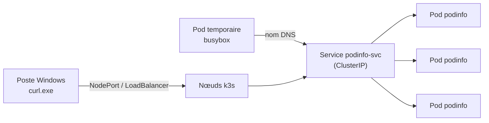

# Lab 3.1 : Exposer une application

|                  |                                                                                                                                                                                         |
| ---------------- | --------------------------------------------------------------------------------------------------------------------------------------------------------------------------------------- |
| **Durée**        | 60 à 75 min                                                                                                                                                                             |
| **Niveau**       | Guidé                                                                                                                                                                                   |
| **Prérequis**    | [Lab 2.2](../ch02-pods-deployments/lab-2-2-deployments-mises-a-jour.md) réalisé, [cours du chapitre 3](cours.md) lu, cluster à 3 nœuds `Ready`, accès à `curl.exe` sur le poste Windows |
| **Acquis visés** | AA2, AA3                                                                                                                                                                                |

!!! abstract "Objectifs" - Exposer un Deployment par un Service ClusterIP et vérifier ses endpoints - Joindre un Service par son nom DNS, y compris depuis un autre namespace - Observer la répartition de charge entre les Pods - Exposer une application hors du cluster avec NodePort puis LoadBalancer (ServiceLB) - Diagnostiquer un Service dont le sélecteur est incorrect

## Contexte et schéma

Vous déployez une petite application web qui répond en indiquant le nom du Pod qui a traité la requête. Cela rend la répartition de charge visible. Vous l'exposez ensuite de plus en plus largement : d'abord à l'intérieur du cluster, puis à l'extérieur.



## Étapes

### Étape 1 : Préparer le namespace et déployer l'application

```bash
k create namespace tp-k8s
k config set-context --current --namespace=tp-k8s

cat <<'EOF' > podinfo.yaml
apiVersion: apps/v1
kind: Deployment
metadata:
  name: podinfo
  labels:
    app: podinfo
spec:
  replicas: 3
  selector:
    matchLabels:
      app: podinfo
  template:
    metadata:
      labels:
        app: podinfo
    spec:
      containers:
        - name: podinfo
          image: ghcr.io/stefanprodan/podinfo:6.5.4
          ports:
            - containerPort: 9898
EOF
k apply -f podinfo.yaml
k get pods -o wide
```

L'application écoute sur le port **9898**. Notez l'adresse IP de chaque Pod.

!!! success "Point de contrôle" - [ ] Trois Pods `podinfo` sont `Running` - [ ] Vous avez noté leurs trois adresses IP

### Étape 2 : Créer un Service ClusterIP

Le Service écoute sur le port **80** et renvoie vers le port **9898** des conteneurs :

```bash
cat <<'EOF' > podinfo-svc.yaml
apiVersion: v1
kind: Service
metadata:
  name: podinfo-svc
spec:
  type: ClusterIP
  selector:
    app: podinfo
  ports:
    - port: 80
      targetPort: 9898
EOF
k apply -f podinfo-svc.yaml
k get service podinfo-svc
k get endpoints podinfo-svc
k get pods -o wide
```

Comparez la colonne `ENDPOINTS` avec les adresses IP des Pods.

!!! success "Point de contrôle" - [ ] Le Service a une adresse `CLUSTER-IP` et aucune `EXTERNAL-IP` - [ ] Les endpoints correspondent exactement aux trois adresses des Pods

### Étape 3 : Joindre le Service par son nom DNS

Depuis un Pod temporaire, appelez le Service par son nom court, puis par son nom complet :

```bash
k run test --rm -it --image=busybox:1.36 --restart=Never -- wget -qO- http://podinfo-svc
k run test --rm -it --image=busybox:1.36 --restart=Never -- wget -qO- http://podinfo-svc.tp-k8s.svc.cluster.local
k run test --rm -it --image=busybox:1.36 --restart=Never -- nslookup podinfo-svc
```

La réponse est un document JSON ; repérez le champ `hostname`. La commande `nslookup` montre l'adresse du Service et le serveur DNS du cluster (CoreDNS).

!!! success "Point de contrôle" - [ ] Les deux appels (nom court et nom complet) renvoient la même application - [ ] L'adresse renvoyée par `nslookup` est la `CLUSTER-IP` du Service

### Étape 4 : Observer la répartition de charge

Envoyez six requêtes successives et affichez le nom du Pod qui répond :

```bash
k run test --rm -it --image=busybox:1.36 --restart=Never -- \
  sh -c 'for i in 1 2 3 4 5 6; do wget -qO- http://podinfo-svc | grep hostname; done'
```

Comparez les noms obtenus avec ceux de `k get pods`.

!!! success "Point de contrôle" - [ ] Plusieurs noms de Pods différents apparaissent dans les réponses - [ ] Ces noms correspondent aux Pods du Deployment

### Étape 5 : Suivre les Pods avec les endpoints

Les endpoints suivent l'évolution des Pods. Dans un **second terminal**, lancez `k get endpoints podinfo-svc -w`, puis dans le premier :

```bash
k scale deployment podinfo --replicas=5
k get endpoints podinfo-svc
POD=$(k get pods -l app=podinfo -o jsonpath='{.items[0].metadata.name}')
k delete pod $POD
k get endpoints podinfo-svc
k scale deployment podinfo --replicas=3
```

Interrompez la surveillance avec `Ctrl+C`.

!!! success "Point de contrôle" - [ ] Avec 5 réplicas, le Service avait 5 endpoints - [ ] Après la suppression d'un Pod, la liste d'endpoints s'est mise à jour automatiquement

### Étape 6 : Diagnostiquer un sélecteur incorrect

Provoquez volontairement une panne :

```bash
k set selector service podinfo-svc app=autre
k get endpoints podinfo-svc
k run test --rm -it --image=busybox:1.36 --restart=Never -- wget -T 3 -qO- http://podinfo-svc
```

Les endpoints sont vides (`<none>`) et l'appel échoue. Vérifiez le sélecteur du Service, puis réparez :

```bash
k describe service podinfo-svc | grep Selector
k set selector service podinfo-svc app=podinfo
k get endpoints podinfo-svc
```

!!! success "Point de contrôle" - [ ] Vous avez observé `<none>` dans les endpoints pendant la panne - [ ] Après réparation, les trois endpoints sont revenus

### Étape 7 : Exposer hors du cluster avec NodePort

Créez un second Service, de type NodePort, vers la même application :

```bash
cat <<'EOF' > podinfo-nodeport.yaml
apiVersion: v1
kind: Service
metadata:
  name: podinfo-nodeport
spec:
  type: NodePort
  selector:
    app: podinfo
  ports:
    - port: 80
      targetPort: 9898
EOF
k apply -f podinfo-nodeport.yaml
k get service podinfo-nodeport
k get nodes -o wide
```

Dans la colonne `PORT(S)`, repérez le port (de la forme `80:3xxxx/TCP`) : c'est le **NodePort**. Depuis votre poste Windows, appelez-le sur l'adresse de **chaque** nœud :

```bash
curl.exe http://<IP_NOEUD>:<NODEPORT>
```

!!! success "Point de contrôle" - [ ] L'application répond depuis Windows - [ ] Elle répond sur l'adresse du serveur **et** sur celle des agents, même si le Pod ne s'exécute pas sur ce nœud

### Étape 8 : Exposer avec LoadBalancer (ServiceLB)

Créez un troisième Service, de type LoadBalancer :

```bash
cat <<'EOF' > podinfo-lb.yaml
apiVersion: v1
kind: Service
metadata:
  name: podinfo-lb
spec:
  type: LoadBalancer
  selector:
    app: podinfo
  ports:
    - port: 8080
      targetPort: 9898
EOF
k apply -f podinfo-lb.yaml
k get service podinfo-lb
k get pods -n kube-system | grep svclb
```

Le Service reçoit une `EXTERNAL-IP` : avec ServiceLB, ce sont les adresses des nœuds. Des Pods `svclb-...` ont été créés dans `kube-system`. Testez depuis Windows :

```bash
curl.exe http://<IP_NOEUD>:8080
```

!!! note "Pourquoi le port 8080 ?"
Traefik est déjà exposé par un Service LoadBalancer sur les ports 80 et 443 de chaque nœud. Un second Service demandant le port 80 resterait en attente (`<pending>`).

!!! success "Point de contrôle" - [ ] `EXTERNAL-IP` n'est pas `<pending>` - [ ] L'application répond sur le port 8080 depuis Windows - [ ] Vous avez repéré les Pods `svclb` du Service `podinfo-lb`

### Étape 9 : Joindre un Service depuis un autre namespace

```bash
k create namespace tp-autre
k run test -n tp-autre --rm -it --image=busybox:1.36 --restart=Never -- wget -T 3 -qO- http://podinfo-svc
k run test -n tp-autre --rm -it --image=busybox:1.36 --restart=Never -- wget -qO- http://podinfo-svc.tp-k8s
```

Le nom court échoue dans `tp-autre`, car il se résout dans le namespace du Pod appelant. Le nom qualifié par le namespace réussit.

!!! success "Point de contrôle" - [ ] Le nom court échoue depuis `tp-autre` - [ ] `podinfo-svc.tp-k8s` répond

## Questions de réflexion

??? question "Quelle est la différence entre `port` et `targetPort` dans un Service ?"
`port` est le port sur lequel le Service écoute ; `targetPort` est le port du conteneur vers lequel le trafic est transmis. Ici, 80 vers 9898.

??? question "Pourquoi l'application répond-elle sur l'adresse d'un nœud qui n'héberge aucun Pod ?"
Un NodePort est ouvert sur **tous** les nœuds : `kube-proxy` transmet le trafic vers un Pod du Service, quel que soit son nœud.

??? question "Qu'est-ce qu'une liste d'endpoints vide vous apprend ?"
Aucun Pod prêt ne correspond au sélecteur du Service : sélecteur erroné, labels différents ou Pods absents ou en erreur. C'est le premier contrôle à faire quand un Service ne répond pas.

??? question "Pourquoi ne pas exposer toutes vos applications web avec un NodePort ?"
Chaque application consomme un port élevé distinct, difficile à gérer et à sécuriser, et il n'y a ni routage par nom d'hôte ni point d'entrée unique. C'est l'objet du Lab 3.2 (Ingress).

??? question "Qu'est-ce qui distingue ClusterIP, NodePort et LoadBalancer dans ce que vous venez d'observer ?"
ClusterIP : adresse interne uniquement. NodePort : ouvre en plus un port sur chaque nœud. LoadBalancer : ajoute une adresse externe (ici, les IP des nœuds via ServiceLB).

## Dépannage

| Symptôme                                    | Pistes                                                                                                                                    |
| ------------------------------------------- | ----------------------------------------------------------------------------------------------------------------------------------------- |
| Pods en `ImagePullBackOff`                  | Vérifier l'accès Internet des VMs et le nom de l'image (`k describe pod`)                                                                 |
| `wget` renvoie `bad address`                | Nom de Service ou de namespace incorrect ; vérifier avec `k get svc`                                                                      |
| `ENDPOINTS` vide                            | Comparer `k describe svc` (Selector) et `k get pods --show-labels`                                                                        |
| `curl.exe` échoue sur le NodePort           | Mauvaise adresse IP ou mauvais port ; pare-feu `ufw` actif sur la VM ; voir [Environnement VMware](../../annexes/environnement-vmware.md) |
| `EXTERNAL-IP` reste `<pending>`             | Port déjà utilisé par un autre Service LoadBalancer (80 et 443 sont pris par Traefik)                                                     |
| `wget` sans réponse                         | Ajouter `-T 3` pour limiter l'attente, puis contrôler les endpoints                                                                       |
| `AlreadyExists` à la création du Pod `test` | Un ancien Pod `test` persiste : `k delete pod test`                                                                                       |

## Nettoyage

```bash
k delete namespace tp-autre
k delete namespace tp-k8s
k config set-context --current --namespace=default
```
