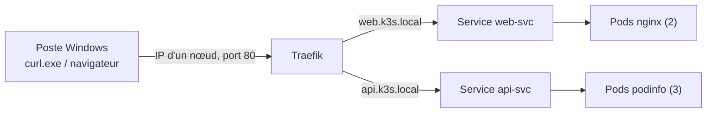

# Lab 3.2 : Ingress avec Traefik

|                  |                                                                                                                                                           |
| ---------------- | --------------------------------------------------------------------------------------------------------------------------------------------------------- |
| **Durée**        | 45 à 60 min                                                                                                                                               |
| **Niveau**       | Guidé                                                                                                                                                     |
| **Prérequis**    | [Lab 3.1](lab-3-1-exposer-application.md) réalisé, [cours du chapitre 3](cours.md) lu, cluster à 3 nœuds `Ready`, accès à `curl.exe` sur le poste Windows |
| **Acquis visés** | AA3                                                                                                                                                       |

!!! abstract "Objectifs" - Repérer l'Ingress controller (Traefik) fourni par k3s - Exposer deux applications derrière un point d'entrée unique, par nom d'hôte - Router par chemin vers deux Services différents - Tester avec l'en-tête `Host` puis avec le fichier `hosts` de Windows - Distinguer une erreur de routage d'une erreur de l'application

## Contexte et schéma

Au Lab 3.1, chaque exposition utilisait un port différent. Vous placez maintenant les deux applications derrière **Traefik**, qui écoute sur les ports 80 et 443 des nœuds et route les requêtes selon l'hôte et le chemin.



## Étapes

### Étape 1 : Déployer les deux applications

Le namespace du Lab 3.1 a été supprimé : recréez l'environnement.

```bash
k create namespace tp-k8s
k config set-context --current --namespace=tp-k8s

cat <<'EOF' > apps.yaml
apiVersion: apps/v1
kind: Deployment
metadata:
  name: web
spec:
  replicas: 2
  selector:
    matchLabels:
      app: web
  template:
    metadata:
      labels:
        app: web
    spec:
      containers:
        - name: web
          image: nginx:1.26-alpine
          ports:
            - containerPort: 80
---
apiVersion: v1
kind: Service
metadata:
  name: web-svc
spec:
  selector:
    app: web
  ports:
    - port: 80
      targetPort: 80
---
apiVersion: apps/v1
kind: Deployment
metadata:
  name: api
spec:
  replicas: 3
  selector:
    matchLabels:
      app: api
  template:
    metadata:
      labels:
        app: api
    spec:
      containers:
        - name: api
          image: ghcr.io/stefanprodan/podinfo:6.5.4
          ports:
            - containerPort: 9898
---
apiVersion: v1
kind: Service
metadata:
  name: api-svc
spec:
  selector:
    app: api
  ports:
    - port: 80
      targetPort: 9898
EOF
k apply -f apps.yaml
k get deployments,services
k get endpoints
```

Les deux Services sont de type **ClusterIP** : aucune application n'est encore joignable de l'extérieur.

!!! success "Point de contrôle" - [ ] Les 5 Pods sont `Running` - [ ] `web-svc` a 2 endpoints et `api-svc` en a 3

### Étape 2 : Repérer Traefik

```bash
k get pods -n kube-system | grep traefik
k get service traefik -n kube-system
k get ingressclass
k get nodes -o wide
```

Notez le type du Service `traefik`, ses ports, et le nom de l'IngressClass. Choisissez l'adresse IP d'un nœud : vous l'utiliserez comme `<IP_NOEUD>` dans la suite.

!!! success "Point de contrôle" - [ ] Le Pod Traefik est `Running` - [ ] Le Service `traefik` est de type `LoadBalancer`, avec les ports 80 et 443 - [ ] Vous connaissez le nom de l'IngressClass et l'adresse IP d'un nœud

### Étape 3 : Créer un Ingress par nom d'hôte

```bash
cat <<'EOF' > ingress-hotes.yaml
apiVersion: networking.k8s.io/v1
kind: Ingress
metadata:
  name: apps-ingress
spec:
  ingressClassName: traefik
  rules:
    - host: web.k3s.local
      http:
        paths:
          - path: /
            pathType: Prefix
            backend:
              service:
                name: web-svc
                port:
                  number: 80
    - host: api.k3s.local
      http:
        paths:
          - path: /
            pathType: Prefix
            backend:
              service:
                name: api-svc
                port:
                  number: 80
EOF
k apply -f ingress-hotes.yaml
k get ingress
k describe ingress apps-ingress
```

Dans `describe`, repérez les règles et les backends associés à chaque hôte. La colonne `ADDRESS` de `get ingress` peut mettre quelques secondes à se remplir.

!!! success "Point de contrôle" - [ ] L'Ingress `apps-ingress` existe avec les hôtes `web.k3s.local` et `api.k3s.local` - [ ] `describe` affiche `web-svc:80` et `api-svc:80` avec leurs endpoints

### Étape 4 : Tester avec l'en-tête Host

Les noms `*.k3s.local` ne sont pas encore connus du DNS. Depuis le poste Windows, appelez l'adresse d'un nœud en précisant l'hôte voulu :

```bash
curl.exe -H "Host: web.k3s.local" http://<IP_NOEUD>
curl.exe -H "Host: api.k3s.local" http://<IP_NOEUD>
```

La première commande renvoie la page d'accueil de nginx, la seconde le JSON de l'API. Essayez aussi l'adresse d'un autre nœud.

!!! success "Point de contrôle" - [ ] Chaque hôte renvoie l'application attendue sur la **même** adresse et le **même** port 80 - [ ] Le résultat est identique sur l'adresse d'un autre nœud

### Étape 5 : Utiliser de vrais noms d'hôte

Pour utiliser un navigateur, associez les noms à l'adresse d'un nœud dans le fichier `hosts` de Windows (voir [Environnement VMware](../../annexes/environnement-vmware.md)). Ouvrez l'éditeur de texte **en administrateur**, puis éditez `C:\Windows\System32\drivers\etc\hosts` et ajoutez une ligne :

```text
<IP_NOEUD>  web.k3s.local api.k3s.local site.k3s.local
```

Testez dans un navigateur : `http://web.k3s.local` et `http://api.k3s.local`. Avec `curl.exe`, l'en-tête n'est plus nécessaire :

```bash
curl.exe http://web.k3s.local
curl.exe http://api.k3s.local
```

!!! success "Point de contrôle" - [ ] Le navigateur affiche nginx sur `web.k3s.local` et l'API sur `api.k3s.local` - [ ] `curl.exe` fonctionne sans en-tête `Host`

### Étape 6 : Router par chemin

Un même nom d'hôte peut desservir plusieurs Services selon le chemin. Créez un second Ingress :

```bash
cat <<'EOF' > ingress-chemins.yaml
apiVersion: networking.k8s.io/v1
kind: Ingress
metadata:
  name: site-ingress
spec:
  ingressClassName: traefik
  rules:
    - host: site.k3s.local
      http:
        paths:
          - path: /
            pathType: Prefix
            backend:
              service:
                name: web-svc
                port:
                  number: 80
          - path: /version
            pathType: Prefix
            backend:
              service:
                name: api-svc
                port:
                  number: 80
EOF
k apply -f ingress-chemins.yaml
k get ingress
curl.exe http://site.k3s.local/
curl.exe http://site.k3s.local/version
```

Le chemin `/version` est envoyé à l'API, tous les autres chemins à nginx. Quand plusieurs règles correspondent, c'est la plus **spécifique** (le préfixe le plus long) qui est appliquée.

!!! note "Le chemin n'est pas modifié"
L'Ingress transmet le chemin **tel quel** à l'application : l'API reçoit bien `/version`. Une application ne répond que si ce chemin existe chez elle.

!!! success "Point de contrôle" - [ ] `/` renvoie la page nginx - [ ] `/version` renvoie une réponse de l'API (numéro de version)

### Étape 7 : Distinguer les erreurs

Observez trois situations différentes :

```bash
# a) Hôte inconnu de l'Ingress
curl.exe -i -H "Host: inconnu.k3s.local" http://<IP_NOEUD>

# b) Chemin inexistant dans l'application nginx
curl.exe -i http://web.k3s.local/nexiste-pas

# c) Service sans aucun Pod
k scale deployment api --replicas=0
curl.exe -i http://api.k3s.local
k scale deployment api --replicas=3
```

Comparez les codes de réponse et les messages. Dans le cas (a), la réponse vient de **Traefik** : aucune règle ne correspond. Dans le cas (b), elle vient de **nginx** : la règle a bien fonctionné, mais la page n'existe pas. Dans le cas (c), la règle existe mais le Service n'a plus de Pod à qui transmettre.

!!! success "Point de contrôle" - [ ] Vous avez obtenu trois réponses différentes pour les cas (a), (b) et (c) - [ ] Vous savez indiquer pour chacune si l'erreur vient du routage ou de l'application - [ ] L'API répond de nouveau après la remise à 3 réplicas

## Questions de réflexion

??? question "Pourquoi préfère-t-on un Ingress à deux Services de type NodePort pour des applications web ?"
L'Ingress offre un point d'entrée unique (ports 80 et 443) avec des noms d'hôte lisibles et du routage par chemin. Les NodePort multiplient les ports élevés, sans routage par nom ni par chemin.

??? question "Quel est le rôle de l'objet Ingress, et celui de Traefik ?"
L'Ingress décrit les règles de routage. Traefik, l'Ingress controller, les lit et route réellement le trafic. Sans controller, l'Ingress n'a aucun effet.

??? question "Pourquoi l'application répond-elle sur l'adresse de n'importe quel nœud ?"
Traefik est exposé par un Service LoadBalancer (ServiceLB), qui ouvre les ports 80 et 443 sur chaque nœud.

??? question "Une règle `/version` et une règle `/` existent pour le même hôte. Laquelle s'applique à `/version` ?"
La règle `/version`, car la correspondance la plus spécifique l'emporte.

??? question "Comment reconnaître qu'une réponse 404 vient de Traefik plutôt que de l'application ?"
En observant le contenu de la réponse : celui de Traefik est un message court, celui de nginx est une page HTML. Si l'erreur est celle de Traefik, aucune règle n'a correspondu : vérifier l'hôte, le chemin et l'Ingress.

## Dépannage

| Symptôme                                        | Pistes                                                                                                                                    |
| ----------------------------------------------- | ----------------------------------------------------------------------------------------------------------------------------------------- |
| `404 page not found`                            | Aucune règle ne correspond : vérifier l'hôte (en-tête `Host` ou fichier `hosts`), le chemin et `k describe ingress`                       |
| `503 Service Unavailable`                       | Le Service n'a pas d'endpoints : `k get endpoints`, `k get pods`                                                                          |
| `ADDRESS` vide dans `k get ingress`             | Attendre quelques secondes ; vérifier le Pod Traefik et le nom de l'`ingressClassName`                                                    |
| `curl.exe` : connexion refusée ou délai dépassé | Mauvaise adresse IP ; pare-feu `ufw` actif sur la VM (ouvrir 80/tcp) ; voir [Environnement VMware](../../annexes/environnement-vmware.md) |
| Le navigateur ne trouve pas `web.k3s.local`     | Fichier `hosts` modifié sans droits d'administrateur, ou ligne mal saisie                                                                 |
| `The Ingress "..." is invalid`                  | Vérifier `pathType`, l'indentation et les noms de Services                                                                                |
| Page nginx au lieu de l'API sur `/version`      | Vérifier l'ordre et le contenu des règles dans `k describe ingress site-ingress`                                                          |

## Nettoyage

```bash
k delete namespace tp-k8s
k config set-context --current --namespace=default
```

Supprimez aussi la ligne ajoutée dans le fichier `hosts` de Windows si vous ne comptez plus l'utiliser (le Mini-projet 1 réutilise ce mécanisme).
