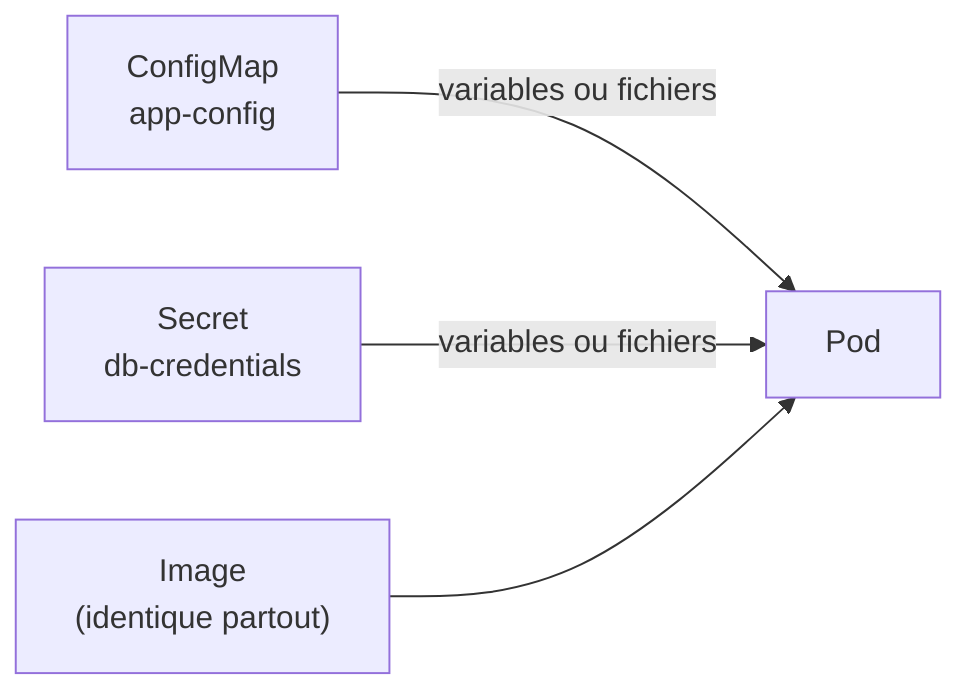
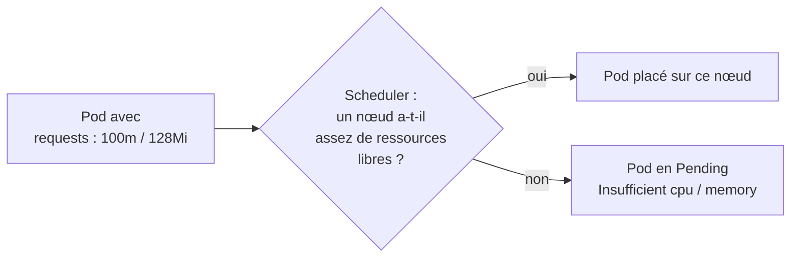
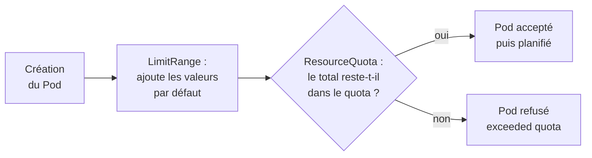

# Chapitre 4 : Configuration et ressources

!!! abstract "Objectifs du chapitre"
    - Expliquer pourquoi on externalise la configuration d'une application
    - Utiliser un ConfigMap et un Secret, par variables d'environnement ou par fichiers
    - Définir les `requests` et les `limits` d'un conteneur et décrire leurs effets
    - Encadrer la consommation d'un namespace avec un ResourceQuota et un LimitRange
    - Acquis d'apprentissage visé : **AA4**

## 1. Pourquoi externaliser la configuration ?

Une même image doit pouvoir tourner partout : sur votre poste, sur le cluster de TP, en production. Ce qui change d'un environnement à l'autre (adresse de la base, niveau de journalisation, mot de passe) ne doit donc **ni figurer dans l'image, ni dans le code**.

Kubernetes sépare l'application de sa configuration avec deux objets :

| Objet | Contenu | Exemples |
|---|---|---|
| **ConfigMap** | Configuration non sensible | Hôte de la base, port, fichier de configuration nginx |
| **Secret** | Données sensibles | Mot de passe, jeton, clé d'API |

Ces deux objets sont des paires clé-valeur, créées indépendamment des Pods, et **injectées** dans les conteneurs au démarrage.



## 2. Les ConfigMaps

On peut créer un ConfigMap en YAML ou en ligne de commande :

```yaml
apiVersion: v1
kind: ConfigMap
metadata:
  name: app-config
data:
  DB_HOST: db
  DB_PORT: "5432"
  LOG_LEVEL: info
```

```bash
kubectl create configmap app-config --from-literal=DB_HOST=db --from-literal=DB_PORT=5432
kubectl create configmap nginx-conf --from-file=default.conf
```

Les valeurs sont toujours des **chaînes** : un nombre se met entre guillemets.

### Utiliser un ConfigMap dans un Pod

| Mode | Principe | Quand l'utiliser |
|---|---|---|
| **Une variable** | `env` + `valueFrom.configMapKeyRef` : une clé devient une variable | Choisir quelques clés précises |
| **Toutes les clés** | `envFrom` + `configMapRef` : chaque clé devient une variable | Injecter un ensemble complet |
| **Fichiers** | `volumes` + `volumeMounts` : chaque clé devient un fichier | Fichier de configuration complet (nginx, etc.) |

```yaml
spec:
  containers:
    - name: app
      image: monimage:1.0.0
      env:
        - name: LOG_LEVEL
          valueFrom:
            configMapKeyRef:
              name: app-config
              key: LOG_LEVEL
      envFrom:
        - configMapRef:
            name: app-config
      volumeMounts:
        - name: conf
          mountPath: /etc/app
  volumes:
    - name: conf
      configMap:
        name: nginx-conf
```

!!! warning "Quand une modification est-elle prise en compte ?"
    - Les **variables d'environnement** sont lues **au démarrage** du conteneur : il faut redémarrer les Pods (`kubectl rollout restart deployment/<nom>`).
    - Un ConfigMap monté en **volume** est mis à jour dans le conteneur après un délai, mais l'application doit relire ses fichiers.
    - Un montage avec **`subPath`** n'est **jamais** rafraîchi automatiquement.

## 3. Les Secrets

Un Secret s'utilise comme un ConfigMap (variables ou fichiers), avec `secretKeyRef` ou `secretRef`.

```bash
kubectl create secret generic db-credentials \
  --from-literal=POSTGRES_USER=appuser \
  --from-literal=POSTGRES_PASSWORD='ChangeMe-123'
kubectl get secret db-credentials -o yaml
```

Dans le YAML, les valeurs sont encodées en **base64**. Cet encodage n'est **pas** un chiffrement :

```bash
echo 'Q2hhbmdlTWUtMTIz' | base64 -d
```

!!! warning "Un Secret n'est pas secret par défaut"
    - Quiconque peut lire le Secret (ou le fichier YAML) peut le décoder.
    - Le contenu est stocké dans le datastore du cluster ; son chiffrement au repos est une option à activer.
    - L'accès aux Secrets se limite avec le contrôle d'accès **RBAC** (chapitre 7).
    - **Ne versionnez jamais** un Secret réel dans Git : versionnez un fichier modèle avec de fausses valeurs.

Pour générer un manifeste sans l'écrire à la main :

```bash
kubectl create secret generic db-credentials --from-literal=POSTGRES_PASSWORD='...' --dry-run=client -o yaml
```

## 4. Requests et limits

Chaque conteneur peut déclarer ses besoins en CPU et en mémoire :

```yaml
resources:
  requests:
    cpu: 100m
    memory: 128Mi
  limits:
    cpu: 500m
    memory: 256Mi
```

| Élément | Rôle | Conséquence |
|---|---|---|
| `requests` | Quantité **réservée** pour le conteneur | Sert au **scheduler** pour choisir un nœud ayant assez de ressources |
| `limits` | **Plafond** que le conteneur ne peut pas dépasser | Dépassement de CPU : le conteneur est **ralenti**. Dépassement de mémoire : il est **tué** (`OOMKilled`) |

Unités : `1` CPU = 1 cœur virtuel, `500m` = 0,5 cœur (« millicores »). La mémoire se note en `Mi` ou `Gi`.

Si aucun nœud n'a assez de ressources **non réservées** pour les `requests` d'un Pod, celui-ci reste en `Pending` ; `kubectl describe pod` indique `Insufficient cpu` ou `Insufficient memory`.



Ces valeurs comptent particulièrement sur vos VMs (environ 2 vCPU et 2 Go de RAM). Pour observer la consommation réelle et les réservations :

```bash
kubectl top nodes
kubectl top pods
kubectl describe node <nom>        # section « Allocated resources »
```

!!! tip "Bon réflexe"
    Définissez toujours des `requests` réalistes et, pour la mémoire, une `limit`. Sans `requests`, le scheduler ne sait pas où placer correctement le Pod ; sans `limit`, un conteneur défaillant peut consommer toute la mémoire du nœud.

## 5. Encadrer un namespace : ResourceQuota et LimitRange

Quand plusieurs équipes partagent un cluster, il faut limiter ce que chaque namespace peut consommer. Deux objets, **complémentaires**, s'en chargent.

| Objet | Portée | Rôle |
|---|---|---|
| **LimitRange** | Chaque conteneur ou Pod | Valeurs **par défaut**, minimum et maximum |
| **ResourceQuota** | Tout le namespace | **Total** de ressources et nombre d'objets autorisés |

```yaml
apiVersion: v1
kind: LimitRange
metadata:
  name: defaults
spec:
  limits:
    - type: Container
      defaultRequest:        # valeurs de requests appliquées si absentes
        cpu: 50m
        memory: 64Mi
      default:               # valeurs de limits appliquées si absentes
        cpu: 200m
        memory: 128Mi
---
apiVersion: v1
kind: ResourceQuota
metadata:
  name: quota
spec:
  hard:
    requests.cpu: "1"
    requests.memory: 1Gi
    limits.cpu: "2"
    limits.memory: 2Gi
    pods: "10"
```

À la création d'un Pod, les contrôles s'enchaînent ainsi :



Points à connaître :

- si un quota porte sur le CPU ou la mémoire, tout Pod du namespace **doit** déclarer `requests` et `limits` ; le LimitRange fournit alors des valeurs par défaut, sinon la création est refusée ;
- avec un **Deployment**, c'est le ReplicaSet qui crée les Pods : le dépassement de quota n'empêche pas `kubectl apply`, mais les Pods manquants n'apparaissent pas. La cause se lit dans `kubectl describe replicaset` (événements) ;
- `kubectl describe quota` affiche la consommation (`Used`) par rapport au plafond (`Hard`).

!!! tip "À retenir"
    - Une image, plusieurs environnements : la configuration est **externalisée** dans un **ConfigMap** (non sensible) ou un **Secret** (sensible).
    - Injection par **variables d'environnement** (lues au démarrage) ou par **fichiers** (volume). Un montage `subPath` n'est pas rafraîchi.
    - Un Secret est **encodé**, pas chiffré : limitez l'accès et ne le versionnez pas dans Git.
    - `requests` = réservation utilisée pour le placement ; `limits` = plafond (CPU ralenti, mémoire : `OOMKilled`).
    - **LimitRange** = valeurs par défaut et bornes par conteneur ; **ResourceQuota** = total du namespace.

## Pour vérifier votre compréhension

??? question "Pourquoi ne met-on pas un mot de passe de base de données directement dans l'image ou dans le code ?"
    L'image est diffusée et conservée : le mot de passe y serait lisible par quiconque y accède, et il serait identique dans tous les environnements. Un Secret permet de l'injecter au démarrage, séparément, et de le changer sans reconstruire l'image.

??? question "Vous modifiez un ConfigMap utilisé par variables d'environnement. Les Pods en cours d'exécution voient-ils le changement ?"
    Non. Les variables sont lues au démarrage du conteneur. Il faut relancer les Pods, par exemple avec `kubectl rollout restart deployment/<nom>`.

??? question "Un Secret est-il chiffré ? Que faut-il faire pour protéger son contenu ?"
    Non, il est seulement encodé en base64. Il faut limiter l'accès avec RBAC, ne pas le versionner dans Git, et activer si besoin le chiffrement au repos du datastore.

??? question "Quelle différence entre `requests` et `limits`, et que se passe-t-il quand un conteneur dépasse sa limite de mémoire ?"
    Les `requests` sont les ressources réservées, utilisées pour le placement ; les `limits` sont le plafond. Le dépassement de la limite de mémoire provoque l'arrêt du conteneur (`OOMKilled`), qui est ensuite redémarré.

??? question "Un Pod reste en `Pending` avec le message `Insufficient memory`. Que signifie-t-il ?"
    Aucun nœud n'a assez de mémoire non réservée pour satisfaire les `requests` du Pod. Il faut réduire les `requests`, libérer des ressources ou ajouter un nœud.

??? question "Quelle différence entre un LimitRange et un ResourceQuota ?"
    Le LimitRange agit sur chaque conteneur (valeurs par défaut, minimum, maximum). Le ResourceQuota plafonne le total du namespace (CPU, mémoire, nombre d'objets).

## Labs du chapitre

- [Lab 4.1 : Externaliser la configuration](lab-4-1-externaliser-configuration.md)
- [Lab 4.2 : Maîtriser les ressources](lab-4-2-maitriser-ressources.md)