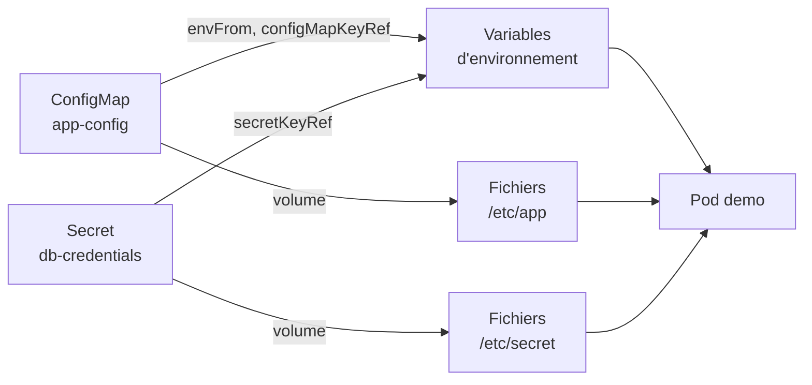

# Lab 4.1 : Externaliser la configuration

|                  |                                                                                            |
| ---------------- | ------------------------------------------------------------------------------------------ |
| **Durée**        | 60 à 75 min                                                                                |
| **Niveau**       | Guidé                                                                                      |
| **Prérequis**    | Labs du chapitre 3 réalisés, [cours du chapitre 4](cours.md) lu, cluster à 3 nœuds `Ready` |
| **Acquis visés** | AA4                                                                                        |

!!! abstract "Objectifs" - Créer un ConfigMap et un Secret, en YAML et en ligne de commande - Les injecter dans un Pod par variables d'environnement et par fichiers - Constater quand une modification est (ou n'est pas) prise en compte - Monter un fichier de configuration dans un conteneur nginx - Diagnostiquer un Pod qui référence une configuration inexistante

## Contexte et schéma

Vous partez d'une même image (`nginx:1.26-alpine`) et vous lui fournissez sa configuration de l'extérieur. Vous observez ensuite comment chaque mode d'injection réagit quand la configuration change.



## Étapes

### Étape 1 : Préparer le namespace

```bash
k create namespace tp-k8s
k config set-context --current --namespace=tp-k8s
```

### Étape 2 : Créer un ConfigMap

Créez le fichier `app-config.yaml` :

```bash
cat <<'EOF' > app-config.yaml
apiVersion: v1
kind: ConfigMap
metadata:
  name: app-config
data:
  APP_ENV: dev
  APP_COLOR: bleu
  LOG_LEVEL: info
EOF
k apply -f app-config.yaml
k get configmap app-config
k describe configmap app-config
```

!!! success "Point de contrôle" - [ ] Le ConfigMap `app-config` contient 3 clés - [ ] Vous lisez les trois valeurs en clair dans `describe`

### Étape 3 : Créer un Secret

Créez le Secret en ligne de commande, sans écrire de fichier à la main :

```bash
k create secret generic db-credentials \
  --from-literal=DB_USER=appuser \
  --from-literal=DB_PASSWORD='ChangeMe-123'
k get secret db-credentials
k describe secret db-credentials
k get secret db-credentials -o yaml
```

Observez que `describe` n'affiche que la taille des valeurs, alors que le YAML les montre **encodées**. Décodez-en une :

```bash
k get secret db-credentials -o jsonpath='{.data.DB_PASSWORD}' | base64 -d; echo
```

Générez maintenant un manifeste (sans rien créer dans le cluster) :

```bash
k create secret generic db-credentials \
  --from-literal=DB_USER=appuser \
  --from-literal=DB_PASSWORD='ChangeMe-123' \
  --dry-run=client -o yaml > secret.yaml
cat secret.yaml
```

!!! warning "Ne versionnez pas `secret.yaml`"
Ce fichier contient le vrai mot de passe, simplement encodé. Dans un dépôt Git, ajoutez-le à `.gitignore` et versionnez un fichier modèle (`secret.example.yaml`) contenant de fausses valeurs.

!!! success "Point de contrôle" - [ ] Vous avez décodé le mot de passe avec `base64 -d` - [ ] Vous pouvez expliquer pourquoi encoder n'est pas chiffrer

### Étape 4 : Injecter la configuration dans un Deployment

Le Deployment `demo` utilise les quatre modes d'injection :

```bash
cat <<'EOF' > demo.yaml
apiVersion: apps/v1
kind: Deployment
metadata:
  name: demo
spec:
  replicas: 1
  selector:
    matchLabels:
      app: demo
  template:
    metadata:
      labels:
        app: demo
    spec:
      containers:
        - name: demo
          image: nginx:1.26-alpine
          env:
            - name: NIVEAU_LOG                 # une clé, sous un autre nom
              valueFrom:
                configMapKeyRef:
                  name: app-config
                  key: LOG_LEVEL
            - name: DB_USER                    # clés du Secret
              valueFrom:
                secretKeyRef:
                  name: db-credentials
                  key: DB_USER
            - name: DB_PASSWORD
              valueFrom:
                secretKeyRef:
                  name: db-credentials
                  key: DB_PASSWORD
          envFrom:                             # toutes les clés du ConfigMap
            - configMapRef:
                name: app-config
          volumeMounts:
            - name: config
              mountPath: /etc/app
            - name: secret
              mountPath: /etc/secret
              readOnly: true
      volumes:
        - name: config
          configMap:
            name: app-config
        - name: secret
          secret:
            secretName: db-credentials
EOF
k apply -f demo.yaml
k rollout status deployment/demo
k get pods
```

!!! success "Point de contrôle" - [ ] Le Pod `demo` est `Running`

### Étape 5 : Vérifier l'injection

```bash
k exec deploy/demo -- env | grep -E 'APP_|NIVEAU_|DB_'
k exec deploy/demo -- ls /etc/app /etc/secret
k exec deploy/demo -- cat /etc/app/APP_COLOR
k exec deploy/demo -- cat /etc/secret/DB_PASSWORD; echo
```

Chaque clé du ConfigMap et du Secret est visible à la fois comme **variable** et comme **fichier**.

!!! success "Point de contrôle" - [ ] `APP_ENV`, `APP_COLOR`, `NIVEAU_LOG`, `DB_USER` et `DB_PASSWORD` apparaissent dans l'environnement - [ ] `/etc/app` contient un fichier par clé du ConfigMap, `/etc/secret` un fichier par clé du Secret

### Étape 6 : Modifier la configuration et observer

Changez une valeur du ConfigMap, puis comparez la variable et le fichier :

```bash
sed -i 's|APP_COLOR: bleu|APP_COLOR: vert|' app-config.yaml
k apply -f app-config.yaml
k exec deploy/demo -- sh -c 'echo "variable : $APP_COLOR"; echo "fichier   : $(cat /etc/app/APP_COLOR)"'
```

Le résultat immédiat montre encore `bleu` des deux côtés. Patientez 1 à 2 minutes, puis relancez la commande `exec` : le **fichier** affiche `vert`, mais la **variable** reste `bleu`.

Redémarrez maintenant les Pods et vérifiez :

```bash
k rollout restart deployment/demo
k rollout status deployment/demo
k exec deploy/demo -- sh -c 'echo "variable : $APP_COLOR"; echo "fichier   : $(cat /etc/app/APP_COLOR)"'
```

!!! success "Point de contrôle" - [ ] Avant le redémarrage, la variable était restée à `bleu` alors que le fichier était passé à `vert` - [ ] Après `rollout restart`, la variable vaut `vert`

### Étape 7 : Monter un fichier de configuration dans nginx

Vous remplacez la configuration de nginx par un fichier fourni par un ConfigMap :

```bash
cat <<'EOF' > web.yaml
apiVersion: v1
kind: ConfigMap
metadata:
  name: nginx-conf
data:
  default.conf: |
    server {
      listen 80;
      default_type text/plain;
      location / {
        return 200 'Bonjour depuis le ConfigMap v1\n';
      }
    }
---
apiVersion: apps/v1
kind: Deployment
metadata:
  name: web
spec:
  replicas: 1
  selector:
    matchLabels:
      app: web
  template:
    metadata:
      labels:
        app: web
    spec:
      containers:
        - name: web
          image: nginx:1.26-alpine
          volumeMounts:
            - name: conf
              mountPath: /etc/nginx/conf.d/default.conf
              subPath: default.conf
      volumes:
        - name: conf
          configMap:
            name: nginx-conf
---
apiVersion: v1
kind: Service
metadata:
  name: web-svc
spec:
  selector:
    app: web
  ports:
    - port: 80
      targetPort: 80
EOF
k apply -f web.yaml
k rollout status deployment/web
k run test --rm -it --image=busybox:1.36 --restart=Never -- wget -qO- http://web-svc
```

Vous obtenez le message de votre ConfigMap, et non la page par défaut de nginx. Modifiez-le :

```bash
sed -i 's|ConfigMap v1|ConfigMap v2|' web.yaml
k apply -f web.yaml
k exec deploy/web -- cat /etc/nginx/conf.d/default.conf
sleep 90
k run test --rm -it --image=busybox:1.36 --restart=Never -- wget -qO- http://web-svc
```

Le ConfigMap a changé, mais le contenu servi reste `v1` : un montage avec `subPath` n'est pas rafraîchi. Relancez le Deployment :

```bash
k rollout restart deployment/web
k rollout status deployment/web
k run test --rm -it --image=busybox:1.36 --restart=Never -- wget -qO- http://web-svc
```

!!! success "Point de contrôle" - [ ] Avant le redémarrage, `cat` dans le conteneur affichait toujours la version `v1` - [ ] Après `rollout restart`, la réponse annonce `v2`

### Étape 8 : Diagnostiquer une configuration manquante

Créez un Pod qui référence un ConfigMap inexistant :

```bash
cat <<'EOF' > broken.yaml
apiVersion: v1
kind: Pod
metadata:
  name: broken
spec:
  containers:
    - name: app
      image: nginx:1.26-alpine
      envFrom:
        - configMapRef:
            name: config-manquant
EOF
k apply -f broken.yaml
k get pod broken
k describe pod broken | tail -n 8
```

Le statut est `CreateContainerConfigError` : lisez le message dans la section **Events**. Corrigez en créant le ConfigMap manquant :

```bash
k create configmap config-manquant --from-literal=EXEMPLE=1
k get pod broken -w
```

Le Pod démarre de lui-même après quelques secondes. Quittez la surveillance avec `Ctrl+C`.

!!! success "Point de contrôle" - [ ] Vous avez lu dans les événements le nom du ConfigMap introuvable - [ ] Le Pod `broken` est passé à `Running` sans être recréé

## Questions de réflexion

??? question "Pourquoi la variable `APP_COLOR` n'a-t-elle pas changé alors que le fichier `/etc/app/APP_COLOR` si ?"
Les variables d'environnement sont fixées au démarrage du conteneur. Un ConfigMap monté en volume est mis à jour par le kubelet après un délai. Il faut relancer les Pods pour renouveler les variables.

??? question "Pourquoi le contenu servi par nginx est-il resté en `v1` après la modification du ConfigMap ?"
Un montage avec `subPath` n'est pas rafraîchi automatiquement. Et même si le fichier changeait, nginx ne relirait pas sa configuration sans rechargement. Un `rollout restart` règle le problème.

??? question "Quel est l'intérêt de la ligne `readOnly: true` sur le montage du Secret ?"
Elle empêche le conteneur de modifier les fichiers du Secret : c'est une précaution de moindre privilège.

??? question "Quelle différence entre `envFrom` et `configMapKeyRef` ?"
`envFrom` injecte toutes les clés du ConfigMap comme variables (avec leur nom). `configMapKeyRef` choisit une seule clé et permet de lui donner un autre nom de variable.

??? question "Comment vérifier qu'aucun secret réel ne se trouve dans un dépôt Git ?"
En inspectant `git status` et le contenu des fichiers versionnés, en ajoutant les fichiers de Secret à `.gitignore`, et en ne gardant dans le dépôt qu'un fichier modèle avec de fausses valeurs.

## Dépannage

| Symptôme                                                  | Pistes                                                                                    |
| --------------------------------------------------------- | ----------------------------------------------------------------------------------------- |
| `CreateContainerConfigError`                              | `k describe pod` : ConfigMap, Secret ou clé introuvable (nom, namespace, faute de frappe) |
| `base64: invalid input`                                   | Valeur copiée avec un espace ou un retour à la ligne : refaire la copie                   |
| Mot de passe décodé incorrect                             | Encodage avec `echo` qui ajoute un retour à la ligne : utiliser `echo -n`                 |
| La variable ne change pas après modification du ConfigMap | Normal : relancer les Pods avec `k rollout restart deployment/<nom>`                      |
| Le fichier monté ne change pas                            | Patienter 1 à 2 minutes ; un montage `subPath` n'est jamais rafraîchi                     |
| nginx renvoie la page par défaut                          | Vérifier `mountPath`, `subPath` et le nom de la clé (`default.conf`)                      |
| `k exec deploy/demo` échoue                               | Le Pod vient de redémarrer : `k get pods` puis réessayer                                  |

## Nettoyage

```bash
k delete namespace tp-k8s
k config set-context --current --namespace=default
rm -f secret.yaml
```

!!! tip "Bon réflexe"
Supprimez `secret.yaml` dès que le lab est terminé : il contient un mot de passe, même fictif.
