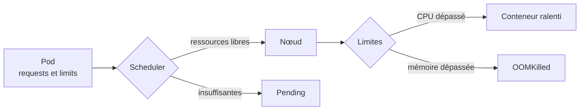

# Lab 4.2 : Maîtriser les ressources

|                  |                                                                                                                                                                |
| ---------------- | -------------------------------------------------------------------------------------------------------------------------------------------------------------- |
| **Durée**        | 60 à 75 min                                                                                                                                                    |
| **Niveau**       | Guidé                                                                                                                                                          |
| **Prérequis**    | [Lab 4.1](lab-4-1-externaliser-configuration.md) réalisé, [cours du chapitre 4](cours.md) lu, cluster à 3 nœuds `Ready` (environ 2 vCPU et 2 Go de RAM par VM) |
| **Acquis visés** | AA4, AA5                                                                                                                                                       |

!!! abstract "Objectifs" - Lire la capacité d'un nœud et la consommation d'un Pod - Définir des `requests` et des `limits`, et observer leurs effets - Diagnostiquer un Pod `Pending` (ressources insuffisantes) et un `OOMKilled` - Constater qu'une limite de CPU ralentit un conteneur - Encadrer un namespace avec un LimitRange et un ResourceQuota

## Contexte et schéma

Vos VMs sont modestes : sans règles, une application gourmande peut gêner toutes les autres. Dans ce lab, vous provoquez volontairement des situations courantes, vous les diagnostiquez, puis vous posez des garde-fous sur un namespace.



!!! warning "Exercices à faible volume"
Les exercices de saturation sont volontairement légers. Supprimez les Pods de test dès que demandé, pour ne pas alourdir vos VMs.

## Étapes

### Étape 1 : Lire la capacité du cluster

```bash
k create namespace tp-k8s
k config set-context --current --namespace=tp-k8s

k get nodes -o custom-columns=NOM:.metadata.name,CPU:.status.allocatable.cpu,MEMOIRE:.status.allocatable.memory
k top nodes
k describe node k3s-agent1 | grep -A8 "Allocated resources"
```

Adaptez `k3s-agent1` au nom de l'un de vos nœuds. Si `k top nodes` répond qu'il n'y a pas encore de métriques, patientez une minute et recommencez.

!!! success "Point de contrôle" - [ ] Vous connaissez le CPU et la mémoire allouables de chaque nœud - [ ] Vous avez lu, pour un nœud, la section « Allocated resources » (requests et limits cumulées)

### Étape 2 : Déclarer des requests et des limits

```bash
cat <<'EOF' > app.yaml
apiVersion: apps/v1
kind: Deployment
metadata:
  name: app
spec:
  replicas: 2
  selector:
    matchLabels:
      app: app
  template:
    metadata:
      labels:
        app: app
    spec:
      containers:
        - name: app
          image: nginx:1.26-alpine
          resources:
            requests:
              cpu: 100m
              memory: 64Mi
            limits:
              cpu: 200m
              memory: 128Mi
EOF
k apply -f app.yaml
k rollout status deployment/app
k get pods -o wide
k describe pod -l app=app | grep -A6 -E "Limits|Requests" | head -n 14
k top pods
```

Relevez de nouveau la section « Allocated resources » du nœud qui héberge un des Pods : les réservations ont augmenté de `100m` de CPU et `64Mi` de mémoire par Pod.

!!! success "Point de contrôle" - [ ] Les deux Pods sont `Running` et `describe` affiche vos `requests` et `limits` - [ ] `k top pods` indique une consommation réelle bien inférieure aux `requests`

### Étape 3 : Diagnostiquer un Pod `Pending`

Demandez volontairement plus de mémoire qu'aucun nœud n'en possède :

```bash
cat <<'EOF' > gourmand.yaml
apiVersion: apps/v1
kind: Deployment
metadata:
  name: gourmand
spec:
  replicas: 1
  selector:
    matchLabels:
      app: gourmand
  template:
    metadata:
      labels:
        app: gourmand
    spec:
      containers:
        - name: app
          image: nginx:1.26-alpine
          resources:
            requests:
              memory: 8Gi
EOF
k apply -f gourmand.yaml
k get pods -l app=gourmand
k describe pod -l app=gourmand | tail -n 6
```

Le Pod reste `Pending` : lisez le message dans **Events**. Corrigez ensuite la demande et réappliquez :

```bash
sed -i 's|memory: 8Gi|memory: 64Mi|' gourmand.yaml
k apply -f gourmand.yaml
k rollout status deployment/gourmand
k get pods -l app=gourmand
```

!!! success "Point de contrôle" - [ ] Vous avez lu `Insufficient memory` dans les événements - [ ] Après correction, le Pod est `Running`

### Étape 4 : Provoquer un `OOMKilled`

Ce Pod tente de stocker environ 100 Mo en mémoire alors que sa limite est de 50 Mi :

```bash
cat <<'EOF' > oom.yaml
apiVersion: v1
kind: Pod
metadata:
  name: oom
spec:
  containers:
    - name: app
      image: busybox:1.36
      command: ["sh", "-c", "x=$(head -c 100000000 /dev/zero | tr '\\0' a); echo fini; sleep 3600"]
      resources:
        limits:
          memory: 50Mi
EOF
k apply -f oom.yaml
k get pod oom -w
```

Attendez que le statut passe par `OOMKilled` (puis `CrashLoopBackOff`), puis quittez avec `Ctrl+C` et cherchez la cause :

```bash
k describe pod oom | grep -A6 "Last State"
k logs oom
k delete pod oom
```

Relevez `Reason: OOMKilled` et le code de sortie `137`. Les logs ne contiennent pas `fini` : le conteneur est tué avant la fin.

!!! success "Point de contrôle" - [ ] `Last State` indique `OOMKilled` et le code de sortie 137 - [ ] Vous pouvez expliquer pourquoi `k logs` n'aide pas ici et `describe` si

### Étape 5 : Observer la limite de CPU

Deux Pods exécutent une boucle qui consomme du CPU en continu : l'un sans limite, l'autre limité à `100m`.

```bash
cat <<'EOF' > cpu.yaml
apiVersion: v1
kind: Pod
metadata:
  name: cpu-libre
spec:
  containers:
    - name: app
      image: busybox:1.36
      command: ["sh", "-c", "while :; do :; done"]
---
apiVersion: v1
kind: Pod
metadata:
  name: cpu-limite
spec:
  containers:
    - name: app
      image: busybox:1.36
      command: ["sh", "-c", "while :; do :; done"]
      resources:
        limits:
          cpu: 100m
EOF
k apply -f cpu.yaml
sleep 60
k top pods
```

Comparez la consommation de `cpu-libre` (environ un cœur entier, soit `1000m`) et celle de `cpu-limite` (proche de `100m`). Le conteneur limité n'est pas arrêté : il est **ralenti**. Supprimez ensuite les deux Pods :

```bash
k delete -f cpu.yaml
```

!!! success "Point de contrôle" - [ ] `cpu-limite` reste `Running` mais consomme environ `100m` - [ ] `cpu-libre` consomme nettement plus - [ ] Les deux Pods de test sont supprimés

### Étape 6 : Poser un ResourceQuota, puis un LimitRange

Travaillez dans un namespace dédié, encadré par un quota :

```bash
k create namespace tp-quota
k config set-context --current --namespace=tp-quota

cat <<'EOF' > quota.yaml
apiVersion: v1
kind: ResourceQuota
metadata:
  name: quota
spec:
  hard:
    requests.cpu: 500m
    requests.memory: 512Mi
    limits.cpu: "2"
    limits.memory: 1Gi
    pods: "5"
EOF
k apply -f quota.yaml
k run test --image=nginx:1.26-alpine
```

La création est **refusée** : le namespace a un quota sur le CPU et la mémoire, donc le Pod doit déclarer ses `requests` et `limits`. Ajoutez un LimitRange qui fournit des valeurs par défaut :

```bash
cat <<'EOF' > limitrange.yaml
apiVersion: v1
kind: LimitRange
metadata:
  name: defaults
spec:
  limits:
    - type: Container
      defaultRequest:
        cpu: 50m
        memory: 64Mi
      default:
        cpu: 200m
        memory: 128Mi
EOF
k apply -f limitrange.yaml
k run test --image=nginx:1.26-alpine
k get pod test -o jsonpath='{.spec.containers[0].resources}'; echo
k describe quota quota
```

Le Pod est accepté et a reçu les valeurs du LimitRange. Dans `describe quota`, comparez `Used` et `Hard`.

!!! success "Point de contrôle" - [ ] Avant le LimitRange, la création était refusée avec un message sur les `requests` et `limits` - [ ] Après le LimitRange, le Pod `test` a automatiquement des `requests` et des `limits` - [ ] `describe quota` affiche la consommation du Pod `test`

### Étape 7 : Dépasser le quota

Demandez beaucoup plus de réplicas que le quota ne le permet :

```bash
k create deployment charge --image=nginx:1.26-alpine --replicas=8
sleep 10
k get deployment charge
k get pods
k describe quota quota
k describe replicaset -l app=charge | tail -n 8
```

Le Deployment est accepté, mais il n'obtient jamais ses 8 Pods : le quota (5 Pods au maximum, le Pod `test` compte) bloque la création, et le message `exceeded quota` apparaît dans les événements du **ReplicaSet**.

Testez ensuite un Pod qui dépasse le quota de CPU :

```bash
cat <<'EOF' > gros.yaml
apiVersion: v1
kind: Pod
metadata:
  name: gros
spec:
  containers:
    - name: app
      image: nginx:1.26-alpine
      resources:
        requests:
          cpu: 600m
          memory: 64Mi
        limits:
          cpu: 600m
          memory: 128Mi
EOF
k apply -f gros.yaml
```

La création est refusée immédiatement (`Forbidden`, `exceeded quota`). Revenez à une charge raisonnable :

```bash
k scale deployment charge --replicas=2
k get pods
k describe quota quota
```

!!! success "Point de contrôle" - [ ] Le Deployment `charge` n'a jamais atteint 8 Pods, et vous avez lu `exceeded quota` dans les événements du ReplicaSet - [ ] Le Pod `gros` a été refusé à la création - [ ] Après la réduction, `Used` est revenu sous `Hard`

## Questions de réflexion

??? question "Pourquoi un Pod avec `requests: memory: 8Gi` reste-t-il `Pending` alors que le conteneur ne consommerait pas autant ?"
Le scheduler se base sur les `requests` (la réservation), pas sur la consommation réelle. Aucun nœud n'a 8 Gi de mémoire non réservée, donc le Pod n'est placé nulle part.

??? question "Quelle différence de comportement entre le dépassement d'une limite de CPU et celui d'une limite de mémoire ?"
Le CPU est « compressible » : le conteneur est ralenti. La mémoire ne l'est pas : le conteneur est tué (`OOMKilled`) puis redémarré.

??? question "Où lire la cause d'un `OOMKilled` ?"
Dans `kubectl describe pod`, section `Last State` : motif `OOMKilled` et code de sortie 137. Les logs ne le montrent pas, puisque le conteneur est interrompu brutalement.

??? question "Pourquoi le Pod `test` a-t-il été refusé avant l'ajout du LimitRange ?"
Le quota porte sur le CPU et la mémoire : chaque Pod doit donc déclarer ses `requests` et `limits`. Le LimitRange fournit des valeurs par défaut quand elles sont absentes.

??? question "Pourquoi le Deployment `charge` a-t-il été accepté alors que ses Pods ne le sont pas ?"
Le Deployment ne crée pas les Pods lui-même : c'est son ReplicaSet qui le fait. Le quota refuse la création des Pods, d'où l'erreur dans les événements du ReplicaSet et non à l'`apply`.

## Dépannage

| Symptôme                                             | Pistes                                                                                                     |
| ---------------------------------------------------- | ---------------------------------------------------------------------------------------------------------- |
| `k top` : métriques indisponibles                    | Patienter 1 à 2 minutes après le démarrage ; vérifier les Pods `metrics-server` dans `kube-system`         |
| Pod `Pending`                                        | `k describe pod` (Events) : `Insufficient cpu` ou `Insufficient memory`, ou quota ; réduire les `requests` |
| Le Pod `oom` ne passe pas par `OOMKilled`            | Attendre le redémarrage du conteneur, puis consulter `Last State`                                          |
| `cpu-limite` consomme plus que `100m`                | Attendre la mise à jour des métriques ; refaire `k top pods` après une minute                              |
| Création refusée : `must specify limits...`          | Un quota existe sans LimitRange : ajouter les `resources` ou un LimitRange                                 |
| Création refusée : `exceeded quota`                  | `k describe quota` : comparer `Used` et `Hard`, puis libérer des ressources                                |
| Le Deployment reste sous le nombre de réplicas voulu | `k describe replicaset` : chercher l'événement `FailedCreate`                                              |

## Nettoyage

```bash
k delete namespace tp-quota
k delete namespace tp-k8s
k config set-context --current --namespace=default
```
