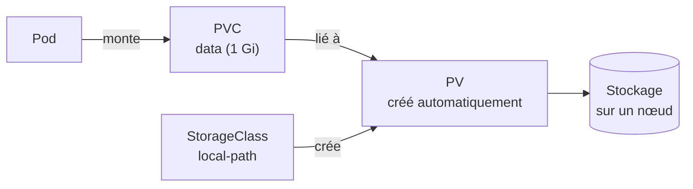
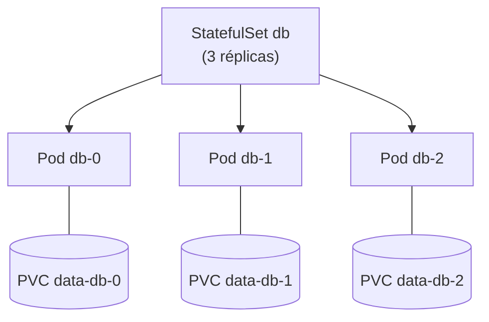

# Chapitre 5 : Stockage

!!! abstract "Objectifs du chapitre" - Expliquer pourquoi les données d'un conteneur sont perdues et comment les conserver - Distinguer `emptyDir` d'un stockage persistant - Décrire les rôles de PersistentVolume, PersistentVolumeClaim et StorageClass - Expliquer le fonctionnement du stockage local de k3s et ses limites - Utiliser un StatefulSet et un Service headless pour une application avec état - Acquis d'apprentissage visé : **AA4**

## 1. Pourquoi un stockage à part ?

Le système de fichiers d'un conteneur est **éphémère** : si le conteneur redémarre, ou si le Pod est remplacé, tout ce qu'il avait écrit disparaît. C'est acceptable pour une application web sans état, mais pas pour une base de données.

Kubernetes sépare donc le **stockage** du **Pod** : les données vivent dans un **volume**, que l'on monte dans le conteneur, comme vous l'avez fait avec les ConfigMaps et les Secrets au chapitre 4.

## 2. Les volumes simples

| Type de volume            | Durée de vie des données               | Usage typique                                                                     |
| ------------------------- | -------------------------------------- | --------------------------------------------------------------------------------- |
| **emptyDir**              | Celle du **Pod** (supprimées avec lui) | Dossier temporaire, partage de fichiers entre conteneurs d'un même Pod            |
| **hostPath**              | Celle du nœud (dossier de la machine)  | Cas très particuliers : déconseillé, car lié à un nœud et risqué pour sa sécurité |
| **PersistentVolumeClaim** | Indépendante du Pod                    | Données à conserver (bases de données, fichiers déposés)                          |

```yaml
spec:
  containers:
    - name: app
      image: nginx:1.26-alpine
      volumeMounts:
        - name: cache
          mountPath: /var/cache/nginx
  volumes:
    - name: cache
      emptyDir: {}
```

Un `emptyDir` survit au redémarrage d'un **conteneur**, mais pas à la suppression du **Pod**. Il ne convient donc pas pour des données à conserver.

## 3. Le stockage persistant

Trois objets se partagent le travail :

| Objet                           | Rôle                                                                         | Qui le crée                                               |
| ------------------------------- | ---------------------------------------------------------------------------- | --------------------------------------------------------- |
| **PersistentVolume (PV)**       | Un morceau de stockage réel, disponible dans le cluster                      | L'administrateur, ou automatiquement par une StorageClass |
| **PersistentVolumeClaim (PVC)** | Une **demande** de stockage (taille, mode d'accès) faite par une application | Le développeur                                            |
| **StorageClass**                | Une « recette » qui crée automatiquement un PV quand un PVC le demande       | L'administrateur (fournie avec k3s)                       |



L'application ne connaît que le **PVC** : elle demande de la place, sans savoir où elle se trouve. C'est le principe du **provisionnement dynamique**.

```yaml
apiVersion: v1
kind: PersistentVolumeClaim
metadata:
  name: data
spec:
  accessModes: ["ReadWriteOnce"]
  storageClassName: local-path
  resources:
    requests:
      storage: 1Gi
---
apiVersion: v1
kind: Pod
metadata:
  name: app
spec:
  containers:
    - name: app
      image: nginx:1.26-alpine
      volumeMounts:
        - name: donnees
          mountPath: /usr/share/nginx/html
  volumes:
    - name: donnees
      persistentVolumeClaim:
        claimName: data
```

### Modes d'accès

| Mode                  | Signification                                                 |
| --------------------- | ------------------------------------------------------------- |
| `ReadWriteOnce` (RWO) | Lecture et écriture par les Pods d'**un seul nœud** à la fois |
| `ReadOnlyMany` (ROX)  | Lecture seule par plusieurs nœuds                             |
| `ReadWriteMany` (RWX) | Lecture et écriture par plusieurs nœuds                       |

Le stockage local de k3s ne gère que `ReadWriteOnce`.

### Cycle de vie et politique de rétention

- Un PVC passe de `Pending` à `Bound` quand il est lié à un PV.
- Supprimer un **Pod** ne supprime **pas** le PVC : les données sont conservées.
- Supprimer un **PVC** peut supprimer le PV et les données, selon la politique de rétention (`reclaimPolicy`) : `Delete` (le PV est supprimé avec le PVC, valeur courante avec le provisionnement dynamique) ou `Retain` (le PV est conservé).

```bash
kubectl get storageclass
kubectl get pvc,pv
kubectl describe pvc data
```

## 4. Le stockage dans k3s : local-path

k3s fournit une StorageClass nommée **`local-path`**, marquée comme classe par défaut. Elle crée les volumes comme de simples **dossiers sur le disque d'un nœud** (sous `/var/lib/rancher/k3s/storage` par défaut).

| Avantage                                   | Limite                                                                            |
| ------------------------------------------ | --------------------------------------------------------------------------------- |
| Aucune installation, idéale pour apprendre | Les données sont **liées à un nœud** : si ce nœud tombe, elles sont inaccessibles |
| Rapide (disque local)                      | Pas de réplication des données entre nœuds                                        |
|                                            | Mode `ReadWriteOnce` uniquement                                                   |
|                                            | La taille demandée n'est pas imposée comme plafond                                |

Le Pod qui utilise un volume `local-path` est donc **toujours placé sur le nœud qui héberge les données**. En production, on utilise un stockage réseau ou distribué (chapitre 13).

!!! note "Un PVC en `Pending` n'est pas forcément une erreur"
Avec `local-path`, le volume n'est créé qu'au moment où un **Pod** utilise le PVC (« liaison différée », `WaitForFirstConsumer`). Tant qu'aucun Pod ne le réclame, le PVC reste `Pending`. Si un Pod l'utilise et que le PVC reste `Pending`, consultez `kubectl describe pvc` et les événements.

## 5. StatefulSet et Service headless

Un Deployment convient à des Pods **interchangeables**. Une base de données a besoin de plus : une identité stable et son propre volume. C'est le rôle du **StatefulSet**.

|                       | Deployment                      | StatefulSet                                             |
| --------------------- | ------------------------------- | ------------------------------------------------------- |
| Nom des Pods          | Aléatoire (`web-7d9f...-abc12`) | **Stable et ordonné** (`db-0`, `db-1`, ...)             |
| Stockage              | Partagé ou absent               | **Un PVC propre à chaque Pod** (`volumeClaimTemplates`) |
| Démarrage et arrêt    | En parallèle                    | Dans l'ordre (`db-0` d'abord)                           |
| Remplacement d'un Pod | Nouveau nom                     | **Même nom, même volume**                               |
| Usage typique         | Applications sans état          | Bases de données, files de messages                     |



Chaque Pod reçoit un PVC créé à partir du modèle, nommé `<modèle>-<statefulset>-<numéro>` (par exemple `data-db-0`). Si `db-0` est supprimé, il est recréé avec le **même nom** et retrouve **le même volume**.

Un StatefulSet s'accompagne d'un **Service headless** : un Service sans adresse IP virtuelle (`clusterIP: None`). Au lieu d'une adresse unique, le DNS renvoie directement les adresses des Pods, et chaque Pod obtient un nom DNS stable :

```text
<pod>.<service>.<namespace>.svc.cluster.local      exemple : db-0.db.tp-k8s.svc.cluster.local
```

```yaml
apiVersion: v1
kind: Service
metadata:
  name: web
spec:
  clusterIP: None # headless
  selector:
    app: web
  ports:
    - port: 80
---
apiVersion: apps/v1
kind: StatefulSet
metadata:
  name: web
spec:
  serviceName: web # nom du Service headless
  replicas: 2
  selector:
    matchLabels:
      app: web
  template:
    metadata:
      labels:
        app: web
    spec:
      containers:
        - name: web
          image: nginx:1.26-alpine
          volumeMounts:
            - name: data
              mountPath: /usr/share/nginx/html
  volumeClaimTemplates:
    - metadata:
        name: data
      spec:
        accessModes: ["ReadWriteOnce"]
        storageClassName: local-path
        resources:
          requests:
            storage: 1Gi
```

Points à retenir sur les StatefulSets :

- les PVC créés par `volumeClaimTemplates` **ne sont pas supprimés** quand on supprime le StatefulSet ou qu'on réduit ses réplicas : c'est une protection des données, mais il faut les supprimer à la main pour libérer l'espace ;
- le champ `serviceName` doit désigner un Service headless qui existe ;
- **un StatefulSet ne réplique pas les données** : avec 2 réplicas d'une base, ce sont deux bases indépendantes, sauf si l'application gère elle-même la réplication.

!!! tip "À retenir" - Le système de fichiers d'un conteneur est **éphémère** ; les données à conserver vont dans un **volume persistant**. - `emptyDir` vit autant que le Pod ; un **PVC** vit indépendamment. - **PVC** = demande, **PV** = stockage réel, **StorageClass** = création automatique. - k3s fournit `local-path` : simple, mais **lié à un nœud** et en `ReadWriteOnce`. - Un PVC `Pending` avec `local-path` attend le premier Pod qui l'utilise. - **StatefulSet** = noms stables + un volume par Pod ; il s'associe à un **Service headless** pour des noms DNS stables. - Supprimer un Pod conserve les données ; supprimer un PVC peut les détruire.

## Pour vérifier votre compréhension

??? question "Un Pod écrit dans son système de fichiers, puis est supprimé. Les données sont-elles conservées ?"
Non, sauf si elles sont écrites dans un volume persistant (PVC). Le système de fichiers du conteneur est perdu avec le Pod.

??? question "Quelle différence entre un PV et un PVC ?"
Le PV est le stockage réel disponible dans le cluster. Le PVC est la demande d'un utilisateur (taille, mode d'accès) ; Kubernetes la lie à un PV, éventuellement créé automatiquement par une StorageClass.

??? question "Un PVC `local-path` reste en `Pending` et aucun Pod ne l'utilise. Est-ce une erreur ?"
Non. Le volume n'est créé que lorsqu'un Pod utilise le PVC (liaison différée).

??? question "Avec `local-path`, que se passe-t-il pour les données si le nœud qui les héberge tombe en panne ?"
Elles deviennent inaccessibles, et le Pod qui les utilise ne peut pas démarrer ailleurs : les données sont liées au nœud, sans réplication.

??? question "Pourquoi préfère-t-on un StatefulSet à un Deployment pour une base de données ?"
Il garantit un nom stable, un ordre de démarrage et un volume propre à chaque Pod. Quand un Pod est recréé, il retrouve son identité et ses données.

??? question "Vous supprimez un StatefulSet. Les PVC créés par `volumeClaimTemplates` sont-ils supprimés ?"
Non, ils sont conservés par défaut, ainsi que leurs données. Il faut les supprimer explicitement.

## Labs du chapitre

- [Lab 5.1 : Volumes persistants](lab-5-1-volumes-persistants.md)
- [Lab 5.2 : Base de données avec StatefulSet](lab-5-2-base-donnees-statefulset.md)
