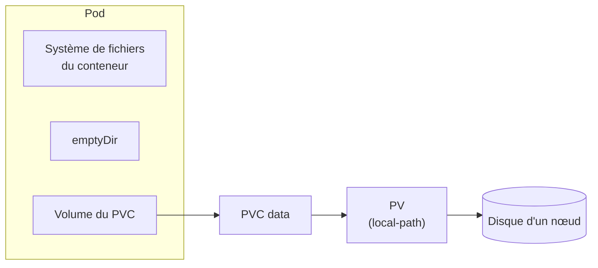

# Lab 5.1 : Volumes persistants

| | |
|---|---|
| **Durée** | 45 à 60 min |
| **Niveau** | Guidé |
| **Prérequis** | Labs du chapitre 4 réalisés, [cours du chapitre 5](cours.md) lu, cluster à 3 nœuds `Ready`, accès SSH aux VMs |
| **Acquis visés** | AA4 |

!!! abstract "Objectifs"
    - Constater la perte de données d'un conteneur et d'un `emptyDir`
    - Créer un PVC et observer sa liaison avec un PV (provisionnement dynamique)
    - Démontrer qu'une donnée survit à la suppression du Pod
    - Repérer où les données sont stockées avec `local-path`
    - Observer la suppression d'un PVC et diagnostiquer un PVC bloqué en `Pending`

## Contexte et schéma

Vous écrivez des fichiers à trois endroits différents et vous observez lesquels survivent aux incidents.



| Emplacement | Survit au redémarrage du conteneur | Survit à la suppression du Pod |
|---|---|---|
| Système de fichiers du conteneur | Non | Non |
| `emptyDir` | À vérifier (étape 2) | À vérifier (étape 2) |
| PVC | À vérifier (étapes 4 et 5) | À vérifier (étape 5) |

## Étapes

### Étape 1 : Préparer le namespace et examiner la StorageClass

```bash
k create namespace tp-k8s
k config set-context --current --namespace=tp-k8s

k get storageclass
k get storageclass local-path -o yaml | grep -E "reclaimPolicy|volumeBindingMode|is-default-class"
```

Repérez la classe par défaut, la politique de rétention (`reclaimPolicy`) et le mode de liaison (`volumeBindingMode`).

!!! success "Point de contrôle"
    - [ ] Vous avez identifié `local-path` comme classe par défaut
    - [ ] Vous avez relevé `reclaimPolicy` et `volumeBindingMode`

### Étape 2 : Perte de données avec `emptyDir`

Créez un Pod avec un `emptyDir` :

```bash
cat <<'EOF' > temp.yaml
apiVersion: v1
kind: Pod
metadata:
  name: temp
spec:
  containers:
    - name: app
      image: nginx:1.26-alpine
      volumeMounts:
        - name: donnees
          mountPath: /donnees
  volumes:
    - name: donnees
      emptyDir: {}
EOF
k apply -f temp.yaml
k wait --for=condition=Ready pod/temp --timeout=60s
```

Écrivez un fichier dans le volume et un autre dans le système de fichiers du conteneur :

```bash
k exec temp -- sh -c 'echo "dans emptyDir" > /donnees/fichier.txt; echo "dans le conteneur" > /tmp/ephemere.txt'
k exec temp -- ls /donnees /tmp
```

Provoquez le redémarrage du **conteneur** (arrêt de nginx), puis relisez :

```bash
k exec temp -- nginx -s stop
sleep 10
k get pod temp
k exec temp -- ls /donnees /tmp
```

La colonne `RESTARTS` est passée à 1. Seul le fichier de l'`emptyDir` existe encore. Supprimez maintenant le **Pod**, recréez-le et regardez :

```bash
k delete pod temp
k apply -f temp.yaml
k wait --for=condition=Ready pod/temp --timeout=60s
k exec temp -- ls /donnees
k delete pod temp
```

!!! success "Point de contrôle"
    - [ ] Après le redémarrage du conteneur, `fichier.txt` existait toujours et `ephemere.txt` avait disparu
    - [ ] Après la suppression du Pod, `/donnees` était vide

### Étape 3 : Créer un PVC

```bash
cat <<'EOF' > pvc.yaml
apiVersion: v1
kind: PersistentVolumeClaim
metadata:
  name: data
spec:
  accessModes: ["ReadWriteOnce"]
  storageClassName: local-path
  resources:
    requests:
      storage: 1Gi
EOF
k apply -f pvc.yaml
k get pvc,pv
k describe pvc data | tail -n 5
```

Le PVC est `Pending` et aucun PV n'existe encore : avec `local-path`, le volume n'est créé que lorsqu'un Pod utilise le PVC.

!!! success "Point de contrôle"
    - [ ] `k get pvc` affiche `Pending`
    - [ ] `describe` indique que le PVC attend un premier consommateur (`WaitForFirstConsumer`)

### Étape 4 : Utiliser le PVC dans un Pod

```bash
cat <<'EOF' > app.yaml
apiVersion: v1
kind: Pod
metadata:
  name: app
spec:
  containers:
    - name: app
      image: nginx:1.26-alpine
      volumeMounts:
        - name: donnees
          mountPath: /usr/share/nginx/html
  volumes:
    - name: donnees
      persistentVolumeClaim:
        claimName: data
EOF
k apply -f app.yaml
k get pvc -w
```

Observez le passage de `Pending` à `Bound`, puis quittez avec `Ctrl+C`. Examinez le PV créé automatiquement et le nœud qui héberge le Pod :

```bash
k get pvc,pv
k get pod app -o wide
PV=$(k get pvc data -o jsonpath='{.spec.volumeName}')
k describe pv $PV | grep -E -A6 "Node Affinity|Source"
```

Écrivez une page web dans le volume et vérifiez qu'nginx la sert :

```bash
k exec app -- sh -c 'echo "Bonjour, donnee persistante" > /usr/share/nginx/html/index.html'
k exec app -- wget -qO- http://localhost
```

Sur le **nœud qui héberge le Pod**, repérez le dossier correspondant :

```bash
sudo ls -R /var/lib/rancher/k3s/storage/
```

!!! success "Point de contrôle"
    - [ ] Le PVC est `Bound` à un PV créé automatiquement
    - [ ] Le PV porte une affinité vers le nœud du Pod
    - [ ] La page est servie par nginx, et le fichier `index.html` existe dans le dossier du nœud

### Étape 5 : Prouver la persistance

Supprimez le Pod, recréez-le, et relisez la page :

```bash
k delete pod app
k get pvc
k apply -f app.yaml
k wait --for=condition=Ready pod/app --timeout=60s
k get pod app -o wide
k exec app -- wget -qO- http://localhost
```

!!! success "Point de contrôle"
    - [ ] Le PVC est resté `Bound` pendant que le Pod n'existait plus
    - [ ] Le nouveau Pod affiche le même message
    - [ ] Il s'exécute sur le même nœud que le Pod précédent

### Étape 6 : Supprimer le PVC

Demandez la suppression du PVC alors que le Pod l'utilise encore :

```bash
k delete pvc data --wait=false
k get pvc
```

Le PVC reste en `Terminating` tant qu'un Pod l'utilise : c'est une protection. Supprimez le Pod, puis observez :

```bash
k delete pod app
sleep 10
k get pvc,pv
```

Le PVC et le PV ont disparu (politique de rétention `Delete`). Sur le nœud, vérifiez que le dossier a été supprimé :

```bash
sudo ls /var/lib/rancher/k3s/storage/
```

Recréez enfin le PVC et le Pod, et constatez que les données ne sont plus là :

```bash
k apply -f pvc.yaml
k apply -f app.yaml
k wait --for=condition=Ready pod/app --timeout=60s
k exec app -- ls /usr/share/nginx/html
```

!!! success "Point de contrôle"
    - [ ] Le PVC est resté `Terminating` tant que le Pod existait
    - [ ] Après suppression, ni PVC ni PV ne subsistaient
    - [ ] Le volume recréé est vide : la page précédente a été perdue

### Étape 7 : Diagnostiquer un PVC en `Pending`

Créez un PVC avec une StorageClass qui n'existe pas :

```bash
cat <<'EOF' > pvc-erreur.yaml
apiVersion: v1
kind: PersistentVolumeClaim
metadata:
  name: data-erreur
spec:
  accessModes: ["ReadWriteOnce"]
  storageClassName: local-pat
  resources:
    requests:
      storage: 1Gi
EOF
k apply -f pvc-erreur.yaml
k get pvc data-erreur
k describe pvc data-erreur | tail -n 5
```

Lisez dans **Events** la raison du blocage. Le champ `storageClassName` ne peut plus être modifié : corrigez en supprimant puis en recréant le PVC :

```bash
k delete pvc data-erreur
sed -i 's|local-pat$|local-path|' pvc-erreur.yaml
k apply -f pvc-erreur.yaml
k get pvc data-erreur
```

Ce PVC reste `Pending`, normalement, tant qu'aucun Pod ne l'utilise.

!!! success "Point de contrôle"
    - [ ] Vous avez lu dans les événements que la StorageClass est introuvable
    - [ ] Après correction, le PVC n'affiche plus d'erreur (il attend un Pod)

## Questions de réflexion

??? question "Pourquoi le fichier de l'`emptyDir` a-t-il survécu au redémarrage du conteneur mais pas à la suppression du Pod ?"
    Un `emptyDir` est lié au **Pod** : il est conservé tant que le Pod existe, y compris quand ses conteneurs redémarrent. Le système de fichiers du conteneur, lui, est recréé à chaque redémarrage.

??? question "Pourquoi le Pod recréé a-t-il été placé sur le même nœud ?"
    Le PV `local-path` est un dossier d'un nœud précis : il porte une affinité vers ce nœud. Le scheduler doit donc y placer tout Pod qui utilise le volume.

??? question "Que se passerait-il pour l'application si le nœud hébergeant le volume tombait en panne ?"
    Le Pod ne pourrait être placé nulle part ailleurs (les données ne sont qu'à cet endroit) : il resterait `Pending`. Il n'y a ni réplication ni basculement avec `local-path`.

??? question "Pourquoi le PVC est-il resté en `Terminating` tant que le Pod existait ?"
    Kubernetes protège un PVC utilisé : il ne le supprime qu'une fois qu'aucun Pod ne l'utilise plus, pour éviter de détruire des données en cours d'utilisation.

??? question "Quelle précaution prendre avant de supprimer un PVC dont la rétention est `Delete` ?"
    S'assurer que les données ne sont plus nécessaires, ou les avoir sauvegardées, car le PV et son contenu sont supprimés avec le PVC.

## Dépannage

| Symptôme | Pistes |
|---|---|
| PVC `Pending` sans Pod | Normal avec `local-path` : le volume est créé au premier Pod qui l'utilise |
| PVC `Pending` malgré un Pod | `k describe pvc` (Events) : StorageClass absente ou mal orthographiée, quota atteint |
| Pod `Pending` | `k describe pod` : PVC non lié ou nœud du volume indisponible |
| `k exec temp -- nginx -s stop` échoue | Pod pas encore prêt ; utiliser `k wait` ou réessayer ; à défaut, `k exec temp -- kill 1` |
| `RESTARTS` reste à 0 | Attendre 10 à 15 secondes puis relancer `k get pod temp` |
| `k exec ... wget` : connexion refusée | nginx redémarre : patienter quelques secondes |
| Dossier absent dans `/var/lib/rancher/k3s/storage/` | Vous êtes sur le mauvais nœud : relever le nœud avec `k get pod app -o wide` |
| `k wait` expire | Image en cours de téléchargement : `k describe pod`, accès Internet des VMs |

## Nettoyage

```bash
k delete namespace tp-k8s
k config set-context --current --namespace=default
k get pv
```

Les PV créés dynamiquement avec la rétention `Delete` disparaissent avec leurs PVC. Vérifiez que `k get pv` ne liste plus de volume de ce lab.