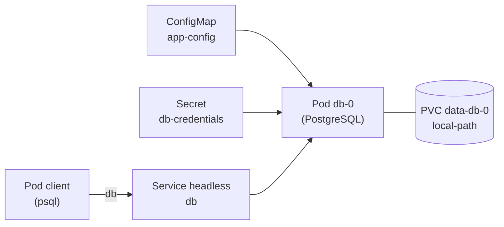

# Lab 5.2 : Base de données avec StatefulSet

|                  |                                                                                                                                               |
| ---------------- | --------------------------------------------------------------------------------------------------------------------------------------------- |
| **Durée**        | 60 à 75 min                                                                                                                                   |
| **Niveau**       | Guidé                                                                                                                                         |
| **Prérequis**    | [Lab 5.1](lab-5-1-volumes-persistants.md) réalisé, [cours du chapitre 5](cours.md) lu, notions du chapitre 4 (ConfigMap, Secret, `resources`) |
| **Acquis visés** | AA4                                                                                                                                           |

!!! abstract "Objectifs" - Déployer PostgreSQL avec un StatefulSet, un Service headless et un volume par Pod - Injecter la configuration avec un ConfigMap et un Secret - Démontrer que les données survivent à la suppression du Pod - Observer les noms DNS d'un Service headless - Constater que deux réplicas d'un StatefulSet ne partagent pas leurs données

## Contexte et schéma

Vous mettez en place la base de données d'une future application. Elle doit conserver ses données et rester joignable par un nom stable. Vous reprendrez cette base dans le Mini-projet 2.



## Étapes

### Étape 1 : Préparer la configuration

```bash
k create namespace tp-k8s
k config set-context --current --namespace=tp-k8s

cat <<'EOF' > app-config.yaml
apiVersion: v1
kind: ConfigMap
metadata:
  name: app-config
data:
  DB_HOST: db
  DB_PORT: "5432"
  DB_NAME: appdb
EOF
k apply -f app-config.yaml

k create secret generic db-credentials \
  --from-literal=POSTGRES_USER=appuser \
  --from-literal=POSTGRES_PASSWORD='ChangeMe-123'
k get configmap,secret
```

!!! success "Point de contrôle" - [ ] Le ConfigMap `app-config` et le Secret `db-credentials` existent

### Étape 2 : Déployer la base avec un StatefulSet

Créez le Service headless et le StatefulSet :

```bash
cat <<'EOF' > db.yaml
apiVersion: v1
kind: Service
metadata:
  name: db
spec:
  clusterIP: None              # Service headless
  selector:
    app: appdb
    tier: db
  ports:
    - port: 5432
---
apiVersion: apps/v1
kind: StatefulSet
metadata:
  name: db
spec:
  serviceName: db              # nom du Service headless
  replicas: 1
  selector:
    matchLabels:
      app: appdb
      tier: db
  template:
    metadata:
      labels:
        app: appdb
        tier: db
    spec:
      containers:
        - name: postgres
          image: postgres:16-alpine
          ports:
            - containerPort: 5432
          env:
            - name: POSTGRES_USER
              valueFrom:
                secretKeyRef:
                  name: db-credentials
                  key: POSTGRES_USER
            - name: POSTGRES_PASSWORD
              valueFrom:
                secretKeyRef:
                  name: db-credentials
                  key: POSTGRES_PASSWORD
            - name: POSTGRES_DB
              valueFrom:
                configMapKeyRef:
                  name: app-config
                  key: DB_NAME
            - name: PGDATA
              value: /var/lib/postgresql/data/pgdata
          volumeMounts:
            - name: data
              mountPath: /var/lib/postgresql/data
          resources:
            requests:
              cpu: 100m
              memory: 128Mi
            limits:
              cpu: 500m
              memory: 512Mi
  volumeClaimTemplates:
    - metadata:
        name: data
      spec:
        accessModes: ["ReadWriteOnce"]
        storageClassName: local-path
        resources:
          requests:
            storage: 1Gi
EOF
k apply -f db.yaml
k get pods -w
```

Observez la création du Pod `db-0`, puis quittez avec `Ctrl+C`. Vérifiez le reste :

```bash
k get statefulset,service,pvc,pv
k logs db-0 | tail -n 5
k exec db-0 -- pg_isready -U appuser -d appdb
```

!!! note "Variable `PGDATA`"
La base écrit ses fichiers dans un **sous-dossier** (`pgdata`) du point de montage. Sur certains stockages, la racine du volume contient déjà des éléments et PostgreSQL refuse alors de s'initialiser.

!!! note "Disponibilité"
Le Pod est déclaré prêt dès que son conteneur démarre, avant même que PostgreSQL accepte des connexions. Les sondes de disponibilité, qui règlent ce point, sont étudiées au chapitre 9. D'ici là, vérifiez l'état de la base avec `pg_isready` ou les logs.

!!! success "Point de contrôle" - [ ] Le Pod s'appelle `db-0` - [ ] Le PVC `data-db-0` est `Bound` à un PV - [ ] `pg_isready` répond `accepting connections` - [ ] Les logs indiquent que le système est prêt à accepter des connexions

### Étape 3 : Créer des données

Créez une table et insérez deux lignes :

```bash
k exec db-0 -- psql -U appuser -d appdb -c "CREATE TABLE taches (id serial PRIMARY KEY, titre text NOT NULL, faite boolean DEFAULT false);"
k exec db-0 -- psql -U appuser -d appdb -c "INSERT INTO taches (titre) VALUES ('Apprendre les StatefulSets'), ('Tester la persistance');"
k exec db-0 -- psql -U appuser -d appdb -c "SELECT * FROM taches;"
```

!!! success "Point de contrôle" - [ ] La requête `SELECT` renvoie deux lignes

### Étape 4 : Prouver la persistance

Supprimez le Pod de la base, puis surveillez sa recréation :

```bash
k get pod db-0 -o wide
k delete pod db-0
k get pods -w
```

Quittez avec `Ctrl+C` quand `db-0` est de nouveau `Running`, puis relisez les données :

```bash
k exec db-0 -- pg_isready -U appuser -d appdb
k exec db-0 -- psql -U appuser -d appdb -c "SELECT * FROM taches;"
k get pod db-0 -o wide
k get pvc
```

!!! success "Point de contrôle" - [ ] Le Pod recréé porte le **même nom** `db-0` - [ ] Les deux lignes sont toujours présentes - [ ] Le Pod s'exécute sur le même nœud, avec le même PVC `data-db-0`

### Étape 5 : Joindre la base par son nom DNS

Interrogez le DNS depuis un Pod temporaire :

```bash
k run test --rm -it --image=busybox:1.36 --restart=Never -- nslookup db
k run test --rm -it --image=busybox:1.36 --restart=Never -- nslookup db-0.db
```

La réponse contient l'adresse **du Pod** (pas d'adresse de Service virtuelle) : c'est la particularité d'un Service headless. Connectez-vous ensuite avec un client PostgreSQL, depuis un autre Pod :

```bash
k run client --rm -it --image=postgres:16-alpine --restart=Never \
  --env="PGPASSWORD=ChangeMe-123" -- \
  psql -h db -U appuser -d appdb -c "SELECT count(*) FROM taches;"
```

!!! note "Mot de passe en ligne de commande"
Passer un mot de passe ainsi est acceptable pour un test de TP, mais à éviter ailleurs : il reste visible dans l'historique et dans la définition du Pod.

!!! success "Point de contrôle" - [ ] `nslookup db` renvoie l'adresse IP du Pod `db-0` - [ ] Le client se connecte avec le nom `db` et obtient `2`

### Étape 6 : Passer à deux réplicas

```bash
k scale statefulset db --replicas=2
k get pods -w
```

Observez que `db-1` ne démarre qu'après que `db-0` est prêt. Quittez avec `Ctrl+C`, puis comparez :

```bash
k get pvc
k exec db-1 -- psql -U appuser -d appdb -c "\dt"
k exec db-0 -- psql -U appuser -d appdb -c "\dt"
```

`db-1` a son propre PVC, `data-db-1`, et sa base est **vide** : les deux réplicas ne sont pas synchronisés. Revenez à un réplica :

```bash
k scale statefulset db --replicas=1
k get pods
k get pvc
```

Le Pod `db-1` a disparu, mais son PVC `data-db-1` existe toujours. Supprimez-le :

```bash
k delete pvc data-db-1
k get pvc
```

!!! success "Point de contrôle" - [ ] `db-1` a été créé après `db-0` et avec un PVC distinct - [ ] La table `taches` n'existait pas dans `db-1` - [ ] Après la réduction à un réplica, `data-db-1` subsistait jusqu'à sa suppression manuelle

### Étape 7 : Comprendre le rôle du mot de passe initial

Changez le mot de passe dans le Secret, puis redémarrez la base :

```bash
k create secret generic db-credentials \
  --from-literal=POSTGRES_USER=appuser \
  --from-literal=POSTGRES_PASSWORD='Nouveau-456' \
  --dry-run=client -o yaml | k apply -f -
k rollout restart statefulset db
k rollout status statefulset db
k exec db-0 -- pg_isready -U appuser -d appdb
```

Testez les deux mots de passe depuis un client :

```bash
k run client --rm -it --image=postgres:16-alpine --restart=Never \
  --env="PGPASSWORD=Nouveau-456" -- psql -h db -U appuser -d appdb -c "SELECT 1;"
k run client --rm -it --image=postgres:16-alpine --restart=Never \
  --env="PGPASSWORD=ChangeMe-123" -- psql -h db -U appuser -d appdb -c "SELECT 1;"
```

Le nouveau mot de passe est **refusé** et l'ancien fonctionne encore : PostgreSQL ne lit `POSTGRES_PASSWORD` qu'à la **première initialisation** d'un volume vide. Ensuite, le mot de passe est enregistré dans la base elle-même et se change avec une commande SQL.

!!! success "Point de contrôle" - [ ] Le Pod `db-0` a redémarré avec les données intactes - [ ] Le nouveau mot de passe est refusé, l'ancien est accepté - [ ] Vous pouvez expliquer pourquoi modifier le Secret ne suffit pas

## Questions de réflexion

??? question "Pourquoi le Pod recréé s'appelle-t-il encore `db-0` et retrouve-t-il ses données ?"
Un StatefulSet donne à ses Pods une identité stable (nom et volume associé). Quand `db-0` est supprimé, un Pod de même nom est créé et rattaché au même PVC `data-db-0`.

??? question "Quelle est la particularité d'un Service headless et pourquoi la préfère-t-on pour un StatefulSet ?"
Il n'a pas d'adresse virtuelle : le DNS renvoie directement les adresses des Pods, et chaque Pod a un nom DNS stable (`db-0.db`). C'est utile quand on doit distinguer les membres d'un groupe, par exemple une base répliquée.

??? question "Pourquoi la table `taches` n'existait-elle pas dans `db-1` ?"
Un StatefulSet ne réplique pas les données : chaque Pod a son propre volume et sa propre base. La réplication doit être configurée dans la base elle-même.

??? question "Pourquoi le PVC `data-db-1` a-t-il subsisté après la réduction à un réplica ?"
Kubernetes ne supprime pas automatiquement les PVC d'un StatefulSet, pour éviter de détruire des données par erreur. Il faut les supprimer explicitement.

??? question "Pourquoi le changement du mot de passe dans le Secret n'a-t-il pas modifié le mot de passe de la base ?"
`POSTGRES_PASSWORD` n'est utilisée qu'à la création de la base, sur un volume vide. Une fois la base initialisée, le mot de passe est conservé dans ses données ; il faut le modifier avec SQL.

## Dépannage

| Symptôme                                 | Pistes                                                                                        |
| ---------------------------------------- | --------------------------------------------------------------------------------------------- |
| `db-0` en `CrashLoopBackOff`             | `k logs db-0` : variable manquante, `PGDATA`, droits sur le volume                            |
| `CreateContainerConfigError`             | Secret ou ConfigMap introuvable, nom de clé incorrect : `k describe pod db-0`                 |
| PVC `Pending`                            | `k describe pvc data-db-0` : StorageClass, quota atteint ; vérifier que le Pod existe         |
| `pg_isready` : `no response`             | PostgreSQL démarre encore : patienter quelques secondes puis relancer                         |
| `psql: FATAL: role "..." does not exist` | Nom d'utilisateur différent de `POSTGRES_USER`, ou volume initialisé avec d'anciennes valeurs |
| `password authentication failed`         | Mot de passe différent de celui utilisé à l'initialisation du volume                          |
| `nslookup db` ne renvoie rien            | Service `db` absent ou sélecteur incorrect : `k get svc db`, `k get endpoints db`             |
| `db-1` reste `Pending`                   | Attendre que `db-0` soit prêt ; vérifier les ressources du nœud (`k describe pod db-1`)       |

## Nettoyage

```bash
k delete namespace tp-k8s
k config set-context --current --namespace=default
k get pv
```

La suppression du namespace supprime aussi les PVC, et les PV `local-path` disparaissent avec eux. Vérifiez qu'aucun volume de ce lab ne subsiste dans `k get pv`.
