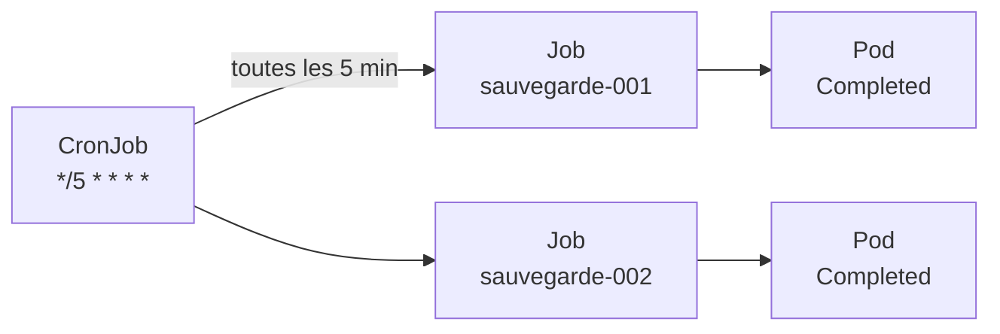
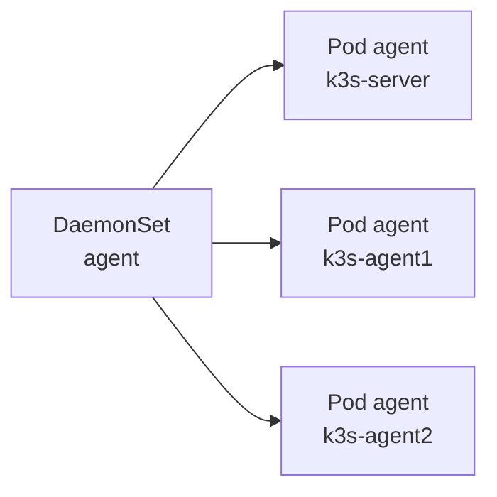
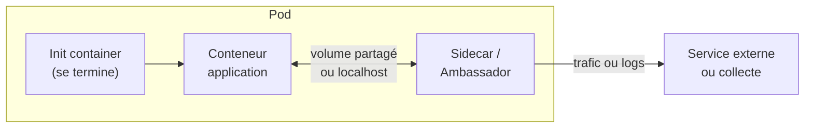

# Chapitre 6 : Workloads spécialisés

!!! abstract "Objectifs du chapitre" - Choisir le type de workload adapté : Deployment, StatefulSet, Job, CronJob ou DaemonSet - Exécuter une tâche ponctuelle avec un Job et une tâche planifiée avec un CronJob - Déployer un Pod sur chaque nœud avec un DaemonSet - Décrire et utiliser les patterns multi-conteneurs : init container, sidecar, ambassador - Acquis d'apprentissage visé : **AA2**

## 1. Quel workload pour quel besoin ?

Jusqu'ici, vous avez déployé des applications qui **tournent en permanence**. D'autres besoins existent : une tâche qui doit se terminer, un traitement planifié, un agent à installer sur chaque machine. Kubernetes propose un objet pour chaque cas.

| Besoin                                     | Objet           | Comportement                                     |
| ------------------------------------------ | --------------- | ------------------------------------------------ |
| Application sans état, toujours disponible | **Deployment**  | N réplicas interchangeables, relancés en continu |
| Application avec état (base de données)    | **StatefulSet** | Pods à identité stable, un volume par Pod        |
| Tâche qui doit **se terminer** (une fois)  | **Job**         | Exécute jusqu'au succès, puis s'arrête           |
| Tâche **répétée** à heure fixe             | **CronJob**     | Crée un Job selon un calendrier                  |
| Un Pod **par nœud**                        | **DaemonSet**   | Un Pod sur chaque nœud, y compris les nouveaux   |

## 2. Job : une tâche qui se termine

Un **Job** crée un ou plusieurs Pods et attend qu'ils se terminent **avec succès**. Contrairement à un Deployment, un Pod terminé n'est pas relancé : le travail est fini.

```yaml
apiVersion: batch/v1
kind: Job
metadata:
  name: calcul
spec:
  backoffLimit: 3 # nombre de tentatives avant échec
  ttlSecondsAfterFinished: 300 # suppression automatique 5 min après la fin
  template:
    spec:
      restartPolicy: Never # Never ou OnFailure (jamais Always)
      containers:
        - name: calcul
          image: busybox:1.36
          command: ["sh", "-c", "echo début; sleep 5; echo fin"]
```

| Champ                     | Rôle                                               | Valeur par défaut      |
| ------------------------- | -------------------------------------------------- | ---------------------- |
| `completions`             | Nombre de Pods à terminer avec succès              | 1                      |
| `parallelism`             | Nombre de Pods exécutés en même temps              | 1                      |
| `backoffLimit`            | Nombre de nouvelles tentatives en cas d'échec      | 6                      |
| `ttlSecondsAfterFinished` | Délai avant suppression automatique du Job terminé | (aucun : le Job reste) |

Le `restartPolicy` d'un Job est **`Never`** (un nouveau Pod est créé après un échec) ou **`OnFailure`** (le conteneur est relancé dans le même Pod). Un Pod terminé avec succès affiche le statut `Completed` ; il reste visible (avec ses logs) tant que le Job existe.

```bash
kubectl get jobs
kubectl get pods
kubectl logs job/calcul
```

## 3. CronJob : une tâche planifiée

Un **CronJob** crée un **Job** à chaque échéance d'un calendrier, écrit dans la syntaxe cron.



La syntaxe `schedule` comporte cinq champs :

| Minute | Heure | Jour du mois | Mois | Jour de la semaine |
| ------ | ----- | ------------ | ---- | ------------------ |
| 0-59   | 0-23  | 1-31         | 1-12 | 0-6 (0 = dimanche) |

| Expression    | Signification              |
| ------------- | -------------------------- |
| `*/5 * * * *` | Toutes les 5 minutes       |
| `0 2 * * *`   | Tous les jours à 02:00     |
| `0 3 * * 0`   | Tous les dimanches à 03:00 |

```yaml
apiVersion: batch/v1
kind: CronJob
metadata:
  name: sauvegarde
spec:
  schedule: "*/5 * * * *"
  concurrencyPolicy: Forbid
  successfulJobsHistoryLimit: 3
  failedJobsHistoryLimit: 1
  jobTemplate:
    spec:
      template:
        spec:
          restartPolicy: OnFailure
          containers:
            - name: sauvegarde
              image: busybox:1.36
              command: ["sh", "-c", "date; echo sauvegarde effectuée"]
```

| Champ                        | Rôle                                                                                                                                   |
| ---------------------------- | -------------------------------------------------------------------------------------------------------------------------------------- |
| `concurrencyPolicy`          | Si l'exécution précédente n'est pas finie : `Allow` (cumuler, défaut), `Forbid` (sauter la nouvelle), `Replace` (remplacer l'ancienne) |
| `successfulJobsHistoryLimit` | Nombre de Jobs réussis conservés (3 par défaut)                                                                                        |
| `failedJobsHistoryLimit`     | Nombre de Jobs échoués conservés (1 par défaut)                                                                                        |
| `suspend`                    | `true` pour suspendre le calendrier sans supprimer le CronJob                                                                          |

Deux points pratiques :

- l'heure du calendrier est, par défaut, celle du cluster (en général **UTC**) ; le champ `timeZone` permet d'en choisir une autre ;
- pour tester sans attendre l'échéance, déclenchez un Job manuellement :

```bash
kubectl create job --from=cronjob/sauvegarde test-manuel
```

Un cas d'usage classique est la **sauvegarde planifiée d'une base de données**, que vous mettrez en place au Mini-projet 2.

## 4. DaemonSet : un Pod par nœud

Un **DaemonSet** garantit qu'un Pod s'exécute sur **chaque nœud** du cluster. Quand un nœud rejoint le cluster, le Pod y est créé automatiquement ; quand il le quitte, le Pod disparaît.



On l'utilise pour des services liés à la machine : collecte de logs, agents de supervision, composants réseau. Dans k3s, ServiceLB (qui expose les Services de type LoadBalancer) repose sur des DaemonSets : vous avez vu ses Pods `svclb-...` au chapitre 3.

```yaml
apiVersion: apps/v1
kind: DaemonSet
metadata:
  name: agent
spec:
  selector:
    matchLabels:
      app: agent
  template:
    metadata:
      labels:
        app: agent
    spec:
      containers:
        - name: agent
          image: busybox:1.36
          command:
            ["sh", "-c", "while true; do echo agent actif; sleep 30; done"]
```

Il n'y a pas de champ `replicas` : le nombre de Pods dépend du nombre de nœuds. Le placement sur certains nœuds seulement relève du chapitre 10.

## 5. Patterns multi-conteneurs

Les conteneurs d'un même Pod partagent le **réseau** (ils se joignent par `localhost`) et peuvent partager des **volumes**. On en tire des patterns classiques :

| Pattern            | Principe                                                                                               | Exemple                                                     |
| ------------------ | ------------------------------------------------------------------------------------------------------ | ----------------------------------------------------------- |
| **Init container** | S'exécute **avant** les conteneurs de l'application, séquentiellement, et doit se terminer avec succès | Attendre qu'une base soit disponible, préparer des fichiers |
| **Sidecar**        | S'exécute **à côté** de l'application, pendant toute sa vie                                            | Collecteur de logs, proxy, synchronisation de fichiers      |
| **Ambassador**     | Un conteneur-proxy représente un service externe pour l'application, qui l'appelle sur `localhost`     | Proxy vers une base ou un service distant                   |



### Init container

Les `initContainers` démarrent un par un, dans l'ordre. Les conteneurs de l'application ne démarrent qu'après leur succès. Tant que l'initialisation n'est pas terminée, le Pod affiche `Init:0/1`.

```yaml
spec:
  initContainers:
    - name: attendre-db
      image: busybox:1.36
      command:
        [
          "sh",
          "-c",
          "until nc -z db 5432; do echo attente de la base; sleep 2; done",
        ]
  containers:
    - name: api
      image: monimage:1.0.0
```

### Sidecar avec volume partagé

```yaml
spec:
  containers:
    - name: app
      image: busybox:1.36
      command:
        ["sh", "-c", "while true; do date >> /logs/app.log; sleep 5; done"]
      volumeMounts:
        - name: logs
          mountPath: /logs
    - name: lecteur-logs # sidecar
      image: busybox:1.36
      command: ["sh", "-c", "tail -F /logs/app.log"]
      volumeMounts:
        - name: logs
          mountPath: /logs
  volumes:
    - name: logs
      emptyDir: {}
```

Avec plusieurs conteneurs, il faut préciser lequel on cible : `kubectl logs <pod> -c <conteneur>` et `kubectl exec <pod> -c <conteneur> -- ...`. Pour un init container : `kubectl logs <pod> -c attendre-db`.

!!! note "Sidecars natifs"
Selon la version de Kubernetes, un mode dédié de sidecar existe (un init container avec `restartPolicy: Always`). Il n'est pas utilisé dans ce cours : les sidecars y sont de simples conteneurs du Pod.

!!! tip "À retenir" - **Job** : tâche qui se termine (`restartPolicy` à `Never` ou `OnFailure`). **CronJob** : crée des Jobs selon un calendrier cron. - Test immédiat d'un CronJob : `kubectl create job --from=cronjob/<nom> <job>`. - **DaemonSet** : un Pod par nœud, sans `replicas`. - Les conteneurs d'un Pod partagent réseau (`localhost`) et volumes. - **Init container** : prérequis avant l'application. **Sidecar** : assistant permanent. **Ambassador** : proxy vers l'extérieur. - Avec plusieurs conteneurs, on cible avec `-c` dans `logs` et `exec`.

## Pour vérifier votre compréhension

??? question "Pourquoi un Job n'utilise-t-il pas `restartPolicy: Always` ?"
`Always` relancerait indéfiniment le conteneur, même après un succès. Un Job doit se terminer : on utilise `Never` ou `OnFailure`.

??? question "Que signifie `*/10 * * * *`, et que signifie `30 1 * * 1` ?"
Toutes les 10 minutes ; tous les lundis à 01:30.

??? question "Comment tester un CronJob sans attendre son échéance ?"
En créant un Job à partir de lui : `kubectl create job --from=cronjob/<nom> <nom-du-job>`.

??? question "Quelle différence entre un Deployment à 3 réplicas et un DaemonSet sur un cluster de 3 nœuds ?"
Le Deployment place 3 Pods où le scheduler le décide (éventuellement plusieurs sur un même nœud). Le DaemonSet place exactement un Pod par nœud, et s'adapte quand le nombre de nœuds change.

??? question "Un Pod affiche `Init:0/1` depuis plusieurs minutes. Où chercher la cause ?"
Dans les logs de l'init container (`kubectl logs <pod> -c <init>`) et dans `kubectl describe pod`. L'init container n'a pas terminé avec succès, par exemple parce que la base qu'il attend n'est pas joignable.

??? question "Quel pattern choisir pour exporter les logs d'une application qui écrit dans un fichier ?"
Un sidecar qui lit le fichier dans un volume partagé (`emptyDir`) et l'envoie vers la collecte ou l'affiche sur sa sortie standard.

## Labs du chapitre

- [Lab 6.1 : Jobs et CronJobs](lab-6-1-jobs-cronjobs.md)
- [Lab 6.2 : Patterns multi-conteneurs](lab-6-2-patterns-multi-conteneurs.md)
