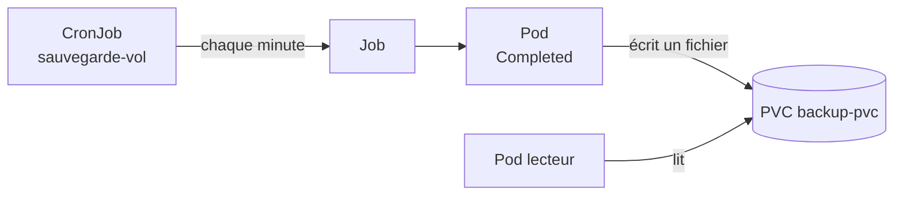

# Lab 6.1 : Jobs et CronJobs

|                  |                                                                                                                                   |
| ---------------- | --------------------------------------------------------------------------------------------------------------------------------- |
| **Durée**        | 75 à 90 min (dont plusieurs attentes de 1 à 3 minutes)                                                                            |
| **Niveau**       | Guidé                                                                                                                             |
| **Prérequis**    | Labs du chapitre 5 réalisés, [cours du chapitre 6](cours.md) lu, cluster à 3 nœuds `Ready`, deux terminaux ouverts sur le serveur |
| **Acquis visés** | AA2                                                                                                                               |

!!! abstract "Objectifs" - Exécuter une tâche ponctuelle avec un Job et lire ses résultats - Observer les nouvelles tentatives, l'échec et le nettoyage automatique d'un Job - Paralléliser un Job avec `completions` et `parallelism` - Planifier une tâche avec un CronJob, la déclencher à la main, la suspendre - Écrire une sauvegarde planifiée sur un volume persistant

## Contexte et schéma

Vous passez de l'exécution d'applications permanentes à l'exécution de **tâches** : traitements ponctuels, puis sauvegardes planifiées. La dernière étape reproduit, avec un exemple simple, le mécanisme que vous appliquerez à une base de données dans le Mini-projet 2.



## Étapes

### Étape 1 : Préparer le namespace

```bash
k create namespace tp-k8s
k config set-context --current --namespace=tp-k8s
```

### Étape 2 : Un Job simple

```bash
cat <<'EOF' > calcul.yaml
apiVersion: batch/v1
kind: Job
metadata:
  name: calcul
spec:
  backoffLimit: 3
  template:
    spec:
      restartPolicy: Never
      containers:
        - name: calcul
          image: busybox:1.36
          command: ["sh", "-c", "echo debut; sleep 5; echo fin"]
EOF
k apply -f calcul.yaml
k wait --for=condition=complete job/calcul --timeout=60s
k get job,pods
k logs job/calcul
k describe job calcul | grep -E "Pods Statuses|Completions"
```

!!! success "Point de contrôle" - [ ] Le Job `calcul` affiche `COMPLETIONS 1/1` - [ ] Le Pod est `Completed` et n'a pas été relancé - [ ] `k logs` affiche `debut` puis `fin`

### Étape 3 : Un Job en échec

Un Job dont le conteneur termine toujours en erreur est relancé jusqu'à `backoffLimit`.

```bash
cat <<'EOF' > echec.yaml
apiVersion: batch/v1
kind: Job
metadata:
  name: echec
spec:
  backoffLimit: 2
  template:
    spec:
      restartPolicy: Never
      containers:
        - name: app
          image: busybox:1.36
          command: ["sh", "-c", "echo tentative; exit 1"]
EOF
k apply -f echec.yaml
k get pods -l job-name=echec -w
```

Les tentatives s'espacent de plus en plus (environ 10 s, puis 20 s). Quittez avec `Ctrl+C` quand trois Pods en erreur sont affichés, puis :

```bash
k get job echec
k describe job echec | tail -n 8
k logs -l job-name=echec
```

Comparez avec `restartPolicy: OnFailure`, qui relance le conteneur **dans le même Pod** :

```bash
sed -e 's/name: echec/name: echec-onfailure/' -e 's/restartPolicy: Never/restartPolicy: OnFailure/' echec.yaml | k apply -f -
sleep 40
k get pods -l job-name=echec-onfailure
```

!!! success "Point de contrôle" - [ ] Avec `Never`, trois Pods distincts en `Error` ont été créés avant l'échec du Job - [ ] `describe` mentionne le dépassement de `backoffLimit` (`BackoffLimitExceeded`) - [ ] Avec `OnFailure`, un seul Pod apparaît, avec une colonne `RESTARTS` qui augmente

### Étape 4 : Un Job parallèle avec nettoyage automatique

Ce Job doit réussir 6 tâches, 2 à la fois, et se supprime tout seul 2 minutes après sa fin.

```bash
cat <<'EOF' > parallele.yaml
apiVersion: batch/v1
kind: Job
metadata:
  name: parallele
spec:
  completions: 6
  parallelism: 2
  ttlSecondsAfterFinished: 120
  template:
    spec:
      restartPolicy: Never
      containers:
        - name: tache
          image: busybox:1.36
          command: ["sh", "-c", "echo traitement; sleep 10"]
EOF
```

Dans le **second terminal**, lancez `k get pods -l job-name=parallele -w`. Dans le premier :

```bash
k apply -f parallele.yaml
k get job parallele -w
```

Observez que jamais plus de deux Pods ne tournent simultanément. Quittez avec `Ctrl+C` dans les deux terminaux quand le Job affiche `6/6`. Vous vérifierez la suppression automatique à la fin de l'étape 5.

!!! success "Point de contrôle" - [ ] Au plus 2 Pods étaient `Running` en même temps - [ ] Le Job a atteint `COMPLETIONS 6/6`

### Étape 5 : Un CronJob

```bash
cat <<'EOF' > sauvegarde.yaml
apiVersion: batch/v1
kind: CronJob
metadata:
  name: sauvegarde
spec:
  schedule: "*/1 * * * *"
  concurrencyPolicy: Forbid
  successfulJobsHistoryLimit: 3
  failedJobsHistoryLimit: 1
  jobTemplate:
    spec:
      template:
        spec:
          restartPolicy: OnFailure
          containers:
            - name: sauvegarde
              image: busybox:1.36
              command: ["sh", "-c", "date; echo sauvegarde effectuee"]
EOF
k apply -f sauvegarde.yaml
k get cronjob
```

Déclenchez immédiatement un Job de test, sans attendre l'échéance :

```bash
k create job --from=cronjob/sauvegarde test-manuel
k wait --for=condition=complete job/test-manuel --timeout=60s
k logs job/test-manuel
```

Patientez environ 2 minutes, puis observez les Jobs créés par le calendrier :

```bash
k get cronjob
k get jobs
JOB=$(k get jobs --sort-by=.metadata.creationTimestamp -o name | tail -n 1)
k logs $JOB
```

Vérifiez enfin que le Job `parallele` de l'étape 4 a été supprimé automatiquement (2 minutes après sa fin) :

```bash
k get jobs
```

!!! success "Point de contrôle" - [ ] Le Job `test-manuel` s'est exécuté immédiatement - [ ] Un nouveau Job apparaît chaque minute, avec un nom de la forme `sauvegarde-<nombre>` - [ ] La colonne `LAST SCHEDULE` du CronJob est renseignée - [ ] Le Job `parallele` n'existe plus

### Étape 6 : Concurrence et suspension

Créez un CronJob dont l'exécution (150 s) est plus longue que son intervalle (1 min), avec `concurrencyPolicy: Forbid` :

```bash
cat <<'EOF' > lent.yaml
apiVersion: batch/v1
kind: CronJob
metadata:
  name: lent
spec:
  schedule: "*/1 * * * *"
  concurrencyPolicy: Forbid
  jobTemplate:
    spec:
      template:
        spec:
          restartPolicy: OnFailure
          containers:
            - name: lent
              image: busybox:1.36
              command: ["sh", "-c", "echo debut; sleep 150; echo fin"]
EOF
k apply -f lent.yaml
sleep 150
k get jobs | grep lent
k describe cronjob lent | tail -n 6
```

Les échéances tombant pendant l'exécution du premier Job sont **ignorées** : il n'y a qu'un Job `lent-...` actif, et les événements du CronJob indiquent qu'une exécution est déjà en cours. Supprimez ce CronJob, puis suspendez `sauvegarde` :

```bash
k delete cronjob lent
k patch cronjob sauvegarde -p '{"spec":{"suspend":true}}'
k get cronjob
k get jobs
sleep 90
k get jobs
```

Aucun nouveau Job n'est créé tant que le CronJob est suspendu. Reprenez ensuite :

```bash
k patch cronjob sauvegarde -p '{"spec":{"suspend":false}}'
k get cronjob
```

!!! success "Point de contrôle" - [ ] Un seul Job `lent-...` était actif malgré plusieurs échéances - [ ] Pendant la suspension, la liste des Jobs n'a pas évolué - [ ] `k get cronjob` affiche `SUSPEND False` après la reprise

### Étape 7 : Sauvegarde sur un volume persistant

Supprimez d'abord l'ancien CronJob, puis créez un volume et un CronJob qui y écrit un fichier horodaté :

```bash
k delete cronjob sauvegarde

cat <<'EOF' > sauvegarde-vol.yaml
apiVersion: v1
kind: PersistentVolumeClaim
metadata:
  name: backup-pvc
spec:
  accessModes: ["ReadWriteOnce"]
  storageClassName: local-path
  resources:
    requests:
      storage: 1Gi
---
apiVersion: batch/v1
kind: CronJob
metadata:
  name: sauvegarde-vol
spec:
  schedule: "*/1 * * * *"
  concurrencyPolicy: Forbid
  successfulJobsHistoryLimit: 3
  jobTemplate:
    spec:
      template:
        spec:
          restartPolicy: OnFailure
          containers:
            - name: sauvegarde
              image: busybox:1.36
              command: ["sh", "-c", "echo \"sauvegarde du $(date)\" > /backup/dump-$(date +%Y%m%d-%H%M%S).txt"]
              volumeMounts:
                - name: backup
                  mountPath: /backup
          volumes:
            - name: backup
              persistentVolumeClaim:
                claimName: backup-pvc
EOF
k apply -f sauvegarde-vol.yaml
k get pvc
```

Le PVC reste `Pending` jusqu'à la première exécution. Patientez environ 3 minutes, puis créez un Pod qui lit le volume :

```bash
cat <<'EOF' > lecteur.yaml
apiVersion: v1
kind: Pod
metadata:
  name: lecteur
spec:
  containers:
    - name: lecteur
      image: nginx:1.26-alpine
      volumeMounts:
        - name: backup
          mountPath: /backup
  volumes:
    - name: backup
      persistentVolumeClaim:
        claimName: backup-pvc
EOF
k get jobs
k get pvc
k apply -f lecteur.yaml
k wait --for=condition=Ready pod/lecteur --timeout=60s
k exec lecteur -- ls -l /backup
k exec lecteur -- sh -c 'cat /backup/$(ls /backup | tail -n 1)'
```

!!! success "Point de contrôle" - [ ] Le PVC `backup-pvc` est `Bound` - [ ] Plusieurs fichiers `dump-...txt` s'accumulent dans `/backup`, un par exécution - [ ] Les fichiers sont lisibles depuis le Pod `lecteur`, qui est distinct des Pods de sauvegarde

## Questions de réflexion

??? question "Quelle différence de comportement entre `restartPolicy: Never` et `OnFailure` pour un Job qui échoue ?"
Avec `Never`, chaque tentative crée un **nouveau Pod** (les Pods en erreur restent visibles). Avec `OnFailure`, le conteneur est relancé dans le **même Pod** (la colonne `RESTARTS` augmente).

??? question "À quoi sert `ttlSecondsAfterFinished` ?"
À supprimer automatiquement un Job terminé et ses Pods après un délai. Sans lui, les Jobs et leurs Pods s'accumulent dans le namespace.

??? question "Que se passerait-il avec `concurrencyPolicy: Allow` dans l'étape 6 ?"
Une nouvelle exécution démarrerait à chaque minute sans attendre la fin de la précédente : plusieurs Jobs `lent-...` tourneraient en parallèle, ce qui est dangereux pour une sauvegarde.

??? question "Pourquoi `kubectl create job --from=cronjob/...` est-il utile ?"
Il permet de tester immédiatement le contenu du CronJob (commande, volumes, variables) sans attendre l'échéance du calendrier.

??? question "Une sauvegarde stockée sur le même volume local que la base protège-t-elle contre la perte d'un nœud ? Que proposeriez-vous ?"
Non : si le nœud tombe, la base et sa sauvegarde disparaissent ensemble. Il faut copier les sauvegardes ailleurs : stockage réseau, autre nœud, stockage objet ou machine distante.

## Dépannage

| Symptôme                          | Pistes                                                                                                        |
| --------------------------------- | ------------------------------------------------------------------------------------------------------------- |
| Job qui ne démarre pas            | `k describe job` et `k describe pod` : image, ressources, quota                                               |
| Pod du Job en `Error`             | `k logs <pod>` : lire le message de la commande                                                               |
| Aucun Job créé par le CronJob     | Vérifier `schedule` (cinq champs), `SUSPEND`, l'heure du cluster (UTC) ; patienter jusqu'à la minute suivante |
| `LAST SCHEDULE` vide              | Aucune échéance n'a encore eu lieu : attendre une minute                                                      |
| Jobs qui s'accumulent             | Régler `successfulJobsHistoryLimit`, `failedJobsHistoryLimit` ou `ttlSecondsAfterFinished`                    |
| `create job --from` : `not found` | Nom du CronJob incorrect ou mauvais namespace : `k get cronjob`                                               |
| PVC `backup-pvc` en `Pending`     | Normal avant la première exécution ; ensuite `k describe pvc backup-pvc`                                      |
| Pod `lecteur` en `Pending`        | PVC non lié, ou nœud du volume indisponible : `k describe pod lecteur`                                        |
| Dossier `/backup` vide            | Attendre l'exécution suivante ; vérifier `k get jobs` et `k logs job/<nom>`                                   |

## Nettoyage

```bash
k delete namespace tp-k8s
k config set-context --current --namespace=default
k get pv
```

La suppression du namespace supprime les CronJobs, les Jobs, les Pods et le PVC. Vérifiez que `k get pv` ne liste plus de volume de ce lab.
