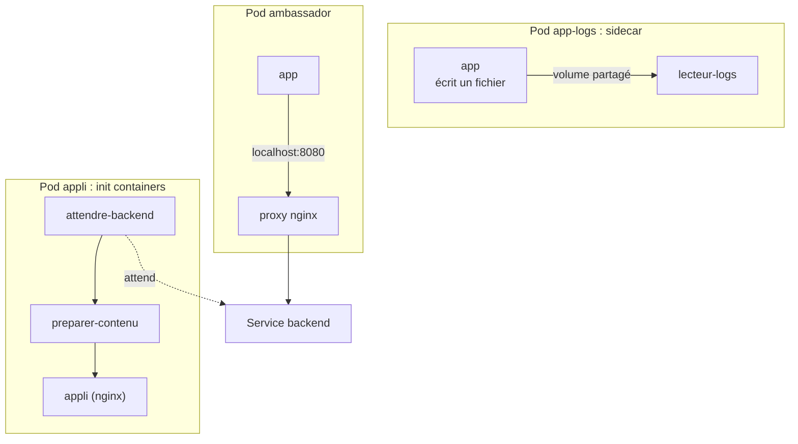

# Lab 6.2 : Patterns multi-conteneurs

|                  |                                                                                                                                               |
| ---------------- | --------------------------------------------------------------------------------------------------------------------------------------------- |
| **Durée**        | 60 à 75 min                                                                                                                                   |
| **Niveau**       | Guidé                                                                                                                                         |
| **Prérequis**    | [Lab 6.1](lab-6-1-jobs-cronjobs.md) réalisé, [cours du chapitre 6](cours.md) lu, notions de ConfigMap (chapitre 4) et de Service (chapitre 3) |
| **Acquis visés** | AA2                                                                                                                                           |

!!! abstract "Objectifs" - Utiliser des init containers pour attendre une dépendance et préparer des fichiers - Diagnostiquer un init container en échec - Partager un volume et le réseau entre les conteneurs d'un Pod (sidecar) - Mettre en place un conteneur ambassador qui sert de proxy vers un Service - Cibler un conteneur précis avec `-c` dans `logs` et `exec`

## Contexte et schéma

Vous construisez trois Pods à plusieurs conteneurs, chacun illustrant un pattern du cours.



## Étapes

### Étape 1 : Préparer le namespace

```bash
k create namespace tp-k8s
k config set-context --current --namespace=tp-k8s
```

### Étape 2 : Init containers

Le Pod `appli` démarre deux init containers, dans l'ordre :

1. `attendre-backend` boucle tant que le Service `backend` n'est pas joignable ;
2. `preparer-contenu` écrit une page dans un volume partagé avec le conteneur nginx.

Le Service `backend` n'existe pas encore : l'initialisation va donc rester bloquée.

```bash
cat <<'EOF' > appli.yaml
apiVersion: apps/v1
kind: Deployment
metadata:
  name: appli
spec:
  replicas: 1
  selector:
    matchLabels:
      app: appli
  template:
    metadata:
      labels:
        app: appli
    spec:
      initContainers:
        - name: attendre-backend
          image: busybox:1.36
          command: ["sh", "-c", "until wget -q -T 2 -O /dev/null http://backend; do echo attente du backend; sleep 2; done; echo backend disponible"]
        - name: preparer-contenu
          image: busybox:1.36
          command: ["sh", "-c", "echo 'Page generee par un init container' > /html/index.html"]
          volumeMounts:
            - name: html
              mountPath: /html
      containers:
        - name: appli
          image: nginx:1.26-alpine
          volumeMounts:
            - name: html
              mountPath: /usr/share/nginx/html
      volumes:
        - name: html
          emptyDir: {}
EOF
k apply -f appli.yaml
sleep 15
k get pods
k logs deploy/appli -c attendre-backend --tail=3
```

Le statut est `Init:0/2` : le premier init container n'a pas terminé. Créez maintenant le backend, dans un second terminal ouvrez d'abord `k get pods -w` :

```bash
cat <<'EOF' > backend.yaml
apiVersion: apps/v1
kind: Deployment
metadata:
  name: backend
spec:
  replicas: 1
  selector:
    matchLabels:
      app: backend
  template:
    metadata:
      labels:
        app: backend
    spec:
      containers:
        - name: backend
          image: nginx:1.26-alpine
---
apiVersion: v1
kind: Service
metadata:
  name: backend
spec:
  selector:
    app: backend
  ports:
    - port: 80
EOF
k apply -f backend.yaml
```

Observez la progression `Init:0/2`, `Init:1/2`, `PodInitializing`, `Running`. Quittez la surveillance avec `Ctrl+C`, puis vérifiez :

```bash
k logs deploy/appli -c attendre-backend --tail=2
k exec deploy/appli -c appli -- wget -qO- http://localhost
```

!!! success "Point de contrôle" - [ ] Tant que le backend n'existait pas, le Pod restait en `Init:0/2` - [ ] Les logs de `attendre-backend` montrent les tentatives, puis `backend disponible` - [ ] La page servie par nginx est celle écrite par `preparer-contenu`

### Étape 3 : Diagnostiquer un init container en échec

```bash
cat <<'EOF' > init-erreur.yaml
apiVersion: v1
kind: Pod
metadata:
  name: init-erreur
spec:
  initContainers:
    - name: init-casse
      image: busybox:1.36
      command: ["sh", "-c", "echo preparation en cours; exit 1"]
  containers:
    - name: app
      image: nginx:1.26-alpine
EOF
k apply -f init-erreur.yaml
sleep 30
k get pod init-erreur
k logs init-erreur -c init-casse
k describe pod init-erreur | grep -A8 "Init Containers"
k delete pod init-erreur
```

Les conteneurs de l'application ne démarrent jamais tant que l'init container échoue. Le statut passe par `Init:Error` puis `Init:CrashLoopBackOff`.

!!! success "Point de contrôle" - [ ] Le statut du Pod commence par `Init:` - [ ] Vous avez lu `preparation en cours` dans les logs de l'init container - [ ] Vous avez relevé le code de sortie dans `describe`

### Étape 4 : Sidecar, volume partagé et réseau partagé

Un conteneur `app` écrit ses logs dans un **fichier** ; un sidecar les relit pour les rendre visibles avec `kubectl logs`.

```bash
cat <<'EOF' > app-logs.yaml
apiVersion: v1
kind: Pod
metadata:
  name: app-logs
spec:
  containers:
    - name: app
      image: busybox:1.36
      command: ["sh", "-c", "while true; do date >> /logs/app.log; sleep 5; done"]
      volumeMounts:
        - name: logs
          mountPath: /logs
    - name: lecteur-logs
      image: busybox:1.36
      command: ["sh", "-c", "tail -F /logs/app.log"]
      volumeMounts:
        - name: logs
          mountPath: /logs
  volumes:
    - name: logs
      emptyDir: {}
EOF
k apply -f app-logs.yaml
k wait --for=condition=Ready pod/app-logs --timeout=60s
sleep 15
k get pod app-logs
k logs app-logs -c app
k logs app-logs -c lecteur-logs --tail=3
k exec app-logs -c app -- ls -l /logs
```

Le Pod affiche `READY 2/2`. Les logs du conteneur `app` sont vides (il n'écrit pas sur sa sortie standard), alors que ceux du sidecar montrent les lignes du fichier.

Les conteneurs d'un Pod partagent aussi le **réseau** : un second conteneur peut joindre le premier avec `localhost`.

```bash
cat <<'EOF' > reseau-partage.yaml
apiVersion: v1
kind: Pod
metadata:
  name: reseau-partage
spec:
  containers:
    - name: web
      image: nginx:1.26-alpine
    - name: testeur
      image: busybox:1.36
      command: ["sh", "-c", "while true; do wget -qO- http://localhost | grep -o '<title>.*</title>'; sleep 10; done"]
EOF
k apply -f reseau-partage.yaml
k wait --for=condition=Ready pod/reseau-partage --timeout=60s
sleep 15
k logs reseau-partage -c testeur --tail=2
```

!!! success "Point de contrôle" - [ ] `k logs app-logs -c app` est vide, `k logs app-logs -c lecteur-logs` affiche des dates - [ ] Le fichier `/logs/app.log` est visible depuis le conteneur `app` - [ ] Le conteneur `testeur` obtient la page de nginx via `localhost`

### Étape 5 : Ambassador

L'application appelle uniquement `localhost:8080` ; un conteneur nginx joue le rôle de **proxy** vers le Service `backend` créé à l'étape 2. L'application ignore l'adresse réelle du service distant.

```bash
cat <<'EOF' > ambassador.yaml
apiVersion: v1
kind: ConfigMap
metadata:
  name: ambassador-conf
data:
  default.conf: |
    server {
      listen 8080;
      location / {
        proxy_pass http://backend:80;
      }
    }
---
apiVersion: v1
kind: Pod
metadata:
  name: ambassador
spec:
  containers:
    - name: app
      image: busybox:1.36
      command: ["sh", "-c", "while true; do wget -qO- http://localhost:8080 2>&1 | grep -Eo '<title>.*</title>|wget: .*'; sleep 5; done"]
    - name: proxy
      image: nginx:1.26-alpine
      volumeMounts:
        - name: conf
          mountPath: /etc/nginx/conf.d/default.conf
          subPath: default.conf
  volumes:
    - name: conf
      configMap:
        name: ambassador-conf
EOF
k apply -f ambassador.yaml
k wait --for=condition=Ready pod/ambassador --timeout=60s
sleep 15
k logs ambassador -c app --tail=3
```

Coupez le backend, puis rétablissez-le, en suivant les logs de l'application :

```bash
k scale deployment backend --replicas=0
sleep 15
k logs ambassador -c app --tail=3
k scale deployment backend --replicas=1
k rollout status deployment/backend
sleep 15
k logs ambassador -c app --tail=3
```

!!! success "Point de contrôle" - [ ] L'application obtient la page du backend en appelant seulement `localhost:8080` - [ ] Avec le backend à 0 réplica, les logs montrent une erreur (passerelle ou connexion refusée) - [ ] Après le retour du backend, l'application obtient de nouveau la page, sans avoir été modifiée ni redémarrée

## Questions de réflexion

??? question "Pourquoi un init container est-il préférable à une boucle d'attente écrite dans l'application ?"
Il sépare la préparation de l'application, qui reste simple, et garantit que les conteneurs applicatifs ne démarrent qu'une fois la dépendance disponible. Il se diagnostique à part, avec `logs -c`.

??? question "Que se passe-t-il si un init container échoue de façon répétée ?"
Les conteneurs de l'application ne démarrent pas. Le Pod reste en `Init:Error` puis `Init:CrashLoopBackOff`, avec des redémarrages de plus en plus espacés.

??? question "Pourquoi les logs du conteneur `app` de l'étape 4 sont-ils vides alors que l'application fonctionne ?"
Elle écrit dans un fichier et non sur la sortie standard, seule source de `kubectl logs`. Le sidecar relit le fichier et l'affiche sur sa propre sortie standard.

??? question "Qu'est-ce qui permet à `testeur` d'appeler nginx avec `localhost` ?"
Les conteneurs d'un même Pod partagent la même interface réseau et la même adresse IP, donc `localhost` désigne le même Pod.

??? question "Quel intérêt d'un ambassador pour l'application ?"
Elle appelle toujours `localhost`, quelle que soit la destination réelle. Le proxy peut changer d'adresse, ajouter de la sécurité ou de la reprise sur erreur sans toucher au code de l'application.

## Dépannage

| Symptôme                                          | Pistes                                                                                                                    |
| ------------------------------------------------- | ------------------------------------------------------------------------------------------------------------------------- |
| Pod bloqué en `Init:0/2`                          | `k logs <pod> -c attendre-backend` : le Service `backend` existe-t-il, a-t-il des endpoints (`k get endpoints backend`) ? |
| `Init:CrashLoopBackOff`                           | `k logs <pod> -c <init>` et `k describe pod` : commande ou code de sortie                                                 |
| `a container name must be specified`              | Pod à plusieurs conteneurs : ajouter `-c <conteneur>` (la liste est indiquée dans le message)                             |
| `READY 1/2`                                       | L'un des conteneurs a échoué : `k describe pod`, section Containers                                                       |
| Logs du sidecar vides                             | Attendre quelques secondes ; vérifier que les deux conteneurs montent le même volume au même chemin                       |
| `testeur` n'affiche rien                          | nginx démarre encore : attendre 10 à 15 secondes puis relire les logs                                                     |
| L'ambassador ne répond pas                        | Nom du Service `backend` ou port incorrect dans `proxy_pass` ; contrôler `k get endpoints backend`                        |
| Configuration de l'ambassador non prise en compte | Un montage `subPath` n'est pas rafraîchi : recréer le Pod                                                                 |

## Nettoyage

```bash
k delete namespace tp-k8s
k config set-context --current --namespace=default
```
