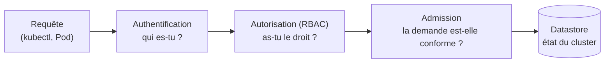
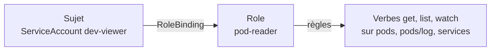
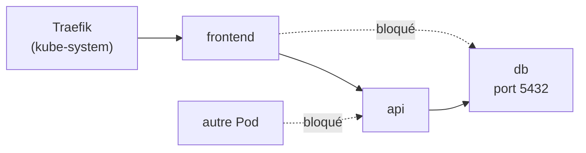

# Chapitre 7 : Sécurité

!!! abstract "Objectifs du chapitre" - Décrire le parcours d'une requête dans l'API : authentification, autorisation, admission - Distinguer les utilisateurs et les ServiceAccounts, et appliquer le moindre privilège avec RBAC - Durcir un Pod avec un SecurityContext - Expliquer les niveaux des Pod Security Standards et les appliquer à un namespace - Contrôler les flux réseau entre Pods avec des NetworkPolicies - Acquis d'apprentissage visé : **AA4**

## 1. Le modèle de sécurité

Par défaut, un cluster est **ouvert** : n'importe quel Pod peut joindre n'importe quel autre, et un conteneur mal configuré dispose de beaucoup de droits. La sécurité se construit en couches, à chacune desquelles on applique le **moindre privilège**.



| Couche            | Question                                   | Outils de ce chapitre                   |
| ----------------- | ------------------------------------------ | --------------------------------------- |
| **Accès à l'API** | Qui peut faire quoi sur le cluster ?       | ServiceAccounts, RBAC                   |
| **Pods**          | Que peut faire un conteneur sur son nœud ? | SecurityContext, Pod Security Standards |
| **Réseau**        | Qui peut parler à qui ?                    | NetworkPolicies                         |

Les secrets (chapitre 4) complètent l'ensemble : leur lecture est elle-même gouvernée par RBAC.

## 2. Identités : utilisateurs et ServiceAccounts

Deux types d'identités appellent l'API :

| Identité           | Représente                                               | Exemple                             |
| ------------------ | -------------------------------------------------------- | ----------------------------------- |
| **Utilisateur**    | Une personne, via un certificat ou un fichier kubeconfig | Vous, avec `kubectl`                |
| **ServiceAccount** | Un programme qui s'exécute dans un Pod                   | Un opérateur, un job de déploiement |

Kubernetes ne gère pas les comptes d'utilisateurs comme des objets. Les **ServiceAccounts**, eux, sont des objets d'un namespace.

- Chaque namespace possède un ServiceAccount `default`, attribué aux Pods qui n'en précisent pas.
- Par défaut, le **jeton** du ServiceAccount est monté dans chaque Pod (dans `/var/run/secrets/kubernetes.io/serviceaccount`), même si l'application n'appelle jamais l'API.
- Un attaquant qui prend la main sur un conteneur peut utiliser ce jeton : on le **désactive** quand il est inutile.

```yaml
apiVersion: v1
kind: ServiceAccount
metadata:
  name: api-sa
automountServiceAccountToken: false # pas de jeton monté dans les Pods qui l'utilisent
---
apiVersion: v1
kind: Pod
metadata:
  name: api
spec:
  serviceAccountName: api-sa
  containers:
    - name: api
      image: monimage:1.0.0
```

!!! note "Votre compte `kubectl`"
Avec k3s, votre fichier kubeconfig donne les droits d'**administrateur du cluster**. Pour tester les droits d'un autre compte, on n'utilise donc pas son identité, mais l'option `--as` de `kubectl` (section 3).

## 3. RBAC : qui a le droit de faire quoi

**RBAC** (Role-Based Access Control) autorise ou non une action selon des règles. Sans règle, l'action est **refusée** : RBAC ne sait qu'ajouter des permissions, jamais en retirer.

| Objet                  | Portée          | Rôle                                                                |
| ---------------------- | --------------- | ------------------------------------------------------------------- |
| **Role**               | Un namespace    | Liste de permissions                                                |
| **ClusterRole**        | Tout le cluster | Liste de permissions (ou règles pour des ressources hors namespace) |
| **RoleBinding**        | Un namespace    | Attribue un Role (ou ClusterRole) à des sujets, dans ce namespace   |
| **ClusterRoleBinding** | Tout le cluster | Attribue un ClusterRole à des sujets, sur tout le cluster           |



Une règle indique des **ressources**, des **verbes** et leur groupe d'API :

```yaml
apiVersion: rbac.authorization.k8s.io/v1
kind: Role
metadata:
  name: pod-reader
rules:
  - apiGroups: [""] # "" = groupe de base (core)
    resources: ["pods", "pods/log", "services"]
    verbs: ["get", "list", "watch"]
---
apiVersion: rbac.authorization.k8s.io/v1
kind: RoleBinding
metadata:
  name: dev-viewer-binding
subjects:
  - kind: ServiceAccount
    name: dev-viewer
    namespace: tp-k8s
roleRef:
  kind: Role
  name: pod-reader
  apiGroup: rbac.authorization.k8s.io
```

| Verbe                                 | Action                                        |
| ------------------------------------- | --------------------------------------------- |
| `get`, `list`, `watch`                | Lire un objet, lister, suivre les changements |
| `create`, `update`, `patch`, `delete` | Créer, modifier, supprimer                    |

!!! warning "Attention aux Secrets"
`get` et `list` sur les **Secrets** donnent accès à leur contenu. Ne les accordez qu'aux comptes qui en ont réellement besoin.

On vérifie les droits avec `kubectl auth can-i`, en se faisant passer pour un autre compte avec `--as` :

```bash
kubectl auth can-i list pods --as=system:serviceaccount:tp-k8s:dev-viewer -n tp-k8s
kubectl auth can-i delete pods --as=system:serviceaccount:tp-k8s:dev-viewer -n tp-k8s
kubectl auth can-i --list --as=system:serviceaccount:tp-k8s:dev-viewer -n tp-k8s
```

## 4. SecurityContext : durcir un conteneur

Par défaut, un conteneur peut s'exécuter en **root** et conserve de nombreux droits. Le **SecurityContext** les restreint, au niveau du Pod ou d'un conteneur.

| Champ                             | Effet                                                                   |
| --------------------------------- | ----------------------------------------------------------------------- |
| `runAsNonRoot: true`              | Refuse de démarrer un conteneur qui s'exécuterait en root               |
| `runAsUser`                       | Impose un identifiant d'utilisateur                                     |
| `allowPrivilegeEscalation: false` | Interdit à un processus d'obtenir plus de droits que son parent         |
| `readOnlyRootFilesystem: true`    | Système de fichiers du conteneur en lecture seule                       |
| `capabilities.drop: ["ALL"]`      | Retire toutes les « capabilities » Linux (fragments des droits de root) |
| `privileged: true`                | Donne presque tous les droits de l'hôte : à **proscrire**               |
| `seccompProfile: RuntimeDefault`  | Filtre les appels système avec le profil par défaut du runtime          |

```yaml
spec:
  securityContext: # niveau Pod
    runAsNonRoot: true
    seccompProfile:
      type: RuntimeDefault
  containers:
    - name: web
      image: nginxinc/nginx-unprivileged:1.27-alpine
      securityContext: # niveau conteneur
        allowPrivilegeEscalation: false
        readOnlyRootFilesystem: true
        capabilities:
          drop: ["ALL"]
      volumeMounts:
        - name: tmp
          mountPath: /tmp
  volumes:
    - name: tmp
      emptyDir: {} # dossier inscriptible malgré le système en lecture seule
```

Points à connaître :

- l'image doit être **compatible** : une image qui exige root ne démarre pas avec `runAsNonRoot` ; `nginx-unprivileged` écoute sur le port **8080** (un port inférieur à 1024 demanderait un droit supplémentaire) ;
- avec `readOnlyRootFilesystem`, les dossiers où l'application écrit (`/tmp`, caches) doivent être des `emptyDir` ;
- certaines applications, comme les bases de données, imposent des exceptions : on les **documente**.

## 5. Pod Security Standards

Plutôt que de vérifier chaque Pod à la main, on applique une politique à un **namespace**, avec des labels. C'est l'admission de sécurité des Pods (_Pod Security Admission_), intégrée à Kubernetes. Trois niveaux, du plus permissif au plus strict :

| Niveau         | Principe                                                                                                                                                              |
| -------------- | --------------------------------------------------------------------------------------------------------------------------------------------------------------------- |
| **privileged** | Aucune restriction                                                                                                                                                    |
| **baseline**   | Interdit les configurations dangereuses connues (Pod privilégié, accès au réseau ou aux processus de l'hôte, `hostPath`...) ; peu de contraintes sur les applications |
| **restricted** | Applique les bonnes pratiques de durcissement : utilisateur non-root, pas d'élévation de privilèges, capabilities supprimées, profil seccomp défini                   |

Trois modes d'application, choisis par label :

| Label                                | Effet                                                |
| ------------------------------------ | ---------------------------------------------------- |
| `pod-security.kubernetes.io/enforce` | Le Pod non conforme est **refusé**                   |
| `pod-security.kubernetes.io/warn`    | Un **avertissement** est affiché, le Pod est accepté |
| `pod-security.kubernetes.io/audit`   | Une trace est écrite dans le journal d'audit         |

```bash
kubectl label namespace tp-k8s pod-security.kubernetes.io/enforce=baseline
kubectl label namespace tp-k8s pod-security.kubernetes.io/warn=restricted --overwrite
```

Le contrôle s'applique à la **création** des Pods : ceux qui existent déjà ne sont pas arrêtés. Une bonne démarche consiste à activer `warn` au niveau visé pour mesurer l'écart, puis `enforce` une fois les manifestes corrigés.

## 6. NetworkPolicies

Par défaut, tous les Pods d'un cluster peuvent communiquer entre eux. Une **NetworkPolicy** est un pare-feu au niveau des Pods : elle décrit les flux **autorisés**.

Principes :

- une politique **sélectionne** des Pods (`podSelector`) et s'applique au trafic entrant (`Ingress`), sortant (`Egress`) ou aux deux ;
- dès qu'un Pod est sélectionné par une politique pour un sens, **tout ce qui n'est pas explicitement autorisé est refusé** dans ce sens ;
- les politiques s'**additionnent** : le trafic est autorisé si au moins une politique l'autorise ;
- elles ne filtrent que les couches 3 et 4 (adresses, ports), pas le contenu HTTP.

Pour qu'elles soient appliquées, le réseau du cluster doit les supporter : k3s embarque un contrôleur de NetworkPolicies, actif par défaut.



On commence par **tout interdire en entrée**, puis on autorise chaque flux nécessaire :

```yaml
apiVersion: networking.k8s.io/v1
kind: NetworkPolicy
metadata:
  name: default-deny-ingress
spec:
  podSelector: {} # tous les Pods du namespace
  policyTypes: ["Ingress"]
---
apiVersion: networking.k8s.io/v1
kind: NetworkPolicy
metadata:
  name: allow-api-to-db
spec:
  podSelector:
    matchLabels:
      tier: db # Pods protégés
  policyTypes: ["Ingress"]
  ingress:
    - from:
        - podSelector:
            matchLabels:
              tier: api # source autorisée
      ports:
        - protocol: TCP
          port: 5432
```

Les sources autorisées se désignent de trois façons :

| Sélecteur           | Désigne                                                                                               |
| ------------------- | ----------------------------------------------------------------------------------------------------- |
| `podSelector`       | Des Pods du **même namespace**, par leurs labels                                                      |
| `namespaceSelector` | Tous les Pods d'un namespace, par ses labels (par exemple `kubernetes.io/metadata.name: kube-system`) |
| `ipBlock`           | Une plage d'adresses IP                                                                               |

!!! warning "ET ou OU : une erreur fréquente"
Dans une liste `from`, **chaque tiret** est une source distincte (**OU**). Un `namespaceSelector` et un `podSelector` écrits dans le **même** élément (sans nouveau tiret) se combinent en **ET** : le Pod doit satisfaire les deux.

Un filtrage du trafic **sortant** (`Egress`) est aussi possible. Il faut alors autoriser explicitement le **DNS**, faute de quoi les noms de Services ne sont plus résolus.

!!! tip "À retenir" - Un cluster est ouvert par défaut : on applique le **moindre privilège** à chaque couche. - Les Pods utilisent des **ServiceAccounts** ; on désactive le montage du jeton quand il est inutile. - **RBAC** : Role + RoleBinding (namespace), ClusterRole + ClusterRoleBinding (cluster). Pas de règle = refus. Test : `kubectl auth can-i ... --as=...`. - **SecurityContext** : non-root, `allowPrivilegeEscalation: false`, capabilities supprimées, système de fichiers en lecture seule si possible. - **Pod Security Standards** : `privileged`, `baseline`, `restricted`, appliqués par labels de namespace (`enforce`, `warn`, `audit`). - **NetworkPolicy** : on interdit tout, puis on autorise les flux nécessaires ; chaque tiret de `from` est un OU.

## Pour vérifier votre compréhension

??? question "Pourquoi désactiver le montage automatique du jeton de ServiceAccount dans un Pod qui n'appelle pas l'API Kubernetes ?"
Le jeton donne accès à l'API avec les droits du ServiceAccount. Si un attaquant prend le contrôle du conteneur, il pourrait l'utiliser. Sans besoin, mieux vaut ne pas le monter.

??? question "Un ServiceAccount n'a aucun RoleBinding. Peut-il lister les Pods ?"
Non. RBAC refuse par défaut : sans règle explicite qui l'autorise, l'action est refusée.

??? question "Quelle différence entre un Role et un ClusterRole, et entre un RoleBinding et un ClusterRoleBinding ?"
Un Role vit dans un namespace et ne donne des droits que dans celui-ci ; un ClusterRole vaut pour tout le cluster. Un RoleBinding attribue des droits dans un namespace, un ClusterRoleBinding sur tout le cluster.

??? question "Un Pod ne démarre pas, avec une image qui s'exécute en root et `runAsNonRoot: true`. Que faire ?"
Utiliser une image conçue pour tourner sans root (par exemple `nginx-unprivileged`), ou définir un utilisateur non-root dans l'image. Désactiver `runAsNonRoot` affaiblirait la sécurité.

??? question "Quelle différence entre les modes `enforce` et `warn` d'un niveau Pod Security ?"
`enforce` refuse les Pods non conformes ; `warn` les accepte mais affiche un avertissement. `warn` sert à mesurer l'écart avant d'imposer le niveau.

??? question "Pourquoi poser d'abord une politique « deny all » avant les autorisations ?"
Dès qu'un Pod est sélectionné par une politique, ce qui n'est pas autorisé est refusé. En partant de « tout interdit », on obtient une liste de flux autorisés explicite : toute autre communication est bloquée.

??? question "Quelle est la limite d'une politique qui ne filtre que le trafic entrant ?"
Elle ne contrôle pas ce que les Pods protégés peuvent envoyer : un Pod compromis peut encore contacter d'autres Pods ou l'extérieur. Il faut aussi filtrer le trafic sortant.

## Labs du chapitre

- [Lab 7.1 : RBAC](lab-7-1-rbac.md)
- [Lab 7.2 : Durcir un Pod](lab-7-2-durcir-un-pod.md)
- [Lab 7.3 : NetworkPolicies](lab-7-3-networkpolicies.md)
