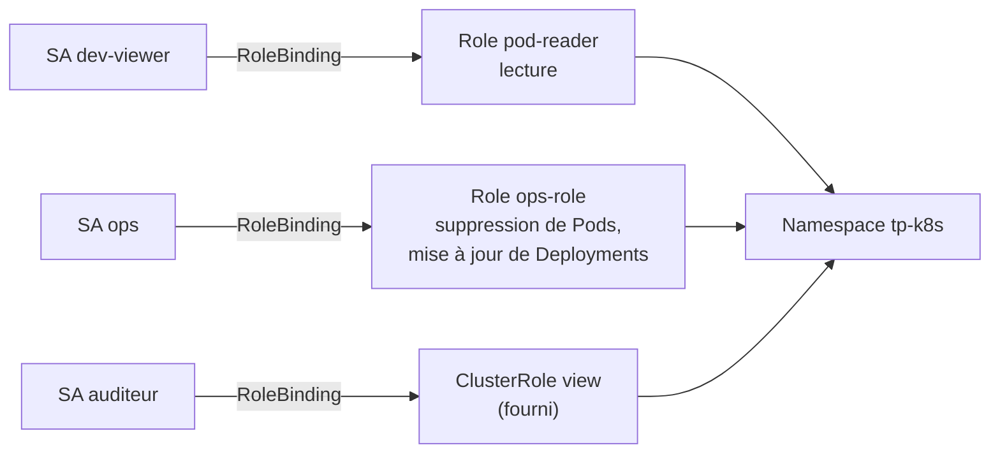

# Lab 7.1 : RBAC

|                  |                                                                                            |
| ---------------- | ------------------------------------------------------------------------------------------ |
| **Durée**        | 60 à 75 min                                                                                |
| **Niveau**       | Guidé                                                                                      |
| **Prérequis**    | Labs du chapitre 6 réalisés, [cours du chapitre 7](cours.md) lu, cluster à 3 nœuds `Ready` |
| **Acquis visés** | AA4                                                                                        |

!!! abstract "Objectifs" - Constater les droits d'un ServiceAccount sans règle RBAC - Créer un Role et un RoleBinding, en YAML puis en ligne de commande - Vérifier des droits avec `kubectl auth can-i --as` - Utiliser les droits d'un ServiceAccount depuis un Pod, en appelant l'API - Réutiliser un ClusterRole fourni (`view`) dans un seul namespace - Désactiver le montage du jeton de ServiceAccount

## Contexte et schéma

Vous allez créer plusieurs identités (des ServiceAccounts) et leur attribuer exactement les droits dont elles ont besoin, dans le namespace `tp-k8s`.



!!! note "Pourquoi `--as` ?"
Votre fichier kubeconfig vous donne les droits d'administrateur du cluster. Pour vérifier ce qu'un autre compte pourrait faire, `kubectl auth can-i` utilise l'option `--as=system:serviceaccount:<namespace>:<nom>`.

## Étapes

### Étape 1 : Préparer l'environnement

```bash
k create namespace tp-k8s
k config set-context --current --namespace=tp-k8s

k create deployment web --image=nginx:1.26-alpine
k create secret generic db-credentials --from-literal=DB_PASSWORD='ChangeMe-123'
k create serviceaccount dev-viewer
k get serviceaccounts
k get pods
```

Notez que le namespace contient déjà un ServiceAccount `default`, créé automatiquement.

!!! success "Point de contrôle" - [ ] Le Pod `web` est `Running` - [ ] Les ServiceAccounts `default` et `dev-viewer` existent

### Étape 2 : Sans règle, pas de droit

Interrogez les droits de `dev-viewer`, qui n'a aucun RoleBinding :

```bash
SA=system:serviceaccount:tp-k8s:dev-viewer
k auth can-i list pods --as=$SA -n tp-k8s
k auth can-i get secrets --as=$SA -n tp-k8s
```

Les réponses sont `no` : RBAC refuse tout ce qui n'est pas autorisé explicitement.

Observez ensuite le Pod `web`, qui utilise le ServiceAccount `default`. Son jeton est monté par défaut :

```bash
k exec deploy/web -- ls /var/run/secrets/kubernetes.io/serviceaccount
k exec deploy/web -- sh -c 'wget -q -O- --no-check-certificate --header "Authorization: Bearer $(cat /var/run/secrets/kubernetes.io/serviceaccount/token)" https://kubernetes.default.svc/api/v1/namespaces/tp-k8s/pods 2>&1 | head -c 300'
```

Le conteneur dispose d'un jeton, mais l'appel à l'API est refusé (`403 Forbidden`) : le ServiceAccount `default` n'a aucun droit.

!!! success "Point de contrôle" - [ ] `can-i` renvoie `no` pour `dev-viewer` - [ ] Les fichiers `ca.crt`, `namespace` et `token` sont visibles dans le Pod - [ ] L'appel à l'API depuis le Pod est refusé avec une erreur 403

### Étape 3 : Créer un Role et un RoleBinding

`dev-viewer` doit pouvoir **consulter** les Pods, leurs logs et les Services, sans rien modifier.

```bash
cat <<'EOF' > pod-reader.yaml
apiVersion: rbac.authorization.k8s.io/v1
kind: Role
metadata:
  name: pod-reader
rules:
  - apiGroups: [""]
    resources: ["pods", "pods/log", "services"]
    verbs: ["get", "list", "watch"]
---
apiVersion: rbac.authorization.k8s.io/v1
kind: RoleBinding
metadata:
  name: dev-viewer-binding
subjects:
  - kind: ServiceAccount
    name: dev-viewer
    namespace: tp-k8s
roleRef:
  kind: Role
  name: pod-reader
  apiGroup: rbac.authorization.k8s.io
EOF
k apply -f pod-reader.yaml
k describe role pod-reader
k describe rolebinding dev-viewer-binding
```

Vérifiez maintenant les droits :

```bash
k auth can-i list pods --as=$SA -n tp-k8s
k auth can-i get pods/log --as=$SA -n tp-k8s
k auth can-i list services --as=$SA -n tp-k8s
k auth can-i delete pods --as=$SA -n tp-k8s
k auth can-i get secrets --as=$SA -n tp-k8s
k auth can-i list pods --as=$SA -n kube-system
k auth can-i --list --as=$SA -n tp-k8s
```

!!! success "Point de contrôle" - [ ] `yes` pour lister les Pods, lire leurs logs et lister les Services - [ ] `no` pour supprimer un Pod et pour lire un Secret - [ ] `no` pour lister les Pods dans `kube-system` : un Role ne vaut que dans son namespace

### Étape 4 : Utiliser ces droits depuis un Pod

Lancez un Pod qui s'exécute avec l'identité `dev-viewer` et appelez l'API avec son jeton :

```bash
cat <<'EOF' > viewer.yaml
apiVersion: v1
kind: Pod
metadata:
  name: viewer
spec:
  serviceAccountName: dev-viewer
  containers:
    - name: viewer
      image: nginx:1.26-alpine
EOF
k apply -f viewer.yaml
k wait --for=condition=Ready pod/viewer --timeout=60s

API=https://kubernetes.default.svc/api/v1/namespaces
AUTH='Authorization: Bearer $(cat /var/run/secrets/kubernetes.io/serviceaccount/token)'
k exec viewer -- sh -c "wget -q -O- --no-check-certificate --header \"$AUTH\" $API/tp-k8s/pods 2>&1 | head -c 200"; echo
k exec viewer -- sh -c "wget -q -O- --no-check-certificate --header \"$AUTH\" $API/tp-k8s/secrets 2>&1 | head -c 200"; echo
k exec viewer -- sh -c "wget -q -O- --no-check-certificate --header \"$AUTH\" $API/kube-system/pods 2>&1 | head -c 200"; echo
```

La première requête renvoie le début d'une liste de Pods au format JSON ; les deux suivantes sont refusées (`403`). Pour lire le message d'erreur complet de l'API, essayez avec `k`, en vous faisant passer pour le compte :

```bash
k get secrets --as=$SA
```

!!! success "Point de contrôle" - [ ] La liste des Pods est renvoyée au Pod `viewer` - [ ] L'accès aux Secrets et aux Pods de `kube-system` est refusé - [ ] Vous avez lu dans l'erreur : l'utilisateur, l'action (`list`), la ressource et le namespace

### Étape 5 : Un second rôle, en ligne de commande

Le compte `ops` doit pouvoir **supprimer des Pods** et **mettre à jour des Deployments** (groupe d'API `apps`) :

```bash
k create serviceaccount ops

cat <<'EOF' > ops-role.yaml
apiVersion: rbac.authorization.k8s.io/v1
kind: Role
metadata:
  name: ops-role
rules:
  - apiGroups: [""]
    resources: ["pods"]
    verbs: ["get", "list", "watch", "delete"]
  - apiGroups: ["apps"]
    resources: ["deployments"]
    verbs: ["get", "list", "watch", "update", "patch"]
EOF
k apply -f ops-role.yaml
k create rolebinding ops-binding --role=ops-role --serviceaccount=tp-k8s:ops
k get roles,rolebindings
```

Pour trouver le groupe d'API d'une ressource : `k api-resources | grep -E "^(pods|deployments) "`. Vérifiez :

```bash
OPS=system:serviceaccount:tp-k8s:ops
k auth can-i delete pods --as=$OPS -n tp-k8s
k auth can-i patch deployments --as=$OPS -n tp-k8s
k auth can-i create deployments --as=$OPS -n tp-k8s
k auth can-i delete deployments --as=$OPS -n tp-k8s
k auth can-i get secrets --as=$OPS -n tp-k8s
```

!!! success "Point de contrôle" - [ ] `ops` peut supprimer des Pods et modifier des Deployments - [ ] `ops` ne peut ni créer ni supprimer de Deployments, ni lire des Secrets

### Étape 6 : Réutiliser un ClusterRole dans un namespace

Kubernetes fournit des ClusterRoles prédéfinis. Observez-les, puis liez `view` à un nouveau compte, **dans ce namespace seulement** :

```bash
k get clusterrole | grep -E "^(view|edit|admin|cluster-admin) "
k create serviceaccount auditeur
k create rolebinding auditeur-view --clusterrole=view --serviceaccount=tp-k8s:auditeur

AUD=system:serviceaccount:tp-k8s:auditeur
k auth can-i list pods --as=$AUD -n tp-k8s
k auth can-i list deployments --as=$AUD -n tp-k8s
k auth can-i delete pods --as=$AUD -n tp-k8s
k auth can-i get secrets --as=$AUD -n tp-k8s
k auth can-i list pods --as=$AUD -n kube-system
```

Comparez avec le rôle `edit`, qui permet de modifier les ressources :

```bash
k create rolebinding auditeur-edit --clusterrole=edit --serviceaccount=tp-k8s:auditeur
k auth can-i delete pods --as=$AUD -n tp-k8s
k auth can-i get secrets --as=$AUD -n tp-k8s
k delete rolebinding auditeur-edit
k auth can-i get secrets --as=$AUD -n tp-k8s
```

!!! success "Point de contrôle" - [ ] Avec `view`, l'auditeur lit les Pods et les Deployments mais ne lit pas les Secrets - [ ] Un RoleBinding vers un ClusterRole limite les droits au namespace (`no` dans `kube-system`) - [ ] Avec `edit`, la lecture des Secrets est permise : cette permission disparaît avec le RoleBinding

### Étape 7 : Désactiver le jeton inutile

Un Pod qui n'appelle jamais l'API n'a pas besoin de jeton. Créez un ServiceAccount qui n'en monte pas et comparez avec le Pod `web` :

```bash
cat <<'EOF' > api-sa.yaml
apiVersion: v1
kind: ServiceAccount
metadata:
  name: api-sa
automountServiceAccountToken: false
---
apiVersion: v1
kind: Pod
metadata:
  name: sans-jeton
spec:
  serviceAccountName: api-sa
  containers:
    - name: app
      image: nginx:1.26-alpine
EOF
k apply -f api-sa.yaml
k wait --for=condition=Ready pod/sans-jeton --timeout=60s
k exec sans-jeton -- ls /var/run/secrets/kubernetes.io/serviceaccount
k exec deploy/web -- ls /var/run/secrets/kubernetes.io/serviceaccount
```

La première commande échoue (le dossier n'existe pas), la seconde liste les trois fichiers du jeton.

!!! success "Point de contrôle" - [ ] Le dossier du jeton n'existe pas dans le Pod `sans-jeton` - [ ] Il existe toujours dans le Pod `web`, qui utilise le ServiceAccount `default`

## Questions de réflexion

??? question "Pourquoi `dev-viewer` ne pouvait-il rien faire avant le RoleBinding ?"
RBAC refuse par défaut. Les permissions ne s'obtiennent que par un Role (ou ClusterRole) lié au compte par un binding.

??? question "Pourquoi le droit de lister les Pods dans `tp-k8s` ne donne-t-il rien dans `kube-system` ?"
Un Role et son RoleBinding ne valent que dans leur namespace. Il faudrait un autre binding dans `kube-system` ou un ClusterRoleBinding.

??? question "Quelle différence entre lier `view` avec un RoleBinding et avec un ClusterRoleBinding ?"
Avec un RoleBinding, les droits du ClusterRole ne valent que dans le namespace du binding. Avec un ClusterRoleBinding, ils valent dans tous les namespaces.

??? question "Pourquoi faut-il être prudent avec les rôles qui permettent de lire les Secrets ?"
`get` et `list` sur les Secrets donnent accès à leur contenu (mots de passe, jetons). Le rôle `view` les exclut volontairement ; `edit` et `admin` les incluent.

??? question "Un attaquant prend le contrôle d'un conteneur du Pod `web`. Que gagne-t-il avec le jeton monté, et comment limiter le risque ?"
Il peut appeler l'API avec les droits du ServiceAccount utilisé. Pour limiter le risque : n'accorder aucun droit au ServiceAccount de l'application et désactiver le montage du jeton quand il est inutile.

## Dépannage

| Symptôme                                                | Pistes                                                                                                                      |
| ------------------------------------------------------- | --------------------------------------------------------------------------------------------------------------------------- |
| `can-i` renvoie `no` alors que le Role existe           | Vérifier le RoleBinding (`k describe rolebinding`) : nom et namespace du sujet, nom du Role                                 |
| `Error from server (Forbidden)`                         | Lire le message : utilisateur, verbe, ressource, namespace ; compléter les règles du Role                                   |
| `can-i` renvoie `no` sur une ressource de groupe `apps` | `apiGroups` incorrect (`[""]` au lieu de `["apps"]`) : `k api-resources`                                                    |
| `can-i get pods/log` renvoie `no`                       | La sous-ressource `pods/log` doit figurer dans `resources`                                                                  |
| `roleRef` ne peut pas être modifié                      | Supprimer le RoleBinding puis le recréer                                                                                    |
| `wget` : erreur de certificat ou option inconnue        | Image sans ces options : utiliser `nginx:1.26-alpine` comme dans le lab ; le message `403` s'affiche sur la sortie d'erreur |
| `k exec ... ls` échoue dans `sans-jeton`                | Comportement attendu : le jeton n'est pas monté                                                                             |
| `k wait` expire                                         | Image en cours de téléchargement : `k describe pod`, accès Internet des VMs                                                 |

## Nettoyage

```bash
k delete namespace tp-k8s
k config set-context --current --namespace=default
```

La suppression du namespace supprime aussi ses ServiceAccounts, Roles et RoleBindings.
