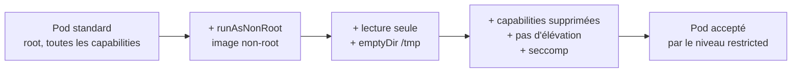

# Lab 7.2 : Durcir un Pod

|                  |                                                                                                           |
| ---------------- | --------------------------------------------------------------------------------------------------------- |
| **Durée**        | 60 à 75 min                                                                                               |
| **Niveau**       | Guidé                                                                                                     |
| **Prérequis**    | [Lab 7.1](lab-7-1-rbac.md) réalisé, [cours du chapitre 7](cours.md) lu, notions d'`emptyDir` (chapitre 5) |
| **Acquis visés** | AA4                                                                                                       |

!!! abstract "Objectifs" - Mesurer les droits d'un conteneur non durci (utilisateur, capabilities, privilèges) - Appliquer un SecurityContext étape par étape et diagnostiquer chaque blocage - Utiliser un `emptyDir` pour les dossiers d'écriture d'un conteneur en lecture seule - Appliquer les niveaux `baseline` et `restricted` des Pod Security Standards à un namespace - Justifier une exception de durcissement (cas d'une base de données)

## Contexte et schéma

Vous partez d'un Pod nginx ordinaire, qui s'exécute avec beaucoup de droits, et vous le durcissez progressivement. Vous demandez ensuite au cluster de refuser les Pods qui ne respectent pas ces règles.



## Étapes

### Étape 1 : Mesurer un Pod non durci

```bash
k create namespace tp-k8s
k config set-context --current --namespace=tp-k8s

k run web-root --image=nginx:1.26-alpine
k wait --for=condition=Ready pod/web-root --timeout=60s
k exec web-root -- id
k exec web-root -- grep -E "CapEff|NoNewPrivs|Seccomp:" /proc/1/status
k exec web-root -- touch /fichier-test
k exec web-root -- ls -l /fichier-test
```

Relevez : l'utilisateur (`uid=0`, donc root), la valeur de `CapEff` (capabilities effectives, non nulle), `NoNewPrivs: 0` et `Seccomp: 0` (aucun filtrage), et le fait que le conteneur peut écrire à la racine de son système de fichiers.

!!! success "Point de contrôle" - [ ] Le processus principal s'exécute en root (`uid=0`) - [ ] `CapEff` est différent de `0000000000000000` - [ ] `touch /fichier-test` réussit

### Étape 2 : Exiger un utilisateur non-root

Ajoutez `runAsNonRoot: true` à l'image nginx standard :

```bash
cat <<'EOF' > web-v1.yaml
apiVersion: v1
kind: Pod
metadata:
  name: web-v1
spec:
  securityContext:
    runAsNonRoot: true
  containers:
    - name: web
      image: nginx:1.26-alpine
EOF
k apply -f web-v1.yaml
sleep 10
k get pod web-v1
k describe pod web-v1 | tail -n 6
```

Le Pod reste en `CreateContainerConfigError` : Kubernetes refuse de démarrer un conteneur dont l'image s'exécuterait en root. Corrigez avec une image conçue pour fonctionner sans root :

```bash
k delete pod web-v1
cat <<'EOF' > web-v2.yaml
apiVersion: v1
kind: Pod
metadata:
  name: web-v2
spec:
  securityContext:
    runAsNonRoot: true
  containers:
    - name: web
      image: nginxinc/nginx-unprivileged:1.27-alpine
      ports:
        - containerPort: 8080
      securityContext:
        readOnlyRootFilesystem: true
EOF
k apply -f web-v2.yaml
sleep 15
k get pod web-v2
k logs web-v2 | tail -n 5
```

Le Pod démarre mais tombe en `CrashLoopBackOff` : avec un système de fichiers en lecture seule, nginx ne peut pas écrire son fichier de PID dans `/tmp`. Les logs indiquent l'erreur.

!!! success "Point de contrôle" - [ ] Vous avez lu dans les événements que l'image s'exécuterait en root - [ ] Vous avez lu dans les logs de `web-v2` une erreur d'écriture sur un système de fichiers en lecture seule

### Étape 3 : Compléter le durcissement

Fournissez un dossier inscriptible avec un `emptyDir`, et ajoutez les restrictions restantes :

```bash
k delete pod web-v2
cat <<'EOF' > web-durci.yaml
apiVersion: v1
kind: Pod
metadata:
  name: web-durci
spec:
  securityContext:
    runAsNonRoot: true
    seccompProfile:
      type: RuntimeDefault
  containers:
    - name: web
      image: nginxinc/nginx-unprivileged:1.27-alpine
      ports:
        - containerPort: 8080
      securityContext:
        allowPrivilegeEscalation: false
        readOnlyRootFilesystem: true
        capabilities:
          drop: ["ALL"]
      volumeMounts:
        - name: tmp
          mountPath: /tmp
  volumes:
    - name: tmp
      emptyDir: {}
EOF
k apply -f web-durci.yaml
k wait --for=condition=Ready pod/web-durci --timeout=60s
```

Comparez avec le Pod de l'étape 1 :

```bash
k exec web-durci -- id
k exec web-durci -- grep -E "CapEff|NoNewPrivs|Seccomp:" /proc/1/status
k exec web-durci -- touch /fichier-test
k exec web-durci -- touch /tmp/fichier-test
k exec web-durci -- wget -qO- http://localhost:8080 | grep -o "<title>.*</title>"
```

!!! success "Point de contrôle" - [ ] L'utilisateur n'est plus root - [ ] `CapEff` vaut `0000000000000000`, `NoNewPrivs` vaut 1 et `Seccomp` vaut 2 - [ ] L'écriture à la racine est refusée, celle dans `/tmp` réussit - [ ] L'application répond sur le port 8080

### Étape 4 : Imposer des règles au namespace

Appliquez d'abord le niveau `baseline` en mode `enforce`, puis tentez de créer un Pod privilégié :

```bash
k label namespace tp-k8s pod-security.kubernetes.io/enforce=baseline

cat <<'EOF' > privilegie.yaml
apiVersion: v1
kind: Pod
metadata:
  name: privilegie
spec:
  containers:
    - name: app
      image: nginx:1.26-alpine
      securityContext:
        privileged: true
EOF
k apply -f privilegie.yaml
k run test-baseline --image=nginx:1.26-alpine
```

Le Pod privilégié est refusé, alors qu'un Pod nginx ordinaire (en root) est accepté : `baseline` n'interdit que les configurations dangereuses. Mesurez l'écart avec `restricted` en ajoutant le mode `warn` :

```bash
k label namespace tp-k8s pod-security.kubernetes.io/warn=restricted
k run test-warn --image=nginx:1.26-alpine
```

Le Pod est créé, mais `kubectl` affiche un avertissement qui énumère les écarts. Imposez enfin le niveau `restricted` :

```bash
k label namespace tp-k8s pod-security.kubernetes.io/enforce=restricted --overwrite
k run test-refuse --image=nginx:1.26-alpine
k delete pod web-durci
k apply -f web-durci.yaml
k get pod web-durci
```

Votre Pod durci est accepté, pas le Pod standard. Observez enfin ce qui se passe avec un Deployment :

```bash
k create deployment root-app --image=nginx:1.26-alpine
sleep 10
k get deployment root-app
k describe replicaset -l app=root-app | tail -n 8
```

!!! success "Point de contrôle" - [ ] `privilegie` refusé sous `baseline`, `test-baseline` accepté - [ ] L'avertissement `restricted` énumère plusieurs écarts : pas d'élévation de privilèges interdite, capabilities, non-root, profil seccomp - [ ] Sous `restricted` en `enforce`, `test-refuse` est refusé et `web-durci` est accepté - [ ] Le Deployment `root-app` existe mais n'obtient aucun Pod ; la cause est dans les événements du ReplicaSet

### Étape 5 : Justifier une exception

Les bases de données sont souvent difficiles à durcir complètement. Essayez PostgreSQL dans le namespace `restricted`, puis dans un namespace `baseline` :

```bash
k run pg --image=postgres:16-alpine --env=POSTGRES_PASSWORD=test

k create namespace tp-db
k label namespace tp-db pod-security.kubernetes.io/enforce=baseline
k run pg --image=postgres:16-alpine --env=POSTGRES_PASSWORD=test -n tp-db
k wait --for=condition=Ready pod/pg -n tp-db --timeout=90s
k get pod pg -n tp-db
```

Dans `tp-k8s`, le Pod est refusé ; dans `tp-db`, il démarre. Rédigez dans votre cahier une justification en deux ou trois lignes : quel écart concerne PostgreSQL, quelle protection reste appliquée (par exemple le niveau `baseline`, aucune capability supplémentaire, aucun accès à l'hôte), et ce que vous pourriez essayer pour aller plus loin.

!!! success "Point de contrôle" - [ ] PostgreSQL est refusé sous `restricted` et accepté sous `baseline` - [ ] Vous avez rédigé une justification d'exception

## Questions de réflexion

??? question "Pourquoi `runAsNonRoot` seul ne suffit-il pas pour faire démarrer nginx ?"
`runAsNonRoot` impose la vérification, mais ne change pas l'utilisateur de l'image. L'image nginx standard s'exécute en root et est donc refusée ; il faut une image prévue pour un utilisateur non-root.

??? question "Pourquoi ajouter un `emptyDir` sur `/tmp` quand on active `readOnlyRootFilesystem` ?"
Les applications ont souvent besoin d'écrire des fichiers temporaires ou des PID. Un `emptyDir` fournit un emplacement inscriptible limité à ce besoin, tout en gardant le reste du système en lecture seule.

??? question "Que gagne-t-on à supprimer toutes les capabilities ?"
Un processus compromis perd les privilèges fragmentés de root (modifier le réseau, changer des propriétaires de fichiers, charger certains modules...). Sa capacité de nuisance, y compris vers l'hôte, est réduite.

??? question "Pourquoi le Deployment `root-app` a-t-il été accepté alors que ses Pods sont refusés ?"
Le Deployment ne crée pas les Pods lui-même : son ReplicaSet le fait. La vérification de Pod Security s'applique à la création du Pod, d'où l'erreur dans les événements du ReplicaSet.

??? question "Pourquoi activer `warn` avant `enforce` quand on introduit `restricted` dans un cluster existant ?"
`warn` fait apparaître tous les écarts sans rien bloquer. On corrige les manifestes, puis on active `enforce` sans interrompre les applications.

## Dépannage

| Symptôme                                                      | Pistes                                                                                     |
| ------------------------------------------------------------- | ------------------------------------------------------------------------------------------ |
| `CreateContainerConfigError` avec `runAsNonRoot`              | L'image s'exécute en root : changer d'image ou imposer `runAsUser`                         |
| `CrashLoopBackOff` avec `readOnlyRootFilesystem`              | `k logs` : dossier d'écriture manquant ; ajouter un `emptyDir` sur ce chemin               |
| `forbidden: violates PodSecurity`                             | Lire le message : il liste chaque champ à corriger                                         |
| Pod non conforme créé malgré le label                         | Le label vise le mode `warn` ou `audit` ; `enforce` s'applique seulement aux nouveaux Pods |
| `wget` échoue dans `web-durci`                                | Mauvais port (8080, pas 80) ou Pod pas encore prêt                                         |
| Le Pod `pg` reste en `Pending` ou ne démarre pas              | `k describe pod pg -n tp-db` : téléchargement de l'image, ressources du nœud               |
| Un ancien Pod continue à tourner après un changement de label | Les Pods existants ne sont pas supprimés : les recréer pour appliquer la politique         |

## Nettoyage

```bash
k delete namespace tp-db
k delete namespace tp-k8s
k config set-context --current --namespace=default
```
