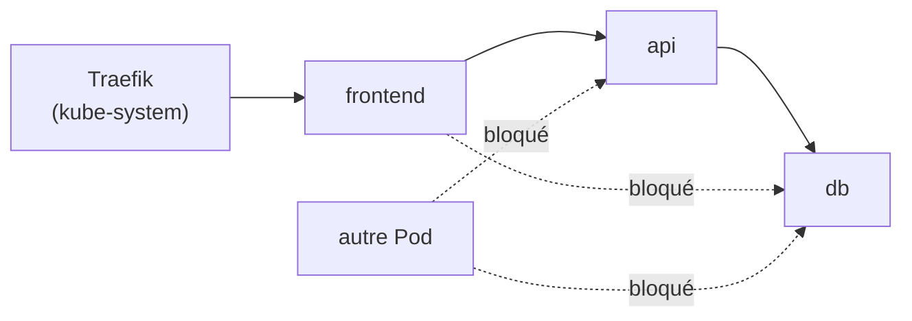

# Lab 7.3 : NetworkPolicies

|                  |                                                                                                                                                                         |
| ---------------- | ----------------------------------------------------------------------------------------------------------------------------------------------------------------------- |
| **Durée**        | 60 à 75 min                                                                                                                                                             |
| **Niveau**       | Guidé                                                                                                                                                                   |
| **Prérequis**    | [Lab 3.2](../../partie-1-fondations/ch03-services-reseau/lab-3-2-ingress-traefik.md) réalisé (Ingress, `curl.exe`, fichier `hosts`), [cours du chapitre 7](cours.md) lu |
| **Acquis visés** | AA4                                                                                                                                                                     |

!!! abstract "Objectifs" - Constater que tous les Pods communiquent par défaut - Appliquer un « deny all » puis autoriser uniquement les flux nécessaires - Autoriser le trafic de l'Ingress controller (Traefik) vers le frontend - Distinguer un `namespaceSelector` seul d'un `namespaceSelector` combiné à un `podSelector` - Filtrer le trafic sortant et autoriser le DNS

## Contexte et schéma

Vous protégez une application à trois niveaux, simulée par trois Pods nginx étiquetés `tier: frontend`, `tier: api` et `tier: db`. Seuls les flux du schéma doivent être autorisés.



À chaque étape, vous mesurez les flux avec un petit script : un flux réussi affiche `OK`, un flux bloqué affiche `BLOQUE` (après 3 secondes de délai).

## Étapes

### Étape 1 : Déployer l'application et mesurer l'état initial

```bash
k create namespace tp-k8s
k config set-context --current --namespace=tp-k8s

cat <<'EOF' > app.yaml
apiVersion: apps/v1
kind: Deployment
metadata:
  name: frontend
spec:
  replicas: 1
  selector:
    matchLabels: { app: appdemo, tier: frontend }
  template:
    metadata:
      labels: { app: appdemo, tier: frontend }
    spec:
      containers:
        - name: web
          image: nginx:1.26-alpine
---
apiVersion: v1
kind: Service
metadata:
  name: frontend
spec:
  selector: { app: appdemo, tier: frontend }
  ports:
    - port: 80
---
apiVersion: apps/v1
kind: Deployment
metadata:
  name: api
spec:
  replicas: 1
  selector:
    matchLabels: { app: appdemo, tier: api }
  template:
    metadata:
      labels: { app: appdemo, tier: api }
    spec:
      containers:
        - name: web
          image: nginx:1.26-alpine
---
apiVersion: v1
kind: Service
metadata:
  name: api
spec:
  selector: { app: appdemo, tier: api }
  ports:
    - port: 80
---
apiVersion: apps/v1
kind: Deployment
metadata:
  name: db
spec:
  replicas: 1
  selector:
    matchLabels: { app: appdemo, tier: db }
  template:
    metadata:
      labels: { app: appdemo, tier: db }
    spec:
      containers:
        - name: web
          image: nginx:1.26-alpine
---
apiVersion: v1
kind: Service
metadata:
  name: db
spec:
  selector: { app: appdemo, tier: db }
  ports:
    - port: 80
---
apiVersion: networking.k8s.io/v1
kind: Ingress
metadata:
  name: app-ingress
spec:
  ingressClassName: traefik
  rules:
    - host: app.k3s.local
      http:
        paths:
          - path: /
            pathType: Prefix
            backend:
              service:
                name: frontend
                port:
                  number: 80
EOF
k apply -f app.yaml
k rollout status deployment/frontend
k rollout status deployment/api
k rollout status deployment/db
```

Créez le script de mesure :

```bash
cat <<'EOF' > matrice.sh
#!/bin/bash
t() {
  printf '%-32s' "$1"
  if eval "$2" >/dev/null 2>&1; then echo "OK"; else echo "BLOQUE"; fi
}
t "frontend -> api"            "kubectl exec deploy/frontend -- wget -T 3 -qO- http://api"
t "frontend -> db"             "kubectl exec deploy/frontend -- wget -T 3 -qO- http://db"
t "api -> db"                  "kubectl exec deploy/api -- wget -T 3 -qO- http://db"
t "autre Pod -> api"           "kubectl run autre --rm -i --image=busybox:1.36 --restart=Never -- wget -T 3 -qO- http://api"
t "autre Pod -> db"            "kubectl run autre --rm -i --image=busybox:1.36 --restart=Never -- wget -T 3 -qO- http://db"
t "Pod kube-system -> frontend" "kubectl run intrus -n kube-system --rm -i --image=busybox:1.36 --restart=Never -- wget -T 3 -qO- http://frontend.tp-k8s"
EOF
chmod +x matrice.sh
./matrice.sh
```

Testez aussi l'accès par l'Ingress depuis le poste Windows (remplacez `<IP_NOEUD>` par l'adresse d'un nœud) :

```bash
curl.exe -m 5 -H "Host: app.k3s.local" http://<IP_NOEUD>
```

!!! success "Point de contrôle" - [ ] Les six flux du script affichent `OK`, y compris ceux qui devraient être interdits (`frontend -> db`, `autre Pod -> db`) - [ ] L'Ingress répond avec la page d'accueil de nginx

### Étape 2 : Tout interdire en entrée

```bash
cat <<'EOF' > default-deny.yaml
apiVersion: networking.k8s.io/v1
kind: NetworkPolicy
metadata:
  name: default-deny-ingress
spec:
  podSelector: {}
  policyTypes: ["Ingress"]
EOF
k apply -f default-deny.yaml
k get networkpolicy
./matrice.sh
curl.exe -m 5 -H "Host: app.k3s.local" http://<IP_NOEUD>
```

Tous les flux sont désormais bloqués, y compris l'Ingress. Un flux bloqué se manifeste par un **délai dépassé**, et non par un refus de connexion.

!!! success "Point de contrôle" - [ ] Les six flux affichent `BLOQUE` - [ ] `curl.exe` échoue par dépassement du délai

### Étape 3 : Autoriser les flux nécessaires

Une politique par flux autorisé. Pour Traefik, on autorise le namespace `kube-system`.

```bash
cat <<'EOF' > allow.yaml
apiVersion: networking.k8s.io/v1
kind: NetworkPolicy
metadata:
  name: allow-traefik-to-frontend
spec:
  podSelector:
    matchLabels:
      tier: frontend
  policyTypes: ["Ingress"]
  ingress:
    - from:
        - namespaceSelector:
            matchLabels:
              kubernetes.io/metadata.name: kube-system
---
apiVersion: networking.k8s.io/v1
kind: NetworkPolicy
metadata:
  name: allow-frontend-to-api
spec:
  podSelector:
    matchLabels:
      tier: api
  policyTypes: ["Ingress"]
  ingress:
    - from:
        - podSelector:
            matchLabels:
              tier: frontend
      ports:
        - protocol: TCP
          port: 80
---
apiVersion: networking.k8s.io/v1
kind: NetworkPolicy
metadata:
  name: allow-api-to-db
spec:
  podSelector:
    matchLabels:
      tier: db
  policyTypes: ["Ingress"]
  ingress:
    - from:
        - podSelector:
            matchLabels:
              tier: api
      ports:
        - protocol: TCP
          port: 80
EOF
k apply -f allow.yaml
k get networkpolicy
k describe networkpolicy allow-api-to-db
./matrice.sh
curl.exe -m 5 -H "Host: app.k3s.local" http://<IP_NOEUD>
```

Relisez les résultats : `frontend -> api` et `api -> db` fonctionnent, `frontend -> db` et les flux de `autre Pod` sont bloqués. L'Ingress fonctionne de nouveau. Mais `Pod kube-system -> frontend` réussit encore : la règle pour Traefik est trop large.

!!! success "Point de contrôle" - [ ] `frontend -> api` et `api -> db` sont `OK` - [ ] `frontend -> db`, `autre Pod -> api` et `autre Pod -> db` sont `BLOQUE` - [ ] L'Ingress répond - [ ] `Pod kube-system -> frontend` est encore `OK` (règle trop large)

### Étape 4 : Affiner avec ET (namespace et Pod)

Repérez les labels du Pod Traefik :

```bash
k get pods -n kube-system --show-labels | grep traefik
```

Combinez ensuite un `namespaceSelector` **et** un `podSelector` dans **le même élément** de la liste `from` (donc en ET) :

```bash
cat <<'EOF' > allow-traefik.yaml
apiVersion: networking.k8s.io/v1
kind: NetworkPolicy
metadata:
  name: allow-traefik-to-frontend
spec:
  podSelector:
    matchLabels:
      tier: frontend
  policyTypes: ["Ingress"]
  ingress:
    - from:
        - namespaceSelector:
            matchLabels:
              kubernetes.io/metadata.name: kube-system
          podSelector:
            matchLabels:
              app.kubernetes.io/name: traefik
EOF
k apply -f allow-traefik.yaml
./matrice.sh
curl.exe -m 5 -H "Host: app.k3s.local" http://<IP_NOEUD>
```

Adaptez le label `app.kubernetes.io/name: traefik` à celui que vous avez relevé. Le Pod de `kube-system` qui n'est pas Traefik est maintenant bloqué, alors que l'Ingress continue de fonctionner.

!!! warning "Un tiret de plus, un sens différent"
Si vous écrivez `- namespaceSelector: ...` et `- podSelector: ...` comme **deux éléments** de la liste (deux tirets), les sources s'additionnent (OU) : tous les Pods de `kube-system`, **ou** les Pods portant ce label dans le namespace courant. Ce n'est pas ce que l'on veut ici.

!!! success "Point de contrôle" - [ ] `Pod kube-system -> frontend` est maintenant `BLOQUE` - [ ] L'Ingress fonctionne toujours - [ ] Vous pouvez expliquer la différence entre un seul élément (ET) et deux éléments (OU)

### Étape 5 : Filtrer le trafic sortant

Interdisez tout le trafic **sortant** des Pods du frontend :

```bash
cat <<'EOF' > egress-deny.yaml
apiVersion: networking.k8s.io/v1
kind: NetworkPolicy
metadata:
  name: frontend-deny-egress
spec:
  podSelector:
    matchLabels:
      tier: frontend
  policyTypes: ["Egress"]
EOF
k apply -f egress-deny.yaml
k exec deploy/frontend -- wget -T 3 -qO- http://api
```

L'appel échoue, avec une erreur de résolution de nom (`bad address`) : le DNS lui-même est bloqué. Autorisez-le, puis le flux vers l'API :

```bash
cat <<'EOF' > egress-allow.yaml
apiVersion: networking.k8s.io/v1
kind: NetworkPolicy
metadata:
  name: frontend-allow-egress
spec:
  podSelector:
    matchLabels:
      tier: frontend
  policyTypes: ["Egress"]
  egress:
    - to:
        - namespaceSelector:
            matchLabels:
              kubernetes.io/metadata.name: kube-system
      ports:
        - protocol: UDP
          port: 53
        - protocol: TCP
          port: 53
    - to:
        - podSelector:
            matchLabels:
              tier: api
      ports:
        - protocol: TCP
          port: 80
EOF
k apply -f egress-allow.yaml
./matrice.sh
curl.exe -m 5 -H "Host: app.k3s.local" http://<IP_NOEUD>
```

!!! success "Point de contrôle" - [ ] Avec `frontend-deny-egress` seule, `frontend -> api` échoue sur la résolution DNS - [ ] Avec `frontend-allow-egress`, `frontend -> api` fonctionne et `frontend -> db` reste `BLOQUE` - [ ] L'Ingress fonctionne toujours

## Résultats attendus

| Flux                         | Étape 1 | Étape 2 | Étape 3 | Étape 4 | Étape 5 |
| ---------------------------- | ------- | ------- | ------- | ------- | ------- |
| frontend → api               | OK      | BLOQUE  | OK      | OK      | OK      |
| frontend → db                | OK      | BLOQUE  | BLOQUE  | BLOQUE  | BLOQUE  |
| api → db                     | OK      | BLOQUE  | OK      | OK      | OK      |
| autre Pod → api              | OK      | BLOQUE  | BLOQUE  | BLOQUE  | BLOQUE  |
| autre Pod → db               | OK      | BLOQUE  | BLOQUE  | BLOQUE  | BLOQUE  |
| Pod `kube-system` → frontend | OK      | BLOQUE  | **OK**  | BLOQUE  | BLOQUE  |
| Ingress (Traefik → frontend) | OK      | BLOQUE  | OK      | OK      | OK      |

## Questions de réflexion

??? question "Pourquoi poser d'abord un « deny all » avant d'ajouter des autorisations ?"
Dès qu'un Pod est sélectionné par une politique, ce qui n'est pas explicitement autorisé est refusé. En partant de « tout interdit », on obtient une liste de flux autorisés explicite et vérifiable.

??? question "Pourquoi l'Ingress a-t-il cessé de fonctionner après le « deny all » ?"
Traefik est un Pod du namespace `kube-system` : son trafic vers le frontend est du trafic entrant pour le namespace `tp-k8s`, bloqué comme les autres. Il faut l'autoriser explicitement.

??? question "Quelle différence entre un `namespaceSelector` seul et un `namespaceSelector` combiné à un `podSelector` dans le même élément ?"
Seul, il autorise tous les Pods du namespace. Combiné dans le même élément, il n'autorise que les Pods du namespace qui portent aussi le label : c'est un ET.

??? question "Comment autoriser en plus un Job de sauvegarde, étiqueté `tier: backup`, à joindre la base ?"
Ajouter un second élément à la liste `from` de la politique de la base (un nouveau tiret avec `podSelector: tier: backup`), avec le même port.

??? question "Pourquoi faut-il autoriser le DNS quand on filtre le trafic sortant ?"
Les Pods résolvent les noms de Services avec CoreDNS, situé dans `kube-system`. Sans autorisation vers le port 53, aucun nom n'est résolu et les appels échouent, même vers des destinations autorisées.

## Dépannage

| Symptôme                                           | Pistes                                                                                       |
| -------------------------------------------------- | -------------------------------------------------------------------------------------------- |
| Tout reste `OK` après un « deny all »              | Vérifier que la politique existe dans le bon namespace (`k get networkpolicy`)               |
| Tout est bloqué, Ingress compris                   | Flux oublié : Traefik vers le frontend, DNS (si egress filtré)                               |
| `curl.exe` : délai dépassé après les autorisations | Label de Traefik incorrect dans la politique : `k get pods -n kube-system --show-labels`     |
| `wget: bad address`                                | Résolution DNS bloquée : autoriser le port 53 vers `kube-system`                             |
| La politique d'Ingress ne bloque rien              | Mauvais `podSelector` ou labels des Pods : `k get pods --show-labels`                        |
| Le script affiche `BLOQUE` pour tout dès l'étape 1 | Pods non prêts ou accès Internet des VMs (image busybox) : `k get pods`, relancer            |
| Pod `autre` ou `intrus` déjà existant              | `k delete pod autre`, `k delete pod intrus -n kube-system`                                   |
| Résultat différent de celui attendu                | Comparer avec le tableau des résultats attendus et relire les sélecteurs de chaque politique |

## Nettoyage

```bash
k delete namespace tp-k8s
k config set-context --current --namespace=default
```

La suppression du namespace supprime aussi ses NetworkPolicies et son Ingress. Supprimez de votre fichier `hosts` Windows la ligne `app.k3s.local`, si vous l'aviez ajoutée.
