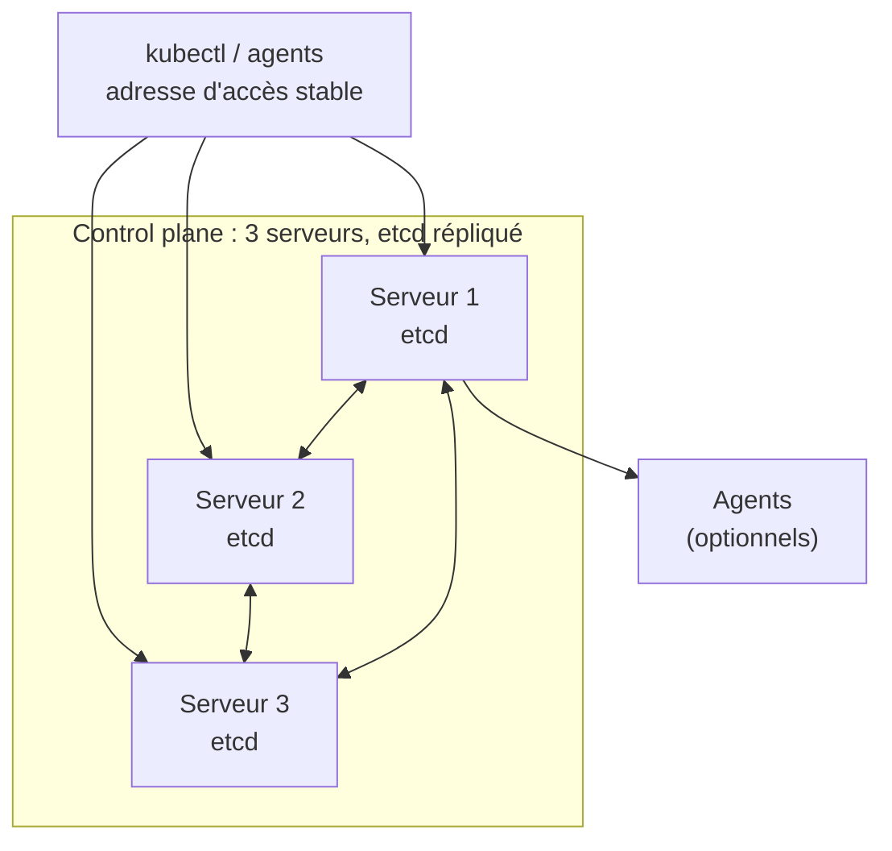
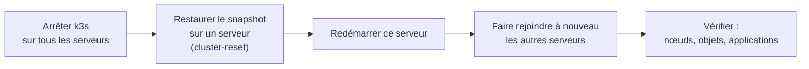
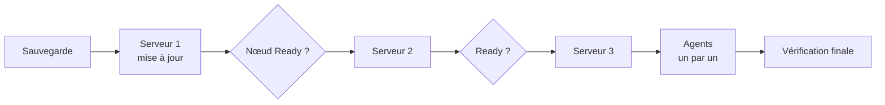
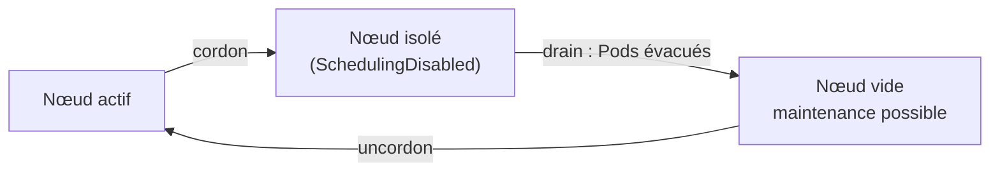

# Chapitre 8 : Administration du cluster k3s

!!! abstract "Objectifs du chapitre" - Expliquer ce qu'apporte la haute disponibilité du control plane et le rôle du quorum etcd - Décrire l'architecture d'un cluster k3s à plusieurs serveurs avec etcd embarqué - Distinguer ce que couvre une sauvegarde du cluster et ce qu'elle ne couvre pas - Planifier une mise à jour de version sans interrompre les applications - Mettre un nœud en maintenance avec `cordon`, `drain` et `uncordon` - Acquis d'apprentissage visés : **AA1**, **AA5**

## 1. Pourquoi administrer le cluster ?

Jusqu'ici, vous avez utilisé un cluster **à un seul serveur** : si ce serveur tombe, le control plane disparaît. Il faut distinguer deux effets :

| Composant en panne             | Effet sur les applications                                                                                                                                      |
| ------------------------------ | --------------------------------------------------------------------------------------------------------------------------------------------------------------- |
| Un nœud **agent**              | Ses Pods sont replanifiés ailleurs, après un délai (voir section 5)                                                                                             |
| Le **serveur** (control plane) | Les Pods déjà en cours **continuent de tourner**, mais on ne peut plus rien créer, modifier ni replanifier : plus d'API, plus de scheduler, plus de contrôleurs |

Administrer un cluster, c'est donc réduire ce point de défaillance unique, **sauvegarder** son état, le **mettre à jour** et **entretenir** les machines qui le composent.

## 2. Haute disponibilité avec etcd embarqué

Par défaut, k3s stocke l'état du cluster dans une base **SQLite**, sur le serveur. Pour la haute disponibilité (HA), plusieurs serveurs partagent un **etcd embarqué**, intégré au binaire k3s. Il existe aussi la possibilité d'utiliser une base externe (MySQL, PostgreSQL ou etcd externe), non étudiée ici.



Les serveurs répliquent l'état entre eux. etcd s'appuie sur un **quorum** : une écriture n'est validée que si la **majorité** des membres la confirme.

| Nombre de serveurs | Quorum (majorité) | Pannes tolérées |
| ------------------ | ----------------- | --------------- |
| 1                  | 1                 | 0               |
| 2                  | 2                 | **0**           |
| 3                  | 2                 | **1**           |
| 5                  | 3                 | 2               |

Conséquences :

- on déploie un nombre **impair** de serveurs : 2 serveurs ne tolèrent aucune panne et sont **moins** fiables qu'un seul (deux machines à garder en marche) ;
- avec 3 serveurs, la perte de deux d'entre eux **bloque** le cluster (plus de quorum) ;
- dans k3s, les serveurs peuvent aussi exécuter des Pods d'application, comme vous l'avez vu avec le serveur du chapitre 1.

Pour monter le cluster, le **premier** serveur initialise etcd, puis les autres le **rejoignent** avec le jeton du cluster. Les agents et `kubectl` doivent joindre le control plane par une **adresse stable** (équilibreur, nom DNS ou adresse virtuelle), pour ne pas dépendre d'un seul serveur.

!!! warning "HA du control plane, pas des applications"
Trois serveurs protègent l'**API et l'état du cluster**. Ils ne rendent pas vos applications hautement disponibles (réplicas, chapitres 2 et 10) et ne répliquent pas les **données** : un volume `local-path` reste lié à son nœud (chapitre 5).

## 3. Sauvegarde et restauration

### Que sauvegarder ?

| Élément                  | Contenu                                                                          | Où il se trouve                                                    |
| ------------------------ | -------------------------------------------------------------------------------- | ------------------------------------------------------------------ |
| **État du cluster**      | Tous les objets Kubernetes (Deployments, Services, Secrets, ConfigMaps, RBAC...) | Datastore : etcd, ou SQLite sur un serveur seul                    |
| **Jeton et certificats** | Identité et clés du cluster                                                      | Dossier de données du serveur (`/var/lib/rancher/k3s/server`)      |
| **Données applicatives** | Contenu des volumes (bases de données...)                                        | Volumes persistants : **pas inclus** dans la sauvegarde du cluster |

La sauvegarde de l'état du cluster **ne contient pas les données de vos applications** : une base de données se sauvegarde avec ses propres outils (CronJob `pg_dump`, chapitre 6).

### Snapshots etcd

Avec etcd embarqué, k3s crée automatiquement des **snapshots** (par défaut toutes les 12 heures, avec une rétention limitée) dans `/var/lib/rancher/k3s/server/db/snapshots`. On peut aussi en créer à la demande :

```bash
sudo k3s etcd-snapshot save --name avant-maj
sudo k3s etcd-snapshot ls
```

Un snapshot stocké sur le **même disque** que le serveur ne protège pas d'une perte de la machine : il faut en copier ailleurs (autre machine, stockage objet compatible S3, géré par k3s en option).

Sur un serveur unique en SQLite, on sauvegarde les fichiers du dossier de données du serveur (`/var/lib/rancher/k3s/server/db/`) ainsi que son jeton.

### Restauration

La restauration remplace l'état du cluster par celui d'un snapshot. Elle suit une procédure précise, que vous pratiquerez au Lab 8.2 :



!!! tip "Une sauvegarde non testée n'est pas une sauvegarde"
Une restauration se répète régulièrement, sur un cluster de test. On y découvre ce qui manque (jeton oublié, snapshot corrompu, procédure mal comprise) avant le jour où on en a besoin.

## 4. Mettre à jour la version

k3s suit les versions de Kubernetes. Les règles à respecter :

- **ne pas sauter de version mineure** : passer de 1.N à 1.N+1, puis à 1.N+2, jamais directement de 1.N à 1.N+2 ;
- mettre à jour **d'abord les serveurs**, **un à un**, puis les **agents** : un agent (kubelet) ne doit jamais être plus récent que le serveur ;
- **sauvegarder avant** : snapshot etcd, ou copie des fichiers du serveur ;
- lire les notes de version de la cible : des fonctions peuvent être retirées ou changer ;
- vérifier l'état du cluster entre chaque nœud.



Dans k3s, mettre à jour un nœud consiste à relancer le script d'installation avec la version voulue (variable `INSTALL_K3S_VERSION`) ou à remplacer le binaire, puis à redémarrer le service. Pour limiter l'interruption, on met d'abord le nœud en maintenance (section 5). Un composant d'automatisation (system-upgrade-controller) existe pour de grands parcs ; il n'est pas utilisé dans ce cours.

## 5. Maintenance des nœuds

Avant d'intervenir sur un nœud (mise à jour, redémarrage, changement de matériel), on le **vide** proprement.

| Commande                                                          | Effet                                                                                                 |
| ----------------------------------------------------------------- | ----------------------------------------------------------------------------------------------------- |
| `kubectl cordon <nœud>`                                           | Marque le nœud **non planifiable** : plus aucun nouveau Pod n'y est placé, les Pods existants restent |
| `kubectl drain <nœud> --ignore-daemonsets --delete-emptydir-data` | `cordon`, puis **évacue** les Pods vers d'autres nœuds                                                |
| `kubectl uncordon <nœud>`                                         | Rend le nœud de nouveau planifiable                                                                   |



À savoir :

- les Pods gérés par un contrôleur (Deployment, StatefulSet...) sont **recréés ailleurs** ; un Pod isolé (sans contrôleur) est **perdu** ;
- les Pods d'un **DaemonSet** ne peuvent pas être déplacés : d'où `--ignore-daemonsets` ;
- les données d'un `emptyDir` sont perdues : d'où `--delete-emptydir-data` ;
- un Pod qui utilise un volume `local-path` ne peut s'exécuter que sur le nœud qui héberge les données : il reste en `Pending` tant que ce nœud n'est pas de retour ;
- les `PodDisruptionBudgets` (chapitre 10) peuvent ralentir ou bloquer un `drain` pour préserver la disponibilité.

En cas de **panne** (et non de maintenance), un nœud devient `NotReady` après quelques dizaines de secondes. Ses Pods ne sont évacués qu'après un délai, **environ 5 minutes par défaut**.

Quelques repères utiles pour l'administration d'un nœud k3s :

| Besoin                            | Où regarder                                               |
| --------------------------------- | --------------------------------------------------------- |
| Journaux du serveur / de l'agent  | `sudo journalctl -u k3s` / `sudo journalctl -u k3s-agent` |
| Configuration du service          | `/etc/rancher/k3s/config.yaml`                            |
| Données et certificats du serveur | `/var/lib/rancher/k3s/server/`                            |
| Jeton du cluster                  | `/var/lib/rancher/k3s/server/node-token`                  |

!!! tip "À retenir" - Un seul serveur est un **point de défaillance unique** : s'il tombe, les Pods en cours continuent, mais plus rien ne peut changer. - La HA de k3s repose sur **etcd embarqué** et un **nombre impair** de serveurs (3 tolèrent 1 panne). - La HA du control plane ne protège ni les **applications** ni les **données**. - Sauvegarder = snapshot etcd + jeton et certificats, **copiés hors du serveur**. Les données applicatives se sauvegardent à part. - Mise à jour : **sauvegarde**, puis serveurs **un à un**, puis agents ; **jamais de saut de version mineure**. - Maintenance d'un nœud : `cordon`, `drain --ignore-daemonsets --delete-emptydir-data`, intervention, `uncordon`.

## Pour vérifier votre compréhension

??? question "Le serveur d'un cluster k3s à un seul serveur s'arrête. Que deviennent les applications qui tournent ?"
Les Pods déjà démarrés continuent de s'exécuter sur les agents. En revanche, on ne peut plus utiliser l'API : pas de création, de modification ni de replanification, et un Pod qui tombe n'est pas remplacé.

??? question "Pourquoi un cluster à 2 serveurs est-il moins fiable qu'un cluster à 1 seul ?"
Le quorum d'etcd est de 2 sur 2 : la perte de l'un des deux bloque le cluster. Il y a donc deux machines susceptibles de provoquer la panne, sans aucune tolérance. Il faut au moins 3 serveurs pour tolérer une panne.

??? question "Un cluster de 3 serveurs perd deux serveurs. Que se passe-t-il ?"
Le quorum (2 sur 3) n'est plus atteint : etcd refuse les écritures et l'API du cluster devient indisponible tant qu'une majorité n'est pas rétablie.

??? question "Une sauvegarde etcd restaurée contient-elle les données de la base PostgreSQL de votre application ?"
Non. Elle contient les objets Kubernetes (dont le PVC et le StatefulSet), mais pas le contenu des volumes. Les données se sauvegardent avec les outils de la base, par exemple un CronJob `pg_dump`.

??? question "Pourquoi met-on à jour les serveurs avant les agents, et pourquoi un nœud à la fois ?"
Un agent plus récent que le serveur n'est pas pris en charge. En mettant à jour un nœud à la fois, on conserve le quorum et une capacité suffisante pour héberger les Pods évacués.

??? question "Quelle différence entre `cordon` et `drain` ?"
`cordon` empêche seulement de placer de nouveaux Pods sur le nœud. `drain` fait un `cordon` puis évacue les Pods existants vers d'autres nœuds.

## Labs du chapitre

- [Lab 8.1 : Cluster HA](lab-8-1-cluster-ha.md)
- [Lab 8.2 : Sauvegarde, restauration et mise à jour](lab-8-2-sauvegarde-restauration-mise-a-jour.md)
