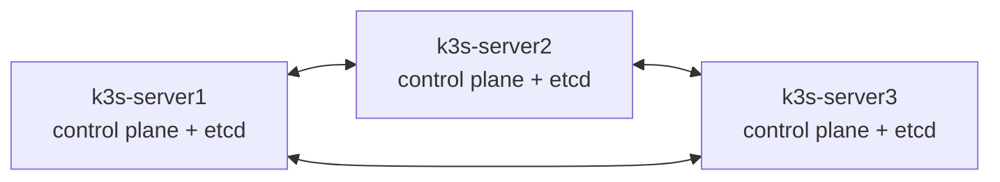

# Lab 8.1 : Cluster HA

| | |
|---|---|
| **Durée** | 75 à 90 min (dont plusieurs redémarrages de VMs) |
| **Niveau** | Guidé |
| **Prérequis** | [Lab 1.1](../../partie-1-fondations/ch01-architecture/lab-1-1-installer-k3s.md) réalisé, [cours du chapitre 8](cours.md) lu, 3 VMs Ubuntu Server (voir [Environnement VMware](../../annexes/environnement-vmware.md)), droits `sudo` |
| **Acquis visés** | AA1, AA5 |

!!! abstract "Objectifs"
    - Construire un cluster k3s à **3 serveurs** avec etcd embarqué
    - Déployer une application répartie sur les trois nœuds
    - Constater qu'un cluster à 3 serveurs survit à la perte d'un serveur
    - Constater qu'il perd son control plane (mais pas ses applications en cours) sans quorum
    - Rétablir le quorum et vérifier le retour à la normale

## Contexte et schéma

Votre cluster actuel a un seul serveur : c'est un point de défaillance unique. Vous le remplacez par trois serveurs qui répliquent leur état dans un etcd commun. Les trois VMs exécutent aussi les applications.



!!! warning "Ce lab reconstruit le cluster"
    Vous allez **désinstaller k3s** sur les trois VMs. Toutes les ressources actuelles (applications, namespaces) seront perdues. Faites un **snapshot** de chaque VM avant de commencer.

!!! note "Adresse d'accès au control plane"
    En production, `kubectl` et les agents joignent les serveurs par une adresse stable (équilibreur, DNS, adresse virtuelle). Avec trois VMs, ce lab n'en met pas en place : sur **chaque** serveur, `kubectl` interroge l'API locale. Vous pourrez ainsi continuer à administrer le cluster quand un autre serveur est arrêté.

## Étapes

### Étape 1 : Préparer les trois VMs

Sur **chacune des trois VMs** (après le snapshot) :

```bash
/usr/local/bin/k3s-uninstall.sh          # sur l'ancien serveur
/usr/local/bin/k3s-agent-uninstall.sh    # sur chaque ancien agent
```

Donnez à chaque VM un nom d'hôte unique et notez son adresse IP :

```bash
sudo hostnamectl set-hostname k3s-server1     # k3s-server2 et k3s-server3 sur les deux autres
hostname
ip -4 addr show | grep inet
```

etcd est sensible aux écarts d'horloge : vérifiez la synchronisation de l'heure. Pour le pare-feu, désactivez `ufw` pour le TP (voir Lab 1.1) ou ouvrez en plus **2379-2380/tcp** (communication entre membres etcd).

```bash
timedatectl | grep -E "synchronized|NTP"
sudo ufw disable
free -h
```

!!! success "Point de contrôle"
    - [ ] k3s est désinstallé sur les trois VMs
    - [ ] Les noms d'hôte `k3s-server1`, `k3s-server2` et `k3s-server3` sont uniques
    - [ ] L'heure est synchronisée sur chaque VM
    - [ ] Vous avez noté les adresses IP des trois VMs : `<IP_S1>`, `<IP_S2>`, `<IP_S3>`

### Étape 2 : Initialiser le premier serveur

Sur `k3s-server1`, générez un jeton partagé et notez-le (les autres serveurs en auront besoin). L'enseignant peut vous imposer une version de k3s : notez-la dans `K3S_VERSION` (laissez la valeur vide pour installer la version stable courante).

```bash
export K3S_TOKEN=$(openssl rand -hex 16)
echo $K3S_TOKEN
export K3S_VERSION=""      # ou la version communiquée par l'enseignant
curl -sfL https://get.k3s.io | INSTALL_K3S_VERSION=$K3S_VERSION sh -s - server --cluster-init
```

!!! warning "Le jeton"
    Le script d'installation lit la variable `K3S_TOKEN` exportée dans votre terminal : lancez donc l'installation dans le **même terminal** que l'`export`. Si vous avez perdu la valeur, relisez-la avec `sudo cat /var/lib/rancher/k3s/server/token`.

Vérifiez le serveur, la version et la présence d'etcd :

```bash
sudo systemctl status k3s --no-pager
sudo k3s --version
sudo k3s kubectl get nodes
sudo ls /var/lib/rancher/k3s/server/db/
```

Configurez `kubectl` sans `sudo` (comme au Lab 1.1) :

```bash
mkdir -p ~/.kube
sudo cp /etc/rancher/k3s/k3s.yaml ~/.kube/config
sudo chown $USER:$USER ~/.kube/config
chmod 600 ~/.kube/config
alias k=kubectl
k get nodes
```

Notez la **version exacte** de k3s : les deux autres serveurs doivent utiliser la même.

!!! success "Point de contrôle"
    - [ ] `k3s-server1` est `Ready`
    - [ ] Le dossier `/var/lib/rancher/k3s/server/db/` contient un dossier `etcd`
    - [ ] Vous avez noté le jeton et la version de k3s

### Étape 3 : Joindre les deux autres serveurs

Sur `k3s-server2`, **puis seulement quand il est `Ready`**, sur `k3s-server3` (remplacez les valeurs) :

```bash
export K3S_TOKEN=<JETON>
export K3S_VERSION=<VERSION_NOTÉE>      # vide si aucune version n'a été imposée
curl -sfL https://get.k3s.io | INSTALL_K3S_VERSION=$K3S_VERSION sh -s - server --server https://<IP_S1>:6443
sudo systemctl status k3s --no-pager
```

Sur le serveur 1, suivez l'arrivée des nœuds :

```bash
k get nodes -o wide -w
```

Quittez avec `Ctrl+C` quand les trois nœuds sont `Ready`. Vérifiez leurs rôles, puis configurez `kubectl` sur chaque serveur (mêmes commandes qu'à l'étape 2, avec `/etc/rancher/k3s/k3s.yaml` local) :

```bash
k get nodes
k get nodes -l node-role.kubernetes.io/etcd=true
k get pods -n kube-system -o wide
```

!!! success "Point de contrôle"
    - [ ] Trois nœuds `Ready`, dont les rôles contiennent `control-plane` et `etcd`
    - [ ] `k get nodes` fonctionne depuis chacun des trois serveurs
    - [ ] Les trois serveurs utilisent la même version de k3s

### Étape 4 : Déployer une application répartie

Sur `k3s-server1` :

```bash
k create namespace tp-k8s
k config set-context --current --namespace=tp-k8s
k create deployment web --image=nginx:1.26-alpine --replicas=3
k expose deployment web --port=80 --type=NodePort
k get pods -o wide
k get service web
```

Notez le **NodePort** (colonne `PORT(S)`, de la forme `80:3xxxx/TCP`). Dans un **second terminal sur `k3s-server3`**, lancez une boucle de requêtes qui restera ouverte pendant tout le lab :

```bash
while true; do curl -s -m 2 -o /dev/null -w "%{http_code} " http://<IP_S3>:<NODEPORT>; sleep 1; done
```

Une suite de `200` s'affiche, un code par seconde. Si un `000` apparaît, la requête a échoué.

!!! success "Point de contrôle"
    - [ ] Trois Pods `web`, de préférence répartis sur plusieurs nœuds
    - [ ] La boucle affiche des `200` en continu

### Étape 5 : Perdre un serveur

Éteignez `k3s-server1` brutalement, comme lors d'une panne :

```bash
sudo poweroff
```

Sur `k3s-server2`, observez le cluster (réponse de l'API locale) :

```bash
k get nodes
k get nodes --watch
```

Au bout d'une quarantaine de secondes, `k3s-server1` passe à `NotReady`. Pendant ce temps, observez la boucle sur `k3s-server3` : quelques `000` peuvent apparaître tant que le Service envoie des requêtes à un Pod du nœud arrêté. Le cluster reste **utilisable en écriture** :

```bash
k create deployment test-ha --image=nginx:1.26-alpine
k get pods -o wide
```

Les Pods de `k3s-server1` sont replanifiés ailleurs après environ 5 minutes. Observez-le si le temps le permet : `k get pods -o wide -w`.

Rallumez ensuite la VM `k3s-server1` (VMware Workstation, *Power On*), puis vérifiez qu'elle rejoint le cluster d'elle-même :

```bash
k get nodes -w
```

!!! success "Point de contrôle"
    - [ ] `k3s-server1` est passé en `NotReady` sans bloquer `kubectl` sur les deux autres serveurs
    - [ ] La création du Deployment `test-ha` a réussi pendant la panne
    - [ ] La boucle a eu au plus quelques échecs, puis est revenue à `200`
    - [ ] Après le redémarrage, `k3s-server1` est de nouveau `Ready`

### Étape 6 : Perdre le quorum

Éteignez maintenant **deux serveurs** sur trois : `k3s-server1` et `k3s-server2`.

```bash
sudo poweroff        # sur k3s-server1, puis sur k3s-server2
```

Sur `k3s-server3`, le dernier serveur, tentez d'utiliser le cluster :

```bash
k get nodes --request-timeout=10s
k create deployment sans-quorum --image=nginx:1.26-alpine --request-timeout=10s
```

Les commandes échouent ou expirent : il n'y a plus de majorité (1 serveur sur 3). Pourtant, observez la boucle de requêtes : elle peut continuer à afficher `200` si elle atteint un Pod encore en exécution sur `k3s-server3`. Les applications en cours **continuent de tourner**, mais le cluster ne peut plus rien changer.

Rétablissez le quorum en rallumant **d'abord `k3s-server2`**, puis `k3s-server1` :

```bash
k get nodes --request-timeout=10s
k get nodes -w
```

Attendez que les trois nœuds soient `Ready`, puis vérifiez que les ressources créées plus tôt sont toujours là :

```bash
k get deployment
k get pods -o wide
```

L'objet `sans-quorum` n'existe pas : la commande de création avait échoué.

!!! success "Point de contrôle"
    - [ ] Sans quorum, `k get nodes` et `k create` échouent ou expirent
    - [ ] Les applications en cours ont continué de répondre aux requêtes, pendant la perte du quorum, quand le Pod était sur `k3s-server3`
    - [ ] Après le retour d'un deuxième serveur, `kubectl` fonctionne de nouveau
    - [ ] Les Deployments créés avant les pannes (`web`, `test-ha`) sont toujours présents

## Questions de réflexion

??? question "Pourquoi le cluster est-il resté utilisable quand un seul serveur était arrêté ?"
    Les deux serveurs restants forment une majorité (2 sur 3) : etcd valide toujours les écritures et les API des deux serveurs répondent.

??? question "Pourquoi `kubectl` a-t-il cessé de fonctionner quand deux serveurs sont tombés ?"
    Le serveur restant n'a plus de quorum : etcd ne peut plus valider ni garantir l'état du cluster, donc l'API ne peut plus répondre de façon fiable.

??? question "Pourquoi la boucle de requêtes a-t-elle pu continuer à répondre pendant la perte du quorum ?"
    Les Pods déjà démarrés continuent de s'exécuter sur leur nœud, et les règles réseau de kube-proxy existent déjà. L'absence de control plane empêche de **changer** l'état, pas de **servir** les applications déjà en place.

??? question "Pourquoi quelques requêtes ont-elles échoué quand un serveur est tombé, alors que le cluster est en HA ?"
    La HA du control plane ne rend pas l'application instantanément insensible aux pannes : pendant la détection de la panne (environ 40 secondes), le Service peut encore envoyer des requêtes à un Pod du nœud arrêté. La disponibilité de l'application repose sur les réplicas, et sur des mécanismes comme les sondes (chapitre 9).

??? question "Quelles limites de cette installation à 3 serveurs resteraient à lever pour une production ?"
    Une adresse d'accès stable au control plane (équilibreur ou adresse virtuelle), un stockage répliqué (les volumes `local-path` restent liés à un nœud), des serveurs sur des machines physiques ou des zones distinctes, des sauvegardes copiées hors des serveurs (Lab 8.2).

## Dépannage

| Symptôme | Pistes |
|---|---|
| Le serveur 2 ou 3 ne rejoint pas | `sudo journalctl -u k3s -n 50` ; vérifier le jeton, l'URL `https://<IP_S1>:6443`, le pare-feu (6443, 2379-2380, 8472, 10250) |
| `token` incorrect ou `bootstrap data already found` | Jeton différent de celui du premier serveur, ou VM mal nettoyée : désinstaller k3s sur la VM et recommencer |
| Deux nœuds portent le même nom | Changer le nom d'hôte, désinstaller puis réinstaller k3s sur cette VM |
| Un serveur reste `NotReady` | Attendre 1 à 2 minutes ; `k describe node <nom>` ; `sudo journalctl -u k3s` ; vérifier l'heure |
| Erreurs `etcdserver: request timed out` | Quorum perdu ou machines surchargées : vérifier combien de serveurs sont actifs, `free -h` |
| `kubectl` : `connection refused` sur un serveur redémarré | k3s met une minute à démarrer : `sudo systemctl status k3s` |
| `NotReady` persistant après `poweroff` puis `Power On` | Vérifier que le service démarre : `sudo systemctl status k3s` ; l'horloge de la VM a pu dériver |
| `k get nodes -l node-role.kubernetes.io/etcd=true` ne renvoie rien | Libellé différent selon la version : `k get nodes --show-labels \| grep etcd` |

## Nettoyage

Ne désinstallez pas le cluster : le Lab 8.2 s'appuie dessus.

```bash
k delete namespace tp-k8s
k config set-context --current --namespace=default
```

Arrêtez la boucle de requêtes avec `Ctrl+C`, puis faites un **snapshot** de chaque VM pour pouvoir revenir à ce cluster HA propre.