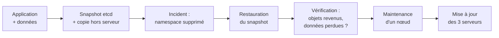

# Lab 8.2 : Sauvegarde, restauration et mise à jour

| | |
|---|---|
| **Durée** | 2 h 30 environ, en deux parties : **A** (étapes 1 à 4, 75 min) et **B** (étapes 5 et 6, 60 à 75 min) |
| **Niveau** | Guidé |
| **Prérequis** | [Lab 8.1](lab-8-1-cluster-ha.md) réalisé (cluster à 3 serveurs `Ready`, installé avec la version `<VERSION_INITIALE>`), [cours du chapitre 8](cours.md) lu, snapshot VMware de chaque VM |
| **Acquis visés** | AA1, AA5 |

!!! abstract "Objectifs"
    - Créer un snapshot etcd et en conserver une copie hors du serveur
    - Restaurer le cluster après un incident (suppression accidentelle d'un namespace)
    - Constater ce que la sauvegarde du cluster ne couvre pas (données des volumes)
    - Mettre un nœud en maintenance avec `cordon`, `drain` et `uncordon`
    - Mettre à jour les trois serveurs, un par un, sans interrompre l'application

## Contexte et schéma

Vous jouez le rôle de l'administrateur d'un cluster de production : vous le sauvegardez, vous subissez un incident, vous restaurez, puis vous le mettez à jour.



!!! warning "Versions de k3s"
    Ce lab suppose que votre enseignant vous a communiqué deux versions : `<VERSION_INITIALE>` (celle installée au Lab 8.1) et `<VERSION_CIBLE>` (la **version mineure suivante**). Elles se présentent sous la forme `v1.<mineure>.<correctif>+k3s<n>`. La liste des versions disponibles est publiée dans les *Releases* du dépôt k3s. **Ne sautez jamais de version mineure.**

## Partie A : sauvegarde et restauration

### Étape 1 : Préparer une application avec des données

Sur `k3s-server1`, déployez une application qui possède des objets Kubernetes **et** des données dans un volume :

```bash
k create namespace tp-k8s

cat <<'EOF' > appli.yaml
apiVersion: v1
kind: ConfigMap
metadata:
  name: important
data:
  message: "configuration d'avant la sauvegarde"
---
apiVersion: apps/v1
kind: Deployment
metadata:
  name: web
spec:
  replicas: 3
  selector:
    matchLabels:
      app: web
  template:
    metadata:
      labels:
        app: web
    spec:
      containers:
        - name: web
          image: nginx:1.26-alpine
---
apiVersion: v1
kind: PersistentVolumeClaim
metadata:
  name: donnees-pvc
spec:
  accessModes: ["ReadWriteOnce"]
  storageClassName: local-path
  resources:
    requests:
      storage: 1Gi
---
apiVersion: apps/v1
kind: Deployment
metadata:
  name: donnees
spec:
  replicas: 1
  selector:
    matchLabels:
      app: donnees
  template:
    metadata:
      labels:
        app: donnees
    spec:
      containers:
        - name: app
          image: nginx:1.26-alpine
          volumeMounts:
            - name: data
              mountPath: /data
      volumes:
        - name: data
          persistentVolumeClaim:
            claimName: donnees-pvc
EOF
k apply -f appli.yaml -n tp-k8s
k rollout status deployment/web -n tp-k8s
k rollout status deployment/donnees -n tp-k8s
k exec -n tp-k8s deploy/donnees -- sh -c 'echo "donnee importante" > /data/important.txt'
k exec -n tp-k8s deploy/donnees -- cat /data/important.txt
k get all,pvc,configmap -n tp-k8s -o wide
```

Notez le nœud qui héberge le Pod `donnees` et le dossier correspondant sur ce nœud :

```bash
NODE=$(k get pod -n tp-k8s -l app=donnees -o jsonpath='{.items[0].spec.nodeName}')
echo $NODE
```

Sur ce nœud, repérez le dossier du volume : `sudo ls /var/lib/rancher/k3s/storage/`.

!!! success "Point de contrôle"
    - [ ] Les Pods `web` (3) et `donnees` (1) sont `Running`
    - [ ] Le fichier `important.txt` contient `donnee importante`
    - [ ] Vous avez repéré le nœud `$NODE` et le dossier du volume sur ce nœud

### Étape 2 : Créer un snapshot etcd et le conserver ailleurs

Sur `k3s-server1` :

```bash
sudo k3s etcd-snapshot save --name avant-incident
sudo k3s etcd-snapshot ls
sudo ls -lh /var/lib/rancher/k3s/server/db/snapshots/
```

Relevez le nom du fichier créé (il commence par `avant-incident`). Les snapshots automatiques, créés régulièrement par k3s, apparaissent dans la même liste. Faites une **copie hors du serveur** : le fichier appartient à `root`, copiez-le d'abord dans votre dossier personnel :

```bash
SNAP=$(sudo ls /var/lib/rancher/k3s/server/db/snapshots/ | grep avant-incident | tail -n 1)
echo $SNAP
sudo cp /var/lib/rancher/k3s/server/db/snapshots/$SNAP ~/$SNAP
sudo chown $USER:$USER ~/$SNAP
scp ~/$SNAP <UTILISATEUR>@<IP_S2>:~/
```

Ajoutez ensuite une ressource **après** le snapshot, qui servira à vérifier la restauration :

```bash
k create configmap apres-snapshot --from-literal=note="creee apres la sauvegarde" -n tp-k8s
k get configmap -n tp-k8s
```

!!! success "Point de contrôle"
    - [ ] `etcd-snapshot ls` liste le snapshot `avant-incident`
    - [ ] Une copie du fichier existe sur `k3s-server2`
    - [ ] Le ConfigMap `apres-snapshot` existe, mais n'est pas dans le snapshot

### Étape 3 : L'incident

Un administrateur supprime par erreur le namespace de l'application :

```bash
k delete namespace tp-k8s
k get namespace
k get pv
```

Le namespace, ses Pods, ses ConfigMaps et son PVC disparaissent. Sur le nœud `$NODE`, le dossier du volume est lui aussi supprimé :

```bash
sudo ls /var/lib/rancher/k3s/storage/
```

!!! success "Point de contrôle"
    - [ ] Le namespace `tp-k8s` n'existe plus
    - [ ] Le dossier du volume a disparu de `/var/lib/rancher/k3s/storage/` sur `$NODE`

### Étape 4 : Restaurer le cluster

Suivez la procédure dans l'ordre. **1. Arrêtez k3s sur les trois serveurs** (une commande sur chaque VM) :

```bash
sudo systemctl stop k3s
```

**2. Sur `k3s-server1` uniquement**, restaurez le snapshot (remplacez le nom du fichier) :

```bash
sudo k3s server --cluster-reset --cluster-reset-restore-path=/var/lib/rancher/k3s/server/db/snapshots/$SNAP
```

Attendez le message indiquant que la réinitialisation est terminée et qu'il faut redémarrer sans l'option `--cluster-reset`. Redémarrez alors le service :

```bash
sudo systemctl start k3s
sudo systemctl status k3s --no-pager
```

**3. Sur `k3s-server2`, puis `k3s-server3`**, mettez de côté l'ancien état etcd et redémarrez, pour rejoindre le cluster restauré :

```bash
sudo mv /var/lib/rancher/k3s/server/db /var/lib/rancher/k3s/server/db.bak
sudo systemctl start k3s
```

**4. Vérifiez** depuis `k3s-server1` :

```bash
k get nodes
k get namespace
k get all,pvc,configmap -n tp-k8s
k get configmap apres-snapshot -n tp-k8s
```

Constatez ce qui est revenu... et ce qui manque :

```bash
k rollout status deployment/web -n tp-k8s
k rollout status deployment/donnees -n tp-k8s
k exec -n tp-k8s deploy/donnees -- ls -l /data
k exec -n tp-k8s deploy/donnees -- cat /data/important.txt
```

!!! success "Point de contrôle"
    - [ ] Les trois nœuds sont `Ready`
    - [ ] Le namespace `tp-k8s`, le Deployment `web`, le ConfigMap `important` et le PVC sont revenus
    - [ ] Le ConfigMap `apres-snapshot` n'existe plus (créé après le snapshot)
    - [ ] Le fichier `important.txt` est **introuvable** : la sauvegarde du cluster ne contient pas les données des volumes

## Partie B : maintenance et mise à jour

### Étape 5 : Mettre un nœud en maintenance

Recréez la donnée du volume, puis videz le nœud qui héberge le Pod `donnees` :

```bash
k exec -n tp-k8s deploy/donnees -- sh -c 'echo "donnee importante" > /data/important.txt'
NODE=$(k get pod -n tp-k8s -l app=donnees -o jsonpath='{.items[0].spec.nodeName}')
echo $NODE
k get pods -n tp-k8s -o wide
```

Mettez le nœud en `cordon`, puis évacuez-le :

```bash
k cordon $NODE
k get nodes
k drain $NODE --ignore-daemonsets --delete-emptydir-data
k get pods -n tp-k8s -o wide
k describe pod -n tp-k8s -l app=donnees | tail -n 6
```

Les Pods `web` ont été recréés sur les autres nœuds. Le Pod `donnees`, lui, reste `Pending` : son volume `local-path` n'existe que sur `$NODE`. Rétablissez le nœud :

```bash
k uncordon $NODE
k get pods -n tp-k8s -o wide -w
k exec -n tp-k8s deploy/donnees -- cat /data/important.txt
```

!!! success "Point de contrôle"
    - [ ] Après `cordon`, le nœud est `SchedulingDisabled`
    - [ ] Après `drain`, aucun Pod `web` ne reste sur `$NODE`
    - [ ] Le Pod `donnees` est resté `Pending` (conflit d'affinité de volume), puis `Running` après `uncordon`, avec sa donnée intacte

### Étape 6 : Mettre à jour les trois serveurs

Avant toute mise à jour, faites un **nouveau snapshot** et vérifiez les versions :

```bash
sudo k3s etcd-snapshot save --name avant-maj      # sur k3s-server1
k get nodes -o wide
```

Dans un second terminal sur `k3s-server2` ou `k3s-server3`, lancez une boucle de requêtes vers l'application (le Pod `web` est accessible par un NodePort, à créer si besoin avec `k expose deployment web --port=80 --type=NodePort -n tp-k8s`) :

```bash
while true; do curl -s -m 2 -o /dev/null -w "%{http_code} " http://<IP_S3>:<NODEPORT>; sleep 1; done
```

Mettez à jour **un serveur à la fois**, en commençant par `k3s-server1`. Pour chacun, dans cet ordre :

```bash
k drain <NOM_DU_SERVEUR> --ignore-daemonsets --delete-emptydir-data
export K3S_TOKEN=<JETON>
curl -sfL https://get.k3s.io | INSTALL_K3S_VERSION=<VERSION_CIBLE> sh -s - server --cluster-init     # k3s-server1
curl -sfL https://get.k3s.io | INSTALL_K3S_VERSION=<VERSION_CIBLE> sh -s - server --server https://<IP_S1>:6443    # k3s-server2 et k3s-server3
k get nodes
k uncordon <NOM_DU_SERVEUR>
```

Choisissez la commande correspondant à votre serveur. Vérifiez entre deux mises à jour que le nœud est `Ready` avec la nouvelle version avant de passer au suivant :

```bash
k get nodes -o wide
```

À la fin, contrôlez le cluster et l'application :

```bash
k get nodes
k get pods -A
k get deployment -n tp-k8s
sudo k3s --version
```

!!! success "Point de contrôle"
    - [ ] Un snapshot `avant-maj` a été créé avant de toucher aux nœuds
    - [ ] Les trois serveurs affichent `<VERSION_CIBLE>` et sont `Ready`
    - [ ] La boucle de requêtes n'a eu que de rares échecs pendant l'opération
    - [ ] Tous les Pods de `kube-system` et de `tp-k8s` sont `Running`

## Questions de réflexion

??? question "Pourquoi le fichier `important.txt` n'est-il pas revenu après la restauration ?"
    Un snapshot etcd ne contient que les objets Kubernetes. Le contenu des volumes se trouve sur le disque du nœud et a été supprimé avec le PVC. Il faut sauvegarder les données avec les outils de l'application, par exemple un CronJob de sauvegarde (chapitre 6).

??? question "Pourquoi le ConfigMap `apres-snapshot` a-t-il disparu ?"
    La restauration ramène le cluster à l'état du snapshot : tout ce qui a été créé ou modifié après est perdu. D'où l'intérêt de snapshots fréquents.

??? question "Pourquoi arrêter k3s sur tous les serveurs, restaurer sur un seul, puis faire rejoindre les autres avec un état etcd vide ?"
    Les membres etcd doivent repartir d'un état cohérent. Le serveur restauré devient la référence, les autres reconstruisent leur état à partir de lui, au lieu de conserver un état divergent.

??? question "Pourquoi le Pod `donnees` est-il resté `Pending` pendant le `drain` ?"
    Son volume `local-path` n'existe que sur le nœud évacué : le scheduler ne peut le placer sur aucun autre nœud tant que celui-ci est isolé. Avec un stockage réseau, le Pod aurait pu être replacé ailleurs.

??? question "Pourquoi mettre à jour un serveur à la fois, et vérifier l'état entre deux mises à jour ?"
    Avec 3 serveurs, le quorum est de 2 : mettre à jour deux serveurs en même temps risquerait de perdre le quorum. Vérifier chaque nœud permet d'arrêter à la première anomalie, avec les deux autres intacts.

??? question "Pourquoi vaut-il mieux restaurer régulièrement sur un cluster de test ?"
    Pour valider que la sauvegarde est exploitable et que la procédure est connue. Sinon on découvre les manques (jeton, fichier absent, étape oubliée) au pire moment.

## Dépannage

| Symptôme | Pistes |
|---|---|
| `etcd-snapshot save` échoue | Vérifier que k3s s'exécute (`systemctl status k3s`) et que vous utilisez `sudo` sur un serveur à etcd embarqué |
| `scp` refuse la connexion | Service SSH absent ou mot de passe incorrect ; copier le fichier via un autre moyen (poste Windows, `scp` depuis Windows) |
| `--cluster-reset` échoue | Vérifier que k3s est arrêté sur **tous** les serveurs, que le chemin du snapshot est exact, que le jeton est inchangé |
| Les autres serveurs ne rejoignent pas | Dossier `db` encore présent (le déplacer) ; `sudo journalctl -u k3s -n 50` |
| `kubectl` : erreurs pendant la restauration | Normal tant que le quorum n'est pas rétabli : attendre que deux serveurs soient revenus |
| `drain` refuse d'évacuer un Pod | Pod sans contrôleur, `DaemonSet` ou `emptyDir` : ajouter les options adaptées ou recréer le Pod avec un Deployment |
| Le Pod `donnees` reste `Pending` | Normal pendant le `drain` ; il redémarre après `uncordon` |
| Après la mise à jour, un nœud reste `NotReady` | `sudo journalctl -u k3s -n 50` ; vérifier la version installée et la connectivité avec les autres serveurs |
| `INSTALL_K3S_VERSION` : version introuvable | Écrire la version exactement comme dans les *Releases* (`v1.<mineure>.<correctif>+k3s<n>`) |

## Nettoyage

Conservez le cluster pour la suite du cours. Supprimez uniquement les ressources de test :

```bash
k delete namespace tp-k8s
rm -f ~/$SNAP
```

Arrêtez la boucle de requêtes avec `Ctrl+C`, puis faites un **snapshot** de chaque VM : le cluster, mis à jour et fonctionnel, sert de base à la suite de la Partie 3.