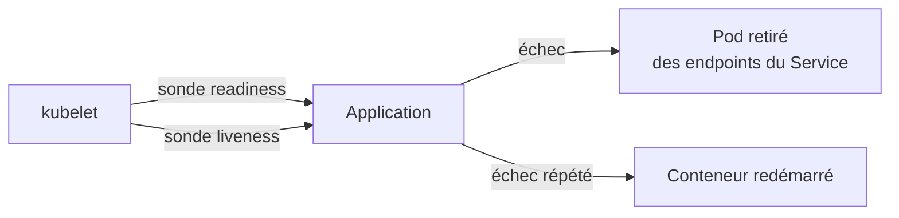
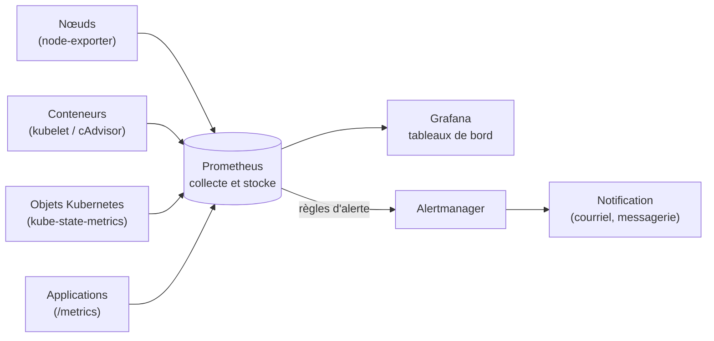
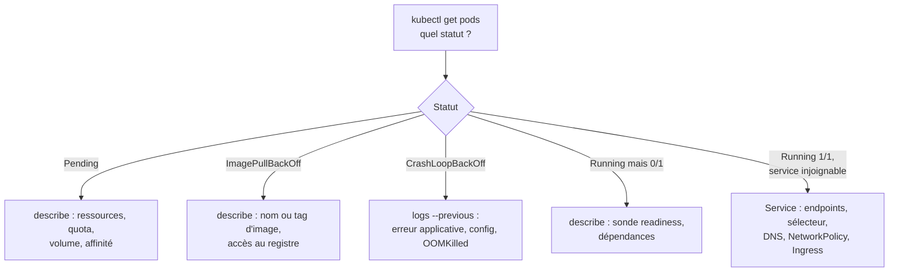

# Chapitre 9 : Observabilité et dépannage

!!! abstract "Objectifs du chapitre" - Exploiter les logs et les événements pour comprendre l'état d'une application - Configurer les trois types de sondes (liveness, readiness, startup) et expliquer leurs effets - Distinguer metrics-server de la chaîne Prometheus, Grafana et Alertmanager - Appliquer une méthodologie de diagnostic structurée - Acquis d'apprentissage visés : **AA5**, **AA6**

## 1. Observer pour comprendre

Un système en production tombe en panne, ralentit ou se comporte de façon inattendue. **Observer** consiste à disposer des informations qui permettent de le comprendre sans deviner.

| Signal         | Question                                            | Exemples dans Kubernetes                       |
| -------------- | --------------------------------------------------- | ---------------------------------------------- |
| **Logs**       | Que s'est-il passé ?                                | `kubectl logs`, sortie standard des conteneurs |
| **Événements** | Que fait le cluster à propos de cet objet ?         | `kubectl describe`, `kubectl get events`       |
| **Sondes**     | L'application est-elle vivante, prête à servir ?    | liveness, readiness, startup                   |
| **Métriques**  | Quelle est la tendance (charge, erreurs, mémoire) ? | `kubectl top`, Prometheus, Grafana             |

Les **traces** distribuées (suivre une requête à travers plusieurs services) complètent ces signaux dans les architectures en microservices ; elles dépassent le cadre de ce chapitre.

## 2. Les logs

Un conteneur doit écrire ses logs sur la **sortie standard** (stdout) et la **sortie d'erreur** : c'est ce que collecte `kubectl logs`.

| Besoin                                   | Commande                                                          |
| ---------------------------------------- | ----------------------------------------------------------------- |
| Logs d'un Pod                            | `kubectl logs <pod>`                                              |
| Suivre en direct                         | `kubectl logs -f <pod>`                                           |
| Dernières lignes / dernières minutes     | `kubectl logs --tail=50 <pod>` · `kubectl logs --since=10m <pod>` |
| Conteneur précis d'un Pod                | `kubectl logs <pod> -c <conteneur>`                               |
| Conteneur **précédent** (après un crash) | `kubectl logs <pod> --previous`                                   |
| Plusieurs Pods par label                 | `kubectl logs -l app=web --all-containers`                        |

Points à connaître :

- les logs sont stockés sur le **nœud** et font l'objet d'une rotation ; ils sont **perdus** quand le Pod ou le nœud disparaît ;
- en production, on les **centralise** dans un outil dédié (par exemple Loki ou la pile Elasticsearch) pour les conserver et les interroger ;
- après un redémarrage de conteneur, `--previous` donne les logs de l'exécution qui a planté.

## 3. Les événements

Kubernetes enregistre des **événements** à chaque décision ou incident : planification, téléchargement d'image, échec d'une sonde, quota refusé.

```bash
kubectl describe pod <pod>                                   # section Events, en bas
kubectl get events --sort-by=.metadata.creationTimestamp     # tout le namespace, du plus ancien au plus récent
kubectl get events --field-selector type=Warning             # uniquement les avertissements
```

Ils sont de type `Normal` ou `Warning`. Ils sont **conservés peu de temps** (environ une heure par défaut) : consultez-les tôt, avant qu'ils ne disparaissent.

## 4. Les sondes (probes)

Par défaut, Kubernetes considère un conteneur comme sain tant que son processus tourne. Or une application peut être démarrée mais bloquée, ou en cours de démarrage et incapable de servir. Les **sondes** permettent au kubelet de le vérifier.

| Sonde         | Question posée                                      | Si elle échoue                                                                                                                  |
| ------------- | --------------------------------------------------- | ------------------------------------------------------------------------------------------------------------------------------- |
| **liveness**  | L'application est-elle vivante ?                    | Le conteneur est **redémarré**                                                                                                  |
| **readiness** | L'application est-elle prête à recevoir du trafic ? | Le Pod est **retiré des endpoints du Service** (pas de redémarrage)                                                             |
| **startup**   | L'application a-t-elle fini de démarrer ?           | Tant qu'elle n'a pas réussi, les deux autres sondes sont suspendues ; si elle échoue trop longtemps, le conteneur est redémarré |



Trois mécanismes de vérification :

| Mécanisme   | Principe                                                     | Exemple                 |
| ----------- | ------------------------------------------------------------ | ----------------------- |
| `httpGet`   | Requête HTTP ; code 200 à 399 = succès                       | `/health`, `/ready`     |
| `tcpSocket` | Ouverture d'une connexion TCP                                | Port 5432 d'une base    |
| `exec`      | Exécution d'une commande dans le conteneur ; code 0 = succès | `pg_isready -U appuser` |

```yaml
containers:
  - name: api
    image: monimage:1.0.0
    readinessProbe:
      httpGet:
        path: /ready
        port: 8080
      initialDelaySeconds: 5
      periodSeconds: 10
    livenessProbe:
      httpGet:
        path: /health
        port: 8080
      initialDelaySeconds: 15
      periodSeconds: 10
      failureThreshold: 3
```

| Paramètre             | Rôle                                                     | Valeur par défaut |
| --------------------- | -------------------------------------------------------- | ----------------- |
| `initialDelaySeconds` | Attente avant la première vérification                   | 0                 |
| `periodSeconds`       | Intervalle entre deux vérifications                      | 10                |
| `timeoutSeconds`      | Délai maximal de réponse                                 | 1                 |
| `failureThreshold`    | Échecs consécutifs avant de considérer la sonde en échec | 3                 |
| `successThreshold`    | Succès consécutifs pour repasser en succès               | 1                 |

Les sondes sont liées à ce que vous avez déjà vu :

- la **disponibilité** d'un Pod (colonne `READY` de `kubectl get pods`) dépend de sa sonde readiness ;
- les **endpoints** d'un Service (chapitre 3) ne contiennent que les Pods prêts ;
- un **rolling update** (chapitre 2) n'avance que lorsque les nouveaux Pods sont prêts : sans sonde readiness, Kubernetes considère un Pod prêt dès que son conteneur démarre.

!!! warning "Erreurs fréquentes" - Une sonde **liveness** trop stricte ou qui dépend d'un service externe (la base de données) provoque des **redémarrages en boucle** quand ce service est indisponible. La liveness doit seulement dire « le processus répond ». - C'est la sonde **readiness** qui peut vérifier les dépendances : un Pod sans accès à la base cesse de recevoir du trafic, sans être redémarré. - Un délai trop court pour une application lente à démarrer provoque des redémarrages permanents : utilisez `initialDelaySeconds` ou une sonde `startup`.

## 5. Les métriques

### metrics-server : la vue instantanée

Fourni par k3s, **metrics-server** donne la consommation actuelle de CPU et de mémoire des nœuds et des Pods :

```bash
kubectl top nodes
kubectl top pods -A
```

Il ne garde **aucun historique** et ne mesure que le CPU et la mémoire. Il alimente aussi l'autoscaling (chapitre 10).

### Prometheus, Grafana et Alertmanager

Pour suivre l'évolution dans le temps et déclencher des alertes, on utilise un outil dédié. La pile la plus répandue :



| Composant        | Rôle                                                                                                                                                  |
| ---------------- | ----------------------------------------------------------------------------------------------------------------------------------------------------- |
| **Prometheus**   | Interroge régulièrement (modèle _pull_) les points d'accès `/metrics` des cibles, stocke des séries temporelles, évalue des règles d'alerte           |
| **Exporters**    | Exposent des métriques : `node-exporter` (machines), kube-state-metrics (état des objets Kubernetes) ; le kubelet expose les métriques des conteneurs |
| **Grafana**      | Affiche des tableaux de bord à partir de Prometheus                                                                                                   |
| **Alertmanager** | Reçoit les alertes de Prometheus, les regroupe, et les envoie vers un canal de notification                                                           |

Prometheus s'interroge avec le langage **PromQL** :

```text
up                                                                  # 1 si la cible répond, 0 sinon
sum by (pod) (rate(container_cpu_usage_seconds_total{namespace="tp-k8s"}[5m]))      # CPU par Pod
container_memory_working_set_bytes{namespace="tp-k8s"}              # mémoire par conteneur
```

Une pile de supervision consomme des ressources : sur des VMs modestes, on limite la durée de rétention et le nombre de cibles.

### Que surveiller ?

Quatre « signaux d'or » résument la santé d'un service :

| Signal         | Question                                                            |
| -------------- | ------------------------------------------------------------------- |
| **Latence**    | En combien de temps répond-il ?                                     |
| **Trafic**     | Combien de requêtes reçoit-il ?                                     |
| **Erreurs**    | Quelle proportion de requêtes échoue ?                              |
| **Saturation** | Quelle part de ses ressources (CPU, mémoire, disque) utilise-t-il ? |

Une bonne alerte signale un **symptôme qui touche les utilisateurs** et appelle une **action**. Trop d'alertes fait ignorer les vraies.

## 6. Méthodologie de diagnostic

Face à un incident, on ne corrige pas au hasard : on suit une démarche.

1. **Observer** : que voit-on exactement ? Depuis quand ? Qu'est-ce qui a changé ?
2. **Formuler une hypothèse** sur la cause, couche par couche.
3. **Tester** l'hypothèse avec une commande, sans modifier l'état si possible.
4. **Corriger**, une seule modification à la fois.
5. **Vérifier** que le symptôme a disparu, et noter la cause racine.

On progresse du plus visible au plus profond :



| Symptôme                     | Premières vérifications                                                                 |
| ---------------------------- | --------------------------------------------------------------------------------------- |
| `Pending`                    | Événements du Pod : `Insufficient cpu/memory`, quota, PVC non lié, nœud non planifiable |
| `ImagePullBackOff`           | Nom et tag de l'image, accès Internet, registre privé                                   |
| `CrashLoopBackOff`           | `logs --previous`, code de sortie, variables et Secrets manquants, `OOMKilled`          |
| `CreateContainerConfigError` | ConfigMap, Secret ou clé introuvable, `runAsNonRoot` incompatible avec l'image          |
| `Running` mais `0/1`         | Sonde readiness en échec : `describe`, dépendance indisponible                          |
| Service injoignable          | `get endpoints` vide ? sélecteur, port, DNS, NetworkPolicy                              |
| Application lente            | `kubectl top`, limites de CPU (ralentissement), mémoire                                 |
| Nœud `NotReady`              | `describe node`, `journalctl -u k3s`, ressources, réseau                                |

Outils complémentaires :

| Besoin                                  | Commande                                                               |
| --------------------------------------- | ---------------------------------------------------------------------- |
| Tester depuis l'intérieur du cluster    | `kubectl run test --rm -it --image=busybox:1.36 --restart=Never -- sh` |
| Accéder à un Service depuis votre poste | `kubectl port-forward service/<nom> 8080:80`                           |
| Déboguer un conteneur sans shell        | `kubectl debug -it <pod> --image=busybox:1.36 --target=<conteneur>`    |
| Voir la définition réelle d'un objet    | `kubectl get <objet> -o yaml`                                          |
| Journaux de k3s sur un nœud             | `sudo journalctl -u k3s` (ou `k3s-agent`)                              |

!!! tip "À retenir" - Les conteneurs écrivent sur **stdout** ; `kubectl logs` (avec `--previous` après un crash) et `describe` (section Events) sont les premiers outils. - Les événements sont **éphémères** (environ une heure) : consultez-les vite. - **readiness** retire le Pod du Service ; **liveness** redémarre le conteneur ; **startup** protège un démarrage lent. - La liveness ne doit pas dépendre de services externes ; la readiness peut le faire. - **metrics-server** : instantané CPU et mémoire (`kubectl top`). **Prometheus** : historique et alertes ; **Grafana** : tableaux de bord ; **Alertmanager** : notifications. - Diagnostic : observer, hypothèse, test, **une** correction, vérification ; du statut du Pod vers le réseau et le nœud.

## Pour vérifier votre compréhension

??? question "Un conteneur plante au démarrage et `kubectl logs` ne montre rien d'utile. Que faites-vous ?"
Utiliser `kubectl logs <pod> --previous` pour lire les logs de l'exécution précédente, et `kubectl describe pod` pour le code de sortie (par exemple 137 pour `OOMKilled`) et les événements.

??? question "Quelle différence d'effet entre l'échec d'une sonde liveness et celui d'une sonde readiness ?"
La liveness redémarre le conteneur. La readiness retire le Pod des endpoints du Service, sans le redémarrer : il ne reçoit plus de trafic jusqu'à ce qu'il soit de nouveau prêt.

??? question "Pourquoi ne faut-il pas faire dépendre une sonde liveness de la base de données ?"
Si la base tombe, toutes les instances de l'application seraient redémarrées en boucle, sans aucun bénéfice (le redémarrage ne répare pas la base). C'est la readiness qui doit exprimer cette dépendance.

??? question "Comment une sonde readiness améliore-t-elle un rolling update ?"
Un nouveau Pod n'est compté comme prêt, et donc l'ancien n'est supprimé, que lorsque sa sonde réussit. Sans sonde, un Pod est considéré prêt dès que son conteneur démarre, même si l'application ne sert pas encore.

??? question "Quelle limite de `kubectl top` motive l'usage de Prometheus ?"
`kubectl top` ne donne que la valeur actuelle du CPU et de la mémoire, sans historique ni alerte. Prometheus conserve des séries temporelles et déclenche des alertes.

??? question "Un Service ne répond pas alors que les Pods sont `Running 1/1`. Quelles vérifications faites-vous, dans l'ordre ?"
`kubectl get endpoints` (liste vide : sélecteur ou labels), le port et le `targetPort`, la résolution DNS depuis un Pod de test, les NetworkPolicies, puis l'Ingress si l'accès passe par lui.

## Labs du chapitre

- [Lab 9.1 : Probes](lab-9-1-probes.md)
- [Lab 9.2 : Monitoring](lab-9-2-monitoring.md)
- [Lab 9.3 : Dépannage](lab-9-3-depannage.md)
