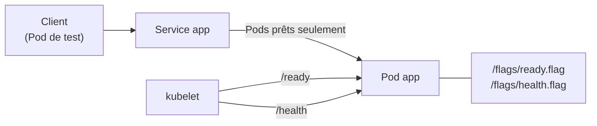

# Lab 9.1 : Probes

|                  |                                                                                                                                                   |
| ---------------- | ------------------------------------------------------------------------------------------------------------------------------------------------- |
| **Durée**        | 60 à 75 min                                                                                                                                       |
| **Niveau**       | Guidé                                                                                                                                             |
| **Prérequis**    | [Cours du chapitre 9](cours.md) lu, notions de ConfigMap (chapitre 4), de Service (chapitre 3) et de rolling update (chapitre 2), cluster `Ready` |
| **Acquis visés** | AA5                                                                                                                                               |

!!! abstract "Objectifs" - Constater qu'un Pod sans sonde peut recevoir du trafic alors qu'il ne peut pas servir - Configurer une sonde readiness et observer le retrait du Pod des endpoints - Configurer une sonde liveness et observer le redémarrage du conteneur - Observer qu'une sonde readiness bloque une mise à jour défectueuse - Utiliser une sonde startup pour une application lente à démarrer - Utiliser les mécanismes `tcpSocket` et `exec`, et définir les sondes d'une base PostgreSQL

## Contexte et schéma

Vous déployez une petite application dont vous pouvez **provoquer les pannes** en supprimant des fichiers « interrupteurs » dans le conteneur. Deux interrupteurs : l'un décide si l'application peut **servir** des requêtes, l'autre si elle est **vivante**.



| Chemin          | Comportement                                      |
| --------------- | ------------------------------------------------- |
| `/` et `/ready` | `200` si `/flags/ready.flag` existe, sinon `503`  |
| `/health`       | `200` si `/flags/health.flag` existe, sinon `500` |

## Étapes

### Étape 1 : Préparer le namespace et la configuration

```bash
k create namespace tp-k8s
k config set-context --current --namespace=tp-k8s

cat <<'EOF' > probe-conf.yaml
apiVersion: v1
kind: ConfigMap
metadata:
  name: probe-conf
data:
  default.conf: |
    server {
      listen 80;
      default_type text/plain;
      location = / {
        root /flags;
        try_files /ready.flag =503;
      }
      location = /ready {
        root /flags;
        try_files /ready.flag =503;
      }
      location = /health {
        root /flags;
        try_files /health.flag =500;
      }
    }
EOF
k apply -f probe-conf.yaml
```

!!! success "Point de contrôle" - [ ] Le ConfigMap `probe-conf` existe

### Étape 2 : Une application sans sonde

Déployez l'application (2 réplicas) et un Service, **sans aucune sonde** :

```bash
cat <<'EOF' > app-v1.yaml
apiVersion: apps/v1
kind: Deployment
metadata:
  name: app
spec:
  replicas: 2
  selector:
    matchLabels:
      app: app
  template:
    metadata:
      labels:
        app: app
    spec:
      containers:
        - name: web
          image: nginx:1.26-alpine
          env:
            - name: PRET
              value: "oui"
          command: ["sh", "-c", "mkdir -p /flags; [ \"$PRET\" = oui ] && echo 'application en service' > /flags/ready.flag; echo ok > /flags/health.flag; exec nginx -g 'daemon off;'"]
          volumeMounts:
            - name: conf
              mountPath: /etc/nginx/conf.d/default.conf
              subPath: default.conf
      volumes:
        - name: conf
          configMap:
            name: probe-conf
---
apiVersion: v1
kind: Service
metadata:
  name: app
spec:
  selector:
    app: app
  ports:
    - port: 80
EOF
k apply -f app-v1.yaml
k rollout status deployment/app
k get pods -o wide
k get endpoints app
```

Mesurez les réponses du Service avec dix requêtes :

```bash
k run test --rm -it --image=busybox:1.36 --restart=Never -- \
  sh -c 'for i in 1 2 3 4 5 6 7 8 9 10; do wget -q -T 2 -O /dev/null http://app && echo OK || echo ERREUR; done'
```

Tout est `OK`. Faites maintenant « tomber » l'application sur **un** Pod, en supprimant son interrupteur, puis recommencez :

```bash
POD=$(k get pods -l app=app -o jsonpath='{.items[0].metadata.name}')
echo $POD
k exec $POD -- rm /flags/ready.flag
k exec $POD -- wget -q -T 2 -O- http://localhost; echo
k get pods
k get endpoints app
k run test --rm -it --image=busybox:1.36 --restart=Never -- \
  sh -c 'for i in 1 2 3 4 5 6 7 8 9 10; do wget -q -T 2 -O /dev/null http://app && echo OK || echo ERREUR; done'
```

Le Pod défaillant reste `1/1` et dans les endpoints : environ la moitié des requêtes échouent.

!!! success "Point de contrôle" - [ ] Avec deux Pods sains, les dix requêtes réussissent - [ ] Le Pod défaillant reste `READY 1/1` et présent dans `k get endpoints app` - [ ] Une partie des requêtes (`ERREUR`) échouent

### Étape 3 : Ajouter une sonde readiness

Ajoutez une sonde readiness sur `/ready` :

```bash
sed 's|          volumeMounts:|          readinessProbe:\n            httpGet:\n              path: /ready\n              port: 80\n            periodSeconds: 5\n            failureThreshold: 2\n          volumeMounts:|' app-v1.yaml > app-v2.yaml
grep -A7 readinessProbe app-v2.yaml
k apply -f app-v2.yaml
k rollout status deployment/app
k get pods
```

Dans un **second terminal**, surveillez : `k get pods -w`. Dans le premier, faites tomber un Pod, puis observez :

```bash
POD=$(k get pods -l app=app -o jsonpath='{.items[0].metadata.name}')
k exec $POD -- rm /flags/ready.flag
sleep 12
k get pods
k get endpoints app
k describe pod $POD | grep -E "Readiness|Warning" | tail -n 3
k run test --rm -it --image=busybox:1.36 --restart=Never -- \
  sh -c 'for i in 1 2 3 4 5 6 7 8 9 10; do wget -q -T 2 -O /dev/null http://app && echo OK || echo ERREUR; done'
```

Le Pod passe à `0/1` (sans redémarrer), disparaît des endpoints, et toutes les requêtes réussissent. Rétablissez l'application :

```bash
k exec $POD -- sh -c "echo 'application en service' > /flags/ready.flag"
sleep 8
k get pods
k get endpoints app
```

!!! success "Point de contrôle" - [ ] Le Pod défaillant est passé à `READY 0/1` avec `RESTARTS` à 0 - [ ] Il a disparu des endpoints du Service et les dix requêtes ont réussi - [ ] Les événements mentionnent `Readiness probe failed` avec le code 503 - [ ] Après la remise du fichier, le Pod est revenu à `1/1` et dans les endpoints

### Étape 4 : Ajouter une sonde liveness

Ajoutez une sonde liveness sur `/health` :

```bash
sed 's|          volumeMounts:|          livenessProbe:\n            httpGet:\n              path: /health\n              port: 80\n            periodSeconds: 5\n            failureThreshold: 3\n          volumeMounts:|' app-v2.yaml > app-v3.yaml
k apply -f app-v3.yaml
k rollout status deployment/app
```

Dans le second terminal : `k get pods -w`. Dans le premier, supprimez l'interrupteur de vie d'un Pod :

```bash
POD=$(k get pods -l app=app -o jsonpath='{.items[0].metadata.name}')
k exec $POD -- rm /flags/health.flag
sleep 25
k get pods
k describe pod $POD | grep -E "Liveness|Killing|Started" | tail -n 5
```

Après environ 15 secondes (trois échecs espacés de 5 secondes), le conteneur est **redémarré** : la colonne `RESTARTS` passe à 1. Comme les fichiers sont recréés au démarrage du conteneur, l'application redevient saine.

!!! success "Point de contrôle" - [ ] `RESTARTS` est passé à 1 pour le Pod concerné - [ ] Les événements mentionnent un échec de la sonde liveness et le redémarrage du conteneur - [ ] Le Pod est de nouveau `1/1`

### Étape 5 : La readiness protège une mise à jour

Simulez une nouvelle version défectueuse : l'application démarre mais n'est jamais prête (la variable `PRET` à `non` empêche la création de l'interrupteur) :

```bash
sed 's|value: "oui"|value: "non"|' app-v3.yaml > app-v4.yaml
k apply -f app-v4.yaml
sleep 30
k rollout status deployment/app --timeout=20s
k get pods
k get endpoints app
k get replicaset
```

La mise à jour reste **bloquée** : le nouveau Pod est `0/1` et les anciens Pods restent disponibles et dans les endpoints. Vérifiez que le service répond toujours, puis revenez en arrière :

```bash
k run test --rm -it --image=busybox:1.36 --restart=Never -- \
  sh -c 'for i in 1 2 3 4 5; do wget -q -T 2 -O /dev/null http://app && echo OK || echo ERREUR; done'
k rollout undo deployment/app
k rollout status deployment/app
k get pods
```

!!! success "Point de contrôle" - [ ] Le nouveau Pod est resté `0/1` et la mise à jour ne s'est pas terminée - [ ] Les anciens Pods ont continué à répondre (aucun `ERREUR`) - [ ] Après `rollout undo`, les deux Pods sont `1/1`

### Étape 6 : Une application lente à démarrer

Ce Pod attend 40 secondes avant de lancer nginx, et sa sonde liveness est la même que précédemment :

```bash
cat <<'EOF' > lent-v1.yaml
apiVersion: v1
kind: Pod
metadata:
  name: lent-v1
spec:
  containers:
    - name: web
      image: nginx:1.26-alpine
      command: ["sh", "-c", "sleep 40; mkdir -p /flags; echo ok > /flags/ready.flag; echo ok > /flags/health.flag; exec nginx -g 'daemon off;'"]
      livenessProbe:
        httpGet:
          path: /health
          port: 80
        periodSeconds: 5
        failureThreshold: 3
      volumeMounts:
        - name: conf
          mountPath: /etc/nginx/conf.d/default.conf
          subPath: default.conf
  volumes:
    - name: conf
      configMap:
        name: probe-conf
EOF
k apply -f lent-v1.yaml
sleep 60
k get pod lent-v1
k describe pod lent-v1 | grep -E "Liveness|Killing" | tail -n 3
```

La sonde liveness échoue avant la fin du démarrage : le conteneur est tué avant d'être opérationnel, et `RESTARTS` augmente sans fin. Ajoutez une sonde **startup** qui laisse jusqu'à 60 secondes au démarrage :

```bash
k delete pod lent-v1
sed -e 's|name: lent-v1|name: lent-v2|' -e 's|      livenessProbe:|      startupProbe:\n        httpGet:\n          path: /health\n          port: 80\n        periodSeconds: 5\n        failureThreshold: 12\n      livenessProbe:|' lent-v1.yaml > lent-v2.yaml
k apply -f lent-v2.yaml
sleep 60
k get pod lent-v2
```

!!! success "Point de contrôle" - [ ] `lent-v1` a redémarré plusieurs fois et n'est jamais devenu prêt - [ ] `lent-v2` est `1/1` avec `RESTARTS` à 0 - [ ] Vous pouvez expliquer le rôle de `failureThreshold × periodSeconds` dans la sonde startup

### Étape 7 : Les mécanismes `tcpSocket` et `exec`, et une base PostgreSQL

Jusqu'ici, vous avez utilisé `httpGet`. Deux Pods nginx testent les deux autres mécanismes, avec des sondes volontairement erronées :

```bash
cat <<'EOF' > mecanismes.yaml
apiVersion: v1
kind: Pod
metadata:
  name: tcp-ko
spec:
  containers:
    - name: web
      image: nginx:1.26-alpine
      readinessProbe:
        tcpSocket:
          port: 81
        periodSeconds: 5
---
apiVersion: v1
kind: Pod
metadata:
  name: exec-ko
spec:
  containers:
    - name: web
      image: nginx:1.26-alpine
      readinessProbe:
        exec:
          command: ["cat", "/tmp/absent"]
        periodSeconds: 5
EOF
k apply -f mecanismes.yaml
sleep 20
k get pods tcp-ko exec-ko
k describe pod tcp-ko | grep -E "Unhealthy" | tail -n 1
k describe pod exec-ko | grep -E "Unhealthy" | tail -n 1
k delete -f mecanismes.yaml
```

Les deux Pods restent `0/1` avec `RESTARTS` à 0 : la sonde `tcpSocket` échoue (`connection refused`, le port 81 n'est pas ouvert) et la sonde `exec` échoue (code de sortie non nul). Passez à une base de données : sa readiness utilise `pg_isready`, sa liveness un simple test de port.

```bash
cat <<'EOF' > postgres.yaml
apiVersion: v1
kind: Pod
metadata:
  name: pg
spec:
  containers:
    - name: postgres
      image: postgres:16-alpine
      env:
        - name: POSTGRES_USER
          value: appuser
        - name: POSTGRES_PASSWORD
          value: ChangeMe-123
        - name: POSTGRES_DB
          value: appdb
      readinessProbe:
        exec:
          command: ["pg_isready", "-h", "127.0.0.1", "-U", "appuser", "-d", "appdb"]
        initialDelaySeconds: 5
        periodSeconds: 5
      livenessProbe:
        tcpSocket:
          port: 5432
        initialDelaySeconds: 30
        periodSeconds: 10
        failureThreshold: 3
      resources:
        requests:
          cpu: 100m
          memory: 128Mi
        limits:
          memory: 512Mi
EOF
k apply -f postgres.yaml
k get pod pg -w
```

Observez le passage de `0/1` à `1/1`, puis quittez avec `Ctrl+C` et nettoyez :

```bash
k exec pg -- pg_isready -h 127.0.0.1 -U appuser -d appdb
k delete pod pg
```

!!! note "Pourquoi `-h 127.0.0.1` ?"
Au premier démarrage, PostgreSQL lance d'abord un serveur temporaire qui n'écoute que sur un socket local, pour initialiser la base. Sans `-h`, `pg_isready` interroge ce socket et peut répondre « prêt » trop tôt. Avec `-h 127.0.0.1`, la sonde ne réussit qu'une fois le serveur définitif à l'écoute en TCP.

!!! success "Point de contrôle" - [ ] `tcp-ko` et `exec-ko` sont `0/1`, sans redémarrage, avec un message d'échec différent pour chacun - [ ] Le Pod `pg` passe à `1/1` une fois la base prête - [ ] Vous pouvez expliquer pourquoi la liveness de la base est un `tcpSocket`, et sa readiness un `pg_isready`

## Questions de réflexion

??? question "Pourquoi le Pod sans sonde recevait-il du trafic alors qu'il ne pouvait pas servir ?"
Sans sonde readiness, Kubernetes considère le Pod prêt dès que son conteneur tourne. Il reste donc dans les endpoints du Service, qui lui envoie des requêtes.

??? question "Pourquoi le Pod n'a-t-il pas redémarré quand la sonde readiness a échoué ?"
Une sonde readiness agit sur le trafic, pas sur le cycle de vie du conteneur : elle retire le Pod des endpoints. Seule la sonde liveness provoque un redémarrage.

??? question "Pourquoi les anciens Pods sont-ils restés disponibles pendant la mise à jour défectueuse ?"
Le Deployment n'avance que lorsque le nouveau Pod est prêt. Sa sonde readiness échouait : l'ancien ReplicaSet a donc conservé ses Pods, et le Service n'a envoyé du trafic qu'à eux.

??? question "Pourquoi `lent-v1` redémarrait-il sans fin, et comment la sonde startup règle-t-elle le problème ?"
La liveness commençait à tester dès le démarrage du conteneur et échouait avant la fin des 40 secondes d'attente. La sonde startup suspend la liveness (et la readiness) jusqu'à son premier succès, en tolérant jusqu'à `failureThreshold × periodSeconds` secondes.

??? question "Quelle sonde choisiriez-vous pour vérifier la connexion à la base de données, et pourquoi pas l'autre ?"
La readiness : sans base, le Pod cesse de recevoir du trafic, sans être redémarré. Une liveness dépendante de la base redémarrerait toutes les instances inutilement.

## Dépannage

| Symptôme                                                      | Pistes                                                                                                    |
| ------------------------------------------------------------- | --------------------------------------------------------------------------------------------------------- |
| Pod `CrashLoopBackOff` dès l'étape 2                          | `k logs <pod>` : erreur dans la configuration nginx (ConfigMap)                                           |
| `READY 0/1` après ajout de la readiness                       | `k describe pod` : chemin ou port de la sonde incorrect, `ready.flag` absent                              |
| `sed` n'a rien modifié                                        | Indentation différente : ouvrir le fichier `app-v2.yaml` et vérifier la présence du bloc `readinessProbe` |
| La requête du Pod de test échoue immédiatement                | Service sans endpoints : `k get endpoints app` ; les deux Pods sont-ils prêts ?                           |
| Le Pod ne redémarre pas après la suppression de `health.flag` | Attendre 15 à 20 secondes ; vérifier que la liveness est bien présente dans le Pod (`k describe pod`)     |
| `rollout status` ne s'interrompt pas                          | Ajouter `--timeout=20s` ; la mise à jour défectueuse est bloquée par conception                           |
| `k exec $POD` : Pod introuvable                               | Un Pod a été remplacé : relire `POD=$(k get pods ...)`                                                    |
| `lent-v2` redémarre                                           | Délai de démarrage plus long que `failureThreshold × periodSeconds` : augmenter `failureThreshold`        |
| `pg` en `0/1` pendant plusieurs dizaines de secondes          | Initialisation de la base en cours : patienter ; sinon `k logs pg`                                        |
| `pg` en `CrashLoopBackOff`                                    | `k logs pg` : variables d'environnement manquantes ou incorrectes                                         |
| `exec` : `executable file not found`                          | La commande de la sonde n'existe pas dans l'image : vérifier avec `k exec <pod> -- which <commande>`      |

## Nettoyage

```bash
k delete namespace tp-k8s
k config set-context --current --namespace=default
```
