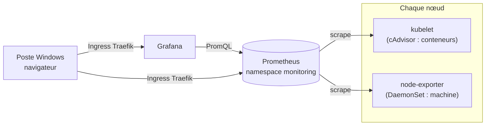

# Lab 9.2 : Monitoring

|                  |                                                                                                                                                                                                                                                                         |
| ---------------- | ----------------------------------------------------------------------------------------------------------------------------------------------------------------------------------------------------------------------------------------------------------------------- |
| **Durée**        | 75 à 90 min                                                                                                                                                                                                                                                             |
| **Niveau**       | Guidé                                                                                                                                                                                                                                                                   |
| **Prérequis**    | [Lab 9.1](lab-9-1-probes.md) réalisé, [cours du chapitre 9](cours.md) lu, notions de RBAC (chapitre 7), d'Ingress (chapitre 3) et de DaemonSet (chapitre 6), fichier `hosts` de Windows modifiable (voir [Environnement VMware](../../annexes/environnement-vmware.md)) |
| **Acquis visés** | AA5, AA6                                                                                                                                                                                                                                                                |

!!! abstract "Objectifs" - Lire la consommation des nœuds et des Pods avec `kubectl top` (metrics-server) - Déployer Prometheus et un exporter de nœuds (node-exporter) avec des manifestes - Interroger les métriques avec PromQL et les comparer à `kubectl top` - Définir des règles d'alerte et observer leur passage à l'état `Firing` - Construire un tableau de bord Grafana - Mesurer le coût d'une pile de supervision sur des VMs modestes

## Contexte et schéma

Vous mettez en place une supervision minimale du cluster. Pour rester léger et pédagogique, vous écrivez vous-même les manifestes de Prometheus, de node-exporter et de Grafana, au lieu d'installer une pile complète.



| Élément                    | Rôle dans ce lab                                                   |
| -------------------------- | ------------------------------------------------------------------ |
| metrics-server             | Vue instantanée avec `kubectl top` (déjà installé par k3s)         |
| Prometheus                 | Collecte, stocke 2 heures de métriques, évalue les règles d'alerte |
| node-exporter              | Métriques de chaque machine (CPU, mémoire, disque)                 |
| cAdvisor (dans le kubelet) | Métriques de chaque conteneur                                      |
| Grafana                    | Tableau de bord                                                    |

!!! warning "Ressources limitées"
Prometheus et Grafana consomment de la mémoire sur des VMs d'environ 2 Go. Les manifestes fixent des limites et une rétention de 2 heures. Surveillez `k top nodes` : si un nœud dépasse 85 % de mémoire, supprimez Grafana (étape 7) avant de continuer. **Supprimez toute la pile à la fin du lab** (nettoyage).

!!! note "En production"
La pile complète (Prometheus Operator, Alertmanager, kube-state-metrics, tableaux de bord prêts à l'emploi) s'installe avec un gestionnaire de paquets Kubernetes. Cette approche dépasse le programme de ce chapitre. Alertmanager n'est pas déployé ici : les règles d'alerte seront observées dans l'interface de Prometheus.

## Étapes

### Étape 1 : Metrics-server et `kubectl top`

```bash
k create namespace tp-k8s
k config set-context --current --namespace=tp-k8s

k top nodes
k top pods -A --sort-by=memory | head -n 10
k top pods -A --sort-by=cpu | head -n 10
```

Si `k top` répond que les métriques ne sont pas disponibles, patientez une minute. Relevez, pour chaque nœud, le pourcentage de CPU et de mémoire utilisé : c'est votre **état de référence** avant la pile de supervision.

Déployez ensuite une application qui consomme du CPU en continu, limitée à `200m` :

```bash
cat <<'EOF' > charge.yaml
apiVersion: apps/v1
kind: Deployment
metadata:
  name: charge
spec:
  replicas: 1
  selector:
    matchLabels:
      app: charge
  template:
    metadata:
      labels:
        app: charge
    spec:
      containers:
        - name: charge
          image: busybox:1.36
          command: ["sh", "-c", "while :; do :; done"]
          resources:
            requests:
              cpu: 100m
              memory: 16Mi
            limits:
              cpu: 200m
              memory: 32Mi
EOF
k apply -f charge.yaml
sleep 60
k top pods -n tp-k8s
k top nodes
```

!!! success "Point de contrôle" - [ ] Vous avez noté la consommation de chaque nœud avant la supervision - [ ] Le Pod `charge` consomme environ `200m` : la limite de CPU le plafonne

### Étape 2 : Déployer Prometheus

Créez le namespace, les droits d'accès et la configuration. Prometheus a besoin de lister les nœuds et d'interroger leur kubelet : un ServiceAccount, un ClusterRole et un ClusterRoleBinding le lui permettent.

```bash
k create namespace monitoring

cat <<'EOF' > prometheus-rbac.yaml
apiVersion: v1
kind: ServiceAccount
metadata:
  name: prometheus
  namespace: monitoring
---
apiVersion: rbac.authorization.k8s.io/v1
kind: ClusterRole
metadata:
  name: prometheus-tp
rules:
  - apiGroups: [""]
    resources: ["nodes", "nodes/metrics", "nodes/proxy"]
    verbs: ["get", "list", "watch"]
  - nonResourceURLs: ["/metrics"]
    verbs: ["get"]
---
apiVersion: rbac.authorization.k8s.io/v1
kind: ClusterRoleBinding
metadata:
  name: prometheus-tp
subjects:
  - kind: ServiceAccount
    name: prometheus
    namespace: monitoring
roleRef:
  kind: ClusterRole
  name: prometheus-tp
  apiGroup: rbac.authorization.k8s.io
EOF
k apply -f prometheus-rbac.yaml
```

La configuration définit trois « jobs » : Prometheus lui-même, les conteneurs (cAdvisor, via l'API Kubernetes) et les machines (node-exporter, port 9100 de chaque nœud). Les règles d'alerte sont dans un fichier séparé, vide pour le moment.

```bash
cat <<'EOF' > prometheus-conf.yaml
apiVersion: v1
kind: ConfigMap
metadata:
  name: prometheus-conf
  namespace: monitoring
data:
  prometheus.yml: |
    global:
      scrape_interval: 30s
      evaluation_interval: 30s
    rule_files:
      - /etc/prometheus/rules.yml
    scrape_configs:
      - job_name: prometheus
        static_configs:
          - targets: ["localhost:9090"]
      - job_name: cadvisor
        scheme: https
        tls_config:
          ca_file: /var/run/secrets/kubernetes.io/serviceaccount/ca.crt
        bearer_token_file: /var/run/secrets/kubernetes.io/serviceaccount/token
        kubernetes_sd_configs:
          - role: node
        relabel_configs:
          - target_label: __address__
            replacement: kubernetes.default.svc:443
          - source_labels: [__meta_kubernetes_node_name]
            regex: (.+)
            target_label: __metrics_path__
            replacement: /api/v1/nodes/${1}/proxy/metrics/cadvisor
          - source_labels: [__meta_kubernetes_node_name]
            target_label: node
      - job_name: node-exporter
        kubernetes_sd_configs:
          - role: node
        relabel_configs:
          - source_labels: [__meta_kubernetes_node_address_InternalIP]
            regex: (.+)
            target_label: __address__
            replacement: ${1}:9100
          - source_labels: [__meta_kubernetes_node_name]
            target_label: node
  rules.yml: |
    groups: []
EOF
k apply -f prometheus-conf.yaml
```

Déployez maintenant Prometheus, son Service et un Ingress :

```bash
cat <<'EOF' > prometheus.yaml
apiVersion: apps/v1
kind: Deployment
metadata:
  name: prometheus
  namespace: monitoring
spec:
  replicas: 1
  selector:
    matchLabels:
      app: prometheus
  template:
    metadata:
      labels:
        app: prometheus
    spec:
      serviceAccountName: prometheus
      containers:
        - name: prometheus
          image: prom/prometheus:v2.53.0
          args:
            - --config.file=/etc/prometheus/prometheus.yml
            - --storage.tsdb.path=/prometheus
            - --storage.tsdb.retention.time=2h
          ports:
            - containerPort: 9090
          readinessProbe:
            httpGet:
              path: /-/ready
              port: 9090
            periodSeconds: 10
          livenessProbe:
            httpGet:
              path: /-/healthy
              port: 9090
            initialDelaySeconds: 30
            periodSeconds: 10
          resources:
            requests:
              cpu: 100m
              memory: 200Mi
            limits:
              memory: 512Mi
          volumeMounts:
            - name: conf
              mountPath: /etc/prometheus
            - name: data
              mountPath: /prometheus
      volumes:
        - name: conf
          configMap:
            name: prometheus-conf
        - name: data
          emptyDir: {}
---
apiVersion: v1
kind: Service
metadata:
  name: prometheus
  namespace: monitoring
spec:
  selector:
    app: prometheus
  ports:
    - port: 9090
---
apiVersion: networking.k8s.io/v1
kind: Ingress
metadata:
  name: prometheus
  namespace: monitoring
spec:
  ingressClassName: traefik
  rules:
    - host: prometheus.k3s.local
      http:
        paths:
          - path: /
            pathType: Prefix
            backend:
              service:
                name: prometheus
                port:
                  number: 9090
EOF
k apply -f prometheus.yaml
k rollout status deployment/prometheus -n monitoring
k get pods -n monitoring
```

Sur le poste Windows, ajoutez à votre fichier `hosts` (en administrateur) une ligne avec l'adresse d'un nœud :

```text
<IP_NOEUD>  prometheus.k3s.local grafana.k3s.local
```

Ouvrez `http://prometheus.k3s.local`, puis le menu **Status → Targets**. Vous pouvez aussi tester avec `curl.exe` :

```bash
curl.exe -s -H "Host: prometheus.k3s.local" http://<IP_NOEUD>/-/ready
```

Les cibles `prometheus` et `cadvisor` (une par nœud) sont `UP`. Les cibles `node-exporter` sont `DOWN` : il reste à déployer l'exporter.

!!! success "Point de contrôle" - [ ] Le Pod `prometheus` est `1/1` - [ ] La page `Targets` affiche `prometheus` et les trois cibles `cadvisor` en `UP` - [ ] Les cibles `node-exporter` sont `DOWN` (message `connection refused`)

### Étape 3 : Déployer node-exporter

Un DaemonSet place un exporter sur chaque nœud. Il utilise le réseau du nœud (`hostNetwork`, port 9100) et lit les informations de la machine sur `/proc` et `/sys`.

```bash
cat <<'EOF' > node-exporter.yaml
apiVersion: apps/v1
kind: DaemonSet
metadata:
  name: node-exporter
  namespace: monitoring
spec:
  selector:
    matchLabels:
      app: node-exporter
  template:
    metadata:
      labels:
        app: node-exporter
    spec:
      hostNetwork: true
      hostPID: true
      containers:
        - name: node-exporter
          image: prom/node-exporter:v1.8.2
          args:
            - --path.procfs=/host/proc
            - --path.sysfs=/host/sys
            - --web.listen-address=:9100
          ports:
            - containerPort: 9100
              hostPort: 9100
          resources:
            requests:
              cpu: 20m
              memory: 32Mi
            limits:
              memory: 64Mi
          volumeMounts:
            - name: proc
              mountPath: /host/proc
              readOnly: true
            - name: sys
              mountPath: /host/sys
              readOnly: true
      volumes:
        - name: proc
          hostPath:
            path: /proc
        - name: sys
          hostPath:
            path: /sys
EOF
k apply -f node-exporter.yaml
k rollout status daemonset/node-exporter -n monitoring
k get pods -n monitoring -o wide
```

Attendez 30 à 60 secondes (un cycle de collecte), puis rechargez la page `Targets` : les trois cibles `node-exporter` passent à `UP`.

!!! success "Point de contrôle" - [ ] Un Pod `node-exporter` s'exécute sur chaque nœud - [ ] Les trois cibles `node-exporter` sont `UP`

### Étape 4 : Interroger avec PromQL

Dans l'interface Prometheus, onglet **Graph** (ou **Query**), saisissez les requêtes suivantes, une par une, et observez le résultat en mode **Table** puis **Graph** :

| Objectif                                     | Requête                                                                                         |
| -------------------------------------------- | ----------------------------------------------------------------------------------------------- |
| Cibles disponibles                           | `up`                                                                                            |
| Cibles en panne                              | `up == 0`                                                                                       |
| CPU utilisé par nœud (%)                     | `100 - (avg by (node) (rate(node_cpu_seconds_total{mode="idle"}[2m])) * 100)`                   |
| Mémoire disponible par nœud (%)              | `node_memory_MemAvailable_bytes / node_memory_MemTotal_bytes * 100`                             |
| CPU par Pod du namespace `tp-k8s` (en cœurs) | `sum by (pod) (rate(container_cpu_usage_seconds_total{namespace="tp-k8s", container!=""}[2m]))` |
| Mémoire par conteneur                        | `container_memory_working_set_bytes{namespace="tp-k8s", container!=""}`                         |

Comparez les valeurs avec celles de `kubectl top` :

```bash
k top nodes
k top pods -n tp-k8s
```

La requête sur le CPU par Pod doit afficher environ `0.2` pour le Pod `charge` (200 millicores). Pour les nœuds, les pourcentages sont proches de ceux de `kubectl top`, sans être identiques : les deux outils ne mesurent pas au même moment ni avec la même fenêtre.

!!! success "Point de contrôle" - [ ] `up` retourne 1 pour toutes les cibles - [ ] Le CPU du Pod `charge` est proche de 0,2 cœur - [ ] Vous avez comparé au moins une valeur de Prometheus avec `kubectl top`

### Étape 5 : Définir des règles d'alerte

Ajoutez deux règles : l'une signale un nœud injoignable, l'autre un Pod qui consomme plus de 0,15 cœur pendant une minute.

```bash
cat <<'EOF' > prometheus-conf.yaml
apiVersion: v1
kind: ConfigMap
metadata:
  name: prometheus-conf
  namespace: monitoring
data:
  prometheus.yml: |
    global:
      scrape_interval: 30s
      evaluation_interval: 30s
    rule_files:
      - /etc/prometheus/rules.yml
    scrape_configs:
      - job_name: prometheus
        static_configs:
          - targets: ["localhost:9090"]
      - job_name: cadvisor
        scheme: https
        tls_config:
          ca_file: /var/run/secrets/kubernetes.io/serviceaccount/ca.crt
        bearer_token_file: /var/run/secrets/kubernetes.io/serviceaccount/token
        kubernetes_sd_configs:
          - role: node
        relabel_configs:
          - target_label: __address__
            replacement: kubernetes.default.svc:443
          - source_labels: [__meta_kubernetes_node_name]
            regex: (.+)
            target_label: __metrics_path__
            replacement: /api/v1/nodes/${1}/proxy/metrics/cadvisor
          - source_labels: [__meta_kubernetes_node_name]
            target_label: node
      - job_name: node-exporter
        kubernetes_sd_configs:
          - role: node
        relabel_configs:
          - source_labels: [__meta_kubernetes_node_address_InternalIP]
            regex: (.+)
            target_label: __address__
            replacement: ${1}:9100
          - source_labels: [__meta_kubernetes_node_name]
            target_label: node
  rules.yml: |
    groups:
      - name: tp
        rules:
          - alert: NodeDown
            expr: up{job="node-exporter"} == 0
            for: 1m
            labels:
              severity: critical
            annotations:
              summary: "Nœud {{ $labels.node }} injoignable"
          - alert: PodCpuEleve
            expr: sum by (pod) (rate(container_cpu_usage_seconds_total{namespace="tp-k8s", container!=""}[1m])) > 0.15
            for: 1m
            labels:
              severity: warning
            annotations:
              summary: "Pod {{ $labels.pod }} : plus de 0,15 cœur depuis une minute"
EOF
k apply -f prometheus-conf.yaml
k rollout restart deployment/prometheus -n monitoring
k rollout status deployment/prometheus -n monitoring
```

Dans l'interface, ouvrez **Alerts**. Après environ deux minutes, l'alerte `PodCpuEleve` passe de `Inactive` à `Pending` puis à `Firing` pour le Pod `charge`, car il consomme environ 0,2 cœur. L'alerte `NodeDown` reste `Inactive`.

Faites cesser la cause de l'alerte, puis observez le retour à la normale :

```bash
k scale deployment charge --replicas=0
```

Après environ deux minutes, l'alerte repasse à `Inactive`.

!!! success "Point de contrôle" - [ ] Les deux règles apparaissent dans **Status → Rules** (ou **Alerts**) - [ ] `PodCpuEleve` est passée par `Pending` puis `Firing` - [ ] Elle est revenue à `Inactive` après l'arrêt de `charge` - [ ] Vous pouvez expliquer le rôle du champ `for`

### Étape 6 : Un tableau de bord Grafana

Déployez Grafana, avec Prometheus comme source de données déjà configurée :

```bash
cat <<'EOF' > grafana.yaml
apiVersion: v1
kind: Secret
metadata:
  name: grafana-admin
  namespace: monitoring
type: Opaque
stringData:
  GF_SECURITY_ADMIN_PASSWORD: "ChangeMe-123"
---
apiVersion: v1
kind: ConfigMap
metadata:
  name: grafana-datasource
  namespace: monitoring
data:
  datasource.yaml: |
    apiVersion: 1
    datasources:
      - name: Prometheus
        type: prometheus
        access: proxy
        url: http://prometheus.monitoring.svc:9090
        isDefault: true
---
apiVersion: apps/v1
kind: Deployment
metadata:
  name: grafana
  namespace: monitoring
spec:
  replicas: 1
  selector:
    matchLabels:
      app: grafana
  template:
    metadata:
      labels:
        app: grafana
    spec:
      containers:
        - name: grafana
          image: grafana/grafana:11.1.0
          envFrom:
            - secretRef:
                name: grafana-admin
          env:
            - name: GF_USERS_ALLOW_SIGN_UP
              value: "false"
          ports:
            - containerPort: 3000
          readinessProbe:
            httpGet:
              path: /api/health
              port: 3000
            periodSeconds: 10
          resources:
            requests:
              cpu: 100m
              memory: 128Mi
            limits:
              memory: 256Mi
          volumeMounts:
            - name: datasource
              mountPath: /etc/grafana/provisioning/datasources
      volumes:
        - name: datasource
          configMap:
            name: grafana-datasource
---
apiVersion: v1
kind: Service
metadata:
  name: grafana
  namespace: monitoring
spec:
  selector:
    app: grafana
  ports:
    - port: 3000
---
apiVersion: networking.k8s.io/v1
kind: Ingress
metadata:
  name: grafana
  namespace: monitoring
spec:
  ingressClassName: traefik
  rules:
    - host: grafana.k3s.local
      http:
        paths:
          - path: /
            pathType: Prefix
            backend:
              service:
                name: grafana
                port:
                  number: 3000
EOF
k apply -f grafana.yaml
k rollout status deployment/grafana -n monitoring
k top pods -n monitoring
k top nodes
```

Relancez la charge pour avoir des données à afficher :

```bash
k scale deployment charge --replicas=1
```

Ouvrez `http://grafana.k3s.local` (utilisateur `admin`, mot de passe `ChangeMe-123`), puis :

1. **Dashboards → New → New dashboard → Add visualization**, source `Prometheus` ;
2. dans le champ de requête, saisissez : `sum by (pod) (rate(container_cpu_usage_seconds_total{namespace="tp-k8s", container!=""}[2m]))` ;
3. donnez le titre « CPU par Pod », choisissez la visualisation **Time series** et validez avec **Apply** ;
4. ajoutez un second panneau avec : `100 - (avg by (node) (rate(node_cpu_seconds_total{mode="idle"}[2m])) * 100)` et le titre « CPU par nœud (%) » ;
5. enregistrez le tableau de bord sous le nom « Cluster TP ».

!!! success "Point de contrôle" - [ ] Grafana affiche la source `Prometheus` comme fonctionnelle (**Connections → Data sources**, bouton `Test`) - [ ] Vos deux panneaux affichent des courbes - [ ] Le Pod `charge` apparaît à environ 0,2 cœur dans le premier panneau

### Étape 7 : Mesurer le coût de la supervision

Comparez la consommation actuelle à votre état de référence de l'étape 1 :

```bash
k top nodes
k top pods -n monitoring
k describe node | grep -A8 "Allocated resources" | head -n 30
```

Calculez, à partir de `k top pods -n monitoring`, la mémoire totale utilisée par la pile de supervision. Si l'un de vos nœuds dépasse 85 % de mémoire, supprimez Grafana, qui est la partie la moins indispensable :

```bash
k delete deployment grafana -n monitoring
```

!!! success "Point de contrôle" - [ ] Vous avez noté la mémoire utilisée par Prometheus, Grafana et node-exporter - [ ] Vous avez comparé l'état des nœuds avant et après la supervision

## Questions de réflexion

??? question "Que vous apportent Prometheus et Grafana que `kubectl top` ne donne pas ?"
L'historique (courbes dans le temps), des mesures plus riches (réseau, disque, par conteneur, par nœud), un langage de requête pour les agréger, et des règles d'alerte. `kubectl top` ne donne que la valeur instantanée du CPU et de la mémoire.

??? question "Pourquoi les valeurs de `kubectl top` et de Prometheus sont-elles proches sans être identiques ?"
Les deux outils échantillonnent à des instants différents, sur des fenêtres de temps différentes, et ne calculent pas les valeurs de la même façon. Ils mesurent les mêmes compteurs du noyau, d'où l'ordre de grandeur identique.

??? question "À quoi sert le champ `for: 1m` d'une règle d'alerte ?"
Il impose que la condition reste vraie pendant une minute avant de déclencher l'alerte (état `Pending` puis `Firing`). Il évite les fausses alertes dues à un pic très bref.

??? question "Quel rôle jouerait Alertmanager, qui n'est pas déployé ici ?"
Prometheus évalue les règles et signale les alertes à Alertmanager, qui les regroupe, les déduplique et les envoie vers un canal de notification (courriel, messagerie). Sans lui, les alertes ne sont visibles que dans l'interface de Prometheus.

??? question "Pourquoi une alerte « consommation de CPU élevée » est-elle un mauvais exemple pour une alerte de production ?"
Un CPU élevé n'est pas toujours un problème pour les utilisateurs, et il n'appelle pas forcément d'action. Une bonne alerte signale un symptôme visible (taux d'erreurs, latence, indisponibilité) et déclenche une action précise. Ici, elle sert uniquement à illustrer le fonctionnement des règles.

??? question "Quelles informations utiles à un administrateur manquent encore dans cette pile ?"
L'état des objets Kubernetes (nombre de redémarrages, Pods non prêts, Deployments incomplets), fourni par kube-state-metrics, ainsi que la centralisation des logs et l'envoi de notifications.

## Dépannage

| Symptôme                                     | Pistes                                                                                                                 |
| -------------------------------------------- | ---------------------------------------------------------------------------------------------------------------------- |
| `k top` : métriques indisponibles            | Patienter 1 à 2 minutes ; vérifier le Pod metrics-server dans `kube-system`                                            |
| Pod `prometheus` en `CrashLoopBackOff`       | `k logs -n monitoring deploy/prometheus` : erreur de syntaxe YAML dans la configuration                                |
| Cibles `cadvisor` en `DOWN` (`403` ou `401`) | Droits insuffisants : vérifier le ClusterRole (`nodes/proxy`) et le ClusterRoleBinding                                 |
| Cibles `cadvisor` en `DOWN` (certificat)     | Vérifier `ca_file` et `bearer_token_file` dans la configuration                                                        |
| Cibles `node-exporter` en `DOWN`             | DaemonSet non démarré ou pare-feu `ufw` actif sur la VM (ouvrir 9100/tcp) ; `k get pods -n monitoring -o wide`         |
| La page Prometheus ou Grafana ne s'ouvre pas | Ligne du fichier `hosts` absente ou incorrecte ; tester avec `curl.exe -H "Host: ..."` ; `k get ingress -n monitoring` |
| Requête PromQL sans résultat                 | Attendre un cycle de collecte (30 s) ; vérifier le nom du namespace et les filtres `container!=""`                     |
| L'alerte ne s'affiche pas dans **Alerts**    | Règles non chargées : `k rollout restart deployment/prometheus -n monitoring` après modification de la ConfigMap       |
| Grafana : source de données en erreur        | URL `http://prometheus.monitoring.svc:9090` ; Pod `prometheus` prêt ?                                                  |
| Un nœud manque de mémoire                    | `k top nodes` ; supprimer Grafana (étape 7) ou réduire la rétention                                                    |

## Nettoyage

Supprimez toute la pile de supervision : elle consomme des ressources inutiles hors du lab.

```bash
k delete namespace monitoring
k delete clusterrolebinding prometheus-tp
k delete clusterrole prometheus-tp
k delete namespace tp-k8s
k config set-context --current --namespace=default
k top nodes
```

Le ClusterRole et le ClusterRoleBinding ne sont pas dans le namespace : ils doivent être supprimés séparément. Retirez aussi de votre fichier `hosts` Windows les noms `prometheus.k3s.local` et `grafana.k3s.local`.
