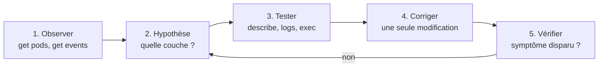

# Lab 9.3 : Dépannage

| | |
|---|---|
| **Durée** | 120 à 150 min (le ticket 10 est facultatif) |
| **Niveau** | Semi-guidé |
| **Prérequis** | [Lab 9.1](lab-9-1-probes.md) réalisé, [cours du chapitre 9](cours.md) lu (méthodologie de diagnostic), notions des chapitres 1 à 8, cluster à 3 nœuds `Ready` |
| **Acquis visés** | AA5, AA6 |

!!! abstract "Objectifs"
    - Appliquer la démarche : observer, formuler une hypothèse, tester, corriger, vérifier
    - Diagnostiquer les pannes les plus fréquentes : image, ressources, configuration, application, Service, réseau, sondes, quota
    - Choisir la bonne commande pour chaque symptôme (`get`, `describe`, `logs`, `events`, `exec`)
    - Corriger **une seule chose à la fois** et vérifier le résultat
    - Tenir un journal de diagnostic

## Contexte et schéma

Vous êtes l'administrateur de garde. Chaque **ticket** décrit un incident : vous recevez un symptôme, pas la cause. Vous déployez le manifeste du ticket, puis vous diagnostiquez et corrigez la panne **avec `kubectl`**.



!!! warning "Règles du lab"
    - **Ne relisez pas le fichier YAML du ticket pour y chercher la panne** : en situation réelle, vous n'avez pas le manifeste d'origine. Diagnostiquez à partir de l'état du cluster.
    - Corrigez avec `k edit`, `k patch`, `k set`, ou en modifiant l'objet puis en le réappliquant.
    - Après chaque ticket, notez dans votre **journal de diagnostic** : le symptôme, la commande qui a révélé la cause, la cause, la correction.
    - Les tickets sont indépendants : vous pouvez les traiter dans le désordre.

Modèle de journal (à recopier dans votre cahier ou un fichier) :

| Ticket | Symptôme | Commande qui a révélé la cause | Cause | Correction |
|---|---|---|---|---|
| 1 | | | | |

## Préparation

```bash
k create namespace tp-k8s
k config set-context --current --namespace=tp-k8s
k create secret generic db-credentials --from-literal=password='ChangeMe-123'
```

Rappel de quelques outils (voir le cours) :

| Besoin | Commande |
|---|---|
| Statut, nœud, adresse IP | `k get pods -o wide` |
| Événements récents | `k get events --sort-by=.metadata.creationTimestamp` |
| Détail et événements d'un objet | `k describe <type> <nom>` |
| Logs (dont après un crash) | `k logs <pod>` · `k logs <pod> --previous` |
| Test depuis l'intérieur du cluster | `k run test --rm -it --image=busybox:1.36 --restart=Never -- wget -T 3 -qO- http://<service>` |

## Tickets

### Ticket 1 : « Le site ne démarre pas »

**Symptôme :** le Deployment `site` devrait avoir 2 Pods en fonctionnement, mais aucun n'est prêt.

```bash
cat <<'EOF' > t1.yaml
apiVersion: apps/v1
kind: Deployment
metadata:
  name: site
spec:
  replicas: 2
  selector:
    matchLabels:
      app: site
  template:
    metadata:
      labels:
        app: site
    spec:
      containers:
        - name: web
          image: nginx:1.26-alpne
EOF
k apply -f t1.yaml
```

**À faire :** identifier la cause, corriger, et obtenir 2 Pods `1/1`.

??? tip "Indice"
    Regardez le statut des Pods, puis la section **Events** de `k describe pod`.

!!! success "Point de contrôle"
    - [ ] Deux Pods `site` sont `Running` (`1/1`)
    - [ ] Vous pouvez nommer la commande qui a donné la cause

### Ticket 2 : « Le calcul n'est jamais lancé »

**Symptôme :** le Pod du Deployment `calcul` reste indéfiniment dans le même état, sans jamais démarrer.

```bash
cat <<'EOF' > t2.yaml
apiVersion: apps/v1
kind: Deployment
metadata:
  name: calcul
spec:
  replicas: 1
  selector:
    matchLabels:
      app: calcul
  template:
    metadata:
      labels:
        app: calcul
    spec:
      containers:
        - name: calcul
          image: nginx:1.26-alpine
          resources:
            requests:
              cpu: "8"
              memory: 64Mi
EOF
k apply -f t2.yaml
```

**À faire :** trouver pourquoi le Pod n'est pas planifié, puis le faire démarrer **sans ajouter de nœud**. Justifiez la valeur retenue à l'aide de la capacité de vos nœuds.

??? tip "Indice"
    `k describe pod` indique ce que le scheduler a constaté. Pour la capacité d'un nœud : `k describe node | grep -A6 Allocatable`.

!!! success "Point de contrôle"
    - [ ] Le Pod `calcul` est `Running`
    - [ ] Votre nouvelle demande de CPU est réaliste au regard des nœuds

### Ticket 3 : « L'API refuse de démarrer »

**Symptôme :** le Pod du Deployment `api` n'atteint jamais l'état `Running`, bien que l'image se télécharge correctement.

```bash
cat <<'EOF' > t3.yaml
apiVersion: apps/v1
kind: Deployment
metadata:
  name: api
spec:
  replicas: 1
  selector:
    matchLabels:
      app: api
  template:
    metadata:
      labels:
        app: api
    spec:
      containers:
        - name: api
          image: nginx:1.26-alpine
          env:
            - name: DB_PASSWORD
              valueFrom:
                secretKeyRef:
                  name: db-credential
                  key: password
EOF
k apply -f t3.yaml
```

**À faire :** diagnostiquer et corriger **sans recréer le Secret**.

??? tip "Indice"
    Le statut du Pod nomme le type d'erreur. `k describe pod` en donne le détail, et `k get secret` liste ce qui existe réellement.

!!! success "Point de contrôle"
    - [ ] Le Pod `api` est `Running`
    - [ ] Le Secret `db-credentials` n'a pas été modifié

### Ticket 4 : « Le worker plante en boucle »

**Symptôme :** le Pod du Deployment `worker` démarre, puis s'arrête aussitôt et redémarre sans fin.

```bash
cat <<'EOF' > t4.yaml
apiVersion: v1
kind: ConfigMap
metadata:
  name: app-config
data:
  DBHOST: db
  DB_PORT: "5432"
---
apiVersion: apps/v1
kind: Deployment
metadata:
  name: worker
spec:
  replicas: 1
  selector:
    matchLabels:
      app: worker
  template:
    metadata:
      labels:
        app: worker
    spec:
      containers:
        - name: worker
          image: busybox:1.36
          command:
            - sh
            - -c
            - 'if [ -z "$DB_HOST" ]; then echo "ERREUR : variable DB_HOST non definie" >&2; exit 1; fi; echo "connexion a $DB_HOST:$DB_PORT"; sleep 3600'
          envFrom:
            - configMapRef:
                name: app-config
EOF
k apply -f t4.yaml
```

**À faire :** identifier la cause racine (le message du conteneur ne suffit pas : d'où vient la variable manquante ?), puis corriger **dans le ConfigMap**, et obtenir un Pod stable.

??? tip "Indice 1"
    `k logs` (avec `--previous` si besoin) donne l'erreur de l'application. Il faut ensuite comparer ce qu'elle attend avec ce que fournit le ConfigMap : `k get configmap app-config -o yaml`.

??? tip "Indice 2"
    Corriger le ConfigMap ne suffit pas pour un conteneur qui lit ses variables au démarrage : rappelez-vous le chapitre 4.

!!! success "Point de contrôle"
    - [ ] Le Pod `worker` est `Running` et affiche `connexion a db:5432` dans ses logs
    - [ ] Vous avez corrigé le ConfigMap, pas le Deployment

### Ticket 5 : « Le Service est muet »

**Symptôme :** les Pods `web` sont `Running 1/1`, mais le Service `web-svc` ne répond pas depuis un autre Pod.

```bash
cat <<'EOF' > t5.yaml
apiVersion: apps/v1
kind: Deployment
metadata:
  name: web
spec:
  replicas: 2
  selector:
    matchLabels:
      app: web
      tier: frontend
  template:
    metadata:
      labels:
        app: web
        tier: frontend
    spec:
      containers:
        - name: web
          image: nginx:1.26-alpine
---
apiVersion: v1
kind: Service
metadata:
  name: web-svc
spec:
  selector:
    app: web
    tier: front
  ports:
    - port: 80
EOF
k apply -f t5.yaml
k run test --rm -it --image=busybox:1.36 --restart=Never -- wget -T 3 -qO- http://web-svc
```

**À faire :** reproduire l'échec, trouver la cause, corriger le Service, puis prouver que le Service répond.

??? tip "Indice"
    Regardez les endpoints du Service, puis comparez le sélecteur du Service aux labels des Pods (`k get pods --show-labels`).

!!! success "Point de contrôle"
    - [ ] `k get endpoints web-svc` liste deux adresses
    - [ ] La requête de test renvoie la page d'accueil de nginx

### Ticket 6 : « Le Service répond… par une erreur »

**Symptôme :** le Service `catalogue-svc` a bien des endpoints, mais les requêtes échouent immédiatement.

```bash
cat <<'EOF' > t6.yaml
apiVersion: apps/v1
kind: Deployment
metadata:
  name: catalogue
spec:
  replicas: 2
  selector:
    matchLabels:
      app: catalogue
  template:
    metadata:
      labels:
        app: catalogue
    spec:
      containers:
        - name: web
          image: nginx:1.26-alpine
---
apiVersion: v1
kind: Service
metadata:
  name: catalogue-svc
spec:
  selector:
    app: catalogue
  ports:
    - port: 80
      targetPort: 8080
EOF
k apply -f t6.yaml
k run test --rm -it --image=busybox:1.36 --restart=Never -- wget -T 3 -qO- http://catalogue-svc
```

**À faire :** noter le message d'erreur exact, en déduire la cause, corriger, et vérifier. Comparez ce symptôme à celui du ticket 5 : qu'est-ce qui les distingue ?

??? tip "Indice"
    Une erreur immédiate de connexion (par opposition à un délai dépassé) indique que quelqu'un répond, mais que rien n'écoute sur ce port. Comparez `targetPort` du Service et le port réellement ouvert dans le conteneur.

!!! success "Point de contrôle"
    - [ ] La requête de test renvoie la page d'accueil de nginx
    - [ ] Vous savez expliquer la différence entre « connexion refusée » et « délai dépassé »

### Ticket 7 : « Le front n'atteint plus le back »

**Symptôme :** depuis le Pod `front`, les appels vers le Service `back` n'aboutissent jamais (ils restent sans réponse jusqu'au délai).

```bash
cat <<'EOF' > t7.yaml
apiVersion: apps/v1
kind: Deployment
metadata:
  name: front
spec:
  replicas: 1
  selector:
    matchLabels:
      app: front
  template:
    metadata:
      labels:
        app: front
        tier: frontend
    spec:
      containers:
        - name: web
          image: nginx:1.26-alpine
---
apiVersion: apps/v1
kind: Deployment
metadata:
  name: back
spec:
  replicas: 1
  selector:
    matchLabels:
      app: back
  template:
    metadata:
      labels:
        app: back
        tier: backend
    spec:
      containers:
        - name: web
          image: nginx:1.26-alpine
---
apiVersion: v1
kind: Service
metadata:
  name: back
spec:
  selector:
    app: back
  ports:
    - port: 80
---
apiVersion: networking.k8s.io/v1
kind: NetworkPolicy
metadata:
  name: allow-front-to-back
spec:
  podSelector:
    matchLabels:
      tier: backend
  policyTypes: ["Ingress"]
  ingress:
    - from:
        - podSelector:
            matchLabels:
              tier: fontend
      ports:
        - protocol: TCP
          port: 80
EOF
k apply -f t7.yaml
k rollout status deployment/front
k rollout status deployment/back
k exec deploy/front -- wget -T 3 -qO- http://back
```

**À faire :** montrer que le Service et ses endpoints sont corrects, identifier la cause réseau, corriger **sans supprimer la politique**, et vérifier que **seul** le `front` peut joindre le `back` (un Pod de test sans le label doit rester bloqué).

??? tip "Indice"
    Si le Service et les endpoints sont bons mais que l'appel expire, pensez aux NetworkPolicies : `k get networkpolicy`, `k describe networkpolicy`, puis comparez avec les labels des Pods (`--show-labels`).

!!! success "Point de contrôle"
    - [ ] `k exec deploy/front -- wget -T 3 -qO- http://back` réussit
    - [ ] Un Pod `busybox` de test, sans le label `tier: frontend`, reste bloqué
    - [ ] La politique d'origine existe toujours

### Ticket 8 : « Les Pods tournent, mais le service est indisponible »

**Symptôme :** les Pods du Deployment `shop` sont `Running`, mais le Service `shop-svc` ne répond pas et ne compte aucun endpoint.

```bash
cat <<'EOF' > t8.yaml
apiVersion: apps/v1
kind: Deployment
metadata:
  name: shop
spec:
  replicas: 2
  selector:
    matchLabels:
      app: shop
  template:
    metadata:
      labels:
        app: shop
    spec:
      containers:
        - name: web
          image: nginx:1.26-alpine
          readinessProbe:
            httpGet:
              path: /sante
              port: 80
            periodSeconds: 5
---
apiVersion: v1
kind: Service
metadata:
  name: shop-svc
spec:
  selector:
    app: shop
  ports:
    - port: 80
EOF
k apply -f t8.yaml
sleep 20
k get pods -l app=shop
k get endpoints shop-svc
```

**À faire :** expliquer pourquoi le sélecteur du Service est correct mais les endpoints sont vides, trouver la cause, corriger, et vérifier que le Service répond.

??? tip "Indice"
    Regardez la colonne `READY` des Pods et les événements de `k describe pod` : quel code HTTP la sonde reçoit-elle ?

!!! success "Point de contrôle"
    - [ ] Les deux Pods sont `1/1` et le Service a deux endpoints
    - [ ] La requête de test vers `shop-svc` renvoie la page d'accueil
    - [ ] Vous savez dire pourquoi les Pods n'ont pas été redémarrés

### Ticket 9 : « Il manque des réplicas »

**Symptôme :** le Deployment `batch` demande 4 réplicas, mais il n'en obtient que 2. Aucun Pod n'est en erreur.

```bash
k create namespace tp-quota
cat <<'EOF' > t9.yaml
apiVersion: v1
kind: ResourceQuota
metadata:
  name: quota
  namespace: tp-quota
spec:
  hard:
    pods: "2"
---
apiVersion: apps/v1
kind: Deployment
metadata:
  name: batch
  namespace: tp-quota
spec:
  replicas: 4
  selector:
    matchLabels:
      app: batch
  template:
    metadata:
      labels:
        app: batch
    spec:
      containers:
        - name: batch
          image: nginx:1.26-alpine
EOF
k apply -f t9.yaml
k get deployment batch -n tp-quota
k get pods -n tp-quota
```

**À faire :** trouver pourquoi les deux Pods manquants n'existent pas (aucun Pod n'est en erreur : où chercher ?), puis obtenir 4 Pods en fonctionnement. Précisez quelle décision vous avez prise et pourquoi (modifier la demande ou la limite).

??? tip "Indice"
    Le Deployment ne crée pas les Pods lui-même : regardez l'objet qui les crée, et ses événements (`k describe replicaset -n tp-quota`). Puis `k describe quota -n tp-quota`.

!!! success "Point de contrôle"
    - [ ] Quatre Pods `batch` sont `Running`
    - [ ] Vous avez trouvé le message `exceeded quota` dans les événements du ReplicaSet

### Ticket 10 (facultatif) : « Un nœud ne répond plus »

**Symptôme :** un nœud passe à `NotReady`. Vous devez le diagnostiquer, observer les conséquences pour les applications, puis le rétablir.

!!! warning "Précautions"
    Cet exercice arrête le service k3s d'un des serveurs. Avec 3 serveurs, le cluster conserve son quorum (voir le chapitre 8). Choisissez **un nœud autre que celui sur lequel vous travaillez**, et lancez vos commandes `kubectl` depuis un autre serveur.

```bash
k create deployment sentinelle --image=nginx:1.26-alpine --replicas=3
k get pods -l app=sentinelle -o wide
```

**À faire :**

1. sur le serveur choisi, arrêtez le service : `sudo systemctl stop k3s` ;
2. suivez l'état des nœuds (`k get nodes -w`) et notez le délai avant `NotReady` ;
3. identifiez, avec `k describe node <nœud>`, la condition qui a changé et la raison indiquée ;
4. observez le sort des Pods de `sentinelle` hébergés par ce nœud (le remplacement prend environ 5 minutes) ;
5. rétablissez le nœud : `sudo systemctl start k3s`, puis vérifiez `k get nodes` ;
6. consultez les journaux du service pour retrouver l'arrêt : `sudo journalctl -u k3s -n 20`.

!!! success "Point de contrôle"
    - [ ] Le nœud est passé à `NotReady`, avec une condition `Ready` à `Unknown` dans `describe node`
    - [ ] Vous avez observé le remplacement des Pods hébergés par ce nœud
    - [ ] Le nœud est de nouveau `Ready`

## Bilan

Complétez votre journal, puis répondez par écrit :

1. Classez les dix tickets par **couche** (image, ordonnancement, configuration, application, réseau, sondes, quota, nœud).
2. Pour chaque statut de Pod rencontré (`ImagePullBackOff`, `Pending`, `CreateContainerConfigError`, `CrashLoopBackOff`, `Running 0/1`), indiquez la **première commande** à lancer.
3. Quels tickets se ressemblaient (pour un utilisateur) mais avaient des causes différentes ? Comment les avez-vous distingués ?

## Questions de réflexion

??? question "Dans quel ordre vérifiez-vous un Service qui ne répond pas ?"
    D'abord les endpoints (liste vide : sélecteur ou Pods non prêts), puis le port et le `targetPort`, puis la résolution DNS depuis un Pod de test, puis les NetworkPolicies, et enfin l'Ingress si l'accès passe par lui.

??? question "Quelle différence de symptôme entre un `targetPort` erroné et une NetworkPolicy qui bloque ?"
    Avec un `targetPort` erroné, la connexion est refusée tout de suite : le Pod est joignable, mais rien n'écoute sur ce port. Avec une NetworkPolicy, les paquets sont abandonnés : la requête reste sans réponse jusqu'au délai.

??? question "Pourquoi aucun message d'erreur n'apparaît-il dans `k get pods` quand un quota est dépassé ?"
    Le refus a lieu à la création des Pods, par le ReplicaSet : il n'existe donc aucun Pod à afficher. L'erreur est dans les événements du ReplicaSet et dans `k describe quota`.

??? question "Pourquoi corriger une seule chose à la fois ?"
    Pour savoir quelle modification a réparé la panne (ou en a créé une autre), et pouvoir revenir en arrière. Plusieurs corrections simultanées empêchent d'identifier la cause racine.

??? question "Quels outils vous manquent encore pour dépanner en production ?"
    La centralisation des logs et des événements au-delà de leur durée de vie, l'historique des métriques (Prometheus), les alertes, et l'état des objets Kubernetes (par exemple le nombre de redémarrages) via kube-state-metrics.

## Dépannage du lab

| Symptôme | Pistes |
|---|---|
| `AlreadyExists` à la création d'un ticket | L'objet existe déjà : `k delete -f tN.yaml` puis `k apply -f tN.yaml` pour repartir à zéro |
| `field is immutable` | Certains champs d'un Deployment ou d'un Pod ne se modifient pas : supprimer l'objet, corriger le manifeste, le recréer |
| La correction ne change rien | Les Pods en cours ne sont pas recréés par un changement de ConfigMap : `k rollout restart deployment/<nom>` |
| Le Pod `test` existe déjà | `k delete pod test` |
| Ticket 7 : la requête réussit avant correction | Vérifier que la politique est bien appliquée (`k get networkpolicy`) et le contrôleur actif (chapitre 7) |
| Ticket 2 : le Pod démarre sans correction | Vos nœuds ont plus de 8 CPU : augmenter la demande dans le manifeste |
| Ticket 10 : `kubectl` ne répond plus | Vous avez arrêté le serveur utilisé par `kubectl` : redémarrez-le avec `sudo systemctl start k3s` (depuis la console de la VM) |

## Nettoyage

```bash
k delete namespace tp-quota
k delete namespace tp-k8s
k config set-context --current --namespace=default
```

Si vous avez réalisé le ticket 10, vérifiez que les trois nœuds sont `Ready` avant de continuer.