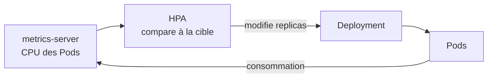
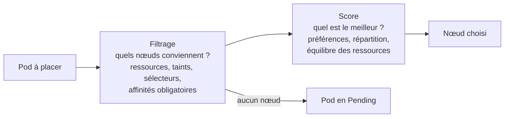
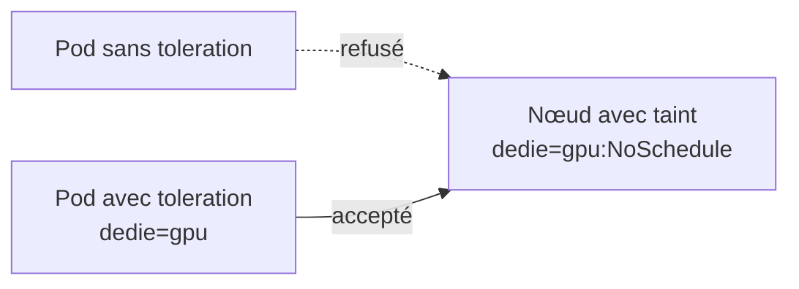
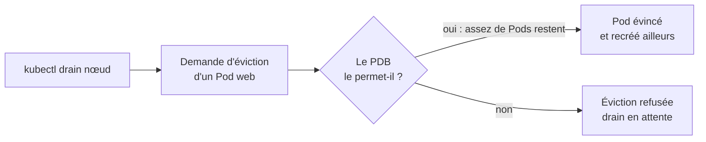

# Chapitre 10 : Autoscaling et scheduling

!!! abstract "Objectifs du chapitre"
    - Expliquer le fonctionnement du HorizontalPodAutoscaler et calculer le nombre de réplicas qu'il demande
    - Situer le VerticalPodAutoscaler et l'autoscaling des nœuds par rapport au HPA
    - Décrire comment le scheduler choisit un nœud (filtrage, puis score)
    - Placer des Pods avec `nodeSelector`, les affinités et les contraintes de répartition
    - Réserver ou protéger des nœuds avec les taints et les tolerations
    - Protéger la disponibilité d'une application pendant une maintenance avec un PodDisruptionBudget
    - Acquis d'apprentissage visé : **AA6**

## 1. Adapter l'application à la charge

Jusqu'ici, vous avez fixé le nombre de réplicas à la main. Une application réelle subit des pics et des creux : trop peu de réplicas, elle ralentit ; trop, vous gaspillez des ressources. Kubernetes propose deux familles d'outils :

| Famille | Question | Outils |
|---|---|---|
| **Autoscaling** | Combien de Pods, ou de quelle taille, faut-il maintenant ? | HPA, VPA, autoscaling de nœuds |
| **Scheduling** | Sur quel nœud chaque Pod doit-il (ou ne doit-il pas) s'exécuter ? | `nodeSelector`, affinités, taints, tolerations |

Un troisième outil, le **PodDisruptionBudget**, garantit une disponibilité minimale quand on vide un nœud (chapitre 8).

## 2. HorizontalPodAutoscaler (HPA)

Le **HPA** ajuste automatiquement le nombre de réplicas d'un Deployment (ou d'un StatefulSet) selon une métrique, le plus souvent le **CPU**. Il s'appuie sur **metrics-server** (chapitre 9), installé par k3s.



### Le calcul

À intervalle régulier (environ toutes les 15 secondes), le HPA applique la formule :

```text
réplicas souhaités = ceil( réplicas actuels × métrique actuelle / métrique cible )
```

Exemple : 2 réplicas, une utilisation moyenne de 80 % pour une cible de 50 % : `ceil(2 × 80 / 50) = ceil(3,2) = 4` réplicas. Le résultat est borné par `minReplicas` et `maxReplicas`. Si l'écart est faible (moins de 10 % environ), rien ne change.

!!! warning "L'utilisation se mesure par rapport aux `requests`"
    Une cible de 50 % signifie « 50 % du CPU **demandé** (`requests.cpu`) par le conteneur ». **Sans `requests` de CPU, le HPA ne peut pas fonctionner.** Des `requests` irréalistes faussent aussi le résultat (chapitre 4).

### Le manifeste

```yaml
apiVersion: autoscaling/v2
kind: HorizontalPodAutoscaler
metadata:
  name: web
spec:
  scaleTargetRef:
    apiVersion: apps/v1
    kind: Deployment
    name: web
  minReplicas: 2
  maxReplicas: 6
  metrics:
    - type: Resource
      resource:
        name: cpu
        target:
          type: Utilization
          averageUtilization: 50
  behavior:
    scaleDown:
      stabilizationWindowSeconds: 60
```

```bash
kubectl autoscale deployment web --cpu-percent=50 --min=2 --max=6
kubectl get hpa
kubectl describe hpa web
```

### Comportement dans le temps

| Sens | Comportement par défaut |
|---|---|
| **Augmentation** | Rapide : le HPA peut presque doubler le nombre de réplicas à chaque cycle |
| **Diminution** | Prudente : le HPA attend une **fenêtre de stabilisation de 300 secondes** avant de réduire, pour éviter les va-et-vient |

Le champ `behavior` permet de régler ces délais et la vitesse de variation. Il faut aussi tenir compte du **temps de réaction** : les métriques mettent environ une minute à refléter une hausse de charge, et un nouveau Pod n'est utile qu'une fois démarré et prêt (sondes, chapitre 9). L'autoscaling n'est **pas instantané**.

À retenir pour l'usage :

- le HPA gère le champ `replicas` : **ne le fixez plus dans le manifeste du Deployment** que vous réappliquez, sinon chaque `apply` le remet à cette valeur ;
- il ne peut pas dépasser la **capacité du cluster** : au-delà, les nouveaux Pods restent `Pending` (ressources insuffisantes, chapitre 4) ;
- le HPA fonctionne aussi sur la mémoire, et sur des métriques personnalisées via un composant supplémentaire (adaptateur de métriques), non étudié ici ;
- il convient aux applications **sans état** ou capables de monter en charge par réplication.

## 3. VerticalPodAutoscaler et autoscaling de nœuds (aperçu)

| Outil | Rôle | Remarques |
|---|---|---|
| **VPA** (Vertical Pod Autoscaler) | Recommande, ou ajuste, les `requests` et `limits` des conteneurs | **N'est pas fourni avec Kubernetes ni k3s** : composant à installer. Selon le mode, il se contente de recommander (`Off`) ou redémarre les Pods pour appliquer les nouvelles valeurs |
| **Cluster Autoscaler** | Ajoute ou retire des **nœuds** selon les Pods en attente | Suppose une infrastructure qui sait créer des machines à la demande (cloud, chapitre 13) : sans objet sur vos VMs |

Le VPA est utile pour **dimensionner** une application dont on ignore les besoins. On ne l'utilise pas avec le HPA sur la même métrique (CPU ou mémoire) : les deux se contrarieraient.

## 4. Le scheduler : comment un Pod trouve son nœud

Le **scheduler** (chapitre 1) place chaque nouveau Pod en deux temps :



1. **Filtrage** : élimine les nœuds qui ne peuvent pas accueillir le Pod (pas assez de CPU ou de mémoire non réservés, taint non toléré, règle obligatoire non respectée).
2. **Score** : classe les nœuds restants selon des préférences, puis choisit le meilleur.

Si aucun nœud ne passe le filtrage, le Pod reste en `Pending` : `kubectl describe pod` en donne la raison dans **Events** (`0/3 nodes are available: ...`).

## 5. Choisir où placer un Pod

### Labels de nœuds et `nodeSelector`

Les nœuds ont des **labels**, comme tous les objets. Certains sont posés par Kubernetes (`kubernetes.io/hostname`), d'autres par vous :

```bash
kubectl get nodes --show-labels
kubectl label node k3s-server2 disque=ssd
```

La forme la plus simple pour imposer un nœud est le `nodeSelector` :

```yaml
spec:
  nodeSelector:
    disque: ssd
```

### Affinité de nœud

L'**affinité de nœud** est plus expressive : opérateurs (`In`, `NotIn`, `Exists`...), règles obligatoires ou simplement préférées.

```yaml
spec:
  affinity:
    nodeAffinity:
      requiredDuringSchedulingIgnoredDuringExecution:      # obligatoire
        nodeSelectorTerms:
          - matchExpressions:
              - key: disque
                operator: In
                values: ["ssd"]
      preferredDuringSchedulingIgnoredDuringExecution:     # préférence
        - weight: 50
          preference:
            matchExpressions:
              - key: zone
                operator: In
                values: ["a"]
```

Les noms sont longs mais lisibles : **required** = condition du filtrage ; **preferred** = bonus au score ; **IgnoredDuringExecution** = une règle n'est vérifiée qu'au placement, un Pod déjà en cours n'est pas déplacé si les labels changent.

### Affinité et anti-affinité de Pods

Elles placent un Pod **par rapport à d'autres Pods**, au sein d'un domaine défini par `topologyKey` (par exemple un nœud, avec `kubernetes.io/hostname`).

| Besoin | Règle |
|---|---|
| Rapprocher deux composants (cache et application) | `podAffinity` |
| **Éviter** que deux réplicas soient sur le même nœud | `podAntiAffinity` |

```yaml
spec:
  affinity:
    podAntiAffinity:
      preferredDuringSchedulingIgnoredDuringExecution:
        - weight: 100
          podAffinityTerm:
            labelSelector:
              matchLabels:
                app: web
            topologyKey: kubernetes.io/hostname
```

Avec une règle **obligatoire** (`required...`), un réplica de plus que de nœuds reste `Pending`. La forme **préférée** reste souple.

### Contraintes de répartition

Les **`topologySpreadConstraints`** répartissent les Pods d'une application de façon équilibrée sur les nœuds (ou les zones) :

```yaml
spec:
  topologySpreadConstraints:
    - maxSkew: 1
      topologyKey: kubernetes.io/hostname
      whenUnsatisfiable: ScheduleAnyway
      labelSelector:
        matchLabels:
          app: web
```

`maxSkew: 1` signifie qu'entre deux nœuds, l'écart du nombre de Pods ne dépasse pas 1. Avec `DoNotSchedule`, la règle devient obligatoire.

## 6. Taints et tolerations

Les règles précédentes **attirent** des Pods vers des nœuds. Un **taint** fait l'inverse : il **repousse** les Pods d'un nœud, sauf ceux qui possèdent la **toleration** correspondante.



```bash
kubectl taint nodes k3s-server2 dedie=gpu:NoSchedule        # poser un taint
kubectl taint nodes k3s-server2 dedie=gpu:NoSchedule-       # le retirer (signe « - »)
kubectl describe node k3s-server2 | grep Taints
```

```yaml
spec:
  tolerations:
    - key: dedie
      operator: Equal
      value: gpu
      effect: NoSchedule
```

| Effet du taint | Conséquence pour les Pods sans toleration |
|---|---|
| `NoSchedule` | Aucun **nouveau** Pod n'est placé sur le nœud ; les Pods déjà présents restent |
| `PreferNoSchedule` | Le scheduler évite le nœud, sans l'interdire |
| `NoExecute` | Aucun nouveau Pod, et les Pods déjà présents sont **évincés** |

!!! warning "Une toleration n'attire pas"
    Une toleration **autorise** un Pod à aller sur un nœud tainté, elle ne l'y envoie pas. Pour **réserver** un nœud à certains Pods, on combine un **taint** (repousse les autres) et une **affinité ou un `nodeSelector`** (attire les bons Pods).

Kubernetes pose lui-même des taints quand un nœud est en difficulté : `node.kubernetes.io/not-ready` et `node.kubernetes.io/unreachable`, avec l'effet `NoExecute`. Chaque Pod reçoit automatiquement une toleration de **300 secondes** pour eux : c'est l'origine du délai d'environ 5 minutes avant l'évacuation des Pods d'un nœud en panne, vu au chapitre 8.

## 7. PodDisruptionBudget

On distingue deux types d'interruptions :

| Type | Exemples | Peut-on la contrôler ? |
|---|---|---|
| **Volontaire** | `kubectl drain`, mise à jour d'un nœud, évacuation par un outil | Oui : c'est le rôle du PodDisruptionBudget |
| **Involontaire** | Panne matérielle, plantage du noyau, nœud injoignable | Non |

Un **PodDisruptionBudget** (PDB) fixe le nombre minimal de Pods disponibles, ou le nombre maximal de Pods indisponibles, pendant les interruptions **volontaires** :

```yaml
apiVersion: policy/v1
kind: PodDisruptionBudget
metadata:
  name: web-pdb
spec:
  minAvailable: 2
  selector:
    matchLabels:
      app: web
```



On précise soit `minAvailable`, soit `maxUnavailable` (pas les deux). La colonne `ALLOWED DISRUPTIONS` de `kubectl get pdb` indique combien de Pods peuvent être évincés **maintenant**.

!!! warning "Un PDB trop strict bloque la maintenance"
    Avec 2 réplicas et `minAvailable: 2`, aucune éviction n'est jamais permise : `kubectl drain` attend indéfiniment. Un PDB ne protège que contre les évictions : il n'empêche pas un `kubectl delete pod`, ni une panne.

!!! tip "À retenir"
    - Le **HPA** ajuste le nombre de réplicas : `ceil(réplicas × actuel / cible)`, borné par `min` et `max`. Il exige des **`requests` de CPU**, et il n'est pas instantané.
    - Le **VPA** recommande ou ajuste les `requests`, il doit être installé ; le **Cluster Autoscaler** ajoute des nœuds (cloud).
    - Le scheduler **filtre**, puis **score** ; un Pod sans nœud valable reste `Pending`.
    - `nodeSelector` et **affinités** attirent ; **anti-affinité** et **topologySpreadConstraints** répartissent ; **taints** repoussent, **tolerations** autorisent.
    - Pour réserver un nœud : **taint** + **affinité**.
    - Un **PDB** protège la disponibilité pendant les interruptions **volontaires** ; trop strict, il bloque `drain`.

## Pour vérifier votre compréhension

??? question "Un HPA cible 50 % de CPU. Les 3 réplicas consomment en moyenne 100 % de leurs `requests`. Combien de réplicas demande-t-il ?"
    `ceil(3 × 100 / 50) = 6` réplicas, dans la limite de `maxReplicas`.

??? question "Pourquoi un HPA sur le CPU ne fonctionne-t-il pas si le conteneur n'a pas de `requests.cpu` ?"
    Le HPA calcule l'utilisation en pourcentage des `requests`. Sans `requests`, il n'a pas de référence et ne peut pas calculer l'utilisation.

??? question "Pourquoi le HPA réduit-il le nombre de réplicas beaucoup plus lentement qu'il ne l'augmente ?"
    Pour éviter les oscillations : une baisse de charge brève ne doit pas retirer des réplicas qu'il faudrait recréer aussitôt. La fenêtre de stabilisation est de 300 secondes par défaut.

??? question "Quelle différence entre un `nodeSelector` et un taint ?"
    Le `nodeSelector` est une règle portée par le Pod, qui l'oriente vers certains nœuds. Un taint est porté par le nœud et repousse les Pods qui ne le tolèrent pas.

??? question "Comment réserver un nœud à une application particulière ?"
    Poser un taint sur le nœud pour repousser les autres Pods, puis donner à l'application la toleration correspondante **et** une affinité (ou un `nodeSelector`) vers ce nœud, car la toleration seule n'attire pas.

??? question "Un `kubectl drain` reste bloqué avec le message d'une éviction refusée. Quelle cause et quelle vérification ?"
    Un PodDisruptionBudget interdit l'éviction (par exemple `minAvailable` égal au nombre de réplicas). Vérifier `kubectl get pdb` (colonne `ALLOWED DISRUPTIONS`) et ajuster le budget ou le nombre de réplicas.

## Labs du chapitre

- [Lab 10.1 : HPA](lab-10-1-hpa.md)
- [Lab 10.2 : Placement](lab-10-2-placement.md)