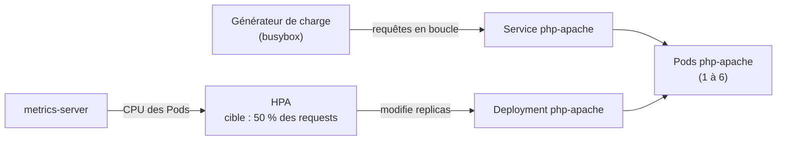

# Lab 10.1 : HPA

|                  |                                                                                                                                                                                                                                                                                                                                           |
| ---------------- | ----------------------------------------------------------------------------------------------------------------------------------------------------------------------------------------------------------------------------------------------------------------------------------------------------------------------------------------- |
| **Durée**        | 60 à 75 min                                                                                                                                                                                                                                                                                                                               |
| **Niveau**       | Guidé                                                                                                                                                                                                                                                                                                                                     |
| **Prérequis**    | [Lab 9.1](../ch09-observabilite-depannage/lab-9-1-probes.md) et [Lab 4.2](../../partie-2-configuration-donnees-securite/ch04-configuration-ressources/lab-4-2-maitriser-ressources.md) réalisés (sondes, `requests`/`limits`, `kubectl top`), [cours du chapitre 10](cours.md) lu, cluster `Ready`, deux terminaux ouverts sur un serveur |
| **Acquis visés** | AA6                                                                                                                                                                                                                                                                                                                                       |

!!! abstract "Objectifs" - Créer un HorizontalPodAutoscaler et lire son état (`TARGETS`, `REPLICAS`) - Diagnostiquer un HPA qui ne reçoit pas de métrique (absence de `requests`) - Observer la montée en charge, puis la réduction du nombre de réplicas - Vérifier un calcul du HPA avec la formule du cours - Régler la vitesse d'évolution avec `behavior` - Constater que le HPA reprend la main sur un réglage manuel

## Contexte et schéma

Vous déployez une application qui consomme du CPU à chaque requête, un générateur de charge qui lui envoie des requêtes en continu, et un HPA qui ajuste le nombre de réplicas.



!!! note "Image utilisée"
L'image `registry.k8s.io/hpa-example` vient du tutoriel officiel de Kubernetes sur le HPA. Elle ne publie pas de version fixe (on utilise donc son étiquette par défaut). C'est une **exception justifiée** pour un TP : en dehors d'un exercice, on épingle toujours une version précise.

## Étapes

### Étape 1 : Préparer le namespace

```bash
k create namespace tp-k8s
k config set-context --current --namespace=tp-k8s
k top nodes
```

Notez la consommation de départ des nœuds.

### Étape 2 : Déployer l'application

L'application déclare des `requests` de CPU : sans elles, le HPA ne peut pas calculer d'utilisation. Le champ `replicas` est **absent** du manifeste : c'est le HPA qui le gérera.

```bash
cat <<'EOF' > php-apache.yaml
apiVersion: apps/v1
kind: Deployment
metadata:
  name: php-apache
spec:
  selector:
    matchLabels:
      app: php-apache
  template:
    metadata:
      labels:
        app: php-apache
    spec:
      containers:
        - name: php-apache
          image: registry.k8s.io/hpa-example
          ports:
            - containerPort: 80
          resources:
            requests:
              cpu: 200m
            limits:
              cpu: 500m
---
apiVersion: v1
kind: Service
metadata:
  name: php-apache
spec:
  selector:
    app: php-apache
  ports:
    - port: 80
EOF
k apply -f php-apache.yaml
k rollout status deployment/php-apache
k get pods -o wide
k top pods
```

!!! success "Point de contrôle" - [ ] Un Pod `php-apache` est `Running` - [ ] `k top pods` indique une consommation proche de zéro

### Étape 3 : Créer le HPA

```bash
cat <<'EOF' > hpa.yaml
apiVersion: autoscaling/v2
kind: HorizontalPodAutoscaler
metadata:
  name: php-apache
spec:
  scaleTargetRef:
    apiVersion: apps/v1
    kind: Deployment
    name: php-apache
  minReplicas: 1
  maxReplicas: 6
  metrics:
    - type: Resource
      resource:
        name: cpu
        target:
          type: Utilization
          averageUtilization: 50
  behavior:
    scaleDown:
      stabilizationWindowSeconds: 60
EOF
k apply -f hpa.yaml
k get hpa php-apache
sleep 30
k get hpa php-apache
k describe hpa php-apache | tail -n 12
```

La colonne `TARGETS` affiche d'abord `<unknown>/50%` puis, après une trentaine de secondes, `0%/50%` : le HPA attend sa première mesure. Notez la valeur du champ `stabilizationWindowSeconds` : 60 secondes ici, au lieu de 300 par défaut, pour raccourcir le TP.

!!! success "Point de contrôle" - [ ] `TARGETS` affiche une valeur chiffrée (par exemple `0%/50%`) - [ ] `REPLICAS` vaut 1, entre `MINPODS` (1) et `MAXPODS` (6)

### Étape 4 : Diagnostiquer un HPA sans métrique

Déployez une application **sans `requests`** et placez un HPA devant, en ligne de commande :

```bash
k create deployment sans-requests --image=nginx:1.26-alpine
k autoscale deployment sans-requests --cpu-percent=50 --min=1 --max=3
sleep 40
k get hpa sans-requests
k describe hpa sans-requests | grep -E "AbleToScale|ScalingActive|FailedGetResourceMetric|missing" | head -n 6
```

`TARGETS` reste à `<unknown>`. Lisez la raison dans les conditions et les événements. Corrigez ensuite le Deployment :

```bash
k set resources deployment sans-requests --requests=cpu=50m
k rollout status deployment/sans-requests
sleep 40
k get hpa sans-requests
k delete hpa sans-requests
k delete deployment sans-requests
```

!!! success "Point de contrôle" - [ ] Vous avez lu dans `describe` que la métrique est indisponible faute de `requests` de CPU - [ ] Après correction, `TARGETS` affiche une valeur chiffrée

### Étape 5 : Monter en charge

Ouvrez deux terminaux sur le serveur. Dans le **terminal 2**, suivez le HPA :

```bash
k get hpa php-apache -w
```

Dans le **terminal 1**, lancez le générateur de charge et notez l'heure :

```bash
date
cat <<'EOF' > charge.yaml
apiVersion: apps/v1
kind: Deployment
metadata:
  name: charge
spec:
  replicas: 1
  selector:
    matchLabels:
      app: charge
  template:
    metadata:
      labels:
        app: charge
    spec:
      containers:
        - name: charge
          image: busybox:1.36
          command: ["sh", "-c", "while sleep 0.01; do wget -q -O- http://php-apache > /dev/null; done"]
EOF
k apply -f charge.yaml
```

Observez pendant 3 à 4 minutes : le pourcentage monte au-dessus de 50 %, puis `REPLICAS` augmente par paliers. Dans le terminal 1, suivez aussi les Pods et les décisions du HPA :

```bash
k get pods -l app=php-apache
k top pods -l app=php-apache
k describe hpa php-apache | grep -E "Events|SuccessfulRescale|New size"
```

Complétez le tableau suivant à partir de ce que vous observez :

| Heure | Utilisation moyenne | Réplicas |
| ----- | ------------------- | -------- |
| début |                     | 1        |
|       |                     |          |
|       |                     |          |

**Vérifiez le calcul** : prenez une ligne de votre tableau (réplicas actuels, utilisation, cible 50 %) et appliquez `ceil(réplicas × utilisation / 50)`. Comparez au nombre de réplicas demandé par le HPA à la décision suivante (champ `New size` dans les événements).

!!! success "Point de contrôle" - [ ] `REPLICAS` est monté de 1 à plusieurs réplicas, sans dépasser 6 - [ ] Vous avez retrouvé, au moins une fois, la valeur calculée avec la formule du cours - [ ] Les événements indiquent `SuccessfulRescale` avec une raison liée au CPU

### Étape 6 : Retour au calme

Arrêtez la charge et observez la réduction :

```bash
date
k scale deployment charge --replicas=0
```

Dans le terminal 2, surveillez `k get hpa php-apache -w`. Le HPA attend la fin de la fenêtre de stabilisation (60 secondes), puis réduit le nombre de réplicas jusqu'à `minReplicas`. Notez l'heure du retour à 1 réplica et comparez avec la durée de la montée à l'étape 5.

!!! success "Point de contrôle" - [ ] Après l'arrêt de la charge, `REPLICAS` est revenu à 1 - [ ] Vous avez noté le délai entre l'arrêt de la charge et le début de la réduction - [ ] Vous pouvez expliquer pourquoi la réduction n'est pas immédiate

### Étape 7 : Régler la vitesse avec `behavior`

Limitez la montée à **un Pod toutes les 30 secondes** :

```bash
k patch hpa php-apache --type merge -p '{"spec":{"behavior":{"scaleUp":{"policies":[{"type":"Pods","value":1,"periodSeconds":30}]}}}}'
k get hpa php-apache -o jsonpath='{.spec.behavior}'; echo
k scale deployment charge --replicas=2
date
```

Avec **deux** générateurs, la charge est plus forte. Suivez `k get hpa php-apache -w` pendant 3 minutes : le nombre de réplicas augmente désormais **d'un seul Pod à la fois**, alors que la charge justifierait un bond plus grand. Comparez avec l'étape 5. Arrêtez ensuite la charge :

```bash
k scale deployment charge --replicas=0
```

!!! success "Point de contrôle" - [ ] La montée est plus lente et régulière qu'à l'étape 5 - [ ] Vous pouvez décrire un cas où limiter la vitesse de montée est utile (et un cas où c'est dangereux)

### Étape 8 : Le HPA reprend la main

Attendez le retour à 1 réplica, puis forcez le nombre de réplicas à la main, sans charge :

```bash
k get deployment php-apache
k scale deployment php-apache --replicas=4
k get deployment php-apache
sleep 45
k get deployment php-apache
k describe hpa php-apache | grep -E "SuccessfulRescale|New size" | tail -n 2
```

Au bout de quelques dizaines de secondes, le HPA ramène le Deployment à `minReplicas` : le réglage manuel ne tient pas.

!!! success "Point de contrôle" - [ ] Le Deployment est revenu à 1 réplica sans intervention de votre part - [ ] Vous pouvez expliquer pourquoi il ne faut pas fixer `replicas` dans le manifeste d'un Deployment géré par un HPA

### Étape 9 (facultatif) : Atteindre la capacité du cluster

!!! warning "Exercice plus lourd"
Cette étape sature volontairement les nœuds. Réalisez-la seulement si les VMs ont de la marge (`k top nodes`), et supprimez la charge dès que demandé.

Demandez beaucoup de CPU par Pod (`requests` de 1 cœur) et autorisez davantage de réplicas :

```bash
k set resources deployment php-apache --requests=cpu=1 --limits=cpu=1
k patch hpa php-apache --type merge -p '{"spec":{"maxReplicas":10}}'
k scale deployment charge --replicas=3
sleep 150
k get hpa php-apache
k get pods -l app=php-apache
k describe pod -l app=php-apache | grep -E "FailedScheduling|Insufficient" | head -n 3
k scale deployment charge --replicas=0
```

Certains Pods restent `Pending` (`Insufficient cpu`) : le HPA demande plus de réplicas que le cluster ne peut en accueillir. Sur un cluster cloud, un Cluster Autoscaler ajouterait des nœuds ; ici, la limite est physique.

!!! success "Point de contrôle" - [ ] Au moins un Pod `php-apache` est `Pending`, avec `Insufficient cpu` dans les événements - [ ] Vous pouvez expliquer la différence entre la limite du HPA (`maxReplicas`) et la capacité du cluster

## Questions de réflexion

??? question "Pourquoi `TARGETS` affichait-il `<unknown>` au début, dans l'étape 3 comme dans l'étape 4 ?"
Dans l'étape 3, le HPA attend sa première mesure de metrics-server (quelques dizaines de secondes). Dans l'étape 4, la métrique n'était jamais disponible : sans `requests` de CPU, l'utilisation en pourcentage ne peut pas être calculée.

??? question "L'utilisation moyenne est de 90 % avec 2 réplicas, pour une cible de 50 %. Combien de réplicas le HPA demande-t-il ?"
`ceil(2 × 90 / 50) = ceil(3,6) = 4` réplicas.

??? question "Pourquoi la réduction du nombre de réplicas est-elle plus lente que la montée en charge ?"
Le HPA applique une fenêtre de stabilisation avant de réduire (300 s par défaut, 60 s ici) : une baisse brève ne doit pas retirer des réplicas qu'il faudrait recréer aussitôt. La montée, elle, doit être rapide pour absorber la charge.

??? question "Quels risques y a-t-il à limiter fortement la vitesse de montée avec `behavior` ?"
Une montée trop lente laisse l'application saturée pendant un pic de charge. À l'inverse, une vitesse trop élevée peut surcharger le cluster ou une base de données en aval.

??? question "Pourquoi n'a-t-on pas utilisé de `replicas` dans le manifeste du Deployment ?"
Le champ `replicas` appartient au HPA. S'il figurait dans le manifeste, chaque `kubectl apply` remettrait le Deployment à cette valeur, en contradiction avec l'autoscaling.

??? question "Un HPA est configuré avec `maxReplicas: 20`, mais le cluster n'a de place que pour 8 Pods. Que se passe-t-il, et que faut-il faire ?"
Le HPA demande 20 réplicas, 12 restent `Pending` faute de ressources. Il faut réduire les `requests`, ajouter de la capacité (nœuds), ou ajuster `maxReplicas` à ce que le cluster peut accueillir.

## Dépannage

| Symptôme                               | Pistes                                                                                                        |
| -------------------------------------- | ------------------------------------------------------------------------------------------------------------- |
| `TARGETS` reste à `<unknown>`          | `k describe hpa` : `requests` de CPU manquantes, ou metrics-server pas encore prêt (`k top pods` répond-il ?) |
| `ImagePullBackOff` sur `php-apache`    | Accès Internet des VMs ; `k describe pod` pour le détail                                                      |
| Le HPA ne monte jamais                 | Charge insuffisante : vérifier que le Pod `charge` tourne (`k logs deploy/charge`, `k top pods`)              |
| La charge échoue (`wget: bad address`) | Service `php-apache` absent ou mal nommé : `k get svc`                                                        |
| `REPLICAS` oscille                     | Fenêtre de stabilisation trop courte ou charge variable : augmenter `stabilizationWindowSeconds`              |
| Le HPA ne réduit pas                   | Charge encore présente (`k get pods -l app=charge`), ou fenêtre de stabilisation non écoulée                  |
| `k patch hpa` : erreur de syntaxe      | Guillemets du JSON : copier la commande telle quelle, entre apostrophes                                       |
| Pods `Pending`                         | `k describe pod` : `Insufficient cpu` ; capacité atteinte, voir l'étape 9                                     |
| Les VMs ralentissent                   | Arrêter la charge (`k scale deployment charge --replicas=0`), vérifier `k top nodes`                          |

## Nettoyage

```bash
k delete namespace tp-k8s
k config set-context --current --namespace=default
k top nodes
```

Arrêtez les surveillances `-w` avec `Ctrl+C` dans les deux terminaux. La suppression du namespace supprime le HPA, les Deployments et le générateur de charge.
