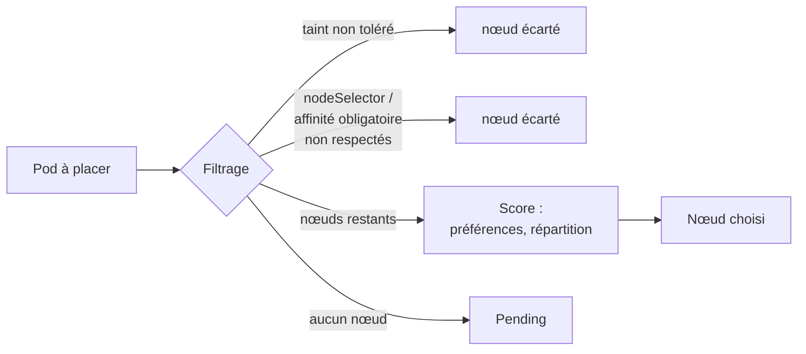

# Lab 10.2 : Placement

|                  |                                                                                                                                                                                                                           |
| ---------------- | ------------------------------------------------------------------------------------------------------------------------------------------------------------------------------------------------------------------------- |
| **Durée**        | 75 à 90 min                                                                                                                                                                                                               |
| **Niveau**       | Guidé                                                                                                                                                                                                                     |
| **Prérequis**    | [Lab 8.2](../ch08-administration-cluster/lab-8-2-sauvegarde-restauration-mise-a-jour.md) réalisé (`cordon`, `drain`), [Lab 10.1](lab-10-1-hpa.md) réalisé, [cours du chapitre 10](cours.md) lu, cluster à 3 nœuds `Ready` |
| **Acquis visés** | AA6                                                                                                                                                                                                                       |

!!! abstract "Objectifs" - Observer la répartition par défaut des Pods sur les nœuds - Imposer un nœud avec `nodeSelector` et diagnostiquer un Pod `Pending` - Utiliser l'affinité de nœud (obligatoire et préférée) - Répartir des réplicas avec l'anti-affinité de Pods et les contraintes de répartition - Repousser des Pods avec des taints, et réserver un nœud (taint, toleration et affinité) - Constater qu'un PodDisruptionBudget peut bloquer un `drain`

## Contexte et schéma

Vous jouez avec les labels et les taints des trois nœuds pour décider où les Pods s'exécutent. Les noms des nœuds sont mémorisés dans des variables, ce qui rend le lab indépendant de leurs noms réels.



!!! warning "Ce lab modifie les nœuds"
Vous ajoutez des labels et des taints aux nœuds. Le **nettoyage final** est indispensable : un taint oublié empêcherait les Pods des autres labs de s'exécuter sur ce nœud.

## Étapes

### Étape 1 : Préparer l'environnement

```bash
k create namespace tp-k8s
k config set-context --current --namespace=tp-k8s

k get nodes
NODES=($(k get nodes -o jsonpath='{.items[*].metadata.name}'))
N1=${NODES[0]}; N2=${NODES[1]}; N3=${NODES[2]}
echo "N1=$N1 N2=$N2 N3=$N3"

k get nodes --show-labels | cut -c1-200
for n in $N1 $N2 $N3; do echo "== $n"; k describe node $n | grep -E "Taints"; done
```

!!! note "Variables"
Les variables `N1`, `N2` et `N3` n'existent que dans ce terminal. Si vous en ouvrez un autre, relancez les trois lignes qui les définissent.

!!! success "Point de contrôle" - [ ] Trois nœuds `Ready`, et les variables `N1`, `N2`, `N3` contiennent leurs noms - [ ] Vous avez relevé les taints existants (en général `<none>`)

### Étape 2 : La répartition par défaut

Déployez six réplicas sans aucune contrainte :

```bash
cat <<'EOF' > web.yaml
apiVersion: apps/v1
kind: Deployment
metadata:
  name: web
spec:
  replicas: 6
  selector:
    matchLabels:
      app: web
  template:
    metadata:
      labels:
        app: web
    spec:
      containers:
        - name: web
          image: nginx:1.26-alpine
          resources:
            requests:
              cpu: 10m
              memory: 16Mi
EOF
k apply -f web.yaml
k rollout status deployment/web
k get pods -l app=web -o wide
k get pods -l app=web -o custom-columns=NODE:.spec.nodeName --no-headers | sort | uniq -c
```

Le scheduler équilibre naturellement les Pods sur les nœuds. Supprimez ce Deployment :

```bash
k delete deployment web
```

!!! success "Point de contrôle" - [ ] Les six Pods sont répartis sur plusieurs nœuds (idéalement deux par nœud)

### Étape 3 : `nodeSelector`

Posez un label sur le premier nœud, puis forcez un Deployment à s'y exécuter :

```bash
k label node $N1 disque=ssd

cat <<'EOF' > db.yaml
apiVersion: apps/v1
kind: Deployment
metadata:
  name: db
spec:
  replicas: 2
  selector:
    matchLabels:
      app: db
  template:
    metadata:
      labels:
        app: db
    spec:
      nodeSelector:
        disque: ssd
      containers:
        - name: db
          image: nginx:1.26-alpine
EOF
k apply -f db.yaml
k rollout status deployment/db
k get pods -l app=db -o wide
```

Les deux Pods sont sur `$N1`. Simulez maintenant une erreur de configuration : un sélecteur vers une valeur qui n'existe sur aucun nœud.

```bash
k patch deployment db -p '{"spec":{"template":{"spec":{"nodeSelector":{"disque":"nvme"}}}}}'
sleep 15
k get pods -l app=db -o wide
k describe pod -l app=db | grep -E "FailedScheduling" | head -n 2
```

Le nouveau Pod reste `Pending` et les anciens Pods continuent de fonctionner (rolling update, chapitre 2). Lisez le message du scheduler. Corrigez en créant le label manquant sur un nœud :

```bash
k label node $N2 disque=nvme
k rollout status deployment/db
k get pods -l app=db -o wide
```

!!! success "Point de contrôle" - [ ] Avec `disque=ssd`, les deux Pods étaient sur `$N1` - [ ] Avec `disque=nvme` absent, un Pod était `Pending` avec un message de non-correspondance au sélecteur - [ ] Après l'ajout du label sur `$N2`, le rollout s'est terminé et les Pods sont sur `$N2`

### Étape 4 : Affinité de nœud

Posez deux labels de zone sur les nœuds 2 et 3. Le nœud 1 n'a pas de label `zone`.

```bash
k label node $N2 zone=a
k label node $N3 zone=b

cat <<'EOF' > app-zone.yaml
apiVersion: apps/v1
kind: Deployment
metadata:
  name: app-zone
spec:
  replicas: 4
  selector:
    matchLabels:
      app: app-zone
  template:
    metadata:
      labels:
        app: app-zone
    spec:
      affinity:
        nodeAffinity:
          requiredDuringSchedulingIgnoredDuringExecution:
            nodeSelectorTerms:
              - matchExpressions:
                  - key: zone
                    operator: In
                    values: ["a", "b"]
          preferredDuringSchedulingIgnoredDuringExecution:
            - weight: 100
              preference:
                matchExpressions:
                  - key: zone
                    operator: In
                    values: ["a"]
      containers:
        - name: web
          image: nginx:1.26-alpine
          resources:
            requests:
              cpu: 10m
              memory: 16Mi
EOF
k apply -f app-zone.yaml
k rollout status deployment/app-zone
k get pods -l app=app-zone -o custom-columns=NODE:.spec.nodeName --no-headers | sort | uniq -c
```

Aucun Pod n'est sur `$N1` (règle **obligatoire**) et la plupart sont sur `$N2` (zone `a`, règle **préférée**). Constatez ensuite que la règle n'est vérifiée qu'au placement :

```bash
k label node $N2 zone-
sleep 10
k get pods -l app=app-zone -o custom-columns=NODE:.spec.nodeName --no-headers | sort | uniq -c
k label node $N2 zone=a
```

!!! success "Point de contrôle" - [ ] Aucun Pod `app-zone` sur `$N1` - [ ] La majorité des Pods sur `$N2` - [ ] Après suppression du label `zone` de `$N2`, les Pods déjà en place n'ont pas bougé (`IgnoredDuringExecution`)

### Étape 5 : Anti-affinité et répartition

**Anti-affinité obligatoire.** Un réplica par nœud au maximum :

```bash
cat <<'EOF' > web-ha.yaml
apiVersion: apps/v1
kind: Deployment
metadata:
  name: web-ha
spec:
  replicas: 3
  selector:
    matchLabels:
      app: web-ha
  template:
    metadata:
      labels:
        app: web-ha
    spec:
      affinity:
        podAntiAffinity:
          requiredDuringSchedulingIgnoredDuringExecution:
            - labelSelector:
                matchLabels:
                  app: web-ha
              topologyKey: kubernetes.io/hostname
      containers:
        - name: web
          image: nginx:1.26-alpine
          resources:
            requests:
              cpu: 10m
              memory: 16Mi
EOF
k apply -f web-ha.yaml
k rollout status deployment/web-ha
k get pods -l app=web-ha -o wide
k scale deployment web-ha --replicas=4
sleep 10
k get pods -l app=web-ha
k describe pod -l app=web-ha | grep -E "FailedScheduling" | head -n 1
```

Avec 3 nœuds et 3 réplicas, chaque nœud en héberge un. Le **quatrième** réplica reste `Pending` : la règle obligatoire interdit de partager un nœud. Remplacez-la par une **contrainte de répartition** souple :

```bash
cat <<'EOF' > web-spread.yaml
apiVersion: apps/v1
kind: Deployment
metadata:
  name: web-spread
spec:
  replicas: 4
  selector:
    matchLabels:
      app: web-spread
  template:
    metadata:
      labels:
        app: web-spread
    spec:
      topologySpreadConstraints:
        - maxSkew: 1
          topologyKey: kubernetes.io/hostname
          whenUnsatisfiable: ScheduleAnyway
          labelSelector:
            matchLabels:
              app: web-spread
      containers:
        - name: web
          image: nginx:1.26-alpine
          resources:
            requests:
              cpu: 10m
              memory: 16Mi
EOF
k apply -f web-spread.yaml
k rollout status deployment/web-spread
k get pods -l app=web-spread -o custom-columns=NODE:.spec.nodeName --no-headers | sort | uniq -c
k delete deployment web-ha web-spread
```

Les quatre Pods se répartissent en `2 / 1 / 1`.

!!! success "Point de contrôle" - [ ] `web-ha` : un Pod par nœud, et le quatrième réplica reste `Pending` avec un message sur l'anti-affinité - [ ] `web-spread` : les quatre Pods sont placés, avec un écart d'au plus 1 entre les nœuds

### Étape 6 : Taints et tolerations

Posez un taint sur le nœud 3 :

```bash
k taint nodes $N3 dedie=batch:NoSchedule
k describe node $N3 | grep Taints
k create deployment normal --image=nginx:1.26-alpine --replicas=6
k rollout status deployment/normal
k get pods -l app=normal -o custom-columns=NODE:.spec.nodeName --no-headers | sort | uniq -c
```

Aucun Pod `normal` n'a été placé sur `$N3`. Les Pods **déjà présents** sur ce nœud (par exemple ceux de `app-zone`) n'ont pas été évincés : `NoSchedule` n'agit que sur les nouveaux Pods.

Donnez maintenant une toleration à un Deployment, sans autre règle :

```bash
cat <<'EOF' > batch-tol.yaml
apiVersion: apps/v1
kind: Deployment
metadata:
  name: batch-tol
spec:
  replicas: 6
  selector:
    matchLabels:
      app: batch-tol
  template:
    metadata:
      labels:
        app: batch-tol
    spec:
      tolerations:
        - key: dedie
          operator: Equal
          value: batch
          effect: NoSchedule
      containers:
        - name: web
          image: nginx:1.26-alpine
          resources:
            requests:
              cpu: 10m
              memory: 16Mi
EOF
k apply -f batch-tol.yaml
k rollout status deployment/batch-tol
k get pods -l app=batch-tol -o custom-columns=NODE:.spec.nodeName --no-headers | sort | uniq -c
```

Certains Pods peuvent être sur `$N3`, mais pas tous : la toleration **autorise** le nœud, elle ne l'impose pas. Pour **réserver** `$N3` à ces Pods, ajoutez un label au nœud et un `nodeSelector` dans le Deployment :

```bash
k label node $N3 dedie=batch
k patch deployment batch-tol -p '{"spec":{"template":{"spec":{"nodeSelector":{"dedie":"batch"}}}}}'
k rollout status deployment/batch-tol
k get pods -l app=batch-tol -o custom-columns=NODE:.spec.nodeName --no-headers | sort | uniq -c
```

Tous les Pods `batch-tol` sont désormais sur `$N3`, et aucun autre Pod n'y arrive. Retirez enfin le taint pour terminer cette étape :

```bash
k taint nodes $N3 dedie=batch:NoSchedule-
k describe node $N3 | grep Taints
k delete deployment normal batch-tol
```

!!! success "Point de contrôle" - [ ] Aucun Pod `normal` n'a été placé sur `$N3` pendant que le taint existait - [ ] Avec la toleration seule, les Pods `batch-tol` n'étaient pas tous sur `$N3` - [ ] Avec le taint, la toleration **et** le `nodeSelector`, ils y sont tous - [ ] Le taint est retiré (`Taints: <none>`)

### Étape 7 (facultatif) : L'effet `NoExecute`

!!! warning "Perturbation brève"
Un taint `NoExecute` évince **tous** les Pods du nœud qui ne le tolèrent pas, y compris des Pods système (DNS, Traefik...). Ils sont recréés sur d'autres nœuds en quelques secondes. Retirez le taint dans la minute qui suit.

```bash
k create deployment evincables --image=nginx:1.26-alpine --replicas=6
k rollout status deployment/evincables
k get pods -l app=evincables -o wide
k taint nodes $N2 urgence=oui:NoExecute
sleep 15
k get pods -l app=evincables -o wide
k taint nodes $N2 urgence=oui:NoExecute-
k delete deployment evincables
```

!!! success "Point de contrôle" - [ ] Les Pods de `$N2` ont été supprimés puis recréés sur d'autres nœuds - [ ] Le taint `urgence` est retiré

### Étape 8 : PodDisruptionBudget et `drain`

Déployez une application critique à 3 réplicas, protégée par un budget qui n'autorise **aucune** indisponibilité :

```bash
cat <<'EOF' > critique.yaml
apiVersion: apps/v1
kind: Deployment
metadata:
  name: critique
spec:
  replicas: 3
  selector:
    matchLabels:
      app: critique
  template:
    metadata:
      labels:
        app: critique
    spec:
      containers:
        - name: web
          image: nginx:1.26-alpine
          resources:
            requests:
              cpu: 10m
              memory: 16Mi
---
apiVersion: policy/v1
kind: PodDisruptionBudget
metadata:
  name: critique-pdb
spec:
  minAvailable: 3
  selector:
    matchLabels:
      app: critique
EOF
k apply -f critique.yaml
k rollout status deployment/critique
k get pdb
k get pods -l app=critique -o wide
```

La colonne `ALLOWED DISRUPTIONS` vaut `0`. Tentez de vider un nœud qui héberge un de ces Pods :

```bash
NODE=$(k get pod -l app=critique -o jsonpath='{.items[0].spec.nodeName}')
echo $NODE
k drain $NODE --ignore-daemonsets --delete-emptydir-data --timeout=40s
```

Le `drain` affiche `Cannot evict pod as it would violate the pod's disruption budget`, réessaie, puis abandonne au bout de 40 secondes. Le nœud reste isolé (`SchedulingDisabled`). Assouplissez le budget, puis relancez :

```bash
k delete pdb critique-pdb
cat <<'EOF' > critique-pdb.yaml
apiVersion: policy/v1
kind: PodDisruptionBudget
metadata:
  name: critique-pdb
spec:
  maxUnavailable: 1
  selector:
    matchLabels:
      app: critique
EOF
k apply -f critique-pdb.yaml
k get pdb
k drain $NODE --ignore-daemonsets --delete-emptydir-data --timeout=90s
k get pods -l app=critique -o wide
k uncordon $NODE
k get nodes
```

!!! success "Point de contrôle" - [ ] Avec `minAvailable: 3`, le `drain` a été bloqué et a affiché le message de budget - [ ] Avec `maxUnavailable: 1`, le `drain` a abouti et les Pods ont été recréés sur d'autres nœuds - [ ] Le nœud est de nouveau `Ready` et planifiable après `uncordon`

## Questions de réflexion

??? question "Quelle différence entre `nodeSelector` et une affinité de nœud « obligatoire » ?"
Les deux imposent un filtre sur les nœuds. L'affinité est plus expressive (opérateurs `In`, `NotIn`, `Exists`...) et permet aussi des règles simplement préférées, ce que `nodeSelector` ne fait pas.

??? question "Pourquoi les Pods déjà placés n'ont-ils pas bougé quand vous avez retiré le label `zone` du nœud ?"
Les règles d'affinité sont vérifiées au moment du placement (`IgnoredDuringExecution`). Un Pod en cours d'exécution n'est pas déplacé si les labels du nœud changent.

??? question "Pourquoi le quatrième réplica de `web-ha` restait-il `Pending` ?"
L'anti-affinité obligatoire interdit deux Pods du même Deployment sur un nœud, et il n'y a que trois nœuds. Une règle souple (anti-affinité préférée, ou contrainte de répartition) aurait permis le placement.

??? question "Pourquoi une toleration seule ne suffit-elle pas à réserver un nœud ?"
Elle autorise un Pod à aller sur un nœud tainté, mais ne l'y attire pas. Pour réserver le nœud, on combine le taint (qui repousse les autres) avec un `nodeSelector` ou une affinité (qui attire les bons Pods).

??? question "Qu'est-ce qui distingue `NoSchedule` de `NoExecute` ?"
`NoSchedule` n'empêche que le placement de nouveaux Pods, ceux qui sont déjà là restent. `NoExecute` évince en plus les Pods en cours d'exécution qui ne tolèrent pas le taint.

??? question "Votre `drain` reste bloqué à cause d'un PodDisruptionBudget. Comment diagnostiquer et que décidez-vous ?"
`k get pdb` montre `ALLOWED DISRUPTIONS` à 0. Selon le besoin, on augmente le nombre de réplicas, on assouplit le budget (par exemple `maxUnavailable: 1`), ou on attend que des Pods supplémentaires soient prêts. Supprimer le budget sans réflexion supprime la protection de la disponibilité.

## Dépannage

| Symptôme                                                       | Pistes                                                                                                                             |
| -------------------------------------------------------------- | ---------------------------------------------------------------------------------------------------------------------------------- |
| `N1`, `N2` ou `N3` vides                                       | Nouveau terminal : relancer les lignes de l'étape 1 ; vérifier que le cluster compte bien trois nœuds                              |
| Pod `Pending`                                                  | `k describe pod` : `didn't match Pod's node affinity/selector`, `taint`, `anti-affinity` ou `Insufficient cpu/memory` selon le cas |
| Le label n'est pas pris en compte                              | `k get nodes --show-labels \| grep <label>` ; attention aux fautes de frappe dans la clé et la valeur                              |
| Un Deployment ne se met pas à jour après correction d'un label | `k rollout status` ; le scheduler réessaie périodiquement, patienter une minute                                                    |
| Les Pods sont tous sur un seul nœud (étape 2)                  | Un nœud a été planifiable plus tôt, ou un taint ou un `cordon` subsiste : `k get nodes`, `k describe node \| grep Taints`          |
| `drain` : `cannot delete Pods not managed by ...`              | Pod sans contrôleur : le supprimer à la main ou ajouter `--force` (avec précaution)                                                |
| `drain` : `cannot delete DaemonSet-managed Pods`               | Ajouter `--ignore-daemonsets`                                                                                                      |
| `label ... not found` au nettoyage                             | Le label n'existait pas : sans conséquence                                                                                         |
| Un nœud reste `SchedulingDisabled`                             | `k uncordon <nœud>`                                                                                                                |

## Nettoyage

Retirez les labels et les taints posés pendant le lab, puis supprimez le namespace :

```bash
k label node $N1 disque-
k label node $N2 disque- zone-
k label node $N3 zone- dedie-
k taint nodes $N3 dedie=batch:NoSchedule-
k taint nodes $N2 urgence=oui:NoExecute-
k uncordon $N1 ; k uncordon $N2 ; k uncordon $N3
k delete namespace tp-k8s
k config set-context --current --namespace=default
for n in $N1 $N2 $N3; do echo "== $n"; k describe node $n | grep -E "Taints"; done
k get nodes
```

Les messages « label not found » ou « taint not found » sont sans conséquence. Vérifiez que les trois nœuds sont `Ready`, sans taint, et que l'option `SchedulingDisabled` a disparu.
