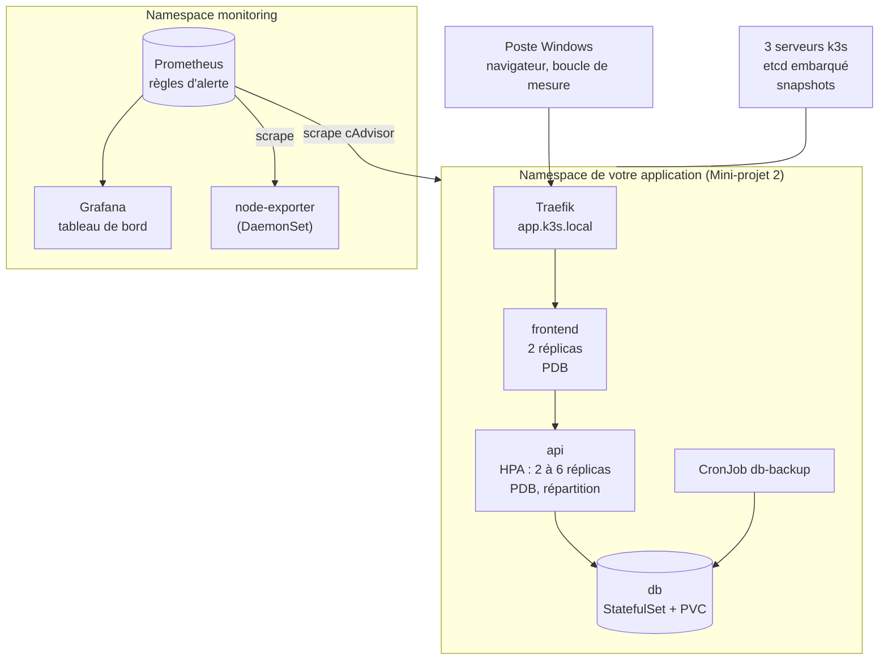

# Mini-projet 3 : Exploitation d'une application sous charge

## 1. Fiche du mini-projet

| Rubrique           | Description                                                                                                     |
| ------------------ | --------------------------------------------------------------------------------------------------------------- |
| Cours              | Orchestration de conteneurs avec Kubernetes (k3s)                                                               |
| Position           | Fin de la Partie 3 : Exploitation (chapitres 8 à 10)                                                            |
| Modalité           | En binôme, sur votre cluster k3s (3 VMs sous VMware Workstation)                                                |
| Niveau d'autonomie | **Autonome** : le cahier des charges et les critères de réussite sont donnés, la démarche est à construire      |
| Durée              | Travail préalable hors séance (phases 0 et 1) + 2 séances de 3 h (phases 2 à 8) + compte rendu sous une semaine |
| Prérequis          | Labs 8.1 à 10.2 et Mini-projet 2 réalisés ; dépôt Git du Mini-projet 2                                          |
| Acquis visés       | AA1 (architecture), AA5 (diagnostiquer et résoudre), AA6 (observabilité et autoscaling)                         |

## 2. Contexte

Dans le Mini-projet 2, vous avez déployé votre application trois niveaux de façon sécurisée et persistante. Elle fonctionne : il reste à prouver qu'elle **tient dans la durée**.

Votre mission : jouer le rôle de l'équipe d'exploitation. Vous allez :

- **observer** l'application et le cluster (métriques, tableau de bord, alertes) ;
- la rendre **élastique** (autoscaling) et **résiliente** (répartition, budgets de disruption) ;
- la **mettre à l'épreuve** : charge forte, maintenance d'un nœud, panne d'un nœud, perte accidentelle du namespace ;
- **documenter** ce que vous avez mesuré, décidé et appris.

> **Important :** l'évaluation ne porte pas sur le code de l'application, mais sur la qualité de son **exploitation** : vos choix sont-ils justifiés par des mesures ? Vos scénarios sont-ils reproductibles ? Votre documentation permettrait-elle à un collègue de reprendre la main ?

## 3. Objectifs pédagogiques

À l'issue du mini-projet, vous êtes capables de :

1. administrer un cluster à plusieurs serveurs et sauvegarder son état (AA1, AA5) ;
2. mettre en place une supervision et des alertes pertinentes (AA6) ;
3. dimensionner des ressources et régler un autoscaling d'après des mesures (AA6) ;
4. répartir une application sur les nœuds et protéger sa disponibilité pendant une maintenance (AA6) ;
5. diagnostiquer une panne selon une méthode, et documenter un incident (AA5) ;
6. identifier les limites de votre architecture et proposer des améliorations (AA5, AA6).

## 4. Architecture cible



Points d'architecture à retenir :

- l'application garde la structure du Mini-projet 2 : seul le frontend est exposé ;
- l'API est le composant **élastique** (HPA) ; la base reste à un seul réplica sur un volume `local-path`, donc **liée à un nœud** : c'est une limite connue, à analyser et non à masquer ;
- la supervision vit dans son propre namespace.

## 5. Cahier des charges

| N°  | Thème                  | Exigence                                                                                                                                            |
| --- | ---------------------- | --------------------------------------------------------------------------------------------------------------------------------------------------- |
| E1  | Cluster HA             | Le cluster compte 3 serveurs `Ready` avec etcd embarqué.                                                                                            |
| E2  | Redéploiement          | L'application du Mini-projet 2 se redéploie **entièrement à partir du dépôt Git** (ordre et procédure dans le `README.md`).                         |
| E3  | Sauvegarde du cluster  | Un snapshot etcd est créé et **copié hors des serveurs** ; la procédure est documentée.                                                             |
| E4  | Sauvegarde des données | Les dumps de la base sont **copiés hors du namespace** (poste ou autre machine).                                                                    |
| E5  | Ressources             | `requests` et `limits` de chaque conteneur sont **justifiés par des mesures** (`kubectl top` ou Prometheus).                                        |
| E6  | Sondes                 | L'API et le frontend ont une sonde readiness et une sonde liveness adaptées (la liveness ne dépend pas de la base) ; la base a une sonde readiness. |
| E7  | Monitoring             | Prometheus collecte les métriques des nœuds et des conteneurs ; un **tableau de bord** de 3 panneaux au moins est fourni.                           |
| E8  | Alertes                | Au moins **deux règles d'alerte**, chacune documentée (symptôme, seuil justifié, action attendue) et dont le déclenchement est prouvé.              |
| E9  | Autoscaling            | Un **HPA** gère l'API (2 à 6 réplicas) ; son comportement sous charge est mesuré.                                                                   |
| E10 | Répartition            | Les réplicas du frontend et de l'API sont **répartis sur plusieurs nœuds** (contrainte de répartition ou anti-affinité).                            |
| E11 | Disponibilité          | Un **PodDisruptionBudget** protège le frontend et l'API. Le choix (budget ou absence de budget) pour la base est **justifié par écrit**.            |
| E12 | Maintenance            | Un nœud est vidé (`drain`) puis rétabli **sans interruption visible** du frontend et de l'API (mesure à l'appui).                                   |
| E13 | Panne                  | La panne d'un nœud est simulée : temps de détection, de rétablissement et indisponibilité mesurés et analysés.                                      |
| E14 | Perte du namespace     | La suppression accidentelle du namespace est jouée, puis l'application **et ses données** sont restaurées.                                          |
| E15 | Dépôt et documentation | Dépôt Git structuré, `README.md` avec les procédures d'exploitation (maintenance, panne, restauration).                                             |

!!! warning "Ressources limitées"
Vos VMs ont environ 2 vCPU et 2 Go de RAM. Prometheus, l'application et un éventuel Grafana doivent coexister. Fixez des `limits` mémoire, une rétention courte (quelques heures), et surveillez `kubectl top nodes` : au-delà de 85 % de mémoire sur un nœud, retirez des composants non essentiels (Grafana d'abord).

## 6. Démarche en phases

Les phases indiquent un but, des **critères de réussite**, quelques **pistes** (notions et chapitres à relire, pas de commandes) et une question pour le compte rendu. C'est à vous de choisir comment faire.

### Outil de mesure de disponibilité

Plusieurs phases demandent de mesurer l'indisponibilité. Lancez dans une fenêtre PowerShell du poste Windows une boucle qui trace le code HTTP renvoyé par l'application (un code par seconde) :

```powershell
while ($true) { curl.exe -s -m 2 -o NUL -w "%{http_code} " http://app.k3s.local; Start-Sleep -Seconds 1 }
```

Les `200` s'enchaînent ; un `000`, un `502` ou un `503` signale une indisponibilité. Notez l'heure de début et de fin de chaque série d'erreurs, ou redirigez la sortie vers un fichier horodaté.

### Phase 0 : Remettre l'application sur le cluster HA (travail préalable)

- **But :** repartir d'une application fonctionnelle, déployée depuis le dépôt Git.
- **Critères de réussite :**
  - l'application est accessible sur `app.k3s.local` depuis votre navigateur ;
  - le déploiement est refait **uniquement à partir du dépôt**, selon un ordre documenté ;
  - l'API expose un point `/work`, qui consomme environ 50 ms de CPU par appel (une boucle de calcul suffit) : il servira aux tests de charge.
- **Pistes :** Mini-projet 2 (E15), chapitres 2 à 5. Si votre application du Mini-projet 2 n'est pas exploitable, demandez à l'enseignant une application de remplacement.
- **Question :** quelles informations manquent dans votre dépôt pour qu'un collègue redéploie l'application sans vous ?

### Phase 1 : Plateforme et sauvegardes du cluster (travail préalable)

- **But :** disposer d'un cluster HA, et de sauvegardes exploitables.
- **Critères de réussite :**
  - trois serveurs `Ready`, avec le rôle `etcd` ;
  - un snapshot etcd existe et une copie est conservée **hors des serveurs** ;
  - vous avez noté la version de k3s, le jeton du cluster (à conserver en lieu sûr, jamais dans Git) et l'emplacement des snapshots.
- **Pistes :** chapitre 8, Labs 8.1 et 8.2. Si votre cluster n'est plus HA, refaites le Lab 8.1.
- **Question :** que contient un snapshot etcd, et que ne contient-il pas ?

### Phase 2 : Ressources et sondes (séance 1)

- **But :** des ressources et des sondes **justifiées**.
- **Critères de réussite :**
  - pour l'API, le frontend et la base, vous avez relevé la consommation réelle au repos et sous une charge modérée ;
  - les `requests` et `limits` s'en déduisent (tableau « mesure, valeur choisie, justification » dans le compte rendu) ;
  - la liveness de l'API vérifie seulement le processus ; la readiness peut vérifier la base ; la base a une readiness adaptée ;
  - si l'API démarre lentement, une sonde startup est justifiée.
- **Pistes :** chapitres 4 et 9, Labs 4.2 et 9.1. Pour que le HPA réagisse à de petites charges, des `requests` de CPU modestes (par exemple quelques dizaines de millicores pour l'API) sont préférables à des valeurs larges.
- **Question :** que se passerait-il si la liveness de l'API interrogeait la base de données, et que celle-ci devenait indisponible ?

### Phase 3 : Monitoring (séance 1)

- **But :** voir l'application et le cluster.
- **Critères de réussite :**
  - Prometheus (rétention courte) collecte les nœuds (node-exporter) et les conteneurs (cAdvisor) ;
  - un tableau de bord de **3 panneaux au moins** (par exemple CPU par Pod, mémoire par Pod, CPU par nœud) est accessible ;
  - les manifestes sont dans le dépôt (`k8s/50-monitoring`), avec les droits RBAC strictement nécessaires ;
  - `kubectl top nodes` reste sous 85 % de mémoire.
- **Pistes :** chapitre 9, Lab 9.2 (Prometheus, node-exporter, Grafana, Ingress). Grafana est facultatif si la mémoire manque : une page de requêtes Prometheus enregistrées peut le remplacer, à justifier.
- **Question :** quelles informations utiles à l'exploitation manquent encore dans cette pile ?

### Phase 4 : Alertes (séance 1)

- **But :** être prévenu des vrais problèmes.
- **Critères de réussite :**
  - deux règles d'alerte au moins (par exemple un nœud injoignable, un Pod en saturation de CPU ou de mémoire) ;
  - pour chaque règle, un court texte : **le symptôme** observé par les utilisateurs, **le seuil** et sa justification, **l'action** attendue de l'exploitant ;
  - le passage de chaque règle à l'état `Firing` est prouvé par une capture.
- **Pistes :** chapitre 9 (signaux d'or, qualité d'une alerte). Les règles du Lab 9.2 sont une base, pas une réponse.
- **Question :** pourquoi une alerte « CPU élevé » est-elle une mauvaise alerte de production, et par quoi la remplaceriez-vous ?

### Phase 5 : Autoscaling et test de charge (séance 1)

- **But :** l'API s'adapte à la charge, et vous le prouvez.
- **Critères de réussite :**
  - un HPA (2 à 6 réplicas) est défini, avec une cible justifiée ;
  - un test de charge dirigé vers `/work` (générateur dans le cluster ou depuis le poste) fait monter le nombre de réplicas ;
  - vous avez relevé : l'heure de début de la charge, le premier palier de réplicas, le nombre maximal atteint, le délai de retour au minimum après l'arrêt de la charge ;
  - pendant le test, la boucle de mesure montre le nombre d'erreurs ; vous l'analysez ;
  - courbes (réplicas, CPU) en capture dans le compte rendu.
- **Pistes :** chapitre 10, Lab 10.1 (formule, `behavior`, fenêtre de stabilisation). N'oubliez pas de retirer `replicas` du manifeste du Deployment géré par le HPA.
- **Question :** quelle est la limite physique de votre autoscaling, et comment la reconnaître ?

### Phase 6 : Répartition, disponibilité et maintenance d'un nœud (séance 2)

- **But :** survivre à une opération planifiée.
- **Critères de réussite :**
  - les réplicas du frontend et de l'API sont répartis sur plusieurs nœuds (preuve : `-o wide`) ;
  - des PodDisruptionBudgets protègent le frontend et l'API ;
  - votre choix pour la base (budget ou non) est justifié par écrit, en tenant compte de son volume `local-path` ;
  - vous videz un nœud **qui n'héberge pas la base** : pas d'indisponibilité visible, ou durée mesurée et expliquée ;
  - vous rétablissez le nœud, vérifiez les Pods, et notez ce que le budget a retardé ou empêché.
- **Pistes :** chapitres 8 et 10, Labs 8.2 et 10.2 (`cordon`, `drain`, répartition, PDB). Identifiez d'abord le nœud de la base.
- **Question :** que se passerait-il si vous vidiez le nœud qui héberge la base ? Comment réduire ce risque en production ?

### Phase 7 : Panne de nœud et perte du namespace (séance 2)

- **But :** mesurer ce qui se passe quand « ça casse », et savoir reconstruire.

**Panne de nœud**

- **Critères de réussite :**
  - vous arrêtez le service k3s d'un nœud **qui n'héberge pas la base**, en suivant la boucle de mesure ;
  - vous relevez : le délai avant `NotReady`, le délai avant le remplacement des Pods, la durée d'indisponibilité visible, ou son absence ;
  - vous expliquez ces délais (condition de nœud, taints automatiques, tolérances, chapitre 10) et le rôle de la répartition ;
  - vous rétablissez le nœud et vérifiez le retour à la normale.

**Perte accidentelle du namespace**

- **Critères de réussite :**
  - vous **avez** une copie des dumps hors du namespace avant de commencer (E4) ;
  - vous supprimez le namespace de l'application, puis reconstruisez l'application **depuis le dépôt** et rechargez la dernière sauvegarde ;
  - vous mesurez la durée totale de reprise et la perte de données (écart entre la dernière sauvegarde et l'incident) ;
  - vous précisez ce que la restauration d'un snapshot etcd aurait apporté, et ce qu'elle n'aurait pas apporté.
- **Pistes :** chapitres 5, 6, 8 ; Labs 5.2, 6.1, 8.2. Pensez à ce qui est supprimé avec un PVC.
- **Question :** quels objectifs de reprise (perte de données acceptable, durée acceptable) fixeriez-vous pour cette application, et que faudrait-il changer pour les atteindre ?

### Phase 8 : Incident surprise et bilan (fin de la séance 2)

- **But :** appliquer la méthode de diagnostic à un incident que vous n'avez pas préparé.
- **Critères de réussite :**
  - un incident vous est fourni par l'enseignant sur votre application ;
  - vous tenez un **journal de diagnostic** (symptôme, hypothèses, commandes, cause, correction, vérification) ;
  - vous corrigez **une seule chose à la fois** et vérifiez la résolution ;
  - vous rédigez les enseignements dans le compte rendu.
- **Pistes :** chapitre 9, Lab 9.3 (méthodologie, journal).
- **Question :** quelle alerte ou quelle métrique vous aurait permis de détecter cet incident plus tôt ?

## 7. Livrables

1. **Dépôt Git** (celui du Mini-projet 2, complété) contenant :
   - `k8s/` : manifestes rangés par dossier, dont `50-monitoring` (supervision) et `60-exploitation` (HPA, PDB, répartition, règles d'alerte) ;
   - `secret.example.yaml` (jamais de vrai secret) ;
   - `README.md` : prérequis, ordre de déploiement, **procédures d'exploitation** (maintenance d'un nœud, panne, restauration complète) ;
   - un fichier `docs/journal-incidents.md` (journal de diagnostic de la phase 8).
2. **Compte rendu** (4 à 6 pages) :
   - schéma de l'architecture d'exploitation ;
   - tableau des exigences E1 à E15 avec la preuve associée (sortie de commande ou capture) ;
   - tableau de justification des ressources (phase 2) ;
   - courbes et mesures des phases 5, 6 et 7 (réplicas, CPU, délais, erreurs) ;
   - réponses aux questions de chaque phase ;
   - un paragraphe « limites de l'architecture et améliorations proposées ».
3. **Démonstration orale** de 10 minutes : tableau de bord pendant un test de charge (montée des réplicas), vidage d'un nœud sans interruption visible, une alerte déclenchée, restauration de l'application et de ses données.

## 8. Grille d'évaluation (/20)

| Critère                                                                         | Points | AA       |
| ------------------------------------------------------------------------------- | ------ | -------- |
| Cluster HA, sauvegardes du cluster et des données copiées hors des serveurs     | 3      | AA1, AA5 |
| Ressources justifiées par des mesures, sondes adaptées                          | 3      | AA5, AA6 |
| Monitoring : collecte, tableau de bord, règles d'alerte documentées et prouvées | 4      | AA6      |
| Autoscaling : HPA justifié et comportement mesuré sous charge                   | 3      | AA6      |
| Répartition, PDB et justification du cas de la base                             | 2      | AA6      |
| Scénarios joués et analysés : maintenance, panne de nœud, perte du namespace    | 3      | AA5      |
| Qualité du dépôt, du journal d'incident, du compte rendu et de la démonstration | 2      | AA5      |

## 9. Erreurs fréquentes et conseils de diagnostic

| Symptôme                                          | Pistes à explorer                                                                                                 |
| ------------------------------------------------- | ----------------------------------------------------------------------------------------------------------------- |
| HPA à `<unknown>`                                 | `requests` de CPU absentes, metrics-server indisponible : `kubectl describe hpa`                                  |
| L'API ne monte jamais en réplicas                 | Charge trop faible (appels de `/work` insuffisants), `requests` de CPU trop larges : mesurer avec `kubectl top`   |
| Pods `Pending` pendant la montée                  | Capacité des nœuds atteinte : `kubectl describe pod`, réduire les `requests` ou `maxReplicas`                     |
| Nœud à court de mémoire                           | Prometheus ou Grafana trop gourmands : réduire la rétention, retirer Grafana, fixer des `limits`                  |
| `drain` bloqué                                    | PodDisruptionBudget trop strict, Pod sans contrôleur, volume `local-path` : `kubectl get pdb`, message d'éviction |
| Indisponibilité malgré plusieurs réplicas         | Réplicas sur le même nœud, sonde readiness absente, Service sans endpoints                                        |
| Cibles Prometheus `DOWN`                          | Droits RBAC insuffisants, `ufw` actif sur la VM, mauvais port                                                     |
| Alerte qui ne se déclenche pas                    | Règles non chargées (redémarrer Prometheus), mauvais nom de métrique, durée `for` trop longue                     |
| Données perdues après la suppression du namespace | Dumps stockés dans le namespace supprimé : copie hors cluster non faite                                           |
| Panne de nœud : Pods remplacés trop tard          | Tolérance automatique de 300 s aux taints `not-ready` et `unreachable` : c'est le comportement par défaut         |

## 10. Pour aller plus loin (facultatif)

- Réduire le délai de remplacement des Pods en cas de panne (tolérances aux taints `not-ready` et `unreachable` avec un délai court sur l'API).
- Réserver un nœud à l'application avec un taint, une toleration et une affinité.
- Ajouter Alertmanager pour envoyer les alertes vers un canal de notification.
- Mesurer, avec les recommandations d'un VPA en mode `Off`, si vos `requests` sont bien dimensionnés.
- Préparer l'industrialisation (Partie 4) : empaqueter la supervision et l'application avec Helm.
