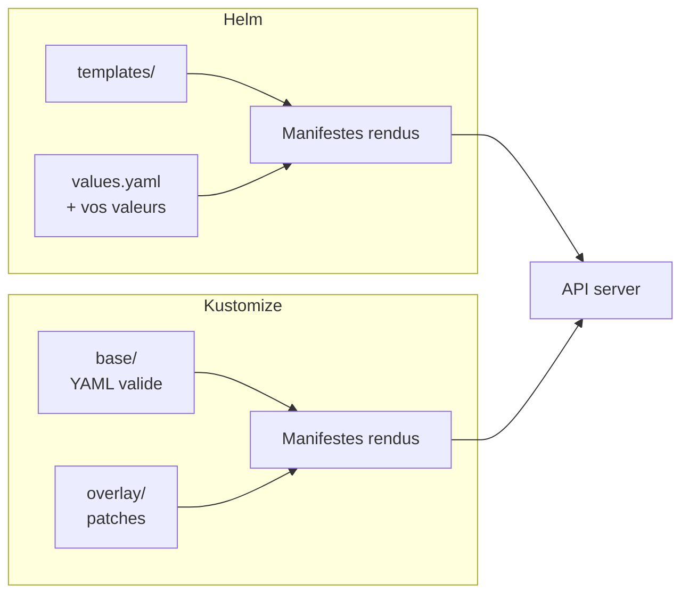
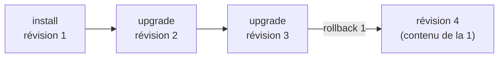

# Chapitre 11 : Helm et Kustomize

!!! abstract "Objectifs du chapitre" - Expliquer pourquoi des manifestes YAML bruts ne suffisent plus pour déployer une application dans plusieurs environnements - Décrire la structure d'un chart Helm, et les notions de values, de release et de révision - Installer, mettre à jour, annuler et désinstaller une application avec Helm - Écrire un template simple paramétré par des values - Décrire le fonctionnement de Kustomize : base, overlays et patches - Choisir entre Helm et Kustomize selon le besoin - Acquis d'apprentissage visé : **AA7**

## 1. Le problème : un même YAML, plusieurs contextes

Vos manifestes des Parties 1 à 3 fonctionnent, mais ils sont **figés** : nom du namespace, version de l'image, nombre de réplicas, nom d'hôte de l'Ingress, ressources. Pour déployer la même application en « test » et en « production », vous seriez tenus de copier les fichiers et de modifier les valeurs à la main. Les copies divergent, les erreurs s'accumulent.

Deux outils répondent à ce besoin, avec deux philosophies différentes :

| Outil         | Principe                                                                     | Forme                       |
| ------------- | ---------------------------------------------------------------------------- | --------------------------- |
| **Helm**      | Des **templates** YAML, remplis par des **values**, empaquetés en **charts** | Gestionnaire de paquets     |
| **Kustomize** | Un YAML **de base**, modifié par des **patches** selon l'environnement       | Superposition sans template |



## 2. Helm

**Helm** est le gestionnaire de paquets de Kubernetes. Il n'est pas installé par k3s : vous l'installez sur la machine qui pilote le cluster (Lab 11.1). Il utilise le même fichier de configuration que `kubectl` (voir plus bas).

### Vocabulaire

| Terme                  | Définition                                                                          |
| ---------------------- | ----------------------------------------------------------------------------------- |
| **Chart**              | Un paquet : un dossier de templates et de métadonnées décrivant une application     |
| **Values**             | Les paramètres du chart, avec des valeurs par défaut dans `values.yaml`             |
| **Release**            | Une **instance installée** d'un chart dans un cluster, avec un nom                  |
| **Révision**           | Un numéro de version de la release, incrémenté à chaque installation ou mise à jour |
| **Dépôt** (repository) | Un serveur qui publie des charts                                                    |

Un même chart peut être installé plusieurs fois sous des noms de release différents, par exemple `blog-test` et `blog-prod`.

### Structure d'un chart

```text
monchart/
├── Chart.yaml          # nom, description, version du chart, version de l'application
├── values.yaml         # valeurs par défaut
├── templates/
│   ├── deployment.yaml
│   ├── service.yaml
│   ├── _helpers.tpl    # fonctions de template réutilisables
│   └── NOTES.txt       # message affiché après l'installation
└── charts/             # dépendances (sous-charts)
```

!!! info "Deux versions à ne pas confondre"
`version` est la version **du chart** (son empaquetage) ; `appVersion` est la version **de l'application** qu'il déploie. Elles évoluent indépendamment.

### Les templates

Un template est un manifeste YAML dans lequel des expressions `{{ ... }}` sont remplacées au rendu. Helm utilise le moteur de templates du langage Go.

```yaml
# templates/deployment.yaml (extrait)
apiVersion: apps/v1
kind: Deployment
metadata:
  name: {{ .Release.Name }}-web
spec:
  replicas: {{ .Values.replicaCount }}
  selector:
    matchLabels:
      app: {{ .Release.Name }}-web
  template:
    metadata:
      labels:
        app: {{ .Release.Name }}-web
    spec:
      containers:
        - name: web
          image: "{{ .Values.image.repository }}:{{ .Values.image.tag }}"
```

```yaml
# values.yaml
replicaCount: 2
image:
  repository: nginx
  tag: "1.27"
```

Les objets prédéfinis les plus utilisés :

| Objet      | Contenu                                                             |
| ---------- | ------------------------------------------------------------------- |
| `.Values`  | Les valeurs du chart (`values.yaml` et vos surcharges)              |
| `.Release` | Informations sur la release (`.Release.Name`, `.Release.Namespace`) |
| `.Chart`   | Le contenu de `Chart.yaml` (`.Chart.Name`, `.Chart.AppVersion`)     |

Quelques fonctions et structures courantes : `default` (valeur de repli), `quote` (met entre guillemets), `if` / `else` (condition), `range` (boucle). Exemple : `{{ .Values.tag | default .Chart.AppVersion }}`.

### Surcharger les values

Trois façons, de la plus faible à la plus forte priorité :

1. le `values.yaml` du chart ;
2. un ou plusieurs fichiers donnés avec `-f` (`--values`) ;
3. des valeurs isolées données avec `--set`.

```bash
helm install blog ./monchart -f prod.yaml --set replicaCount=3
```

Préférez les fichiers `-f` : ils se versionnent dans Git, contrairement à une ligne de commande.

### Cycle de vie d'une release

| Commande                         | Rôle                                                   |
| -------------------------------- | ------------------------------------------------------ |
| `helm repo add NOM URL`          | Déclare un dépôt de charts                             |
| `helm search repo MOT`           | Cherche un chart dans les dépôts déclarés              |
| `helm show values CHART`         | Affiche les values configurables d'un chart            |
| `helm install RELEASE CHART`     | Installe une release                                   |
| `helm list`                      | Liste les releases du namespace                        |
| `helm upgrade RELEASE CHART`     | Met à jour une release (nouvelle révision)             |
| `helm history RELEASE`           | Affiche les révisions                                  |
| `helm rollback RELEASE REVISION` | Revient à une révision précédente                      |
| `helm uninstall RELEASE`         | Supprime la release et ses objets                      |
| `helm template RELEASE CHART`    | Affiche les manifestes rendus, **sans rien installer** |
| `helm lint CHART`                | Vérifie la structure et la syntaxe d'un chart          |
| `helm create NOM`                | Génère le squelette d'un chart                         |



!!! warning "Un rollback crée une nouvelle révision"
`helm rollback` ne « remonte » pas dans le temps : il crée une **nouvelle** révision dont le contenu est celui de la révision demandée. L'historique reste complet.

### Où Helm stocke-t-il l'état ?

Helm 3 n'a pas de composant serveur dans le cluster. Chaque révision d'une release est enregistrée dans un **Secret** du namespace de la release (de type `helm.sh/release.v1`). Supprimer le namespace supprime donc aussi l'historique.

### Accès au cluster

Helm lit le fichier de configuration indiqué par la variable `KUBECONFIG`, à défaut `~/.kube/config`. Sur un serveur k3s, le fichier est `/etc/rancher/k3s/k3s.yaml` (lisible par root) : si `kubectl` fonctionne pour votre utilisateur, Helm fonctionne aussi. Le Lab 11.1 vérifie ce point.

### Bonnes pratiques

- **Fixer les versions** : version du chart (`--version`) et tag de l'image, jamais `latest`.
- Toujours regarder `helm show values` et `helm template` avant d'installer un chart tiers.
- Ne pas mettre de secrets en clair dans les fichiers de values versionnés.
- Vérifier avec `helm lint` et `helm template` avant `helm install` ou `helm upgrade`.

!!! info "Helm dans k3s"
k3s embarque un contrôleur Helm : un objet `HelmChart` déposé dans le répertoire des manifestes automatiques est installé sans la commande `helm`. C'est ainsi que Traefik est déployé. Vous verrez cet aspect en administration ; ce cours utilise la commande `helm`.

## 3. Kustomize

**Kustomize** personnalise des manifestes YAML **sans template** : la base reste du YAML valide, que l'on peut appliquer telle quelle. Il est intégré à `kubectl`.

### Base et overlays

```text
app/
├── base/
│   ├── kustomization.yaml
│   ├── deployment.yaml
│   └── service.yaml
└── overlays/
    ├── test/
    │   └── kustomization.yaml
    └── prod/
        ├── kustomization.yaml
        └── replicas.yaml
```

La **base** décrit l'application ; chaque **overlay** décrit une variante. Un overlay référence la base et y ajoute des modifications.

```yaml
# base/kustomization.yaml
resources:
  - deployment.yaml
  - service.yaml
```

```yaml
# overlays/prod/kustomization.yaml
resources:
  - ../../base
namespace: prod
namePrefix: prod-
images:
  - name: nginx
    newTag: "1.27"
patches:
  - path: replicas.yaml
```

```yaml
# overlays/prod/replicas.yaml : patch partiel
apiVersion: apps/v1
kind: Deployment
metadata:
  name: web
spec:
  replicas: 4
```

Le patch désigne l'objet (même `kind` et même `name` que dans la base, sans le préfixe) et ne contient que les champs à modifier.

### Principales fonctions

| Champ                                    | Effet                                                                 |
| ---------------------------------------- | --------------------------------------------------------------------- |
| `resources`                              | Liste les fichiers ou les dossiers à inclure                          |
| `namespace`                              | Impose un namespace à tous les objets                                 |
| `namePrefix` / `nameSuffix`              | Préfixe ou suffixe tous les noms                                      |
| `labels`                                 | Ajoute des labels à tous les objets                                   |
| `images`                                 | Remplace le nom ou le tag d'une image                                 |
| `patches`                                | Modifie des champs d'objets existants                                 |
| `configMapGenerator` / `secretGenerator` | Génère un ConfigMap ou un Secret à partir de fichiers ou de littéraux |

### Commandes

```bash
kubectl kustomize overlays/prod    # affiche le résultat, sans rien appliquer
kubectl apply -k overlays/prod     # applique l'overlay
kubectl delete -k overlays/prod    # supprime les objets de l'overlay
```

## 4. Helm ou Kustomize ?

| Critère                                                       | Helm                               | Kustomize                               |
| ------------------------------------------------------------- | ---------------------------------- | --------------------------------------- |
| Application tierce à installer (base de données, supervision) | **Adapté** : chart prêt à l'emploi | Rarement disponible                     |
| Application que vous maintenez, avec quelques variantes       | Possible                           | **Adapté**, YAML lisible                |
| Lisibilité                                                    | Templates plus difficiles à lire   | YAML valide, patches explicites         |
| Historique et retour arrière                                  | **Releases, révisions, rollback**  | Aucun : c'est Git qui sert d'historique |
| Distribution                                                  | Charts publiés dans un dépôt       | Dossiers dans Git                       |
| Logique (conditions, boucles)                                 | Oui, via les templates             | Non, volontairement                     |

Les deux outils se combinent : on peut, par exemple, installer un chart Helm tiers pour l'infrastructure et gérer l'application avec Kustomize. Vous les retrouverez avec GitOps au chapitre 12.

!!! tip "À retenir" - Helm = **chart** (templates + `values.yaml`) installé en **release**, avec des **révisions** et un **rollback**. - `helm template` et `helm lint` permettent de vérifier **avant** d'installer. - Priorité des values : `values.yaml` < `-f` < `--set`. - Kustomize = **base** + **overlays** + **patches**, sans template ; `kubectl apply -k`. - Fixez toujours les versions (chart et image). - Helm pour installer des applications tierces et packager avec historique ; Kustomize pour des variantes simples d'un YAML que vous maintenez.

## Pour vérifier votre compréhension

??? question "Quelle différence entre un chart et une release ?"
Un chart est le paquet (templates et values par défaut). Une release est une instance de ce chart installée dans un cluster, avec un nom et un historique de révisions. Un même chart peut donner plusieurs releases.

??? question "Comment vérifier ce qu'un chart va créer sans rien installer ?"
Avec `helm template RELEASE CHART`, qui affiche les manifestes rendus, après `helm lint CHART` pour contrôler la syntaxe. `helm install --dry-run` permet aussi une simulation.

??? question "Une valeur est définie dans `values.yaml`, dans `-f prod.yaml` et dans `--set`. Laquelle est retenue ?"
La valeur de `--set`, qui est prioritaire sur `-f`, lui-même prioritaire sur le `values.yaml` du chart.

??? question "Après `helm rollback blog 1`, quel est le numéro de la révision courante, si la release en avait 3 ?"
La révision 4 : le rollback crée une nouvelle révision dont le contenu est celui de la révision 1.

??? question "Pourquoi un fichier de base Kustomize peut-il être appliqué directement avec `kubectl apply -f` ?"
Parce que c'est du YAML Kubernetes valide, sans expression de template. Les overlays le modifient sans le rendre invalide.

??? question "Vous devez installer un outil de supervision tiers et gérer votre propre application en deux variantes. Quel outil pour chaque besoin ?"
Helm pour l'outil tiers, car un chart est généralement fourni et paramétrable. Kustomize (ou un chart interne) pour votre application et ses deux variantes.

## Labs du chapitre

- [Lab 11.1 : Utiliser Helm](lab-11-1-utiliser-helm.md)
- [Lab 11.2 : Packager son application](lab-11-2-packager-application.md)
