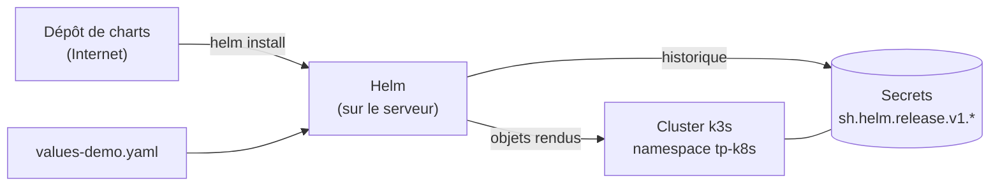

# Lab 11.1 : Utiliser Helm

| | |
|---|---|
| **Durée** | 60 à 75 min |
| **Niveau** | Guidé |
| **Prérequis** | [Lab 3.1](../../partie-1-fondations/ch03-services-reseau/lab-3-1-exposer-application.md) réalisé (Services NodePort), [cours du chapitre 11](cours.md) lu, cluster `Ready`, accès Internet depuis les VMs |
| **Acquis visés** | AA7 |

!!! abstract "Objectifs"
    - Installer Helm et vérifier qu'il accède au cluster
    - Ajouter un dépôt de charts, chercher un chart et lire ses values
    - Installer une release avec une version de chart fixée
    - Personnaliser une release avec un fichier de values
    - Mettre à jour une release, lire son historique et revenir en arrière après un échec
    - Désinstaller une release et constater ce qui est supprimé

## Contexte et schéma

Vous installez une petite application web publique, **podinfo**, à partir de son chart Helm. Vous la configurez, la mettez à jour, provoquez une mise à jour ratée, puis revenez à la révision saine.



!!! note "Application utilisée"
    Le chart `podinfo` est un exemple public très utilisé dans les démonstrations Kubernetes. L'application est légère (quelques Mo de mémoire par Pod) et renvoie un message JSON configurable, ce qui convient à des VMs de 2 Go.

## Étapes

### Étape 1 : Installer Helm

Sur le serveur où vous lancez `kubectl` :

```bash
curl -fsSL -o get_helm.sh https://raw.githubusercontent.com/helm/helm/main/scripts/get-helm-3
chmod 700 get_helm.sh
./get_helm.sh
helm version
```

Notez la version affichée. Vérifiez que Helm voit votre cluster :

```bash
helm list -A
```

La commande doit répondre sans erreur (la liste peut être vide, ou contenir les composants de k3s). Si elle signale `Kubernetes cluster unreachable`, consultez le tableau de dépannage.

- [ ] `helm version` affiche une version
- [ ] `helm list -A` répond sans erreur

### Étape 2 : Préparer le namespace et le dépôt

```bash
k create namespace tp-k8s
k config set-context --current --namespace=tp-k8s
helm repo add podinfo https://stefanprodan.github.io/podinfo
helm repo update
helm search repo podinfo
```

Listez **toutes** les versions disponibles du chart :

```bash
helm search repo podinfo/podinfo --versions | head -8
```

La colonne `CHART VERSION` donne la version du chart ; `APP VERSION` celle de l'application. Choisissez la **deuxième ligne** de la liste (une version légèrement plus ancienne que la dernière) et gardez-la dans une variable :

```bash
CHARTVER=<version-du-chart-choisie>
echo $CHARTVER
```

Regardez les values configurables :

```bash
helm show values podinfo/podinfo --version $CHARTVER | head -60
```

Repérez au moins `replicaCount`, `image`, `ui.message`, `service` et `resources`.

!!! tip "Pourquoi fixer la version du chart ?"
    Sans `--version`, Helm installe la dernière version publiée : deux installations à des dates différentes ne donneraient pas le même résultat.

- [ ] Le dépôt `podinfo` est déclaré
- [ ] La variable `CHARTVER` contient une version du chart

### Étape 3 : Installer une release

```bash
helm install demo podinfo/podinfo --version $CHARTVER -n tp-k8s
```

La sortie résume la release (nom, namespace, `STATUS: deployed`, `REVISION: 1`) et affiche les notes du chart. Observez ensuite ce que Helm a créé :

```bash
helm list -n tp-k8s
helm status demo -n tp-k8s
k get deploy,svc,pods
```

Le Deployment et le Service portent le nom `demo-podinfo` : le nom de la release sert de préfixe, comme dans les templates du cours (`.Release.Name`).

- [ ] La release `demo` est en `deployed`, révision 1
- [ ] Le Pod `demo-podinfo-...` est `Running`

### Étape 4 : Inspecter la release

```bash
helm get values demo -n tp-k8s
helm get values demo -n tp-k8s --all | head -20
helm get manifest demo -n tp-k8s | head -40
k get secrets
```

- `helm get values` : les valeurs que **vous** avez fournies (aucune pour l'instant).
- `--all` : toutes les valeurs, défauts compris.
- `helm get manifest` : les manifestes rendus et envoyés au cluster.
- Le Secret `sh.helm.release.v1.demo.v1` est l'enregistrement de la révision 1.

Testez l'application depuis le serveur :

```bash
k port-forward svc/demo-podinfo 9898:9898 &
sleep 2
curl -s localhost:9898 | head -20
kill %1
```

Notez le champ `message` de la réponse. Il vient de la valeur `ui.message` du chart.

- [ ] Vous avez trouvé le Secret de la révision 1
- [ ] La réponse JSON de l'application est affichée

### Étape 5 : Exposer en NodePort et personnaliser (révision 2)

Créez un fichier de values :

```bash
cat <<'EOF2' > values-demo.yaml
replicaCount: 2
ui:
  message: "Bonjour depuis ma release Helm"
service:
  type: NodePort
EOF2
```

Avant d'appliquer, affichez ce que Helm va rendre :

```bash
helm template demo podinfo/podinfo --version $CHARTVER -f values-demo.yaml | grep -E "replicas:|type:|PODINFO_UI_MESSAGE" -A1
```

Appliquez ensuite la mise à jour :

```bash
helm upgrade demo podinfo/podinfo --version $CHARTVER -f values-demo.yaml -n tp-k8s
helm history demo -n tp-k8s
k get pods
k get svc demo-podinfo
```

Testez le NodePort depuis le serveur :

```bash
NODEPORT=$(k get svc demo-podinfo -o jsonpath='{.spec.ports[0].nodePort}')
NODEIP=$(k get nodes -o jsonpath='{.items[0].status.addresses[0].value}')
curl -s http://$NODEIP:$NODEPORT | grep -i message
```

Le message doit être celui de votre fichier.

- [ ] `helm history` montre deux révisions (la première en `superseded`, la seconde en `deployed`)
- [ ] Deux Pods tournent
- [ ] Le message personnalisé apparaît dans la réponse

### Étape 6 : Mise à jour de la version du chart (révision 3)

Choisissez maintenant la **dernière** version du chart et mettez la release à jour en conservant vos values :

```bash
LATEST=<dernière-version-du-chart>
helm upgrade demo podinfo/podinfo --version $LATEST -f values-demo.yaml -n tp-k8s
helm history demo -n tp-k8s
k get pods
```

Notez : l'application a été mise à jour par un rolling update (chapitre 2), mais votre configuration est restée celle de `values-demo.yaml`.

- [ ] La révision 3 est `deployed`
- [ ] Le message personnalisé est toujours présent

### Étape 7 : Provoquer un échec, puis revenir en arrière

Simulez une mise à jour avec une image qui n'existe pas :

```bash
helm upgrade demo podinfo/podinfo --version $LATEST -f values-demo.yaml \
  --set image.tag=0.0.0-inexistant --wait --timeout 60s -n tp-k8s
```

Au bout de 60 secondes, Helm signale l'échec. Observez :

```bash
helm history demo -n tp-k8s
k get pods
```

- La révision 4 est en `failed`.
- Un nouveau Pod est en `ImagePullBackOff` ou `ErrImagePull`, mais les Pods de la révision 3 **continuent de servir** : le rolling update ne retire pas les anciens Pods tant que les nouveaux ne sont pas prêts.

Revenez à la dernière révision saine (la 3) :

```bash
helm rollback demo 3 -n tp-k8s
helm history demo -n tp-k8s
k get pods
curl -s http://$NODEIP:$NODEPORT | grep -i message
```

La révision 5 apparaît : c'est une **nouvelle** révision dont le contenu est celui de la révision 3.

- [ ] La révision 4 est `failed`
- [ ] Après le rollback, la révision 5 est `deployed` et les Pods sont `Running`
- [ ] L'application répond avec votre message

### Étape 8 : Désinstaller

```bash
helm uninstall demo -n tp-k8s
helm list -n tp-k8s
k get all
k get secrets
```

La release, ses objets et ses Secrets d'historique disparaissent.

- [ ] Plus aucun objet `demo-podinfo`
- [ ] Plus de Secret `sh.helm.release.v1.demo.*`

## Questions de réflexion

??? question "Que contient `helm get values demo` juste après l'étape 3, et pourquoi ?"
    Rien (ou `null`) : cette commande affiche uniquement les valeurs **fournies par l'utilisateur**. Les valeurs par défaut du chart s'affichent avec `--all`.

??? question "Pourquoi les anciens Pods ont-ils continué à servir pendant l'échec de l'étape 6 ?"
    Le Deployment applique un rolling update : il ne supprime les anciens Pods que lorsque les nouveaux sont prêts. Le nouveau Pod n'a jamais démarré (image introuvable), donc les anciens ont été conservés.

??? question "Que se passe-t-il si vous lancez `helm upgrade` sans `-f values-demo.yaml` à l'étape 5 ?"
    Helm repart des valeurs par défaut du chart : `replicaCount` revient à sa valeur par défaut, le message et le type de Service aussi. Pour conserver les valeurs précédentes, il faut redonner le fichier `-f` (ou utiliser `--reuse-values`, à manier avec précaution). Un fichier de values versionné est la pratique recommandée.

??? question "Pourquoi le rollback crée-t-il la révision 5 plutôt que de revenir à la 3 ?"
    L'historique de Helm est en ajout seulement : chaque opération crée une révision. Le rollback copie le contenu de la révision demandée dans une nouvelle révision, ce qui conserve la trace complète de ce qui s'est passé.

??? question "Quel avantage a `--wait --timeout` pour un pipeline automatisé ?"
    Helm n'indique la réussite que lorsque les ressources sont prêtes. Sans `--wait`, la commande réussit dès que les objets sont créés, même si les Pods ne démarrent jamais, et le pipeline continuerait à tort.

## Dépannage

| Symptôme | Pistes |
|---|---|
| `helm: command not found` | Le script n'a pas terminé ; relancer `./get_helm.sh` ; vérifier `/usr/local/bin/helm` |
| Échec du téléchargement du script | Accès Internet des VMs ; essayer à nouveau, ou demander à l'enseignant le binaire |
| `Kubernetes cluster unreachable` | Variable `KUBECONFIG` absente : `export KUBECONFIG=~/.kube/config`, ou voir la copie de `/etc/rancher/k3s/k3s.yaml` du Lab 1.1 |
| `permission denied` sur le fichier kubeconfig | Fichier lisible seulement par root : le copier dans `~/.kube/config` avec les bons droits |
| `helm repo add` échoue | Accès Internet, URL mal recopiée |
| `chart "podinfo" matching ... not found` | `helm repo update` non fait, ou version du chart inexistante : relire `helm search repo --versions` |
| `cannot re-use a name that is still in use` | La release `demo` existe déjà : `helm list -n tp-k8s`, puis `helm uninstall` ou `helm upgrade` |
| Pod `ImagePullBackOff` en dehors de l'étape 6 | Accès Internet ou limitation du registre ; `k describe pod` |
| `curl` sur le NodePort sans réponse | Mauvais `NODEIP` ou `NODEPORT` (`echo`), pare-feu `ufw` de la VM, Service encore en `ClusterIP` (upgrade non appliqué) |
| `helm upgrade` refusé : `another operation is in progress` | Une opération précédente interrompue : `helm history`, puis `helm rollback` vers une révision saine |

## Nettoyage

```bash
helm uninstall demo -n tp-k8s 2>/dev/null
helm repo remove podinfo
k delete namespace tp-k8s
k config set-context --current --namespace=default
rm -f get_helm.sh values-demo.yaml
```

Gardez Helm installé : vous en aurez besoin au Lab 11.2.