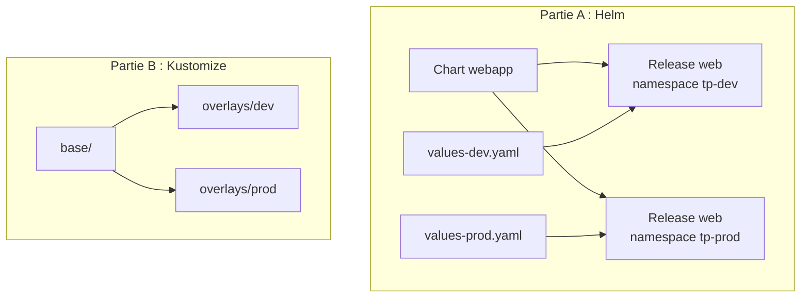

# Lab 11.2 : Packager son application

| | |
|---|---|
| **Durée** | 90 à 120 min |
| **Niveau** | Semi-guidé |
| **Prérequis** | [Lab 11.1](lab-11-1-utiliser-helm.md) réalisé (Helm installé), [Lab 3.2](../../partie-1-fondations/ch03-services-reseau/lab-3-2-ingress-traefik.md) et [Lab 4.1](../../partie-2-configuration-donnees-securite/ch04-configuration-ressources/lab-4-1-externaliser-configuration.md) réalisés (Ingress, ConfigMap), [cours du chapitre 11](cours.md) lu, cluster `Ready` |
| **Acquis visés** | AA7 |

!!! abstract "Objectifs"
    - Créer un chart Helm complet pour une petite application web
    - Paramétrer le chart avec des values et le valider (`helm lint`, `helm template`)
    - Déployer le même chart dans deux environnements avec deux fichiers de values
    - Faire redémarrer les Pods lorsqu'un ConfigMap change
    - Empaqueter le chart (`helm package`)
    - Reproduire le même besoin avec Kustomize (base et overlays) et comparer les deux approches

## Contexte et schéma

Vous reprenez l'application des chapitres 3 et 4 : un serveur nginx qui sert une page HTML fournie par un ConfigMap, exposé par un Service et un Ingress Traefik. Vous l'empaquetez de deux façons, puis vous déployez deux environnements, **dev** et **prod**.



Les parties A et B produisent le même résultat par deux chemins. Vous les comparerez à la fin.

!!! warning "Ressources"
    Chaque environnement lance 1 ou 2 Pods nginx de quelques Mo. Pour éviter les conflits, vous supprimez les environnements de la partie A avant de commencer la partie B.

## Partie A : le chart Helm

### Étape 1 : Créer la structure du chart

```bash
k create namespace tp-dev
k create namespace tp-prod
mkdir -p ~/lab11/webapp/templates && cd ~/lab11
```

Créez `webapp/Chart.yaml` :

```yaml
apiVersion: v2
name: webapp
description: Application web statique (nginx) pour le cours Kubernetes
type: application
version: 0.1.0
appVersion: "1.26"
```

Créez `webapp/values.yaml`, qui contient les valeurs par défaut :

```yaml
replicaCount: 1
image:
  repository: nginx
  tag: 1.26-alpine
message: "Bonjour depuis Helm"
service:
  port: 80
resources:
  requests:
    cpu: 20m
    memory: 16Mi
  limits:
    cpu: 100m
    memory: 64Mi
ingress:
  enabled: false
  className: traefik
  host: webapp.k3s.local
```

### Étape 2 : Les templates

Créez `webapp/templates/_helpers.tpl`. Ce fichier ne produit pas d'objet : il définit des morceaux de template réutilisables avec `define`, appelés ensuite par `include`.

```yaml
{{- define "webapp.fullname" -}}
{{ .Release.Name }}-{{ .Chart.Name }}
{{- end -}}

{{- define "webapp.selectorLabels" -}}
app.kubernetes.io/name: {{ .Chart.Name }}
app.kubernetes.io/instance: {{ .Release.Name }}
{{- end -}}
```

Créez `webapp/templates/configmap.yaml` :

```yaml
apiVersion: v1
kind: ConfigMap
metadata:
  name: {{ include "webapp.fullname" . }}
data:
  index.html: |
    <h1>{{ .Values.message }}</h1>
    <p>Release : {{ .Release.Name }}, namespace : {{ .Release.Namespace }}</p>
```

Créez `webapp/templates/service.yaml` :

```yaml
apiVersion: v1
kind: Service
metadata:
  name: {{ include "webapp.fullname" . }}
spec:
  selector:
    {{- include "webapp.selectorLabels" . | nindent 4 }}
  ports:
    - port: {{ .Values.service.port }}
      targetPort: 80
```

Créez `webapp/templates/deployment.yaml`. **Complétez les trois zones `À COMPLÉTER`** à l'aide des values du fichier `values.yaml` :

```yaml
apiVersion: apps/v1
kind: Deployment
metadata:
  name: {{ include "webapp.fullname" . }}
spec:
  replicas: À COMPLÉTER (nombre de réplicas des values)
  selector:
    matchLabels:
      {{- include "webapp.selectorLabels" . | nindent 6 }}
  template:
    metadata:
      labels:
        {{- include "webapp.selectorLabels" . | nindent 8 }}
    spec:
      containers:
        - name: web
          image: À COMPLÉTER (repository et tag des values, séparés par « : »)
          ports:
            - containerPort: 80
          readinessProbe:
            httpGet:
              path: /
              port: 80
          resources:
            À COMPLÉTER (recopier le bloc des values avec toYaml et nindent 12)
          volumeMounts:
            - name: html
              mountPath: /usr/share/nginx/html
      volumes:
        - name: html
          configMap:
            name: {{ include "webapp.fullname" . }}
```

??? tip "Indices"
    - Un entier ou une chaîne s'écrit simplement `{{ .Values.cle }}`.
    - Une valeur imbriquée s'écrit `.Values.image.tag`.
    - Pour recopier un bloc de YAML : `{{- toYaml .Values.resources | nindent 12 }}`. L'indentation `12` doit correspondre à celle du bloc dans le fichier.

Créez enfin `webapp/templates/ingress.yaml`. Cahier des charges :

- l'objet n'est rendu que si `.Values.ingress.enabled` vaut `true` (bloc `{{- if ... }}` ... `{{- end }}`) ;
- API `networking.k8s.io/v1`, `kind: Ingress`, nom `{{ include "webapp.fullname" . }}` ;
- `ingressClassName` pris dans `.Values.ingress.className` ;
- une règle sur l'hôte `.Values.ingress.host`, chemin `/`, `pathType: Prefix`, vers le Service du chart, port `.Values.service.port`.

Reportez-vous à l'Ingress du Lab 3.2 pour la forme du manifeste.

### Étape 3 : Valider avant d'installer

```bash
helm lint webapp
helm template web webapp
helm template web webapp --set ingress.enabled=true | grep -c "kind: Ingress"
```

- [ ] `helm lint` ne signale aucune erreur
- [ ] `helm template` affiche un ConfigMap, un Service et un Deployment (pas d'Ingress par défaut)
- [ ] Avec `ingress.enabled=true`, l'Ingress apparaît

En cas d'erreur de syntaxe, Helm donne le nom du fichier et la ligne. Corrigez avant de continuer.

### Étape 4 : Deux environnements, deux fichiers de values

```bash
cat <<'EOF2' > values-dev.yaml
message: "Environnement DEV"
ingress:
  enabled: true
  host: webapp-dev.k3s.local
EOF2

cat <<'EOF2' > values-prod.yaml
replicaCount: 2
message: "Environnement PROD"
ingress:
  enabled: true
  host: webapp-prod.k3s.local
EOF2
```

Installez les deux releases à partir du même chart :

```bash
helm install web ./webapp -f values-dev.yaml  -n tp-dev
helm install web ./webapp -f values-prod.yaml -n tp-prod
helm list -A
k get pods,ingress -n tp-dev
k get pods,ingress -n tp-prod
```

Testez chaque environnement avec l'en-tête `Host` (il remplace une entrée DNS) :

```bash
NODEIP=$(k get nodes -o jsonpath='{.items[0].status.addresses[0].value}')
curl -s -H "Host: webapp-dev.k3s.local"  http://$NODEIP/
curl -s -H "Host: webapp-prod.k3s.local" http://$NODEIP/
```

- [ ] Les deux releases s'appellent `web`, dans deux namespaces
- [ ] Dev a 1 Pod, prod en a 2
- [ ] Chaque URL renvoie son message

!!! question "Question"
    Pourquoi les deux releases peuvent-elles porter le même nom `web` ?

### Étape 5 : Faire redémarrer les Pods quand le ConfigMap change

Changez le message de prod :

```bash
sed -i 's/Environnement PROD/Environnement PROD v2/' values-prod.yaml
helm upgrade web ./webapp -f values-prod.yaml -n tp-prod
k get pods -n tp-prod
curl -s -H "Host: webapp-prod.k3s.local" http://$NODEIP/
```

Observez : la révision 2 existe, mais les **Pods n'ont pas redémarré**. Le contenu servi peut rester l'ancien un court instant, le temps que le fichier monté soit actualisé (chapitre 4). Dans un autre cas (variable d'environnement), l'ancienne valeur resterait indéfiniment.

Une pratique courante force le redémarrage : ajouter dans le gabarit des Pods une annotation qui contient l'empreinte du ConfigMap. Quand le contenu change, l'empreinte change, donc le gabarit change, donc le Deployment déclenche un rolling update.

Dans `webapp/templates/deployment.yaml`, sous `template:` → `metadata:`, ajoutez :

```yaml
      annotations:
        checksum/config: {{ include (print $.Template.BasePath "/configmap.yaml") . | sha256sum }}
```

Puis changez à nouveau le message (`v3`), faites un `helm upgrade` et observez avec `k get pods -n tp-prod -w` (`Ctrl+C` pour arrêter).

- [ ] Sans annotation, les Pods ne sont pas recréés
- [ ] Avec l'annotation, un changement du message provoque un rolling update

### Étape 6 : Empaqueter le chart

Passez `version` à `0.2.0` dans `Chart.yaml`, puis :

```bash
helm lint webapp
helm package webapp
ls -l webapp-0.2.0.tgz
helm upgrade web ./webapp-0.2.0.tgz -f values-prod.yaml -n tp-prod
helm list -n tp-prod
```

La colonne `CHART` de `helm list` affiche `webapp-0.2.0`. L'archive `.tgz` est ce que l'on publie dans un dépôt de charts ou dans un registre.

- [ ] L'archive `webapp-0.2.0.tgz` existe
- [ ] La release `web` de prod utilise le chart `webapp-0.2.0`

### Fin de la partie A

Désinstallez les deux releases avant de passer à Kustomize :

```bash
helm uninstall web -n tp-dev
helm uninstall web -n tp-prod
```

## Partie B : le même besoin avec Kustomize

### Étape 7 : Créer la base

```bash
mkdir -p ~/lab11/kust/base ~/lab11/kust/overlays/dev ~/lab11/kust/overlays/prod
cd ~/lab11/kust/base
```

Créez trois fichiers.

`index.html` :

```html
<h1>Bonjour depuis Kustomize</h1>
```

`deployment.yaml` :

```yaml
apiVersion: apps/v1
kind: Deployment
metadata:
  name: web
spec:
  replicas: 1
  selector:
    matchLabels:
      app: web
  template:
    metadata:
      labels:
        app: web
    spec:
      containers:
        - name: web
          image: nginx:1.26-alpine
          ports:
            - containerPort: 80
          resources:
            requests:
              cpu: 20m
              memory: 16Mi
            limits:
              cpu: 100m
              memory: 64Mi
          volumeMounts:
            - name: html
              mountPath: /usr/share/nginx/html
      volumes:
        - name: html
          configMap:
            name: web-html
```

`service.yaml` : un Service `web` de type `ClusterIP`, qui sélectionne `app: web` et expose le port 80 vers le port 80 du conteneur.

Créez `kustomization.yaml` de la base. Le ConfigMap est **généré** à partir du fichier `index.html` :

```yaml
resources:
  - deployment.yaml
  - service.yaml
configMapGenerator:
  - name: web-html
    files:
      - index.html
```

Vérifiez le rendu, sans rien appliquer :

```bash
cd ~/lab11/kust
kubectl kustomize base
```

Repérez le nom du ConfigMap : Kustomize lui a ajouté un **suffixe de hachage**, et l'a répercuté dans le Deployment (`configMap.name`).

- [ ] Le rendu contient un ConfigMap au nom suffixé, un Service et un Deployment
- [ ] Le Deployment référence le ConfigMap suffixé

### Étape 8 : Écrire les overlays

**Overlay `dev`** (à écrire entièrement) : namespace `tp-dev`, préfixe de nom `dev-`, label `env: dev`. Il référence `../../base`.

**Overlay `prod`** : complétez le squelette `overlays/prod/kustomization.yaml`.

```yaml
resources:
  - ../../base
namespace: tp-prod
namePrefix: prod-
labels:
  - pairs:
      env: prod
patches:
  - path: replicas.yaml
configMapGenerator:
  - name: web-html
    behavior: replace
    files:
      - index.html
```

- Créez `overlays/prod/replicas.yaml` : un patch partiel qui fixe `replicas: 2` sur le Deployment `web`.
- Créez `overlays/prod/index.html` avec un titre propre à la production.

??? tip "Indices"
    - Le patch contient l'`apiVersion`, le `kind`, le `metadata.name` (`web`, nom **dans la base**) et uniquement le champ à modifier.
    - `behavior: replace` remplace le ConfigMap de la base par celui de l'overlay, au lieu de lever une erreur de doublon.
    - Pour `dev`, copiez la structure de `prod` en retirant ce dont vous n'avez pas besoin.

Contrôlez chaque overlay avant de l'appliquer :

```bash
kubectl kustomize overlays/dev
kubectl kustomize overlays/prod
```

- [ ] Le rendu `dev` a le namespace `tp-dev` et le préfixe `dev-`
- [ ] Le rendu `prod` a 2 réplicas et son propre contenu HTML

### Étape 9 : Appliquer et observer

```bash
kubectl apply -k overlays/dev
kubectl apply -k overlays/prod
k get pods,svc,cm -n tp-dev
k get pods,svc,cm -n tp-prod
```

Testez depuis le serveur avec un Pod temporaire ou un `port-forward` (vous n'avez pas d'Ingress ici) :

```bash
k port-forward -n tp-prod svc/prod-web 8080:80 &
sleep 2
curl -s localhost:8080
kill %1
```

Modifiez ensuite `overlays/prod/index.html`, rappliquez avec `kubectl apply -k overlays/prod` et observez :

```bash
k get pods -n tp-prod
k get cm -n tp-prod
```

Un **nouveau ConfigMap** apparaît, avec un nouveau suffixe de hachage. Le Deployment le référence, donc ses Pods sont recréés **sans annotation** ajoutée à la main.

- [ ] `dev-web` et `prod-web` existent dans leurs namespaces
- [ ] Un changement de `index.html` crée un nouveau ConfigMap et un rolling update

## Questions de réflexion

??? question "Pourquoi les deux releases Helm peuvent-elles s'appeler `web` ?"
    Une release est identifiée par son nom **et** son namespace. Deux namespaces différents peuvent donc contenir chacun une release `web`.

??? question "Pourquoi les Pods ne redémarrent-ils pas quand seul le ConfigMap change, avec Helm sans annotation ?"
    Le gabarit du Deployment n'a pas changé : Kubernetes ne voit aucune raison de recréer les Pods. L'annotation avec l'empreinte du ConfigMap modifie le gabarit à chaque changement du contenu, ce qui déclenche le rolling update.

??? question "Comment Kustomize obtient-il le même résultat sans annotation ?"
    Le générateur ajoute au nom du ConfigMap un suffixe calculé à partir de son contenu et met à jour les références. Un nouveau contenu donne un nouveau nom, donc un nouveau gabarit de Pod.

??? question "Quels sont, pour votre application, les avantages de Helm et ceux de Kustomize ?"
    Helm : paramètres explicites dans `values.yaml`, historique et rollback, paquet versionné (`.tgz`), conditions comme l'Ingress facultatif. Kustomize : YAML lisible et valide en l'état, pas de langage de template, outil déjà intégré à `kubectl`. Aucun des deux n'est universellement meilleur.

??? question "Que perdez-vous avec Kustomize par rapport à Helm en cas de mise à jour ratée ?"
    Il n'y a pas d'historique de révisions ni de commande de retour arrière. On revient en arrière avec Git : on restaure la version précédente des fichiers, puis on rapplique.

## Dépannage

| Symptôme | Pistes |
|---|---|
| `helm lint` : `error converting YAML` | Indentation du `nindent`, ou `À COMPLÉTER` resté dans le fichier |
| `helm template` : `nil pointer evaluating interface` | Clé absente de `values.yaml` : vérifier l'orthographe (`.Values.image.tag`) |
| `function "include" not defined` ou erreur de définition | Fichier `_helpers.tpl` absent ou mal nommé, ou nom de template différent de l'appel |
| `Ingress` absent après `helm install` | `ingress.enabled` à `false` : fichier de values oublié (`-f`) |
| `curl` renvoie `404 page not found` | Mauvais en-tête `Host`, ou Ingress du bon namespace non créé |
| `curl` ne répond pas | Mauvais `NODEIP`, pare-feu `ufw`, Traefik non prêt : `k get pods -n kube-system` |
| Les Pods ne redémarrent pas à l'étape 5 | Annotation mal placée (elle doit être dans `template.metadata`, pas dans `metadata` du Deployment) |
| `helm upgrade` : `another operation is in progress` | Opération interrompue : `helm history`, puis `helm rollback` |
| `kubectl kustomize` : `no such file or directory` | Chemin de `resources` ou dossier d'exécution incorrect |
| `kustomize` : `may not add resource with an already registered id` | `behavior: replace` oublié dans l'overlay |
| Patch sans effet | `metadata.name` du patch différent de celui de la base |
| `namespaces "tp-prod" not found` | Namespace non créé à l'étape 1 |

## Nettoyage

```bash
helm uninstall web -n tp-dev 2>/dev/null
helm uninstall web -n tp-prod 2>/dev/null
kubectl delete -k ~/lab11/kust/overlays/dev 2>/dev/null
kubectl delete -k ~/lab11/kust/overlays/prod 2>/dev/null
k delete namespace tp-dev tp-prod
k config set-context --current --namespace=default
```

Conservez le dossier `~/lab11` (chart `webapp` et overlays) : il servira de point de départ au chapitre 12, où vous le placerez dans un dépôt Git.