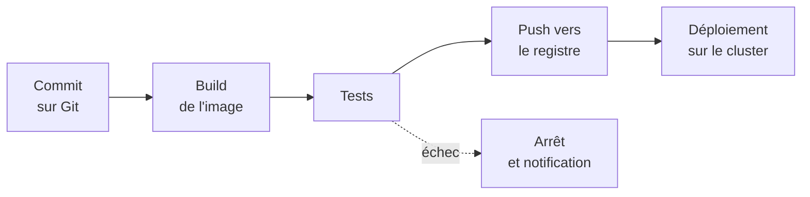
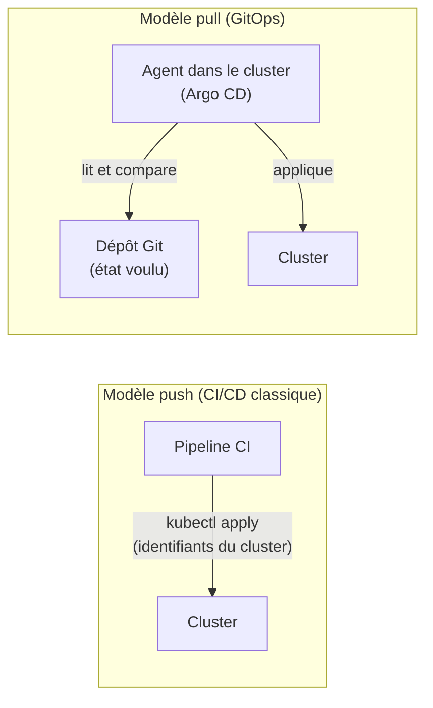

# Chapitre 12 : CI/CD et GitOps

!!! abstract "Objectifs du chapitre"
    - Distinguer intégration continue, livraison continue et déploiement continu
    - Décrire les étapes d'un pipeline qui mène du code à l'application déployée
    - Expliquer le rôle d'un registre d'images et choisir une stratégie d'étiquetage (tags)
    - Décrire les notions de base d'un pipeline GitHub Actions
    - Opposer déploiement « push » et déploiement « pull »
    - Énoncer les principes du GitOps et le fonctionnement d'Argo CD
    - Acquis d'apprentissage visé : **AA7**

## 1. De l'écriture du code à la production

Jusqu'ici, vous avez construit et déployé à la main : écrire un manifeste, lancer `kubectl apply`. Cette pratique ne passe pas à l'échelle : elle dépend d'une personne, elle n'est pas traçable, elle est difficile à reproduire. Le DevOps automatise le chemin complet.

| Sigle | Nom | Ce qui est automatisé |
|---|---|---|
| **CI** | Intégration continue | À chaque modification du code : compiler, construire l'image, tester |
| **CD** | Livraison continue (*delivery*) | Produire un artefact prêt à déployer ; le déploiement reste validé par un humain |
| **CD** | Déploiement continu (*deployment*) | Déployer automatiquement en production chaque modification validée |

## 2. Anatomie d'un pipeline

Un **pipeline** est une suite d'étapes exécutées automatiquement à chaque événement (par exemple un `push` Git).



| Étape | Objectif | Exemples |
|---|---|---|
| Récupérer | Obtenir le code à la version du commit | `git checkout` |
| Construire | Produire l'image du conteneur | `docker build` |
| Tester | Détecter les régressions avant la diffusion | tests unitaires, vérification de syntaxe des manifestes |
| Publier | Envoyer l'image dans un registre | `docker push` |
| Déployer | Mettre à jour le cluster | `kubectl apply`, `helm upgrade`, ou GitOps |

Une règle simple : **un pipeline qui échoue arrête tout**. On ne publie pas une image qui ne passe pas les tests.

## 3. Le registre d'images et les tags

Un **registre** stocke et distribue les images. Le Docker Hub est un registre public ; GitHub propose le sien (GitHub Container Registry, `ghcr.io`) ; les clouds ont les leurs. Une image se désigne ainsi :

```text
registre/organisation/nom:tag
ghcr.io/mon-compte/webapp:1.4.2
```

Le **tag** est une étiquette modifiable : `latest`, ou même `1.4`, peut pointer demain vers une autre image. Le **digest** (`@sha256:...`) identifie, lui, un contenu précis et ne change jamais.

| Stratégie de tag | Avantage | Limite |
|---|---|---|
| `latest` | Simple | Imprévisible, déconseillé (ni reproductible, ni retour arrière) |
| Version sémantique (`1.4.2`) | Lisible par les humains | Doit être attribuée à chaque publication |
| **Identifiant de commit** (`3f2a9c1`) | Chaque image correspond à un commit précis | Moins lisible |
| Digest | Immuable | Illisible |

!!! tip "Bonne pratique"
    Étiquetez chaque image avec l'**identifiant court du commit** (et éventuellement une version). Dans les manifestes, référencez une version précise, jamais `latest`.

## 4. La CI avec GitHub Actions

Votre code est sur GitHub. **GitHub Actions** exécute des pipelines décrits dans des fichiers YAML du dépôt, dans `.github/workflows/`.

| Terme | Définition |
|---|---|
| **Workflow** | Un pipeline, décrit dans un fichier YAML |
| **Événement** (`on`) | Ce qui déclenche le workflow : `push`, `pull_request`, lancement manuel |
| **Job** | Un groupe d'étapes exécuté sur une machine |
| **Runner** | La machine (fournie par GitHub) qui exécute un job |
| **Step** | Une étape : une commande (`run`) ou une action réutilisable (`uses`) |
| **Secret** | Une valeur confidentielle stockée dans les paramètres du dépôt |

```yaml
name: ci
on:
  push:
    branches: [main]
jobs:
  build:
    runs-on: ubuntu-latest
    steps:
      - uses: actions/checkout@v4
      - name: Construire l'image
        run: docker build -t webapp:test .
```

Pour publier dans `ghcr.io`, le workflow s'authentifie avec un jeton temporaire fourni par GitHub (`GITHUB_TOKEN`), à condition de lui donner le droit d'écrire des paquets (`permissions`). Vous verrez le détail au Lab 12.1.

!!! warning "Aucun secret dans le dépôt"
    Un mot de passe ou un jeton ne s'écrit jamais dans un fichier versionné, ni dans un workflow. On utilise les **secrets** du dépôt, injectés à l'exécution. Le site et vos dépôts peuvent être publics.

## 5. Déployer : « push » ou « pull » ?

Une fois l'image publiée, il faut mettre à jour le cluster. Deux modèles s'opposent.



| Critère | Push | Pull (GitOps) |
|---|---|---|
| Qui a accès au cluster ? | Le pipeline, depuis l'extérieur : il faut lui confier des identifiants | Un agent **dans** le cluster : aucun identifiant ne sort |
| Dérive (modification manuelle du cluster) | Non détectée | Détectée et corrigeable |
| Retour arrière | Relancer un pipeline | Revenir à un commit précédent |
| Traçabilité | Journaux du pipeline | Historique Git |

## 6. GitOps

Le **GitOps** applique à l'exploitation les pratiques de développement : **Git est la source de vérité** de l'état voulu du cluster. Ses principes :

1. **Déclaratif** : l'état voulu est décrit en YAML (vous connaissez le modèle depuis le chapitre 1).
2. **Versionné et immuable** : cet état vit dans Git, avec son historique, ses revues et ses retours arrière.
3. **Récupéré automatiquement** : un agent lit le dépôt, sans que quelqu'un « pousse ».
4. **Réconcilié en continu** : l'agent compare l'état réel à l'état voulu et corrige les écarts.

C'est la même boucle de réconciliation que celle des contrôleurs Kubernetes (chapitre 1), élevée d'un niveau : le dépôt Git joue le rôle de la spec.

### Deux dépôts, deux rôles

| Dépôt | Contenu | Qui l'écrit ? |
|---|---|---|
| **Dépôt applicatif** | Code source, `Dockerfile`, workflow CI | Les développeurs |
| **Dépôt de configuration** | Manifestes, chart ou overlays, avec la version d'image à déployer | Le pipeline (après publication) et les exploitants |

La CI construit l'image, puis **met à jour le tag dans le dépôt de configuration**. L'agent GitOps fait le reste. Un seul dépôt reste possible pour un petit projet.

## 7. Argo CD

**Argo CD** est un agent GitOps pour Kubernetes. Il s'installe dans le cluster et surveille des dépôts Git. Vous lui déclarez, pour chaque application, un objet `Application` (un objet personnalisé que Argo CD ajoute à l'API ; le mécanisme sera expliqué au chapitre 14).

```yaml
apiVersion: argoproj.io/v1alpha1
kind: Application
metadata:
  name: webapp
  namespace: argocd
spec:
  project: default
  source:
    repoURL: https://github.com/mon-compte/webapp-config.git
    targetRevision: main
    path: overlays/prod
  destination:
    server: https://kubernetes.default.svc
    namespace: tp-prod
  syncPolicy:
    automated:
      prune: true
      selfHeal: true
```

| Champ | Rôle |
|---|---|
| `source` | Où lire l'état voulu : dépôt, branche, dossier (manifestes, Kustomize ou Helm) |
| `destination` | Où l'appliquer : cluster et namespace |
| `syncPolicy.automated` | Synchronisation sans validation manuelle |
| `prune` | Supprimer du cluster ce qui a disparu de Git |
| `selfHeal` | Corriger automatiquement les modifications faites à la main sur le cluster |

Argo CD affiche deux états par application :

| État | Question | Valeurs |
|---|---|---|
| **Sync** | Le cluster correspond-il à Git ? | `Synced`, `OutOfSync` |
| **Health** | Les ressources fonctionnent-elles ? | `Healthy`, `Progressing`, `Degraded`, `Missing` |

!!! info "Coût en ressources"
    Argo CD déploie plusieurs composants (serveur, contrôleur, serveur de dépôts, etc.). Sur des VMs de 2 Go de RAM, il occupe une part sensible de la mémoire : vous le lancerez dans un cluster où vous avez supprimé les autres applications du TP.

### Et les secrets ?

Le dépôt Git est public ou largement partagé : on n'y met **pas** de Secret Kubernetes en clair (un Secret n'est que de l'encodage en base64, chapitre 4). Les approches courantes sont de chiffrer les secrets avant de les versionner (Sealed Secrets, SOPS) ou d'aller les chercher dans un coffre externe. Ce cours n'en met aucune en œuvre : on se limite à une application sans secret versionné.

!!! tip "À retenir"
    - **CI** : construire et tester à chaque modification ; **CD** : livrer ou déployer automatiquement.
    - Un pipeline s'arrête au premier échec ; on ne publie que ce qui a passé les tests.
    - Étiquetez les images par **commit** ou version précise, jamais `latest`.
    - Aucun secret dans Git ni dans un workflow : utiliser les secrets du dépôt.
    - **Push** : le pipeline accède au cluster ; **pull** : un agent dans le cluster lit Git.
    - **GitOps** : état voulu dans Git, récupéré et **réconcilié en continu** ; l'historique Git est l'historique du cluster.
    - **Argo CD** : un objet `Application` (`source`, `destination`, `syncPolicy`) ; états **Sync** et **Health**.

## Pour vérifier votre compréhension

??? question "Quelle différence entre livraison continue et déploiement continu ?"
    En livraison continue, chaque modification produit un artefact prêt à déployer, mais le déploiement en production est validé par un humain. En déploiement continu, il est automatique.

??? question "Pourquoi éviter le tag `latest` dans un manifeste ?"
    Il peut pointer vers des images différentes selon le moment : le déploiement n'est pas reproductible, on ne sait pas quelle version tourne, et un retour arrière précis est impossible. Un tag lié à un commit ou à une version identifie une image précise.

??? question "Pourquoi le modèle pull est-il considéré comme plus sûr que le modèle push ?"
    Avec le pull, l'agent est dans le cluster et lit Git : aucun identifiant d'accès au cluster n'est confié à un pipeline extérieur.

??? question "Quelqu'un modifie à la main le nombre de réplicas d'un Deployment géré par Argo CD, avec `selfHeal: true`. Que se passe-t-il ?"
    Argo CD détecte l'écart entre le cluster et Git (`OutOfSync`) et rétablit la valeur du dépôt. Pour changer durablement le nombre de réplicas, il faut modifier Git.

??? question "Comment annuler un mauvais déploiement avec GitOps ?"
    En revenant à un commit précédent dans le dépôt de configuration (`git revert`) : l'agent réconcilie le cluster avec cet état.

??? question "Pourquoi ne faut-il pas versionner un Secret Kubernetes tel quel ?"
    Ses valeurs sont seulement encodées en base64, donc lisibles par quiconque a accès au dépôt. Il faut les chiffrer avant de les versionner, ou les stocker hors de Git.

## Labs du chapitre

- [Lab 12.1 : Pipeline CI](lab-12-1-pipeline-ci.md)
- [Lab 12.2 : GitOps avec Argo CD](lab-12-2-gitops-argocd.md)