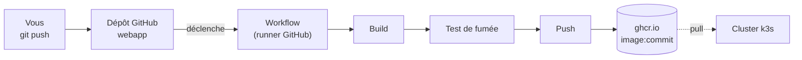

# Lab 12.1 : Pipeline CI

| | |
|---|---|
| **Durée** | 75 à 90 min |
| **Niveau** | Guidé |
| **Prérequis** | [Cours du chapitre 12](cours.md) lu, [Lab 11.2](../ch11-helm-kustomize/lab-11-2-packager-application.md) réalisé, un compte GitHub, `git` installé (poste Windows ou VM), cluster `Ready` |
| **Acquis visés** | AA7 |

!!! abstract "Objectifs"
    - Créer un dépôt GitHub contenant une application et son `Dockerfile`
    - Écrire un workflow GitHub Actions qui construit, teste et publie une image
    - Publier l'image dans le registre `ghcr.io`, étiquetée par l'identifiant du commit
    - Constater qu'un test en échec arrête le pipeline avant la publication
    - Déployer l'image publiée sur votre cluster

## Contexte et schéma

À chaque `push` sur la branche `main`, GitHub construit l'image de votre application, la teste, puis la publie. Aucune commande n'est lancée à la main.



!!! warning "Dépôt public, aucun secret"
    Votre dépôt est public : n'y écrivez ni mot de passe ni jeton. Le workflow utilise le jeton temporaire `GITHUB_TOKEN`, fourni par GitHub à chaque exécution.

!!! note "Ce lab se déroule surtout sur GitHub"
    Seule l'étape 7 utilise le cluster. Les autres étapes se font depuis un poste ayant `git` et un navigateur.

## Étapes

### Étape 1 : Créer le dépôt

Dans votre compte GitHub, créez un dépôt **public** nommé `webapp` (sans fichier initial, ou avec un `README`). Notez :

- votre identifiant GitHub, désigné ci-dessous par `VOTRE-COMPTE`, et écrit **en minuscules** dans les noms d'image ;
- l'adresse du dépôt : `https://github.com/VOTRE-COMPTE/webapp.git`.

Clonez-le :

```bash
git clone https://github.com/VOTRE-COMPTE/webapp.git
cd webapp
git config user.name "Votre Nom"
git config user.email "vous@exemple.org"
```

!!! tip "Authentification pour `git push`"
    GitHub n'accepte plus le mot de passe de votre compte en ligne de commande. Créez un **jeton d'accès personnel** (Paramètres du compte → Developer settings → Personal access tokens) avec le droit d'écrire dans le contenu du dépôt, et saisissez-le à la place du mot de passe lors du premier `push`. Ne l'écrivez dans aucun fichier du dépôt. En cas de difficulté, créez les fichiers par l'interface web du dépôt (**Add file → Create new file**) : le reste du lab est identique.

### Étape 2 : Écrire l'application

L'application est une page web servie par nginx. Créez `index.html` :

```html
<!doctype html>
<html lang="fr">
  <head><meta charset="utf-8"><title>webapp</title></head>
  <body>
    <h1>Bonjour depuis ma CI, version 1</h1>
  </body>
</html>
```

Créez le `Dockerfile` (remplacez `VOTRE-COMPTE`) :

```dockerfile
FROM nginx:1.26-alpine
LABEL org.opencontainers.image.source="https://github.com/VOTRE-COMPTE/webapp"
COPY index.html /usr/share/nginx/html/index.html
```

L'étiquette `org.opencontainers.image.source` relie l'image publiée à votre dépôt dans GitHub.

- [ ] Les fichiers `index.html` et `Dockerfile` existent

### Étape 3 : Écrire le workflow

Créez le dossier et le fichier :

```bash
mkdir -p .github/workflows
```

Contenu de `.github/workflows/ci.yml` :

```yaml
name: ci

on:
  push:
    branches: [main]
  pull_request:

permissions:
  contents: read
  packages: write

jobs:
  build:
    runs-on: ubuntu-latest
    steps:
      - uses: actions/checkout@v4

      - name: Définir le nom et le tag de l'image
        run: |
          echo "IMAGE=ghcr.io/${GITHUB_REPOSITORY_OWNER,,}/webapp" >> "$GITHUB_ENV"
          echo "TAG=${GITHUB_SHA::7}" >> "$GITHUB_ENV"

      - name: Construire l'image
        run: docker build -t "$IMAGE:$TAG" .

      - name: Test de fumée
        run: |
          docker run -d --name test -p 8080:80 "$IMAGE:$TAG"
          sleep 3
          curl -fs http://localhost:8080 | grep -q "Bonjour"

      - name: Se connecter au registre
        if: github.event_name == 'push'
        run: echo "${{ secrets.GITHUB_TOKEN }}" | docker login ghcr.io -u "${{ github.actor }}" --password-stdin

      - name: Publier l'image
        if: github.event_name == 'push'
        run: docker push "$IMAGE:$TAG"
```

Points à comprendre :

| Élément | Rôle |
|---|---|
| `on` | Le workflow se lance à chaque `push` sur `main` et sur chaque `pull_request` |
| `permissions` | Le jeton peut lire le code et **écrire des paquets** (le registre) |
| `${GITHUB_REPOSITORY_OWNER,,}` | Met le nom du propriétaire en minuscules : un nom d'image doit être en minuscules |
| `${GITHUB_SHA::7}` | Les 7 premiers caractères du commit servent de tag |
| `if: github.event_name == 'push'` | On ne publie que sur un `push`, pas sur une `pull_request` |

### Étape 4 : Premier push

```bash
git add .
git commit -m "Application et pipeline CI"
git push origin main
```

Dans GitHub, ouvrez l'onglet **Actions** du dépôt et suivez l'exécution du workflow `ci`. Cliquez sur le job `build` pour lire le journal de chaque étape.

- [ ] Le workflow se termine en succès (coche verte)
- [ ] Les cinq étapes sont exécutées, dont « Publier l'image »

### Étape 5 : Retrouver l'image publiée

Sur la page de votre compte ou du dépôt GitHub, ouvrez la section **Packages** : le paquet `webapp` doit apparaître, avec un tag de 7 caractères (le début de l'identifiant du commit). Comparez-le au commit :

```bash
git log --oneline -1
```

Les deux identifiants doivent correspondre.

**Rendre l'image publique.** Pour que votre cluster puisse la télécharger sans identifiants, ouvrez le paquet → **Package settings** → **Change visibility** → **Public**.

- [ ] Le tag de l'image est le début de l'identifiant du commit
- [ ] Le paquet est public

### Étape 6 : Un test en échec arrête le pipeline

Modifiez `index.html` pour que le mot « Bonjour » disparaisse :

```bash
sed -i 's/Bonjour/Salut/' index.html
git commit -am "Test : on casse volontairement la page"
git push origin main
```

Observez l'onglet **Actions** : le workflow échoue à l'étape « Test de fumée », et les étapes suivantes (connexion, publication) sont **ignorées**. Vérifiez dans **Packages** qu'aucun nouveau tag n'est apparu.

Corrigez ensuite :

```bash
git revert --no-edit HEAD
git push origin main
```

Le workflow repasse au vert et publie une nouvelle image (nouveau tag).

- [ ] Le pipeline échoue au test et ne publie rien
- [ ] Après correction, une nouvelle image est publiée

### Étape 7 : Déployer l'image sur le cluster

Depuis un serveur du cluster :

```bash
k create namespace tp-k8s
k config set-context --current --namespace=tp-k8s
IMAGE=ghcr.io/VOTRE-COMPTE/webapp:<tag-de-7-caracteres>
k run ci-test --image=$IMAGE --restart=Never --port=80
k get pod ci-test -w
```

Quand le Pod est `Running` (`Ctrl+C` pour arrêter la surveillance) :

```bash
k port-forward pod/ci-test 8081:80 &
sleep 2
curl -s localhost:8081
kill %1
```

Vous voyez la page produite par votre pipeline.

- [ ] Le Pod `ci-test` est `Running`
- [ ] La réponse contient le titre de votre page

## Questions de réflexion

??? question "Pourquoi le tag de l'image est-il l'identifiant du commit et non `latest` ?"
    Il relie chaque image à un commit précis : on sait quel code tourne, on peut redéployer une version donnée, et deux images différentes ne partagent jamais le même tag. `latest` change de contenu à chaque publication.

??? question "Pourquoi les étapes de publication sont-elles conditionnées à l'événement `push` ?"
    Une `pull_request` propose une modification qui n'est pas encore validée : on construit et on teste, mais on ne publie rien tant que la modification n'est pas fusionnée dans `main`.

??? question "Que se serait-il passé sans le test de fumée ?"
    L'image cassée aurait été publiée, puis déployée par un exploitant ou par GitOps : le défaut aurait atteint le cluster au lieu d'être arrêté par le pipeline.

??? question "Où est stocké le jeton utilisé pour publier, et pourquoi n'est-il pas dans le dépôt ?"
    `GITHUB_TOKEN` est créé par GitHub pour chaque exécution, avec les seules permissions déclarées dans `permissions`, et expire à la fin. Il n'est donc ni écrit dans un fichier, ni réutilisable plus tard.

??? question "Pourquoi le nom du propriétaire est-il converti en minuscules ?"
    Les noms d'images doivent être en minuscules, alors qu'un identifiant GitHub peut contenir des majuscules.

## Dépannage

| Symptôme | Pistes |
|---|---|
| `git push` refuse l'authentification | Utiliser un jeton d'accès personnel à la place du mot de passe, avec le droit d'écrire dans le contenu du dépôt |
| Aucun workflow ne démarre | Fichier mal placé : il doit se trouver exactement dans `.github/workflows/` et se terminer par `.yml` ou `.yaml` |
| Erreur de syntaxe YAML dans l'onglet Actions | Indentation (espaces uniquement) ; relire le message, qui donne la ligne |
| `repository name must be lowercase` | Nom d'image avec des majuscules : vérifier la conversion `${GITHUB_REPOSITORY_OWNER,,}` |
| `denied: permission_denied` au push de l'image | `permissions: packages: write` absent du workflow ; paramètres du dépôt (Settings → Actions) qui restreignent le jeton |
| Le test de fumée échoue sans raison | `sleep` trop court ; vérifier que le mot recherché est bien dans `index.html` |
| Le Pod reste en `ImagePullBackOff` | Paquet encore privé (étape 5), tag mal recopié, accès Internet de la VM : `k describe pod ci-test` |
| `k run` : `already exists` | Pod `ci-test` déjà créé : `k delete pod ci-test` |

## Nettoyage

```bash
k delete pod ci-test
k config set-context --current --namespace=default
```

Gardez le dépôt `webapp` et l'image publiée : le Lab 12.2 les utilise. Supprimez le jeton d'accès personnel si vous n'en avez plus besoin.