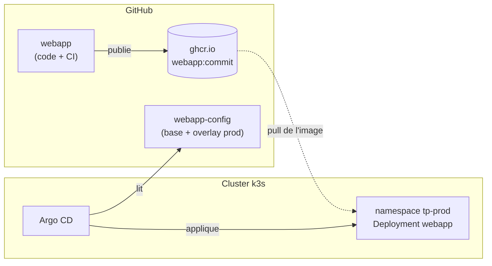

# Lab 12.2 : GitOps avec Argo CD

| | |
|---|---|
| **Durée** | 90 à 120 min |
| **Niveau** | Semi-guidé |
| **Prérequis** | [Lab 12.1](lab-12-1-pipeline-ci.md) réalisé (image publique dans `ghcr.io`), [Lab 11.2](../ch11-helm-kustomize/lab-11-2-packager-application.md) réalisé (Kustomize), [cours du chapitre 12](cours.md) lu, cluster `Ready`, accès Internet depuis les VMs |
| **Acquis visés** | AA7 |

!!! abstract "Objectifs"
    - Installer Argo CD sur le cluster et accéder à son interface
    - Créer un dépôt de configuration au format Kustomize
    - Déclarer une `Application` Argo CD qui déploie l'application depuis Git
    - Déployer une nouvelle version en modifiant Git, sans `kubectl apply`
    - Observer la correction automatique d'une dérive (`selfHeal`) et son absence en mode manuel
    - Revenir à une version précédente avec `git revert`

## Contexte et schéma

Vous séparez désormais le code (dépôt `webapp`, Lab 12.1) de la configuration de déploiement (dépôt `webapp-config`). Argo CD, installé dans le cluster, lit le second et aligne le cluster dessus.



!!! warning "Ressources limitées"
    Argo CD lance plusieurs composants et occupe une part sensible de la mémoire de vos VMs. Avant de commencer, supprimez les namespaces des autres TP (`tp-k8s`, `tp-dev`, `monitoring`, etc.) et surveillez `k top nodes`. Au-delà de 85 % de mémoire sur un nœud, arrêtez et reprenez plus tard.

## Étapes

### Étape 1 : Préparer le cluster

```bash
k get ns
k top nodes
```

Supprimez les namespaces de TP inutiles (`k delete namespace NOM`). Notez la mémoire utilisée par chaque nœud : c'est votre point de départ.

### Étape 2 : Installer Argo CD

Cherchez le numéro de la dernière version stable de la page *Releases* du projet Argo CD (`github.com/argoproj/argo-cd/releases`, depuis votre poste Windows) et fixez-le :

```bash
ARGOVER=<version, par exemple v2.x.y>
k create namespace argocd
k apply -n argocd --server-side -f https://raw.githubusercontent.com/argoproj/argo-cd/$ARGOVER/manifests/install.yaml
k get pods -n argocd -w
```

(`Ctrl+C` pour arrêter la surveillance.) Attendez que tous les Pods soient `Running` et prêts, ce qui peut prendre plusieurs minutes. Vérifiez la mémoire :

```bash
k top nodes
k top pods -n argocd
```

!!! info "Pourquoi `--server-side` ?"
    Certaines définitions d'objets d'Argo CD sont trop volumineuses pour un `apply` classique. L'option `--server-side` demande à l'API server de fusionner les modifications.

- [ ] Tous les Pods du namespace `argocd` sont prêts
- [ ] Les nœuds restent sous 85 % de mémoire

### Étape 3 : Accéder à l'interface

Récupérez le mot de passe initial de l'utilisateur `admin`, puis exposez l'interface :

```bash
k -n argocd get secret argocd-initial-admin-secret -o jsonpath="{.data.password}" | base64 -d; echo
k port-forward -n argocd svc/argocd-server 8443:443 --address 0.0.0.0
```

Laissez cette commande tourner dans un terminal. Depuis le navigateur du poste Windows, ouvrez `https://IP-DU-SERVEUR:8443` (acceptez l'avertissement : le certificat est auto-signé), puis connectez-vous avec `admin`.

- [ ] L'interface Argo CD s'affiche
- [ ] Vous êtes connectés (liste d'applications vide)

### Étape 4 : Créer le dépôt de configuration

Créez un dépôt GitHub **public** `webapp-config`. Il doit contenir cette arborescence :

```text
webapp-config/
├── base/
│   ├── kustomization.yaml
│   ├── deployment.yaml
│   └── service.yaml
└── overlays/
    └── prod/
        └── kustomization.yaml
```

`base/deployment.yaml` (remplacez `VOTRE-COMPTE`) :

```yaml
apiVersion: apps/v1
kind: Deployment
metadata:
  name: webapp
spec:
  replicas: 1
  selector:
    matchLabels:
      app: webapp
  template:
    metadata:
      labels:
        app: webapp
    spec:
      containers:
        - name: webapp
          image: ghcr.io/VOTRE-COMPTE/webapp
          ports:
            - containerPort: 80
          readinessProbe:
            httpGet:
              path: /
              port: 80
          resources:
            requests:
              cpu: 20m
              memory: 16Mi
            limits:
              cpu: 100m
              memory: 64Mi
```

À écrire vous-mêmes :

- `base/service.yaml` : un Service `webapp` de type `ClusterIP`, port 80, sélecteur `app: webapp` ;
- `base/kustomization.yaml` : la liste des deux ressources ;
- `overlays/prod/kustomization.yaml` : référence `../../base`, namespace `tp-prod`, **2 réplicas** (patch) et **tag de l'image** (transformation `images`, `name` = `ghcr.io/VOTRE-COMPTE/webapp`, `newTag` = un tag de 7 caractères de votre registre).

??? tip "Indices"
    - Reprenez la structure de l'overlay `prod` du Lab 11.2.
    - Le patch de réplicas est un fichier `replicas.yaml` à côté de l'overlay, qui désigne le Deployment `webapp`.
    - L'image sans tag dans la base est valable : c'est l'overlay qui fixe `newTag`.

Vérifiez le rendu **avant** de pousser :

```bash
kubectl kustomize overlays/prod
```

Cherchez `replicas: 2`, `namespace: tp-prod` et l'image complète avec son tag. Puis publiez le dépôt (`git add`, `git commit`, `git push`), comme au Lab 12.1.

- [ ] Le rendu de l'overlay contient 2 réplicas, le namespace `tp-prod` et l'image avec son tag
- [ ] Le dépôt `webapp-config` est publié sur GitHub

### Étape 5 : Déclarer l'application

Créez `application.yaml` **sur le serveur** (ce fichier n'est pas dans le dépôt de configuration) :

```bash
cat <<'EOF2' > application.yaml
apiVersion: argoproj.io/v1alpha1
kind: Application
metadata:
  name: webapp
  namespace: argocd
spec:
  project: default
  source:
    repoURL: https://github.com/VOTRE-COMPTE/webapp-config.git
    targetRevision: main
    path: overlays/prod
  destination:
    server: https://kubernetes.default.svc
    namespace: tp-prod
  syncPolicy:
    automated:
      prune: true
      selfHeal: true
    syncOptions:
      - CreateNamespace=true
EOF2
k apply -f application.yaml
k get applications -n argocd
```

Dans l'interface, ouvrez l'application `webapp` : suivez la synchronisation. Vérifiez ensuite le cluster :

```bash
k get pods,svc -n tp-prod
k get applications -n argocd
```

L'état attendu est `Synced` et `Healthy`.

- [ ] L'application est `Synced` et `Healthy`
- [ ] Deux Pods `webapp` tournent dans `tp-prod`
- [ ] Vous avez trouvé, dans l'interface, la représentation graphique Deployment → ReplicaSet → Pods

### Étape 6 : Déployer une nouvelle version par Git

1. Dans le dépôt `webapp` (Lab 12.1), changez le titre de `index.html` (« version 2 »), puis `git commit` et `git push`. La CI publie une nouvelle image : relevez son tag (7 caractères).
2. Dans le dépôt `webapp-config`, modifiez `newTag` dans `overlays/prod/kustomization.yaml`, puis `git commit` et `git push`.
3. **Sans toucher au cluster**, observez Argo CD :

```bash
k get pods -n tp-prod -w
k get applications -n argocd
```

Argo CD interroge Git à intervalle régulier (environ toutes les trois minutes). Pour ne pas attendre, cliquez sur **Refresh** dans l'interface. La nouvelle version est déployée par un rolling update.

Vérifiez que l'image du Deployment est la nouvelle :

```bash
k get deploy webapp -n tp-prod -o jsonpath='{.spec.template.spec.containers[0].image}'; echo
```

- [ ] La CI a publié un nouveau tag
- [ ] Après la modification de Git, le Deployment utilise la nouvelle image sans `kubectl apply`

### Étape 7 : La dérive est corrigée (`selfHeal`)

Modifiez le cluster **à la main** :

```bash
k scale deployment webapp -n tp-prod --replicas=5
k get pods -n tp-prod -w
```

Observez : Argo CD détecte l'écart et ramène le Deployment à 2 réplicas, valeur de Git. Notez le délai.

- [ ] Le nombre de réplicas revient à 2 sans intervention

### Étape 8 : Passer en synchronisation manuelle

Retirez la synchronisation automatique de l'application :

```bash
k patch application webapp -n argocd --type merge -p '{"spec":{"syncPolicy":null}}'
k scale deployment webapp -n tp-prod --replicas=5
k get applications -n argocd
```

Cette fois, l'application passe à `OutOfSync` et le cluster **reste** à 5 réplicas. Dans l'interface, la ressource est signalée en écart. Cliquez sur **Sync** : le cluster est ramené à l'état de Git.

Rétablissez ensuite la synchronisation automatique avec `k apply -f application.yaml`.

- [ ] L'application est `OutOfSync`, et le cluster n'est pas corrigé automatiquement
- [ ] Un clic sur **Sync** rétablit l'état voulu
- [ ] La synchronisation automatique est rétablie

### Étape 9 : Revenir en arrière avec Git

Dans le dépôt `webapp-config`, annulez la dernière modification de tag :

```bash
git revert --no-edit HEAD
git push origin main
```

Après un **Refresh**, observez : le Deployment revient à l'image précédente. L'historique de Git est le journal de vos déploiements.

```bash
git log --oneline
```

- [ ] Le Deployment utilise de nouveau l'image précédente
- [ ] `git log` montre la mise à jour puis son annulation

## Questions de réflexion

??? question "Qu'est-ce qui, dans cette démarche, remplace `kubectl apply` ?"
    Un `git push` dans le dépôt de configuration. L'agent Argo CD lit Git et applique les différences ; plus personne n'a besoin d'identifiants d'administration du cluster pour déployer.

??? question "Quelle différence de comportement entre l'étape 7 et l'étape 8 ?"
    Avec `selfHeal`, Argo CD corrige seul la dérive. Sans synchronisation automatique, il se contente de **signaler** l'écart (`OutOfSync`) et attend une action humaine (Sync).

??? question "Pourquoi n'avez-vous pas versionné `application.yaml` dans `webapp-config` ?"
    L'objet `Application` décrit comment Argo CD lit le dépôt : il est géré à part, côté cluster. Versionner dans le même dépôt est possible (modèle « app of apps »), mais demande une amorce manuelle et dépasse ce lab.

??? question "Que se passe-t-il si quelqu'un pousse dans `webapp-config` une image qui n'existe pas ?"
    Argo CD applique le changement, les nouveaux Pods restent en `ImagePullBackOff`, l'état Health passe à `Progressing` puis `Degraded`, tandis que les anciens Pods continuent de servir pendant le rolling update. Le retour arrière se fait par `git revert`.

??? question "Quelle étape de cette chaîne reste manuelle, et comment l'automatiser ?"
    La mise à jour du tag dans `webapp-config` après la publication de l'image. La CI peut la faire elle-même (commit automatique dans le dépôt de configuration, avec un jeton limité à ce dépôt), ou un outil dédié peut surveiller le registre.

## Dépannage

| Symptôme | Pistes |
|---|---|
| `k apply` du `install.yaml` : `Too long` | Option `--server-side` oubliée |
| Pods d'Argo CD `Pending` ou redémarrages | Mémoire insuffisante : supprimer d'autres namespaces, `k top nodes`, `k describe pod` |
| Interface inaccessible depuis Windows | `port-forward` arrêté, `--address 0.0.0.0` oublié, pare-feu `ufw` de la VM, `https://` oublié dans l'URL |
| Connexion refusée avec `admin` | Mot de passe mal recopié ; relire le Secret `argocd-initial-admin-secret` |
| Application en `Unknown` ou `ComparisonError` | URL du dépôt incorrecte, dépôt privé, `path` absent du dépôt : `k describe application webapp -n argocd` |
| Erreur `kustomize build` dans Argo CD | Rendu invalide : tester `kubectl kustomize overlays/prod` localement avant de pousser |
| `OutOfSync` permanent juste après le déploiement | Champ modifié par un autre acteur (ou, ici, `replicas`) ; relire la différence dans l'interface |
| Pods `ImagePullBackOff` | Paquet `ghcr.io` privé, tag erroné, accès Internet : `k describe pod -n tp-prod` |
| Argo CD ne voit pas le push | Attendre ~3 minutes ou cliquer sur **Refresh** ; vérifier la branche (`targetRevision`) |
| `selfHeal` ne corrige pas | Application sans `syncPolicy.automated` (étape 8 non annulée) |

## Nettoyage

```bash
k delete application webapp -n argocd
k delete namespace tp-prod
k delete -n argocd --server-side -f https://raw.githubusercontent.com/argoproj/argo-cd/$ARGOVER/manifests/install.yaml 2>/dev/null
k delete namespace argocd
k get crd | grep argoproj
```

Si des définitions `argoproj.io` subsistent, supprimez-les :

```bash
k delete crd applications.argoproj.io applicationsets.argoproj.io appprojects.argoproj.io
```

Arrêtez le `port-forward` (`Ctrl+C`). Conservez les dépôts `webapp` et `webapp-config` : ils serviront de base au projet fil rouge.