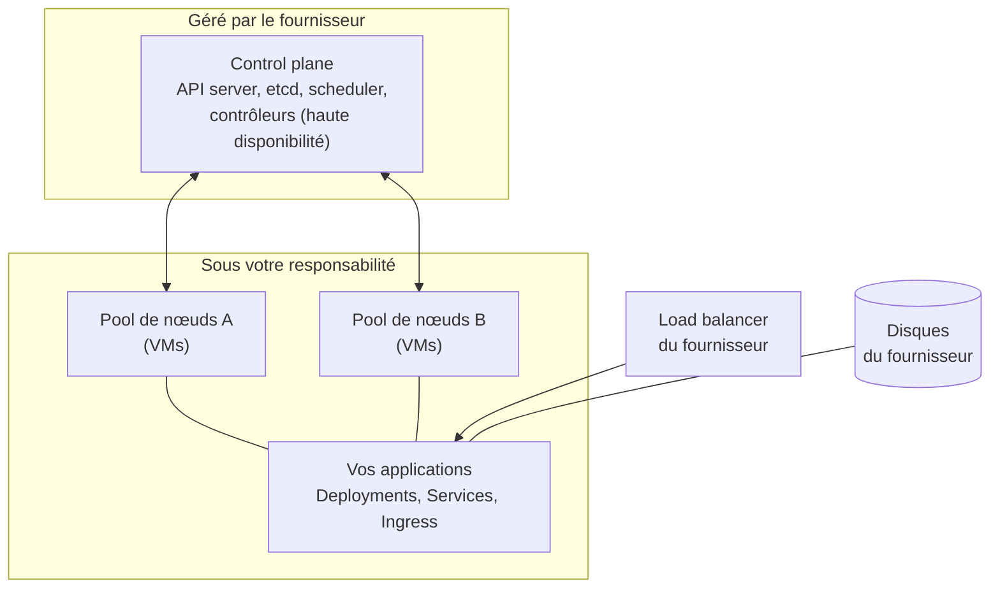
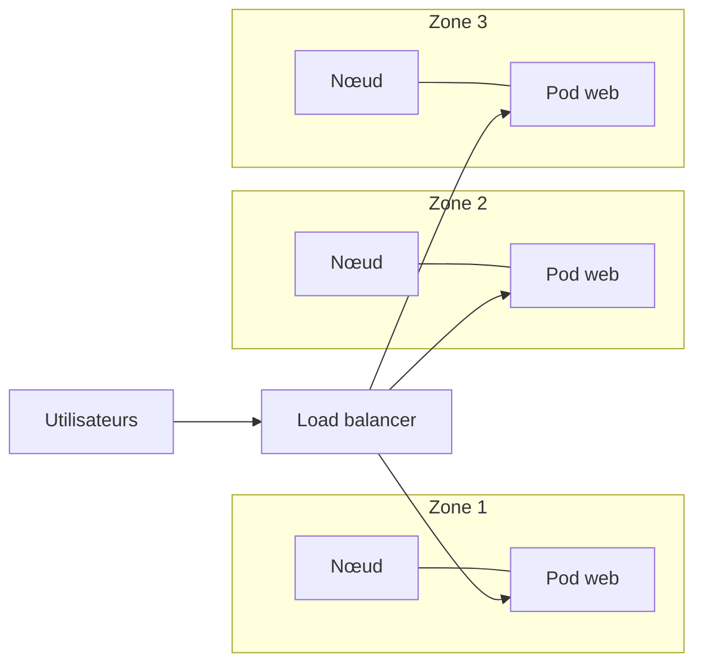
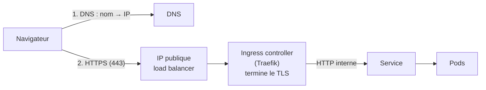

# Chapitre 13 : Cloud managé et haute disponibilité

!!! abstract "Objectifs du chapitre"
    - Décrire ce qu'est un Kubernetes managé (AKS, EKS, GKE) et ce qu'il change par rapport à k3s
    - Appliquer le modèle de responsabilité partagée : qui gère quoi
    - Identifier les postes de coût d'un cluster et les leviers pour les réduire
    - Expliquer la haute disponibilité à l'échelle du cloud : zones de disponibilité et domaines de panne
    - Décrire le chemin d'une requête publique : DNS, load balancer, Ingress, TLS
    - Évaluer une architecture selon la **fiabilité**, le **coût** et la **sécurité**
    - Acquis d'apprentissage visé : **AA8**

## 1. Du cluster de TP au cluster de production

Vos clusters de TP vivent sur des VMs locales, sans exposition publique. Un cluster de production se déploie en général dans un **cloud public**, accessible depuis Internet, avec des exigences de disponibilité, de coût et de sécurité. Deux voies :

| Voie | Principe | Exemple |
|---|---|---|
| **Auto-géré** | Vous installez et exploitez Kubernetes sur des VMs du cloud (ou chez vous) | k3s sur des VMs |
| **Managé** | Le fournisseur exploite le plan de contrôle ; vous gérez les nœuds de travail et les applications | AKS (Azure), EKS (AWS), GKE (Google Cloud) |

## 2. Kubernetes managé

Dans un service managé, le fournisseur déploie, met à jour et surveille le **control plane** (API server, etcd, scheduler, contrôleurs). Vous ne voyez pas ces composants et vous n'y accédez pas par SSH : vous recevez un point d'accès à l'API et un fichier kubeconfig.



Les nœuds sont regroupés en **pools de nœuds** (*node pools*, ou *managed node groups* chez AWS) : des groupes de VMs de même taille, que le fournisseur crée, remplace et met à l'échelle à votre demande.

### Intégrations propres au cloud

| Besoin | Sur vos clusters k3s | Dans un cloud managé |
|---|---|---|
| Service `LoadBalancer` | ServiceLB : utilise l'IP des nœuds | Création d'un **load balancer du fournisseur** avec une IP publique (facturé) |
| Volumes (`StorageClass`) | `local-path` : disque du nœud | **Disques du fournisseur**, attachés au Pod où qu'il soit, mais souvent liés à une **zone** |
| Identité | Comptes et RBAC Kubernetes | RBAC Kubernetes, plus intégration avec l'annuaire du fournisseur (IAM, Entra ID) |
| Ajout de nœuds | À la main | Autoscaling des pools (chapitre 10 : *Cluster Autoscaler*) |
| Mises à jour | `k3s` par vous (chapitre 8) | Mise à jour du control plane par le fournisseur, des nœuds par vous ou de façon automatisée |

## 3. Le modèle de responsabilité partagée

Passer en managé **déplace** des responsabilités, il ne les supprime pas.

| Domaine | Auto-géré (k3s sur VMs) | Managé (AKS, EKS, GKE) |
|---|---|---|
| Datacenter, matériel | Vous (ou le cloud pour les VMs) | Fournisseur |
| Control plane : installation, disponibilité, sauvegarde etcd | **Vous** | **Fournisseur** |
| Mise à jour de version Kubernetes | Vous | Le fournisseur propose, vous déclenchez ou planifiez |
| Système d'exploitation et correctifs des nœuds | Vous | Selon l'offre : le plus souvent **vous** (ou mise à jour d'image automatisée) |
| Réseau, pare-feu, accès à l'API | Vous | Vous, avec les outils du fournisseur |
| RBAC, Pod Security, NetworkPolicies | **Vous** | **Vous** |
| Applications, images, secrets | **Vous** | **Vous** |
| Sauvegarde des **données** applicatives | **Vous** | **Vous** |
| Coût | Vos VMs | Nœuds, et souvent frais de control plane, load balancers, disques, trafic |

!!! warning "Les détails varient"
    Les périmètres exacts changent d'un fournisseur et d'une offre à l'autre (mode standard, mode « automatique » où le fournisseur gère aussi les nœuds). Vérifiez toujours la documentation du service choisi : c'est la source de référence.

!!! tip "La règle à retenir"
    Le fournisseur est responsable **du cluster** (le plan de contrôle). Vous restez responsable **de ce que vous y mettez** : configuration, droits, images, données, et de leur sécurité.

## 4. Les coûts

Un cluster cloud se facture à l'usage. Pas de prix à connaître par cœur : ils changent, utilisez le **simulateur de prix** du fournisseur. Retenez les postes :

| Poste | Remarque |
|---|---|
| **Nœuds** (VMs) | Le poste principal ; facturés tant qu'ils existent, même sans charge |
| **Control plane** | Gratuit ou payant selon le fournisseur et le niveau de service |
| **Load balancers** | Un par Service `LoadBalancer` : mutualiser avec un Ingress |
| **Disques** | Facturés même si le Pod est supprimé, tant que le volume existe |
| **Trafic sortant** (egress) | Souvent payant, entre zones comme vers Internet |
| **Outils annexes** | Journaux, métriques, registres : au volume stocké |

Leviers pour réduire la facture :

- **dimensionner** : des `requests` réalistes (chapitre 4) évitent de payer des nœuds vides ;
- **autoscaler** : pods (HPA) et nœuds (Cluster Autoscaler), chapitre 10 ;
- **arrêter** ce qui ne sert pas : environnements de test hors des heures de travail ;
- **supprimer les ressources orphelines** : load balancers, disques, IP publiques ;
- utiliser des VMs **à tarif réduit** (« spot », « preemptible ») pour les charges qui supportent d'être interrompues ;
- mettre en place des **budgets et alertes de dépense**.

!!! danger "Un cluster oublié coûte cher"
    Le risque principal en TP est d'oublier des ressources allumées. Notez ce que vous créez, fixez une alerte de budget, et détruisez tout en fin de séance.

## 5. La haute disponibilité dans le cloud

Dans le chapitre 8, vous avez tenu la panne d'un serveur. Le cloud ajoute une échelle : les **domaines de panne**.

| Niveau | Exemple de panne | Protection |
|---|---|---|
| Processus | Crash de l'application | Redémarrage par Kubernetes, sondes |
| Nœud | Panne d'une VM | Plusieurs réplicas sur des nœuds différents |
| **Zone de disponibilité** | Panne d'un datacenter (alimentation, réseau) | Réplicas et nœuds répartis sur **plusieurs zones** |
| Région | Sinistre régional | Déploiement multi-région (hors programme) |



Chaque nœud porte automatiquement le label `topology.kubernetes.io/zone`. Vous répartissez les réplicas avec la contrainte que vous connaissez (chapitre 10), en changeant la **clé de topologie** :

```yaml
topologySpreadConstraints:
  - maxSkew: 1
    topologyKey: topology.kubernetes.io/zone
    whenUnsatisfiable: ScheduleAnyway
    labelSelector:
      matchLabels:
        app: web
```

Points de vigilance :

- **Un disque est lié à une zone.** Un Pod avec un volume ne peut redémarrer que dans la zone de son disque : si la zone tombe, l'application avec état est indisponible. Il faut alors répliquer les données (base répliquée, service de base de données managé) et sauvegarder.
- **Le quorum d'etcd** (auto-géré) demande une majorité : 3 serveurs répartis sur 3 zones tolèrent la perte d'une zone, 2 serveurs ne tolèrent rien.
- La haute disponibilité a un **coût** (ressources en double, trafic entre zones) : on la dimensionne selon l'objectif de disponibilité de l'application.
- Les **PodDisruptionBudgets** protègent contre les arrêts volontaires, pas contre les pannes.

## 6. Exposer une application sur Internet

Une application publique suit ce chemin :



1. Un **enregistrement DNS** associe un nom à l'IP publique.
2. Le trafic arrive sur une **IP publique**, celle d'un load balancer (cloud) ou d'une VM.
3. L'**Ingress controller** reçoit la requête, choisit le Service selon l'hôte et le chemin (chapitre 3), et **termine le TLS** : il déchiffre le HTTPS.

### TLS et certificats

Le **TLS** chiffre la communication et prouve l'identité du serveur grâce à un **certificat** signé par une **autorité de certification** (CA). Sans certificat valide, le navigateur affiche un avertissement.

- **Let's Encrypt** est une autorité gratuite et automatisée. Pour délivrer un certificat, elle vérifie que vous contrôlez le nom de domaine : avec le défi **HTTP-01**, elle interroge votre serveur sur le port 80 à une adresse précise. Il faut donc un **nom de domaine public** pointant vers votre IP, et le port 80 ouvert.
- Un certificat a une durée de vie courte et doit être **renouvelé** : l'automatiser est indispensable.
- Dans Kubernetes, le certificat et sa clé sont stockés dans un **Secret** de type `kubernetes.io/tls`, référencé par l'Ingress :

```yaml
spec:
  tls:
    - hosts:
        - app.exemple.org
      secretName: app-tls
  rules:
    - host: app.exemple.org
      # ...
```

- **cert-manager** est un composant tiers très répandu qui obtient et renouvelle les certificats automatiquement (il utilise des objets personnalisés comme `ClusterIssuer` et `Certificate`, expliqués au chapitre 14). Traefik peut aussi obtenir des certificats Let's Encrypt par lui-même.

### Réduire la surface d'attaque

| Mesure | Pourquoi |
|---|---|
| N'ouvrir que **80 et 443** vers Internet | Tout autre port exposé est une cible |
| Ne **pas** exposer l'API Kubernetes (6443) à tout Internet | Restreindre aux adresses d'administration |
| Pas de `NodePort` ouvert en public | Contourne l'Ingress et le TLS |
| Pare-feu du cloud (groupes de sécurité) **et** NetworkPolicies | Deux niveaux de filtrage |
| Rediriger HTTP vers HTTPS | Évite les échanges en clair |
| Aucun secret dans Git (chapitre 12) | Les dépôts sont publics ou partagés |

## 7. Évaluer une architecture (AA8)

Évaluer, c'est comparer des options selon des critères, puis **justifier** un choix. Trois critères structurent la démarche :

| Critère | Questions à poser |
|---|---|
| **Fiabilité** | Quelle panne l'application tolère-t-elle (nœud, zone) ? Quel temps de reprise, quelle perte de données acceptable ? |
| **Coût** | Combien coûte l'architecture par mois ? Où est le gaspillage ? Que coûterait la haute disponibilité ? |
| **Sécurité** | Qu'est-ce qui est exposé ? Qui a quels droits ? Où sont les secrets ? Qui est responsable de quoi ? |

Exemple de grille de comparaison :

| | k3s sur VMs cloud | Kubernetes managé |
|---|---|---|
| Fiabilité du control plane | À votre charge (3 serveurs, sauvegardes) | Assurée par le fournisseur |
| Effort d'exploitation | Élevé | Plus faible |
| Coût | VMs seulement, parfois plus bas | Frais de service possibles, plus d'intégrations facturées |
| Maîtrise et portabilité | Totale | Dépendance aux outils du fournisseur |
| Sécurité | Tout est à votre charge | Partagée, selon le modèle |

Il n'y a pas de « meilleure » réponse : le bon choix dépend des **besoins** (disponibilité, budget, compétences de l'équipe). Une équipe réduite et sans objectif de haute disponibilité forte préfère souvent le managé ; un laboratoire, un site isolé ou un besoin de maîtrise totale préfère k3s.

!!! tip "À retenir"
    - Un Kubernetes **managé** délègue le **control plane** au fournisseur ; les **nœuds**, les **applications**, la **sécurité** et les **données** restent à vous.
    - Un Service `LoadBalancer` crée un load balancer **facturé** ; un Ingress permet d'en mutualiser un.
    - Principaux coûts : nœuds, load balancers, disques, trafic sortant. Leviers : dimensionner, autoscaler, éteindre, supprimer les orphelins.
    - **Zones de disponibilité** : répartir les réplicas avec `topology.kubernetes.io/zone` ; un disque est lié à une zone.
    - Exposition publique : **DNS**, IP publique, Ingress, **TLS** (Let's Encrypt, renouvellement automatique) ; ouvrir seulement 80 et 443.
    - Évaluer = comparer selon **fiabilité, coût, sécurité**, et justifier.

## Pour vérifier votre compréhension

??? question "Dans un cluster managé, qui répare une panne de l'API server, et qui répare une application qui plante à cause d'une mauvaise configuration ?"
    Le fournisseur répare l'API server (control plane). La mauvaise configuration de l'application relève de vous : elle fait partie des applications dont vous restez responsable.

??? question "Pourquoi créer un Service `LoadBalancer` par application peut-il coûter cher, et quelle alternative proposer ?"
    Chaque Service `LoadBalancer` crée un load balancer facturé avec son IP publique. Un seul Ingress controller derrière un seul load balancer peut desservir plusieurs applications selon l'hôte et le chemin.

??? question "Pourquoi un Pod avec un volume ne survit-il pas forcément à la perte d'une zone ?"
    Les disques du cloud sont liés à une zone. Le Pod ne peut redémarrer que dans la zone du disque : si cette zone tombe, le Pod ne peut pas repartir ailleurs avec ses données. Il faut répliquer les données ou les restaurer depuis une sauvegarde.

??? question "Que faut-il pour obtenir un certificat Let's Encrypt avec le défi HTTP-01 ?"
    Un nom de domaine public qui pointe vers l'IP du cluster, et le port 80 accessible depuis Internet, pour que l'autorité puisse vérifier que vous contrôlez le domaine.

??? question "Pourquoi ne pas ouvrir le port 6443 de l'API Kubernetes à tout Internet ?"
    L'API donne le contrôle du cluster : l'exposer à tous multiplie les risques d'attaque (scan, exploitation d'une faille ou d'identifiants volés). On limite l'accès aux adresses d'administration.

??? question "Une application doit rester disponible si une zone entière tombe. Quels éléments d'architecture ajoutez-vous, et quel en est le coût ?"
    Des nœuds dans au moins deux ou trois zones, des réplicas répartis par zone (`topologySpreadConstraints` sur `topology.kubernetes.io/zone`), des données répliquées. Le coût : ressources en double ou en triple et trafic entre zones.

## Labs du chapitre

- [Lab 13.1 : Cluster sur VMs cloud](lab-13-1-cluster-vms-cloud.md)
- [Lab 13.2 : Exposition publique](lab-13-2-exposition-publique.md)