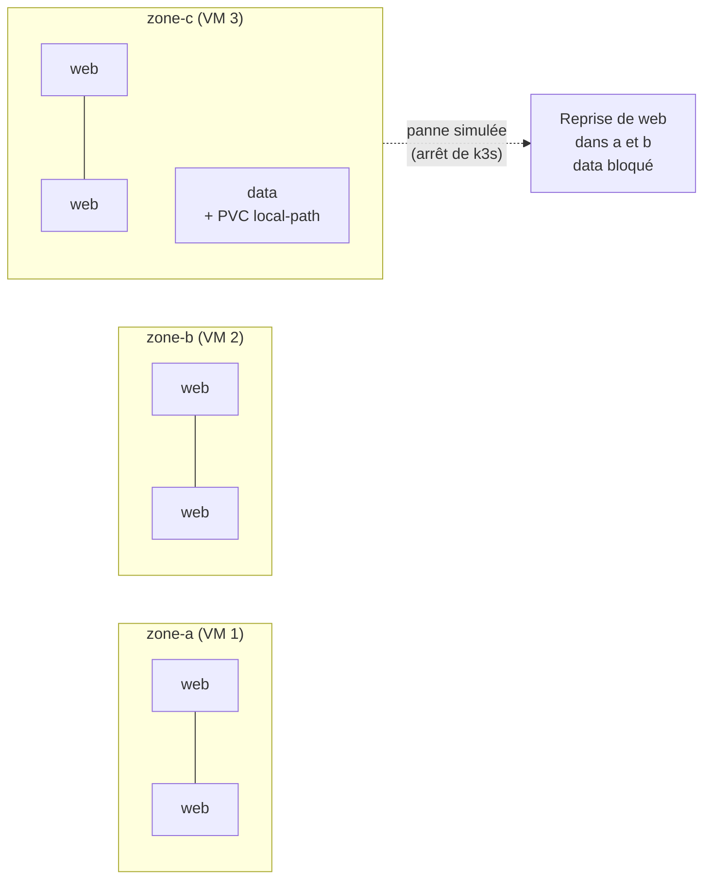

# Lab 13.1 : Haute disponibilité multi-zones

| | |
|---|---|
| **Durée** | 90 à 120 min |
| **Niveau** | Semi-guidé |
| **Prérequis** | [Cours du chapitre 13](cours.md) lu, [Lab 10.2](../../partie-3-exploitation/ch10-autoscaling-scheduling/lab-10-2-placement.md) réalisé (répartition, tolerations), [Lab 5.1](../../partie-2-configuration-donnees-securite/ch05-stockage/lab-5-1-volumes-persistants.md) réalisé (PVC `local-path`), cluster à 3 nœuds `Ready` |
| **Acquis visés** | AA8 (AA6 en soutien) |

!!! abstract "Objectifs"
    - Simuler trois zones de disponibilité sur votre cluster de trois VMs
    - Répartir les réplicas d'une application par zone avec `topologySpreadConstraints`
    - Simuler la perte d'une zone et mesurer la reprise de l'application
    - Constater qu'un volume lié à un nœud empêche la reprise d'une application avec état
    - Estimer le coût d'une architecture cloud équivalente avec un simulateur de prix public
    - Comparer k3s auto-géré et Kubernetes managé selon fiabilité, coût et sécurité

## Contexte et schéma

Un cloud public n'est pas nécessaire pour comprendre les zones de disponibilité. Dans ce lab, **chaque VM joue le rôle d'une zone** : vous étiquetez les nœuds comme le ferait un fournisseur, vous répartissez l'application sur les zones, puis vous « coupez » une zone en arrêtant k3s sur sa VM.



!!! info "Ce qui est simulé"
    Chez un fournisseur cloud, les nœuds portent automatiquement le label `topology.kubernetes.io/zone`. Ici, vous le posez à la main : le comportement de Kubernetes est le même, car il ne connaît que ce label. Un disque `local-path` est lié à un nœud, comme un disque cloud l'est à une zone.

!!! warning "Un nœud sera arrêté"
    Vous arrêtez k3s sur un nœud pendant quelques minutes. Gardez une session `kubectl` sur un **autre** nœud. Si votre cluster n'a qu'un serveur, la zone coupée doit être un **agent**.

## Étapes

### Étape 1 : Préparer le cluster

```bash
k create namespace tp-k8s
k config set-context --current --namespace=tp-k8s
k get nodes -o wide
k top nodes
N1=$(k get nodes -o jsonpath='{.items[0].metadata.name}')
N2=$(k get nodes -o jsonpath='{.items[1].metadata.name}')
N3=$(k get nodes -o jsonpath='{.items[2].metadata.name}')
echo $N1 $N2 $N3
```

Vérifiez qu'aucune étiquette de zone n'existe déjà, ni de taint hérité du Lab 10.2 :

```bash
k get nodes -L topology.kubernetes.io/zone
k describe nodes | grep -i taints
```

### Étape 2 : Déclarer les zones

```bash
k label node $N1 topology.kubernetes.io/zone=zone-a
k label node $N2 topology.kubernetes.io/zone=zone-b
k label node $N3 topology.kubernetes.io/zone=zone-c
k get nodes -L topology.kubernetes.io/zone
```

- [ ] Chaque nœud porte une zone différente

### Étape 3 : Une application répartie par zone

Créez `web.yaml`. Complétez les deux zones `À COMPLÉTER` :

```yaml
apiVersion: apps/v1
kind: Deployment
metadata:
  name: web
spec:
  replicas: 6
  selector:
    matchLabels:
      app: web
  template:
    metadata:
      labels:
        app: web
    spec:
      # À COMPLÉTER : contrainte de répartition par zone
      #   (clé de topologie : topology.kubernetes.io/zone, maxSkew 1, ScheduleAnyway)
      # À COMPLÉTER : tolerations de 30 secondes pour les taints
      #   node.kubernetes.io/not-ready et node.kubernetes.io/unreachable
      containers:
        - name: web
          image: nginx:1.26-alpine
          ports:
            - containerPort: 80
          readinessProbe:
            httpGet:
              path: /
              port: 80
          resources:
            requests:
              cpu: 20m
              memory: 16Mi
            limits:
              cpu: 100m
              memory: 64Mi
```

??? tip "Indices"
    - Le bloc `topologySpreadConstraints` figure dans le cours (section 5). Il se place au niveau de `spec` du Pod, au même niveau que `containers`.
    - Son `labelSelector` doit sélectionner `app: web`.
    - Une toleration s'écrit avec `key`, `operator: Exists`, `effect: NoExecute` et `tolerationSeconds: 30`. Il en faut deux (chapitre 10).
    - Le délai par défaut de 300 s est raccourci à 30 s uniquement pour que le TP ne dure pas.

```bash
k apply -f web.yaml
k get pods -l app=web -o wide
k get pods -l app=web -o wide --no-headers | awk '{print $7}' | sort | uniq -c
```

La dernière commande compte les Pods par nœud, donc par zone. Attendu : 2 Pods par zone.

- [ ] Les 6 Pods sont `Running`
- [ ] La répartition est de 2 par zone

### Étape 4 : Une application avec état

Créez `data.yaml` :

```yaml
apiVersion: v1
kind: PersistentVolumeClaim
metadata:
  name: data-pvc
spec:
  accessModes: ["ReadWriteOnce"]
  storageClassName: local-path
  resources:
    requests:
      storage: 100Mi
---
apiVersion: apps/v1
kind: Deployment
metadata:
  name: data
spec:
  replicas: 1
  selector:
    matchLabels:
      app: data
  template:
    metadata:
      labels:
        app: data
    spec:
      tolerations:
        - key: node.kubernetes.io/not-ready
          operator: Exists
          effect: NoExecute
          tolerationSeconds: 30
        - key: node.kubernetes.io/unreachable
          operator: Exists
          effect: NoExecute
          tolerationSeconds: 30
      containers:
        - name: data
          image: busybox:1.36
          command: ["sh", "-c", "echo \"démarrage $(date)\" >> /data/log.txt; sleep 36000"]
          volumeMounts:
            - name: data
              mountPath: /data
      volumes:
        - name: data
          persistentVolumeClaim:
            claimName: data-pvc
```

```bash
k apply -f data.yaml
k get pods,pvc -l app=data -o wide
k get pvc data-pvc
DATANODE=$(k get pod -l app=data -o jsonpath='{.items[0].spec.nodeName}')
echo $DATANODE
k exec deploy/data -- cat /data/log.txt
```

Notez le nœud qui héberge `data` : c'est lui qui sera coupé.

!!! note "Cluster à un seul serveur"
    Si `$DATANODE` est le serveur, supprimez `data` et le PVC, faites `k cordon` sur le serveur, recréez `data`, puis `k uncordon`. Le Pod sera alors placé sur un agent.

- [ ] Le PVC `data-pvc` est `Bound`
- [ ] Le fichier `/data/log.txt` contient une ligne de démarrage

### Étape 5 : Perdre une zone

Notez l'heure. Dans un **deuxième terminal** relié à `$DATANODE` (SSH), arrêtez k3s :

```bash
sudo systemctl stop k3s          # sur un serveur
# ou : sudo systemctl stop k3s-agent    # sur un agent
```

Depuis la session `kubectl` d'un **autre nœud**, observez dans deux terminaux :

```bash
k get nodes -w
k get pods -o wide -w
```

Relevez :

- l'heure à laquelle le nœud passe `NotReady` ;
- l'heure à laquelle les Pods `web` du nœud coupé sont recréés ailleurs ;
- l'état de `data`.

Puis :

```bash
k get pods -l app=web -o wide --no-headers | awk '{print $7}' | sort | uniq -c
k describe pod -l app=data | tail -15
```

Attendu : l'application `web` reste disponible sur les deux zones restantes (les Pods perdus sont recréés, 3 par zone). Le Pod `data` neuf reste `Pending` : lisez l'événement de `FailedScheduling`.

- [ ] Vous avez mesuré le délai de détection, puis de reprise de `web`
- [ ] `web` est de nouveau à 6 Pods `Running`, sur deux nœuds seulement
- [ ] `data` est `Pending`, et vous avez lu la cause dans `k describe pod`

### Étape 6 : Rétablir la zone

Sur `$DATANODE` :

```bash
sudo systemctl start k3s          # ou k3s-agent
```

Observez le retour du nœud et de `data` :

```bash
k get nodes -w
k get pods -o wide
k exec deploy/data -- cat /data/log.txt
```

Le fichier contient les anciennes lignes **et** une nouvelle : les données ont été conservées, parce que le Pod est revenu sur le nœud qui détient le volume.

Vérifiez la répartition de `web` :

```bash
k get pods -l app=web -o wide --no-headers | awk '{print $7}' | sort | uniq -c
```

Elle est probablement restée à 3 et 3 : Kubernetes **ne rééquilibre pas** les Pods existants quand une zone revient. Rétablissez l'équilibre :

```bash
k rollout restart deployment web
k rollout status deployment web
k get pods -l app=web -o wide --no-headers | awk '{print $7}' | sort | uniq -c
```

- [ ] `data` est de nouveau `Running`, avec ses anciennes données
- [ ] Après `rollout restart`, `web` est à nouveau réparti sur les trois zones

### Étape 7 (facultatif) : `DoNotSchedule` pendant une panne

Dans `web.yaml`, remplacez `ScheduleAnyway` par `DoNotSchedule`, appliquez, puis recommencez les étapes 5 et 6 en observant l'état des Pods recréés. Notez la différence avec `ScheduleAnyway` et expliquez-la avec la question 4 ci-dessous.

### Étape 8 : Estimer le coût dans le cloud

Cette étape ne demande **aucun compte**. Les simulateurs de prix des fournisseurs sont publics (calculateur de prix Azure, AWS Pricing Calculator, ou équivalent). Estimez le coût mensuel de l'architecture suivante dans la région de votre choix, pour deux options :

| Besoin | Option A : k3s sur VMs | Option B : Kubernetes managé |
|---|---|---|
| Nœuds | 3 VMs de 2 vCPU et 8 Go | 3 nœuds de même taille |
| Control plane | À votre charge (3 serveurs parmi les VMs) | Frais du service, s'il y en a |
| Load balancer | 1 | 1 |
| Disque | 1 disque de 100 Go | 1 disque de 100 Go |
| Trafic sortant | 100 Go par mois | 100 Go par mois |

Recopiez dans un tableau : le fournisseur, la région, la date de l'estimation, chaque ligne de coût et le total mensuel. **Ne reprenez pas de prix de mémoire :** seuls comptent ceux du simulateur le jour de l'estimation.

Rédigez ensuite un paragraphe de 10 à 15 lignes qui compare les deux options selon la **fiabilité**, le **coût** et la **sécurité** (grille de la section 7 du cours), et qui conclut sur le choix que vous feriez pour : (1) un site vitrine à faible trafic, (2) une application métier avec engagement de disponibilité.

- [ ] Le tableau d'estimation (avec date et région) est rempli
- [ ] Le paragraphe de comparaison conclut pour les deux situations

## Questions de réflexion

??? question "Pourquoi les Pods de `web` ont-ils pu être recréés ailleurs, et pas celui de `data` ?"
    `web` n'a besoin d'aucune donnée locale : n'importe quel nœud convient. Le volume `local-path` de `data` est **lié au nœud** (le PV porte une affinité de nœud) : le Pod ne peut démarrer que sur ce nœud. Dans un cloud, un disque est lié à une zone et se comporte de la même façon.

??? question "Comment rendre l'application `data` tolérante à la perte d'une zone ?"
    En répliquant les données entre zones (base de données répliquée, StatefulSet avec réplication applicative, ou service de base de données managé), et en sauvegardant régulièrement. Le volume seul ne protège pas contre la perte de sa zone.

??? question "Pourquoi les Pods n'ont-ils pas été rééquilibrés quand la zone est revenue ?"
    Le scheduler ne décide qu'au moment de placer un nouveau Pod ; il ne déplace pas ceux qui tournent. Un outil de rééquilibrage (ou un redémarrage progressif) est nécessaire.

??? question "Quel risque y a-t-il avec `DoNotSchedule` quand une zone est perdue ?"
    La contrainte compare le nombre de Pods par zone, et la zone en panne, avec 0 Pod, peut empêcher de placer des Pods supplémentaires dans les zones saines (l'écart maximal serait dépassé). Les Pods restent `Pending`. Avec `ScheduleAnyway`, la répartition est une préférence et la disponibilité prime. À vérifier par l'étape 7.

??? question "Avec ce cluster, 3 serveurs répartis sur 3 zones tolèrent la perte d'une zone. Et avec 2 serveurs sur 2 zones ?"
    Non : etcd exige la majorité des membres. Avec 2 membres, la perte d'un seul bloque le cluster. Un nombre impair (3) répartis sur 3 domaines de panne est le minimum utile.

## Dépannage

| Symptôme | Pistes |
|---|---|
| Répartition 3-2-1 au lieu de 2-2-2 | `ScheduleAnyway` est une préférence, pas une garantie ; vérifier `maxSkew` et le `labelSelector` |
| Pods `web` `Pending` à l'étape 3 | Capacité insuffisante : `k describe pod`, `k top nodes` |
| Le nœud ne passe pas `NotReady` | Le service arrêté n'est pas le bon (`k3s` ou `k3s-agent`) ; attendre jusqu'à une minute |
| Les Pods de la zone coupée ne sont pas recréés | Tolerations absentes (délai de 300 s par défaut) ou mal écrites |
| `kubectl` ne répond plus | Session ouverte sur le nœud arrêté, ou perte de quorum (cluster à 3 serveurs : un seul arrêt est toléré) |
| Le nœud ne revient pas `Ready` | `sudo systemctl status k3s` (ou `k3s-agent`), `journalctl -u k3s -n 50` |
| `data` reste `Pending` après le retour du nœud | Attendre quelques dizaines de secondes ; `k describe pod` ; vérifier que le nœud est `Ready` et sans taint |
| `k label` : `already has a value` | Étiquette déjà posée : ajouter `--overwrite` |

## Nettoyage

```bash
k delete namespace tp-k8s
k label node $N1 topology.kubernetes.io/zone-
k label node $N2 topology.kubernetes.io/zone-
k label node $N3 topology.kubernetes.io/zone-
k get nodes -L topology.kubernetes.io/zone
k config set-context --current --namespace=default
k top nodes
```

Vérifiez que les trois nœuds sont `Ready` et qu'aucun service k3s n'est resté arrêté. Le volume `local-path` est supprimé avec le namespace.