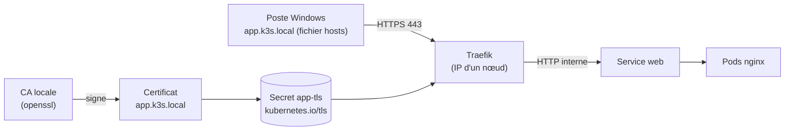

# Lab 13.2 : Exposition sécurisée avec TLS

| | |
|---|---|
| **Durée** | 75 à 90 min |
| **Niveau** | Guidé |
| **Prérequis** | [Lab 3.2](../../partie-1-fondations/ch03-services-reseau/lab-3-2-ingress-traefik.md) réalisé (Ingress Traefik, hôte local), [cours du chapitre 13](cours.md) lu, cluster `Ready`, poste Windows avec `curl.exe` |
| **Acquis visés** | AA8 (AA3 en soutien) |

!!! abstract "Objectifs"
    - Reproduire le chemin d'une requête publique : nom, IP, Ingress, Service, Pods
    - Créer une autorité de certification locale et un certificat pour un nom d'hôte
    - Publier le certificat dans un Secret `kubernetes.io/tls` et l'associer à un Ingress
    - Vérifier la chaîne de confiance avec `curl` et `openssl`
    - Restreindre un Ingress au HTTPS et constater l'effet sur HTTP
    - Recenser les ports ouverts d'un nœud et proposer des règles de filtrage

## Contexte et schéma

Vous n'avez pas de nom de domaine public ni d'IP publique : ce lab **simule** l'exposition sur Internet. Le principe est identique. Le fichier `hosts` de votre poste joue le rôle du DNS, et une **autorité de certification locale** joue le rôle de Let's Encrypt.



!!! info "Et avec un vrai domaine ?"
    Avec un nom de domaine public pointant vers une IP publique, et le port 80 ouvert, Let's Encrypt délivre un certificat reconnu par tous les navigateurs, par le défi HTTP-01 (cours, section 6). Les manifestes Kubernetes (Secret TLS, section `tls` de l'Ingress) sont les mêmes que dans ce lab.

!!! warning "Certificat de TP"
    Votre autorité locale n'est reconnue par aucun navigateur : c'est voulu. Ne l'installez pas durablement sur un poste, et ne réutilisez jamais ces clés ailleurs.

## Étapes

### Étape 1 : Déployer l'application

```bash
k create namespace tp-k8s
k config set-context --current --namespace=tp-k8s

k create deployment web --image=nginx:1.26-alpine --replicas=2
k expose deployment web --port=80
k set resources deployment web --requests=cpu=20m,memory=16Mi --limits=cpu=100m,memory=64Mi
k get pods,svc
```

Relevez l'IP d'un nœud :

```bash
NODEIP=$(k get nodes -o jsonpath='{.items[0].status.addresses[0].value}')
echo $NODEIP
```

### Étape 2 : Un nom pour l'application (le « DNS »)

Sur le **poste Windows**, ouvrez le Bloc-notes **en administrateur** et ajoutez à la fin du fichier `C:\Windows\System32\drivers\etc\hosts` (remplacez l'IP par `$NODEIP`) :

```text
192.168.xx.xx   app.k3s.local
```

Vérifiez dans PowerShell :

```powershell
ping app.k3s.local
```

### Étape 3 : Un Ingress en HTTP

Sur le serveur, créez `ingress.yaml` :

```bash
cat <<'EOF2' > ingress.yaml
apiVersion: networking.k8s.io/v1
kind: Ingress
metadata:
  name: web
spec:
  ingressClassName: traefik
  rules:
    - host: app.k3s.local
      http:
        paths:
          - path: /
            pathType: Prefix
            backend:
              service:
                name: web
                port:
                  number: 80
EOF2
k apply -f ingress.yaml
k get ingress
```

Testez depuis le poste Windows :

```powershell
curl.exe -i http://app.k3s.local
```

Attendu : `200 OK` et la page d'accueil de nginx.

- [ ] La page est servie en HTTP sur `app.k3s.local`

### Étape 4 : Que se passe-t-il en HTTPS sans certificat ?

```powershell
curl.exe -k -v https://app.k3s.local 2>&1 | Select-String "subject|issuer|HTTP/"
```

L'option `-k` désactive la vérification. Le certificat présenté est un certificat par défaut de Traefik : il ne correspond à aucun nom, le navigateur le refuserait. Retenez ce que vous voyez dans `subject` et `issuer`.

### Étape 5 : Créer l'autorité locale et le certificat

Sur le serveur :

```bash
mkdir -p ~/tls && cd ~/tls

# 1. Autorité de certification (CA) locale
openssl genrsa -out ca.key 4096
openssl req -x509 -new -nodes -key ca.key -sha256 -days 30 \
  -subj "/CN=CA locale du TP" -out ca.crt

# 2. Clé et demande de certificat du serveur
openssl genrsa -out app.key 2048
openssl req -new -key app.key -subj "/CN=app.k3s.local" -out app.csr

# 3. Signature par la CA, avec le nom d'hôte en SAN
cat <<'EOF2' > app.ext
subjectAltName=DNS:app.k3s.local
EOF2
openssl x509 -req -in app.csr -CA ca.crt -CAkey ca.key -CAcreateserial \
  -out app.crt -days 30 -sha256 -extfile app.ext
```

Inspectez le certificat :

```bash
openssl x509 -in app.crt -noout -subject -issuer -dates -ext subjectAltName
```

Relevez : le sujet (`CN`), l'émetteur, les dates de validité, le nom alternatif (SAN).

!!! tip "Pourquoi le SAN ?"
    Les clients modernes vérifient le nom d'hôte dans le champ **SAN** (*Subject Alternative Name*), et non plus dans le `CN`. Un certificat sans SAN est refusé.

- [ ] Les fichiers `ca.crt`, `app.crt` et `app.key` existent
- [ ] Le certificat est valable 30 jours et contient `DNS:app.k3s.local`

### Étape 6 : Publier le certificat dans Kubernetes

```bash
k create secret tls app-tls --cert=app.crt --key=app.key
k get secret app-tls
k describe secret app-tls
```

Le Secret est de type `kubernetes.io/tls`, avec les clés `tls.crt` et `tls.key`. Complétez ensuite l'Ingress avec une section `tls` :

```bash
cd ~
cat <<'EOF2' > ingress.yaml
apiVersion: networking.k8s.io/v1
kind: Ingress
metadata:
  name: web
spec:
  ingressClassName: traefik
  tls:
    - hosts:
        - app.k3s.local
      secretName: app-tls
  rules:
    - host: app.k3s.local
      http:
        paths:
          - path: /
            pathType: Prefix
            backend:
              service:
                name: web
                port:
                  number: 80
EOF2
k apply -f ingress.yaml
k describe ingress web
```

- [ ] Le Secret `app-tls` est de type `kubernetes.io/tls`
- [ ] L'Ingress mentionne le Secret `app-tls`

### Étape 7 : Vérifier la chaîne de confiance

Depuis le **serveur**, avec la CA locale (et sans désactiver la vérification) :

```bash
curl -v --cacert ~/tls/ca.crt --resolve app.k3s.local:443:$NODEIP https://app.k3s.local 2>&1 | grep -E "subject|issuer|expire|SSL certificate verify|HTTP/"
```

Attendu : `SSL certificate verify ok` et `HTTP/... 200`. Relancez **sans** `--cacert` :

```bash
curl -sS --resolve app.k3s.local:443:$NODEIP https://app.k3s.local | head -3
```

Attendu : une erreur de vérification du certificat (`unable to get local issuer certificate`). Le client ne connaît pas votre CA : c'est le comportement correct.

Inspectez enfin le certificat réellement servi :

```bash
openssl s_client -connect $NODEIP:443 -servername app.k3s.local -CAfile ~/tls/ca.crt </dev/null 2>/dev/null \
  | grep -E "subject=|issuer=|Verify return code"
```

Vous devez retrouver votre certificat (et non plus celui par défaut de Traefik), avec `Verify return code: 0 (ok)`.

- [ ] La vérification réussit avec `--cacert`
- [ ] Elle échoue sans `--cacert`
- [ ] `openssl s_client` affiche votre certificat et `Verify return code: 0 (ok)`

### Étape 8 : Restreindre l'Ingress au HTTPS

Aujourd'hui l'application répond en HTTP **et** en HTTPS. Restreignez-la au point d'entrée HTTPS de Traefik :

```bash
k annotate ingress web traefik.ingress.kubernetes.io/router.entrypoints=websecure
k get ingress web -o yaml | grep -A3 annotations
```

Testez les deux protocoles depuis le serveur :

```bash
curl -s -o /dev/null -w "HTTP  : %{http_code}\n" --resolve app.k3s.local:80:$NODEIP http://app.k3s.local
curl -s -o /dev/null -w "HTTPS : %{http_code}\n" --cacert ~/tls/ca.crt --resolve app.k3s.local:443:$NODEIP https://app.k3s.local
```

Attendu : HTTP renvoie `404` (plus de route sur ce point d'entrée), HTTPS renvoie `200`.

!!! note "Redirection HTTP vers HTTPS"
    En production, on **redirige** HTTP vers HTTPS plutôt que de répondre `404`. Avec Traefik, cela passe par un objet personnalisé (*Middleware*), que vous découvrirez avec les CRD au chapitre 14.

Depuis le poste Windows, avec la CA :

```powershell
scp utilisateur@IP-DU-SERVEUR:~/tls/ca.crt .
curl.exe --ssl-no-revoke --cacert ca.crt https://app.k3s.local
```

(`--ssl-no-revoke` évite l'erreur de contrôle de révocation de Windows avec une CA de TP.)

- [ ] HTTP : 404 ; HTTPS : 200
- [ ] `curl.exe` sur Windows réussit avec `--cacert`

### Étape 9 : La surface d'attaque d'un nœud

Sur un serveur, listez les ports en écoute :

```bash
sudo ss -tlnp | awk 'NR==1 || /LISTEN/ {print $1, $4, $6}' | sort -u
sudo ss -ulnp | awk 'NR==1 || /UNCONN/ {print $1, $4, $6}' | sort -u
```

Recopiez les ports dans un tableau et classez-les. Les ports usuels d'un nœud k3s :

| Port | Usage habituel |
|---|---|
| 22/tcp | Administration SSH |
| 80/tcp, 443/tcp | Traefik (Ingress) |
| 6443/tcp | API Kubernetes |
| 10250/tcp | kubelet |
| 2379-2380/tcp | etcd (serveurs, cluster HA) |
| 8472/udp | Réseau entre nœuds (Flannel) |
| 30000-32767 | Plage des Services `NodePort` |

Pour chaque port observé, décidez s'il doit être **ouvert à Internet**, **ouvert aux seuls nœuds du cluster**, ou **accessible depuis les adresses d'administration**. Rédigez le tableau de règles de pare-feu que vous appliqueriez à un nœud exposé sur Internet.

!!! warning "Ne pas appliquer de pare-feu sur vos VMs"
    Une règle trop stricte coupe la communication entre les nœuds et casse le cluster. Dans ce lab, vous **rédigez** les règles sans les appliquer.

- [ ] Le tableau des ports ouverts est rempli, avec le classement de chacun
- [ ] Les règles proposées n'ouvrent à Internet que 80 et 443

## Questions de réflexion

??? question "Pourquoi le certificat par défaut de Traefik pose-t-il problème en HTTPS ?"
    Il ne correspond à aucun nom d'hôte et n'est signé par aucune autorité reconnue : les navigateurs et les clients le refusent. Seul un certificat qui couvre le nom demandé, signé par une autorité de confiance, est accepté.

??? question "Pourquoi `curl` a-t-il échoué sans `--cacert`, alors que le certificat est correct ?"
    Le client vérifie que le certificat est signé par une autorité qu'il connaît. Votre CA locale ne figure pas dans sa liste. Pour Let's Encrypt, la CA est déjà présente dans le système : aucune option n'est nécessaire.

??? question "Le certificat expire dans 30 jours. Qu'est-ce qui change avec Let's Encrypt, et comment éviter l'oubli du renouvellement ?"
    Un certificat Let's Encrypt a aussi une durée de vie courte. Il faut automatiser son renouvellement avec un composant comme cert-manager, ou avec Traefik, au lieu de le faire à la main.

??? question "Où se trouve la clé privée dans le cluster, et quel risque cela présente-t-il ?"
    Dans le Secret `app-tls`, encodée en base64 (pas chiffrée). Quiconque peut lire les Secrets du namespace obtient la clé. D'où l'importance du RBAC (chapitre 7) et de ne jamais versionner ce Secret en clair dans Git (chapitre 12).

??? question "Pourquoi n'expose-t-on pas le port 6443 de l'API à Internet ?"
    L'API donne le contrôle du cluster. Il faut en limiter l'accès aux adresses d'administration, ou passer par un VPN ou une machine de rebond.

## Dépannage

| Symptôme | Pistes |
|---|---|
| `ping app.k3s.local` ne répond pas | Fichier `hosts` non enregistré (éditeur sans droits administrateur), mauvaise IP |
| `404 page not found` en HTTP | Hôte envoyé différent de `app.k3s.local` ; Ingress dans un autre namespace |
| `502` ou `503` | Pods `web` non prêts, mauvais nom ou port du Service : `k get endpoints web` |
| `curl.exe` : `schannel: ... CRYPT_E_NO_REVOCATION_CHECK` | Ajouter `--ssl-no-revoke` (CA de TP sans point de révocation) |
| `unable to get local issuer certificate` avec `--cacert` | Mauvais fichier `ca.crt`, ou certificat non signé par cette CA : refaire l'étape 5 dans l'ordre |
| Certificat par défaut toujours servi | Secret absent ou dans un autre namespace, `secretName` incorrect, nom d'hôte du Secret différent de celui de l'Ingress |
| Erreur `no alternative certificate subject name matches` | SAN absent : recréer le certificat avec `app.ext` |
| `scp` échoue depuis Windows | Service SSH, nom d'utilisateur, chemin du fichier |
| Port visible dans `ss` mais inconnu | Rechercher le processus avec la colonne `-p` avant de conclure |

## Nettoyage

```bash
k delete namespace tp-k8s
k config set-context --current --namespace=default
rm -rf ~/tls ~/ingress.yaml
```

Sur le poste Windows : supprimez la ligne `app.k3s.local` du fichier `hosts` et le fichier `ca.crt` copié. Les clés de ce lab ne servent à rien en dehors de lui.