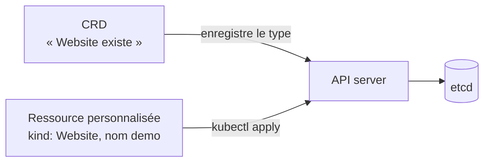
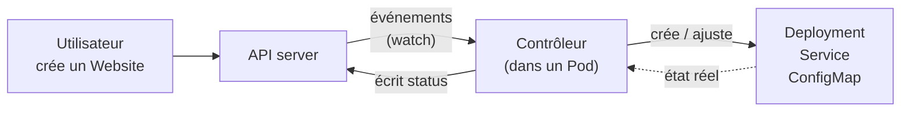
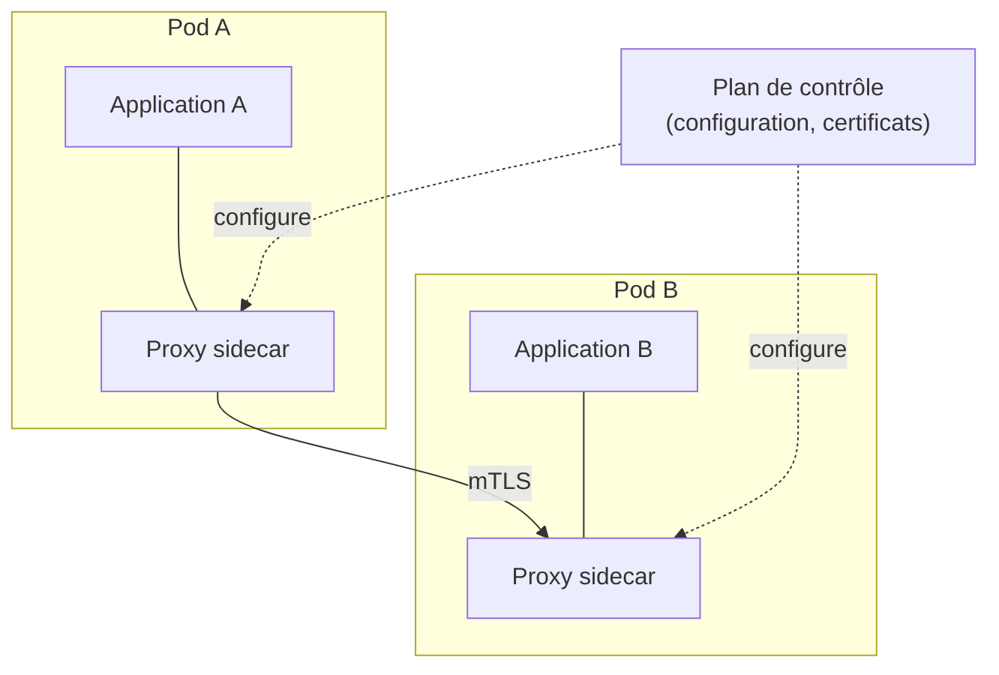

# Chapitre 14 : Extensibilité

!!! abstract "Objectifs du chapitre"
    - Citer les principaux points d'extension de Kubernetes
    - Expliquer ce qu'est une CustomResourceDefinition (CRD) et une ressource personnalisée
    - Décrire le fonctionnement d'un contrôleur et le modèle « opérateur »
    - Reconnaître les CRD déjà rencontrées dans le cours (Traefik, Argo CD, cert-manager)
    - Décrire les fonctions d'un service mesh, son architecture et son coût
    - Évaluer l'intérêt d'une extension pour un besoin donné
    - Acquis d'apprentissage visé : **AA8**

## 1. Pourquoi étendre Kubernetes ?

Kubernetes connaît des objets généraux : Pod, Deployment, Service. Mais un besoin comme « une base PostgreSQL avec sauvegardes et bascule automatique » ou « un certificat TLS renouvelé tout seul » n'y a pas d'objet dédié. Plutôt que de multiplier les objets natifs, Kubernetes permet d'**ajouter les siens**, qui se manipulent ensuite avec les mêmes outils (`kubectl`, RBAC, YAML, GitOps).

| Point d'extension | Ce qu'on ajoute | Exemple |
|---|---|---|
| **CRD** (*CustomResourceDefinition*) | De nouveaux types d'objets dans l'API | `Application` d'Argo CD, `Certificate` de cert-manager |
| **Contrôleur / opérateur** | La logique qui donne vie à ces objets | L'opérateur d'une base de données |
| Webhooks d'admission | Un contrôle ou une modification à la création d'un objet | Refuser les images non signées |
| Plugins d'infrastructure (CNI, CSI, CRI) | Réseau, stockage, moteur de conteneurs | Flannel, `local-path` (chapitres 1 et 5) |
| Plugins `kubectl` | De nouvelles sous-commandes | `kubectl neat`, `kubectl ctx` |

Ce chapitre traite des deux premiers, puis présente le **service mesh**.

## 2. Les CRD : de nouveaux types d'objets

Une **CRD** déclare à l'API server un nouveau type. Après son enregistrement, l'API accepte, valide et stocke (dans etcd) des objets de ce type : les **ressources personnalisées** (*custom resources*, CR).



Exemple de CRD pour un type fictif `Website` :

```yaml
apiVersion: apiextensions.k8s.io/v1
kind: CustomResourceDefinition
metadata:
  name: websites.cours.example.org      # <pluriel>.<groupe>
spec:
  group: cours.example.org
  scope: Namespaced
  names:
    plural: websites
    singular: website
    kind: Website
    shortNames: [ws]
  versions:
    - name: v1
      served: true
      storage: true
      subresources:
        status: {}
      additionalPrinterColumns:
        - name: Replicas
          type: integer
          jsonPath: .spec.replicas
      schema:
        openAPIV3Schema:
          type: object
          properties:
            spec:
              type: object
              required: [message]
              properties:
                message:
                  type: string
                replicas:
                  type: integer
                  minimum: 1
                  maximum: 5
                  default: 1
            status:
              type: object
              properties:
                phase:
                  type: string
```

| Champ | Rôle |
|---|---|
| `group`, `names`, `versions` | Identité du type : `cours.example.org/v1`, `kind: Website` |
| `scope` | `Namespaced` (dans un namespace) ou `Cluster` |
| `schema.openAPIV3Schema` | **Validation** : types, champs obligatoires, bornes. L'API refuse un objet non conforme |
| `subresources.status` | Sépare l'état observé (`status`) de l'état voulu (`spec`) : même principe que pour les Pods |
| `additionalPrinterColumns` | Colonnes affichées par `kubectl get` |

Une ressource personnalisée se rédige comme n'importe quel objet :

```yaml
apiVersion: cours.example.org/v1
kind: Website
metadata:
  name: demo
spec:
  message: "Bonjour"
  replicas: 2
```

!!! warning "Une CRD seule ne fait rien"
    Créer un objet `Website` ne crée ni Pod ni Service. L'API **stocke** simplement l'objet. Il faut un **contrôleur** pour agir.

## 3. Contrôleurs et opérateurs

Vous connaissez la boucle de réconciliation (chapitre 1) : un contrôleur compare l'état voulu et l'état réel, et agit pour les rapprocher. Les Deployments ont leur contrôleur dans le cluster. Pour une CRD, c'est vous (ou un éditeur) qui fournissez le contrôleur.



Un contrôleur typique :

1. **observe** les objets de son type (mécanisme de *watch* de l'API) ;
2. **compare** à l'état réel (Pods, Services, etc.) ;
3. **crée, modifie ou supprime** les objets nécessaires ;
4. **écrit le `status`** de l'objet ;
5. recommence à chaque événement, et à intervalle régulier.

Un **opérateur** est un contrôleur qui encode le **savoir-faire d'un exploitant** pour une application : installation, configuration, sauvegarde, mise à jour, bascule en cas de panne. Typiquement : une CRD (« un cluster PostgreSQL ») + un contrôleur déployé dans le cluster.

| | Sans opérateur | Avec opérateur |
|---|---|---|
| Déployer une base répliquée | Manifestes StatefulSet, scripts, procédures | Un objet `Cluster` de quelques lignes |
| Sauvegarde, bascule, mise à jour | Procédures manuelles | Gérés par le contrôleur |
| Risque | Erreur humaine | Dépendance à la qualité de l'opérateur |

Les opérateurs se construisent avec des outils comme Operator SDK ou Kubebuilder (langage Go le plus souvent). Les opérateurs existants se trouvent dans des catalogues publics.

!!! tip "Quand écrire (ou installer) un opérateur ?"
    Quand une application a un **cycle de vie complexe** que des manifestes ne suffisent pas à décrire (état, réplication, sauvegarde). Pour une application sans état, un Deployment et un chart Helm suffisent : un opérateur serait une complexité inutile.

### Les CRD que vous avez déjà rencontrées

| CRD | Apportée par | Chapitre | Rôle |
|---|---|---|---|
| `Application` | Argo CD | 12 | Décrit l'application à synchroniser depuis Git |
| `Middleware`, `IngressRoute`, `TraefikService` | Traefik | 3, 13 | Redirections, limites de débit, routage avancé |
| `Certificate`, `ClusterIssuer` | cert-manager | 13 | Certificats TLS obtenus et renouvelés automatiquement |
| `HelmChart` | k3s | 11 | Installe un chart Helm sans la commande `helm` |

Pour les lister : `kubectl get crd`.

## 4. Le service mesh (aperçu)

Dans une architecture en microservices, chaque service appelle d'autres services. Il faut alors, **entre les services**, chiffrer les échanges, réessayer en cas d'échec, mesurer la latence, répartir le trafic entre versions, limiter les accès. Faire cela dans le code de chaque application, dans chaque langage, est coûteux. Un **service mesh** déplace ces fonctions dans l'infrastructure.

| Fonction | Apport |
|---|---|
| **Sécurité** | Chiffrement mutuel (mTLS) entre services, identité de chaque service, règles d'autorisation |
| **Fiabilité** | Délais d'attente (*timeouts*), nouvelles tentatives, coupe-circuit |
| **Gestion du trafic** | Répartition pondérée entre versions (canary), bascule progressive, tests A/B |
| **Observabilité** | Latence, débit et taux d'erreur de chaque appel, sans modifier le code |

### Architecture



- Chaque Pod reçoit un **proxy sidecar** (vous connaissez ce motif depuis le chapitre 6) qui intercepte tout le trafic entrant et sortant de l'application.
- Le **plan de contrôle** distribue la configuration et les certificats aux proxys.
- Les applications ne changent pas : elles croient communiquer directement.

Des variantes récentes évitent un proxy par Pod (un agent par nœud, ou « sidecarless »), pour réduire le coût.

### Le coût d'un service mesh

| Coût | Détail |
|---|---|
| **Ressources** | Un proxy par Pod : CPU et mémoire supplémentaires, multipliés par le nombre de Pods |
| **Latence** | Chaque appel traverse deux proxys de plus |
| **Complexité** | Un composant de plus à installer, mettre à jour, déboguer |
| **Compétences** | Concepts et outils supplémentaires pour l'équipe |

!!! info "Un mesh n'est pas toujours la bonne réponse"
    Pour quelques services, un Ingress, des NetworkPolicies et une bonne observabilité suffisent. Le mesh se justifie quand le nombre de services, les exigences de sécurité (mTLS généralisé) ou la gestion du trafic le demandent. Dans ce cours, vos VMs de 2 Go sont trop justes pour en installer un de façon fiable : le Lab 14.2 en manipule les fonctions avec Traefik et en étudie le coût.

!!! tip "À retenir"
    - Kubernetes s'étend par des **CRD** (nouveaux types d'objets) et des **contrôleurs** (la logique qui les anime).
    - Une CRD déclare un type et le **valide** ; sans contrôleur, un objet n'est que des données stockées dans etcd.
    - Un **opérateur** = CRD + contrôleur qui encode le savoir-faire d'exploitation d'une application.
    - Vous utilisez déjà des CRD : Argo CD, Traefik, cert-manager, `HelmChart` de k3s (`kubectl get crd`).
    - Un **service mesh** fournit mTLS, fiabilité, gestion du trafic et observabilité grâce à un **proxy sidecar** par Pod.
    - Son coût (ressources, latence, complexité) doit être pesé contre le besoin.

## Pour vérifier votre compréhension

??? question "Vous créez un objet `Website` après avoir enregistré la CRD, mais aucun Pod n'apparaît. Pourquoi ?"
    La CRD fait seulement accepter et stocker l'objet par l'API. Aucun contrôleur n'observe les `Website` pour créer des Deployments et des Services : il faut en installer un.

??? question "À quoi sert le schéma `openAPIV3Schema` d'une CRD ?"
    À valider les objets à la création : types des champs, champs obligatoires, valeurs minimales et maximales, valeurs par défaut. Un objet non conforme est refusé par l'API.

??? question "Que devient-il des ressources personnalisées quand on supprime leur CRD ?"
    Elles sont supprimées avec elle : le type n'existe plus, ses objets non plus. Il faut donc sauvegarder les ressources avant de supprimer une CRD.

??? question "Quelle différence entre un contrôleur et un opérateur ?"
    Tous deux réconcilient l'état voulu et l'état réel. Un opérateur est un contrôleur spécialisé qui encode le savoir-faire d'exploitation d'une application précise (sauvegarde, bascule, mise à jour).

??? question "Citez deux fonctions d'un service mesh que vous ne pouviez pas obtenir avec un Service et un Ingress seuls."
    Le chiffrement mutuel (mTLS) entre services avec identité de chaque service ; les nouvelles tentatives et délais d'attente appliqués aux appels internes ; la répartition pondérée du trafic interne entre versions ; la mesure de la latence de chaque appel entre services.

??? question "Votre application compte 3 services sur un cluster de 3 VMs de 2 Go. Un service mesh est-il pertinent ?"
    Probablement non : les proxys sidecar consomment de la mémoire sur des nœuds déjà justes, et le nombre de services est faible. Un Ingress, des NetworkPolicies et la supervision répondent au besoin avec moins de complexité.

## Labs du chapitre

- [Lab 14.1 : CRD et opérateur](lab-14-1-crd-operateur.md)
- [Lab 14.2 : Découverte du service mesh](lab-14-2-service-mesh.md)