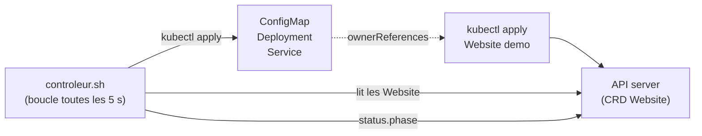

# Lab 14.1 : CRD et opérateur

| | |
|---|---|
| **Durée** | 75 à 90 min |
| **Niveau** | Semi-guidé |
| **Prérequis** | [Cours du chapitre 14](cours.md) lu, [Lab 4.1](../../partie-2-configuration-donnees-securite/ch04-configuration-ressources/lab-4-1-externaliser-configuration.md) réalisé (ConfigMap), [Lab 2.2](../../partie-1-fondations/ch02-pods-deployments/lab-2-2-deployments-mises-a-jour.md) réalisé (rolling update), cluster `Ready`, deux terminaux ouverts sur un serveur |
| **Acquis visés** | AA8 |

!!! abstract "Objectifs"
    - Définir une CRD avec un schéma de validation
    - Créer, lister et inspecter des ressources personnalisées avec `kubectl`
    - Constater qu'une ressource personnalisée, seule, ne déclenche aucune action
    - Faire fonctionner un contrôleur minimal qui réconcilie les objets `Website`
    - Observer la correction d'une dérive, la propagation d'une modification et la suppression en cascade
    - Mesurer l'écart entre ce contrôleur de TP et un véritable opérateur

## Contexte et schéma

Vous créez un nouveau type d'objet, `Website` : « un site web avec un message et un nombre de réplicas ». Vous écrivez ensuite un **contrôleur minimal** en shell, qui lit les objets `Website` et crée les ConfigMap, Deployment et Service correspondants.



!!! note "Un contrôleur de démonstration"
    Le script interroge l'API toutes les 5 secondes, depuis le serveur. Un vrai opérateur tourne dans un Pod, observe l'API par événements (*watch*) et utilise un langage compilé. Le principe de la boucle de réconciliation est le même : c'est lui que vous étudiez.

## Étapes

### Étape 1 : Préparer le namespace

```bash
k create namespace tp-k8s
k config set-context --current --namespace=tp-k8s
mkdir -p ~/lab14 && cd ~/lab14
```

### Étape 2 : Définir la CRD

Créez `website-crd.yaml`. Complétez la zone `À COMPLÉTER` : le champ `replicas` est un entier entre **1 et 5**, de valeur par défaut **1**.

```yaml
apiVersion: apiextensions.k8s.io/v1
kind: CustomResourceDefinition
metadata:
  name: websites.cours.example.org
spec:
  group: cours.example.org
  scope: Namespaced
  names:
    plural: websites
    singular: website
    kind: Website
    shortNames: [ws]
  versions:
    - name: v1
      served: true
      storage: true
      subresources:
        status: {}
      additionalPrinterColumns:
        - name: Replicas
          type: integer
          jsonPath: .spec.replicas
        - name: Phase
          type: string
          jsonPath: .status.phase
        - name: Age
          type: date
          jsonPath: .metadata.creationTimestamp
      schema:
        openAPIV3Schema:
          type: object
          properties:
            spec:
              type: object
              required: [message]
              properties:
                message:
                  type: string
                replicas:
                  À COMPLÉTER
            status:
              type: object
              properties:
                phase:
                  type: string
```

??? tip "Indices"
    Le cours (section 2) donne le schéma d'un champ entier avec bornes et valeur par défaut. Les mots-clés sont `type`, `minimum`, `maximum` et `default`.

```bash
k apply -f website-crd.yaml
k get crd websites.cours.example.org
k api-resources | grep -i website
k explain website.spec
```

La commande `k explain` affiche la documentation de votre type, générée à partir du schéma.

- [ ] La CRD est créée
- [ ] `k explain website.spec` décrit `message` et `replicas`

### Étape 3 : Créer des ressources personnalisées

```bash
cat <<'EOF2' > demo.yaml
apiVersion: cours.example.org/v1
kind: Website
metadata:
  name: demo
spec:
  message: "Bonjour depuis un opérateur"
  replicas: 2
EOF2
k apply -f demo.yaml
k get websites
k get ws demo -o yaml
```

Remarquez les colonnes `REPLICAS`, `PHASE` (vide pour l'instant) et `AGE`. Testez ensuite la validation avec trois objets invalides, un par un :

```bash
# 1. replicas hors bornes
cat <<'EOF2' | k apply -f -
apiVersion: cours.example.org/v1
kind: Website
metadata:
  name: trop-grand
spec:
  message: "x"
  replicas: 10
EOF2

# 2. champ obligatoire absent
cat <<'EOF2' | k apply -f -
apiVersion: cours.example.org/v1
kind: Website
metadata:
  name: sans-message
spec:
  replicas: 1
EOF2

# 3. champ inconnu
cat <<'EOF2' | k apply -f -
apiVersion: cours.example.org/v1
kind: Website
metadata:
  name: champ-inconnu
spec:
  message: "x"
  couleur: rouge
EOF2
```

Notez le message d'erreur de chacun, ainsi que la liste obtenue avec `k get websites`.

- [ ] L'objet `demo` existe
- [ ] Les trois objets invalides ont été refusés (ou, pour le champ inconnu, ignoré selon la version : notez ce que vous observez)

### Étape 4 : Une ressource personnalisée seule ne fait rien

```bash
k get all
k get configmap
```

Aucun Pod, Deployment ni Service n'a été créé pour `demo`. L'API a seulement **stocké** l'objet.

- [ ] Vous avez constaté l'absence de Pods

### Étape 5 : Écrire le contrôleur

Créez `controleur.sh`. Le script lit chaque `Website` et applique les objets correspondants (`kubectl apply` est idempotent). **Complétez le document `Service`**, signalé par `À COMPLÉTER` : un Service `site-$name`, de type `ClusterIP`, port 80, qui sélectionne les Pods `app: site-$name`, avec les mêmes `ownerReferences` que les autres objets.

```bash
cat <<'FIN' > controleur.sh
#!/bin/bash
# Contrôleur minimal pour les objets Website (boucle de réconciliation)
NS=tp-k8s
while true; do
  for name in $(kubectl get websites -n $NS -o jsonpath='{.items[*].metadata.name}'); do
    msg=$(kubectl get website $name -n $NS -o jsonpath='{.spec.message}')
    replicas=$(kubectl get website $name -n $NS -o jsonpath='{.spec.replicas}')
    uid=$(kubectl get website $name -n $NS -o jsonpath='{.metadata.uid}')
    hash=$(echo -n "$msg" | md5sum | cut -c1-8)

    cat <<EOF2 | kubectl apply -n $NS -f - > /dev/null
apiVersion: v1
kind: ConfigMap
metadata:
  name: site-$name
  ownerReferences:
    - apiVersion: cours.example.org/v1
      kind: Website
      name: $name
      uid: $uid
data:
  index.html: |
    <h1>$msg</h1>
---
apiVersion: apps/v1
kind: Deployment
metadata:
  name: site-$name
  ownerReferences:
    - apiVersion: cours.example.org/v1
      kind: Website
      name: $name
      uid: $uid
spec:
  replicas: $replicas
  selector:
    matchLabels:
      app: site-$name
  template:
    metadata:
      labels:
        app: site-$name
      annotations:
        message-hash: "$hash"
    spec:
      containers:
        - name: web
          image: nginx:1.26-alpine
          ports:
            - containerPort: 80
          resources:
            requests:
              cpu: 10m
              memory: 16Mi
            limits:
              cpu: 100m
              memory: 64Mi
          volumeMounts:
            - name: html
              mountPath: /usr/share/nginx/html
      volumes:
        - name: html
          configMap:
            name: site-$name
---
# À COMPLÉTER : Service site-$name (ClusterIP, port 80, sélecteur app: site-$name, ownerReferences)
EOF2

    kubectl patch website $name -n $NS --subresource=status --type=merge \
      -p '{"status":{"phase":"Reconciled"}}' > /dev/null
  done
  sleep 5
done
FIN
chmod +x controleur.sh
```

??? tip "Indices"
    - Le Service est un troisième document YAML, après le `---`. Remplacez la ligne de commentaire par ses champs.
    - Les `ownerReferences` sont identiques à ceux du ConfigMap et du Deployment : `apiVersion`, `kind`, `name`, `uid`.
    - Les variables `$name` et `$uid` sont remplacées par le shell dans le document (les délimiteurs `EOF2` ne sont pas entre apostrophes).

Points à comprendre dans le script :

| Élément | Rôle |
|---|---|
| Boucle `while true` + `sleep 5` | La boucle de réconciliation |
| `kubectl apply` | Rend l'état réel conforme à l'état voulu, sans erreur si rien ne change |
| `ownerReferences` | Lie les objets créés à leur `Website` : la suppression du `Website` supprime les enfants |
| `message-hash` | Une annotation du gabarit de Pod, calculée sur le message : un nouveau message change le gabarit, donc déclenche un rolling update (même principe qu'au Lab 11.2) |
| `patch ... --subresource=status` | Le contrôleur écrit l'état observé dans `status`, pas dans `spec` |

### Étape 6 : Lancer le contrôleur

Dans le **terminal 2**, laissez tourner le contrôleur :

```bash
cd ~/lab14
./controleur.sh
```

Dans le **terminal 1** :

```bash
k get websites
k get configmap,deploy,svc,pods -l app=site-demo
k get configmap,deploy,svc
k describe deployment site-demo | grep -i "controlled by"
```

Après quelques secondes, les objets apparaissent et la colonne `PHASE` indique `Reconciled`. La ligne `Controlled By` du Deployment indique `Website/demo`. Testez le site :

```bash
k port-forward svc/site-demo 8080:80 &
sleep 2
curl -s localhost:8080
kill %1
```

- [ ] `Phase` vaut `Reconciled`
- [ ] Deux Pods `site-demo` tournent
- [ ] Le Deployment est « contrôlé » par `Website/demo`
- [ ] La page affiche le message de l'objet

### Étape 7 : Observer la réconciliation

Dans le terminal 1, effectuez une action à la fois et observez avec `k get pods -w` (arrêt avec `Ctrl+C`) :

**a. Modifier l'état voulu.**

```bash
k patch website demo --type=merge -p '{"spec":{"replicas":4}}'
k get pods -l app=site-demo
```

**b. Changer le message.**

```bash
k patch website demo --type=merge -p '{"spec":{"message":"Nouveau message"}}'
k get pods -l app=site-demo -w
```

**c. Provoquer une dérive** en supprimant un objet géré :

```bash
k delete deployment site-demo
k get deploy,pods -l app=site-demo
```

**d. Supprimer la ressource personnalisée.**

```bash
k delete website demo
k get configmap,deploy,svc,pods
```

Pour chaque action, notez le délai et ce que fait le contrôleur.

- [ ] (a) Le nombre de Pods passe à 4
- [ ] (b) Un rolling update remplace les Pods, et la page affiche le nouveau message
- [ ] (c) Le Deployment est recréé en quelques secondes
- [ ] (d) La suppression du `Website` supprime ConfigMap, Deployment, Service et Pods (suppression en cascade)

### Étape 8 : Sans contrôleur

Arrêtez le contrôleur (`Ctrl+C` dans le terminal 2), puis :

```bash
k apply -f demo.yaml
k get websites
k get deploy,pods
```

L'objet est accepté, mais aucun Pod n'apparaît : l'état voulu est stocké, rien ne le réalise. Relancez `./controleur.sh` pour constater que tout est recréé, puis supprimez à nouveau `demo` et arrêtez le script.

Terminez par la suppression de la CRD :

```bash
k apply -f demo.yaml
k delete crd websites.cours.example.org
k get websites
```

Constatez que les ressources personnalisées ont disparu avec la CRD.

- [ ] Sans contrôleur, rien n'est créé
- [ ] La suppression de la CRD supprime ses objets

## Questions de réflexion

??? question "Quels éléments de la boucle de réconciliation du chapitre 1 retrouvez-vous dans le script ?"
    L'état voulu est lu dans `spec` du `Website` ; l'état réel est celui des objets du cluster ; `kubectl apply` rapproche le second du premier ; la boucle recommence toutes les 5 secondes. Le résultat est écrit dans `status`.

??? question "Pourquoi le script utilise-t-il `kubectl apply` plutôt que `kubectl create` ?"
    `apply` est idempotent : on peut l'exécuter à chaque tour sans erreur, et il corrige les écarts. Avec `create`, la deuxième exécution échouerait, car les objets existent déjà.

??? question "À quoi servent les `ownerReferences` ?"
    À lier les objets créés à leur propriétaire. Le ramasse-miettes de Kubernetes supprime les objets dont le propriétaire a disparu, d'où la suppression en cascade.

??? question "Citez trois différences entre ce script et un véritable opérateur."
    Un opérateur tourne dans le cluster, dans un Pod, avec un ServiceAccount et des droits RBAC limités ; il observe l'API par événements au lieu d'interroger toutes les 5 secondes ; il gère les erreurs et les conflits, des *finalizers* pour nettoyer avant suppression, des conditions détaillées dans `status`, une élection de leader pour la haute disponibilité. Il est écrit dans un langage adapté (souvent Go), testé et versionné.

??? question "Que doit-on faire avant de supprimer une CRD en production ?"
    Sauvegarder les ressources personnalisées (par exemple `kubectl get websites -A -o yaml`), car leur suppression avec la CRD est irréversible. Il faut aussi vérifier qu'aucun contrôleur n'en dépend.

## Dépannage

| Symptôme | Pistes |
|---|---|
| `k apply` de la CRD : erreur de schéma | Indentation de la zone complétée ; `type: integer` obligatoire |
| `error: the server doesn't have a resource type "websites"` | CRD absente ou supprimée : relancer l'étape 2 |
| `./controleur.sh : Permission denied` | `chmod +x controleur.sh` |
| `no matches for kind "Website"` | CRD non enregistrée : attendre une seconde, `k get crd` |
| `error: unknown flag: --subresource` | Version de `kubectl` trop ancienne : retirer l'appel `patch` du script, la colonne `PHASE` restera vide |
| Aucun objet créé par le script | Le script tourne-t-il (terminal 2) ? Variable `NS` ? message d'erreur de `kubectl apply` (retirer `> /dev/null` pour le voir) |
| Erreur YAML dans la sortie du script | Message de l'objet contenant des guillemets ou deux-points, document `Service` mal indenté |
| Service absent | Zone `À COMPLÉTER` du script non remplacée |
| Pods qui ne changent pas à l'étape 7b | Annotation `message-hash` absente ou mal placée (dans `template.metadata`) |
| Le Deployment n'est pas supprimé avec le `Website` | `ownerReferences` absents ou `uid` vide : `k get website demo -o jsonpath='{.metadata.uid}'` |

## Nettoyage

```bash
# Terminal 2 : Ctrl+C pour arrêter le contrôleur
k delete website --all 2>/dev/null
k delete crd websites.cours.example.org 2>/dev/null
k delete namespace tp-k8s
k config set-context --current --namespace=default
rm -rf ~/lab14
```