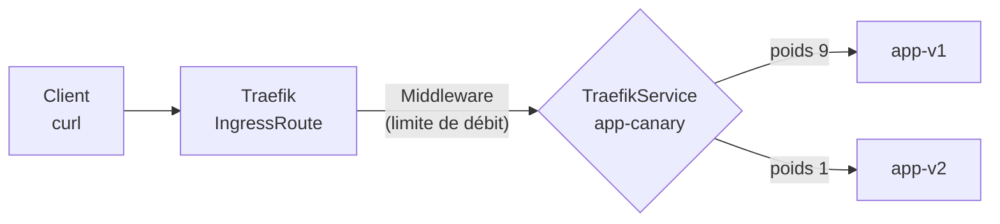

# Lab 14.2 : Découverte du service mesh

|                  |                                                                                                                                                                                                                   |
| ---------------- | ----------------------------------------------------------------------------------------------------------------------------------------------------------------------------------------------------------------- |
| **Durée**        | 60 à 75 min                                                                                                                                                                                                       |
| **Niveau**       | Guidé                                                                                                                                                                                                             |
| **Prérequis**    | [Lab 14.1](lab-14-1-crd-operateur.md) réalisé (CRD), [cours du chapitre 14](cours.md) lu, [Lab 3.2](../../partie-1-fondations/ch03-services-reseau/lab-3-2-ingress-traefik.md) réalisé (Traefik), cluster `Ready` |
| **Acquis visés** | AA8 (AA3 en soutien)                                                                                                                                                                                              |

!!! abstract "Objectifs" - Identifier les CRD de Traefik présentes dans votre cluster - Répartir le trafic entre deux versions d'une application (canary), avec un poids réglable - Limiter le débit d'une route avec un `Middleware` - Rediriger HTTP vers HTTPS (fonction annoncée au Lab 13.2) - Chiffrer le coût en mémoire d'un proxy sidecar sur vos nœuds - Décider, pour trois situations, si un service mesh se justifie

## Contexte et schéma

Aucun service mesh n'est installé dans ce lab : la mémoire de vos VMs de 2 Go ne le permet pas de façon fiable. Vous manipulez **quelques-unes de ses fonctions** (répartition pondérée du trafic, limitation de débit, redirection) avec les CRD de Traefik, puis vous étudiez le **coût** d'un mesh complet.



!!! warning "Fonctions de bordure, pas de mesh"
Traefik applique ces règles **à l'entrée du cluster**. Un service mesh les applique **entre tous les services**, grâce à un proxy sidecar dans chaque Pod : c'est la différence essentielle, et ce qui coûte en ressources.

## Étapes

### Étape 1 : Préparer le terrain

```bash
k create namespace tp-k8s
k config set-context --current --namespace=tp-k8s
NODEIP=$(k get nodes -o jsonpath='{.items[0].status.addresses[0].value}')
echo $NODEIP
k -n kube-system get deploy traefik -o jsonpath='{.spec.template.spec.containers[0].image}'; echo
k get crd | grep -i traefik
```

Notez la version de Traefik et la liste des CRD. Le **groupe d'API** de ces CRD dépend de la version de Traefik fournie par votre version de k3s : `traefik.io` (Traefik 3) ou `traefik.containo.us` (Traefik 2). Les manifestes ci-dessous utilisent `traefik.io/v1alpha1` ; si votre cluster expose l'autre groupe, adaptez-les avec :

```bash
sed -i 's#traefik.io/v1alpha1#traefik.containo.us/v1alpha1#' fichier.yaml
```

- [ ] Vous connaissez la version de Traefik et le groupe d'API de ses CRD

### Étape 2 : Deux versions de l'application

Déployez deux versions d'une page web, `v1` et `v2`, chacune avec son Service :

```bash
for v in v1 v2; do
cat <<EOF2 | k apply -f -
apiVersion: v1
kind: ConfigMap
metadata:
  name: page-$v
data:
  index.html: |
    <h1>Version $v</h1>
---
apiVersion: apps/v1
kind: Deployment
metadata:
  name: app-$v
spec:
  replicas: 1
  selector:
    matchLabels:
      app: app-$v
  template:
    metadata:
      labels:
        app: app-$v
    spec:
      containers:
        - name: web
          image: nginx:1.26-alpine
          ports:
            - containerPort: 80
          resources:
            requests:
              cpu: 10m
              memory: 16Mi
            limits:
              cpu: 100m
              memory: 64Mi
          volumeMounts:
            - name: html
              mountPath: /usr/share/nginx/html
      volumes:
        - name: html
          configMap:
            name: page-$v
---
apiVersion: v1
kind: Service
metadata:
  name: app-$v
spec:
  selector:
    app: app-$v
  ports:
    - port: 80
      targetPort: 80
EOF2
done
k get pods,svc
```

- [ ] Deux Pods `app-v1` et `app-v2` sont `Running`
- [ ] Deux Services existent

### Étape 3 : Répartir le trafic entre les deux versions (canary)

Créez `canary.yaml` :

```bash
cat <<'EOF2' > canary.yaml
apiVersion: traefik.io/v1alpha1
kind: TraefikService
metadata:
  name: app-canary
spec:
  weighted:
    services:
      - name: app-v1
        port: 80
        weight: 9
      - name: app-v2
        port: 80
        weight: 1
---
apiVersion: traefik.io/v1alpha1
kind: IngressRoute
metadata:
  name: app
spec:
  entryPoints:
    - web
  routes:
    - match: Host(`app.k3s.local`)
      kind: Rule
      services:
        - name: app-canary
          kind: TraefikService
EOF2
k apply -f canary.yaml
k get traefikservice,ingressroute
```

Envoyez 50 requêtes et comptez les réponses de chaque version (l'en-tête `Host` remplace une entrée DNS) :

```bash
for i in $(seq 1 50); do curl -s -H "Host: app.k3s.local" http://$NODEIP/; done | sort | uniq -c
```

Attendu : environ 9 réponses `v1` pour 1 réponse `v2`. Faites évoluer le poids : passez à `5` et `5`, puis à `0` et `1` (v2 est « promue ») :

```bash
sed -i '0,/weight: 9/s//weight: 5/; 0,/weight: 1$/s//weight: 5/' canary.yaml
k apply -f canary.yaml
for i in $(seq 1 50); do curl -s -H "Host: app.k3s.local" http://$NODEIP/; done | sort | uniq -c
```

Pour le passage à `0` et `1`, modifiez le fichier avec un éditeur (`nano canary.yaml`), réappliquez et recomptez.

- [ ] La répartition 9/1 est observée (à quelques réponses près)
- [ ] La répartition 5/5 est observée
- [ ] Avec `0` et `1`, toutes les réponses viennent de `v2`

### Étape 4 : Limiter le débit

Ajoutez un `Middleware` et rattachez-le à la route :

```bash
cat <<'EOF2' > limite.yaml
apiVersion: traefik.io/v1alpha1
kind: Middleware
metadata:
  name: limite
spec:
  rateLimit:
    average: 5
    burst: 10
EOF2
k apply -f limite.yaml
```

Modifiez `canary.yaml` : dans la route, ajoutez après `kind: Rule` :

```yaml
middlewares:
  - name: limite
```

Réappliquez, puis lancez 40 requêtes très rapides et comptez les codes de retour :

```bash
k apply -f canary.yaml
for i in $(seq 1 40); do curl -s -o /dev/null -w "%{http_code}\n" -H "Host: app.k3s.local" http://$NODEIP/; done | sort | uniq -c
```

Attendu : quelques `200` (la rafale autorisée), puis des `429` (_Too Many Requests_). Attendez quelques secondes et recommencez : les `200` reviennent.

- [ ] Des réponses `429` apparaissent lors de la rafale
- [ ] Le service redevient disponible après une courte pause

### Étape 5 : Rediriger HTTP vers HTTPS

Créez un `Middleware` de redirection et une seconde route, sur un autre nom d'hôte :

```bash
cat <<'EOF2' > redirect.yaml
apiVersion: traefik.io/v1alpha1
kind: Middleware
metadata:
  name: redirect-https
spec:
  redirectScheme:
    scheme: https
    permanent: true
---
apiVersion: traefik.io/v1alpha1
kind: IngressRoute
metadata:
  name: app-secure
spec:
  entryPoints:
    - web
  routes:
    - match: Host(`secure.k3s.local`)
      kind: Rule
      middlewares:
        - name: redirect-https
      services:
        - name: app-v1
          port: 80
EOF2
k apply -f redirect.yaml
curl -sI -H "Host: secure.k3s.local" http://$NODEIP/
```

Attendu : un code `301` ou `308` (redirection permanente) et un en-tête `Location: https://secure.k3s.local/`. Au Lab 13.2, la même route en HTTP répondait `404` : la redirection est la solution de production.

- [ ] La réponse est une redirection vers `https://secure.k3s.local/`

### Étape 6 : Le coût d'un proxy sidecar

Un mesh ajoute un proxy à **chaque** Pod. Mesurez ce que cela représenterait sur votre cluster.

```bash
k get pods -A --no-headers | wc -l
k top nodes
k get nodes -o custom-columns=NOM:.metadata.name,MEMOIRE:.status.allocatable.memory
```

Recherchez ensuite, dans la **documentation officielle** d'un service mesh de votre choix (Istio ou Linkerd, par exemple), la mémoire **demandée** (`requests`) par défaut pour un proxy sidecar. Notez la source, la version et la date de consultation : ne reprenez pas de valeur de mémoire.

Remplissez ce tableau :

| Élément                                                       | Valeur |
| ------------------------------------------------------------- | ------ |
| Nombre de Pods actuellement dans le cluster                   |        |
| Mémoire demandée par un proxy sidecar (source, version, date) |        |
| Mémoire supplémentaire = Pods × proxy                         |        |
| Mémoire libre actuelle des 3 nœuds (`k top nodes`)            |        |
| Part de la mémoire libre consommée par les proxys             |        |
| Mémoire demandée par le plan de contrôle du mesh (source)     |        |

Concluez en une phrase : le mesh tiendrait-il sur votre cluster ?

- [ ] Le tableau est rempli, avec ses sources
- [ ] Votre conclusion est justifiée par les chiffres

### Étape 7 : Faut-il un service mesh ?

Pour chacune des trois situations, répondez par **oui** ou **non** en 3 à 5 lignes, en citant une alternative lorsque la réponse est non :

1. Une application de 3 services sur un cluster de 3 VMs, exposée par un Ingress.
2. Une plateforme de 40 microservices dans plusieurs équipes, avec l'obligation de chiffrer **tous** les échanges internes et de tracer chaque appel.
3. Un monolithe et sa base de données, avec un déploiement par semaine.

Appuyez-vous sur la grille de la section 4 du cours (fonctions et coûts) et sur les mesures de l'étape 6.

- [ ] Les trois situations ont une réponse justifiée

## Questions de réflexion

??? question "Qu'est-ce qui distingue le canary de cette étape de celui d'un vrai service mesh ?"
Ici, la répartition s'applique à l'**entrée** du cluster, pour le trafic venant de l'extérieur. Un mesh l'applique aussi au trafic **entre services**, grâce aux proxys sidecar placés devant chaque Pod.

??? question "Pourquoi faire monter progressivement le poids de la nouvelle version ?"
Pour limiter l'impact d'un défaut : si `v2` pose problème, seule une petite part des utilisateurs est touchée, et le retour arrière consiste à remettre le poids à zéro, sans redéploiement.

??? question "Pourquoi une limitation de débit est-elle utile même quand l'application est correcte ?"
Elle protège l'application et ses dépendances contre les pics, les clients défaillants (boucles de nouvelles tentatives) et les abus, en renvoyant `429` au lieu de laisser le service s'effondrer.

??? question "Quels sont les trois principaux coûts d'un service mesh à base de sidecars ?"
Les ressources (un proxy par Pod, multiplié par le nombre de Pods, plus le plan de contrôle), la latence (deux proxys de plus par appel) et la complexité d'exploitation (un composant de plus à installer, mettre à jour et diagnostiquer).

??? question "Quelles alternatives apportent une partie de la sécurité d'un mesh pour une petite application ?"
Des NetworkPolicies pour contrôler les flux (chapitre 7), le TLS terminé à l'Ingress (chapitre 13), éventuellement TLS géré par l'application, et la supervision (chapitre 9) pour mesurer la latence et les erreurs.

## Dépannage

| Symptôme                                                 | Pistes                                                                                                             |
| -------------------------------------------------------- | ------------------------------------------------------------------------------------------------------------------ |
| `no matches for kind "IngressRoute"`                     | Mauvais groupe d'API : `k get crd \| grep -i traefik`, puis adapter avec `sed` (étape 1)                           |
| `404 page not found`                                     | En-tête `Host` différent de `app.k3s.local`, ou IngressRoute dans un autre namespace                               |
| `502 Bad Gateway` ou `503`                               | Pods `app-v1` ou `app-v2` non prêts, nom ou port de Service incorrect : `k get endpoints`                          |
| Tout vient de la même version                            | Poids à 0 sur l'autre, ou `weight` mal modifié par `sed` : relire `canary.yaml`                                    |
| La répartition varie beaucoup                            | Peu de requêtes : l'écart se réduit avec 100 requêtes                                                              |
| Aucun `429`                                              | Middleware non rattaché à la route (`middlewares:` mal placé), ou requêtes trop lentes pour dépasser 5 par seconde |
| `middleware ... does not exist` dans les logs de Traefik | Nom ou namespace du Middleware incorrect : `k get middleware`                                                      |
| Pas de redirection                                       | Mauvais nom d'hôte (`secure.k3s.local`), route sur le mauvais `entryPoints`                                        |
| `k top nodes` indisponible                               | metrics-server pas encore prêt : attendre une minute                                                               |

## Nettoyage

```bash
k delete namespace tp-k8s
k config set-context --current --namespace=default
rm -f canary.yaml limite.yaml redirect.yaml
```

La suppression du namespace supprime aussi les `IngressRoute`, `TraefikService` et `Middleware` (objets namespacés). Les CRD de Traefik, elles, appartiennent à k3s : ne les supprimez pas.
