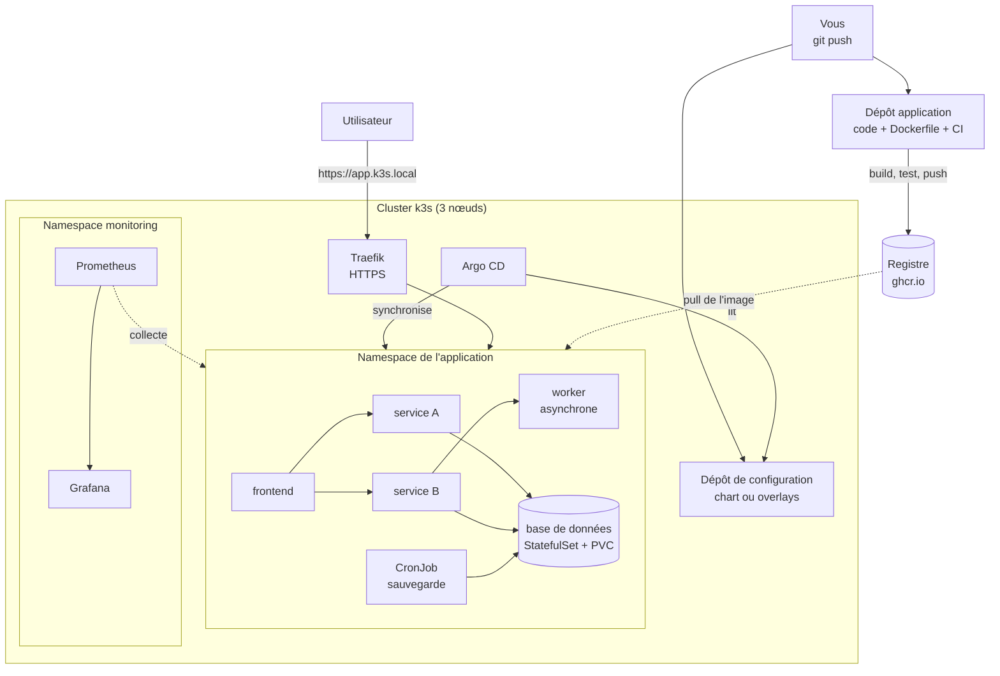

# Projet fil rouge : une plateforme applicative complète sur Kubernetes

## 1. Fiche du projet

| Rubrique | Description |
|---|---|
| Cours | Orchestration de conteneurs avec Kubernetes (k3s) |
| Position | Chapitre 15, point d'aboutissement du cours (40 % de la note) |
| Modalité | En binôme, sur votre cluster k3s (3 VMs sous VMware Workstation) |
| Niveau d'autonomie | **Autonome** : le cahier des charges et les critères de réussite sont donnés, la démarche est à construire |
| Durée | Séances de la Partie 4 consacrées au projet, travail personnel, puis soutenance en fin de semestre |
| Prérequis | Chapitres 1 à 14 ; mini-projets 1, 2 et 3 réalisés ; dépôts `webapp` et `webapp-config` du chapitre 12 |
| Acquis visés | **AA1 à AA8** |

## 2. Contexte

Les mini-projets vous ont fait déployer, sécuriser puis exploiter une application. Le projet fil rouge rassemble tout : vous concevez, déployez, sécurisez, exploitez, **industrialisez et évaluez** une application en microservices, comme le ferait une petite équipe de plateforme.

Vous jouez deux rôles successifs :

- **équipe de développement et de plateforme** : l'application est construite, livrée par un pipeline et déployée par GitOps ;
- **équipe d'exploitation et d'architecture** : elle est observée, mise à l'épreuve, puis **évaluée** selon sa fiabilité, son coût et sa sécurité.

> **Important :** l'évaluation porte moins sur le code de l'application que sur la **qualité des choix** et leur **justification**. Une solution simple, bien exploitée, mesurée et expliquée vaut plus qu'une solution ambitieuse mal maîtrisée.

!!! warning "Les ressources sont limitées"
    Vos trois VMs ont environ 2 vCPU et 2 Go de RAM. L'application, la supervision et Argo CD ne tiennent pas forcément ensemble. Un **plan de capacité** est donc un livrable : il montre ce que vous avez mesuré (`kubectl top`), ce qui tourne en même temps, et ce que vous faites tourner à tour de rôle. Dépasser 85 % de mémoire sur un nœud est un signal d'arrêt.

### Choix de l'application

Vous partez de votre application du Mini-projet 2, ou d'une autre de votre choix, avec ces contraintes minimales :

- **au moins quatre services applicatifs** en plus de la base (par exemple : interface web, deux services métier, un service de traitement asynchrone) ;
- une **base de données** conteneurisée avec un stockage persistant ;
- chaque service expose `/health` (état du processus) et `/ready` (prêt à recevoir du trafic) ;
- la configuration passe par des variables d'environnement, et les journaux vont sur la sortie standard ;
- les images sont construites **par votre pipeline** : aucune image n'est poussée à la main.

L'application doit rester **simple** : chaque service peut tenir en quelques dizaines de lignes. Faites valider votre choix à l'enseignant avant de commencer.

## 3. Objectifs pédagogiques

À l'issue du projet, vous êtes capables de :

1. concevoir une architecture en microservices pour Kubernetes et la justifier (AA1, AA2) ;
2. exposer l'application de façon sécurisée, avec routage et TLS (AA3) ;
3. gérer configuration, données et sécurité de bout en bout (AA4) ;
4. diagnostiquer un incident et en documenter la résolution (AA5) ;
5. mettre en place observabilité, autoscaling et résilience, et les mesurer (AA6) ;
6. automatiser la livraison avec Helm ou Kustomize, un pipeline CI et GitOps (AA7) ;
7. évaluer l'architecture selon la fiabilité, le coût et la sécurité, et proposer des améliorations (AA8).

## 4. Architecture cible

Cette figure est un **point de départ** : votre architecture peut différer, à condition de la justifier dans le rapport.

## 5. Cahier des charges

| N° | Axe | Exigence | AA |
|---|---|---|---|
| E1 | Architecture | Au moins 4 services applicatifs et une base de données ; schéma d'architecture et des flux, **avec justification des choix** | AA1 |
| E2 | Déploiement | Chaque service est un Deployment (ou StatefulSet) avec labels cohérents, **stratégie de mise à jour justifiée** et version d'image fixée | AA2 |
| E3 | Exposition | Un seul point d'entrée, l'Ingress, avec routage par hôte ou chemin ; les autres services restent internes | AA3 |
| E4 | TLS | L'accès se fait en HTTPS (certificat d'une autorité locale, comme au Lab 13.2) ; le HTTP est redirigé ou refusé | AA3 |
| E5 | Configuration | Configuration dans des ConfigMaps ; aucun mot de passe dans les images ni dans Git | AA4 |
| E6 | Secrets | Les secrets sont des Secrets Kubernetes, absents du dépôt (un `secret.example.yaml` documente leur forme) | AA4 |
| E7 | Données | La base utilise un StatefulSet avec un PVC ; un CronJob sauvegarde les données et les copie **hors du namespace** | AA4 |
| E8 | Droits | Un ServiceAccount par composant, avec le droit minimal (ou aucun droit) | AA4 |
| E9 | Pods durcis | Conteneurs non root, privilèges inutiles retirés, `securityContext` justifié pour chaque composant | AA4 |
| E10 | Réseau | NetworkPolicies : refus par défaut, puis autorisation des seuls flux nécessaires ; **matrice des flux** dans le rapport | AA4, AA3 |
| E11 | Ressources | `requests` et `limits` de chaque conteneur justifiés par des mesures | AA6 |
| E12 | Sondes | Sondes readiness et liveness adaptées à chaque service (la liveness ne dépend pas de la base) | AA5 |
| E13 | Supervision | Prometheus collecte nœuds et conteneurs ; un tableau de bord d'au moins 4 panneaux ; au moins 2 alertes documentées (symptôme, seuil, action) et prouvées | AA6 |
| E14 | Autoscaling | Un HPA sur au moins un service, avec comportement sous charge mesuré | AA6 |
| E15 | Résilience | Réplicas répartis sur les nœuds, PodDisruptionBudgets, `drain` d'un nœud sans interruption visible, **panne de nœud simulée et analysée** | AA6, AA5 |
| E16 | Sauvegarde du cluster | Snapshot etcd créé et copié hors des serveurs, procédure de restauration écrite | AA1, AA5 |
| E17 | Packaging | L'application se déploie à partir d'un **chart Helm** ou d'**overlays Kustomize** (au moins deux environnements : `dev` et `prod`) | AA7 |
| E18 | CI | Pipeline : build, test, publication des images dans un registre, étiquetées par commit ; un test en échec bloque la publication | AA7 |
| E19 | GitOps | Argo CD déploie l'application depuis le dépôt de configuration ; une nouvelle version se déploie par un commit ; un retour arrière se fait par `git revert` | AA7 |
| E20 | Diagnostic | Un **incident préparé par l'enseignant** est diagnostiqué selon la méthode du chapitre 9 ; journal de diagnostic remis | AA5 |
| E21 | Évaluation | Étude d'architecture : liste de contrôle de mise en production (synthèse, section 7) remplie, **estimation du coût** d'une architecture cloud équivalente avec un simulateur de prix public, comparaison k3s et Kubernetes managé, limites et améliorations proposées | AA8 |
| E22 | Plan de capacité | Tableau des ressources mesurées : ce qui tourne en même temps, ce qui tourne à tour de rôle, et pourquoi | AA6, AA8 |
| E23 | Documentation | Dépôts structurés, `README.md` avec procédures de déploiement et d'exploitation (maintenance, panne, restauration), historique Git montrant la contribution des **deux** membres | Tous |

## 6. Démarche en phases

Chaque phase donne un but, des **critères de réussite**, des **pistes** (notions et chapitres à relire, pas de commandes) et une question pour le rapport. À vous de construire la démarche, les manifestes et les scripts.

### Phase 0 : Cadrage et architecture

- **But :** décider ce que vous construisez, avant de le construire.
- **Critères de réussite :**
  - l'application est choisie et validée par l'enseignant ;
  - un schéma montre les services, les flux, les données, le chemin de livraison ;
  - un premier plan de capacité estime la mémoire de chaque composant ;
  - un tableau de répartition du travail désigne un responsable pour chaque phase (les deux membres touchent à tout, mais l'un pilote).
- **Pistes :** chapitres 1 à 3, 5, synthèse (section 3).
- **Question :** quelle est la partie de votre architecture la plus difficile à rendre disponible, et pourquoi ?

### Phase 1 : Application et pipeline CI

- **But :** des images construites et testées automatiquement.
- **Critères de réussite :**
  - chaque service a un `Dockerfile` et expose `/health` et `/ready` ;
  - le workflow construit toutes les images, exécute un test de fumée par service, publie dans le registre, avec le tag lié au commit ;
  - un test cassé volontairement bloque la publication (preuve en capture).
- **Pistes :** chapitre 12, Lab 12.1 (jeton `GITHUB_TOKEN`, paquets publics, minuscules).
- **Question :** que se passerait-il, pour vos utilisateurs, si votre pipeline publiait une image sans la tester ?

### Phase 2 : Déploiement et packaging

- **But :** un déploiement reproductible, sans copie manuelle de fichiers.
- **Critères de réussite :**
  - un chart Helm (ou une base Kustomize) décrit tous les composants ;
  - deux environnements, `dev` et `prod`, diffèrent par leurs values ou leurs overlays (réplicas, message, hôte, ressources) ;
  - `helm template` (ou `kubectl kustomize`) produit des manifestes valides avant tout déploiement.
- **Pistes :** chapitre 11, Labs 11.1 et 11.2.
- **Question :** qu'est-ce qui, dans votre application, doit être paramétrable, et qu'est-ce qui ne doit surtout pas l'être ?

### Phase 3 : Configuration, données et sécurité

- **But :** une application configurée et protégée selon le moindre privilège.
- **Critères de réussite :**
  - configuration et secrets séparés des images, secrets absents de Git ;
  - base de données sur StatefulSet et PVC, sauvegardée par CronJob, avec copie hors du namespace ;
  - un ServiceAccount par composant, droits minimaux ;
  - Pods non root, privilèges retirés ;
  - NetworkPolicies : refus par défaut, flux autorisés un par un, **matrice des flux** vérifiée par des tests (flux autorisé qui passe, flux interdit qui échoue).
- **Pistes :** chapitres 4 à 7, Labs 5.2, 6.1, 7.1 à 7.3 ; mini-projet 2.
- **Question :** quel flux interdit aurait pu rester ouvert sans que personne ne s'en aperçoive, et comment l'auriez-vous détecté ?

### Phase 4 : Exposition et TLS

- **But :** un point d'entrée unique et chiffré.
- **Critères de réussite :**
  - un seul Ingress, aucun NodePort exposé ;
  - un certificat signé par votre autorité locale, installé dans un Secret TLS ;
  - le HTTP est redirigé vers HTTPS ou refusé ;
  - la vérification de la chaîne de confiance est démontrée avec `curl` et `openssl`.
- **Pistes :** chapitres 3 et 13, Labs 3.2, 13.2, 14.2.
- **Question :** que faudrait-il changer pour passer à un vrai nom de domaine public avec Let's Encrypt ?

### Phase 5 : Supervision, sondes et ressources

- **But :** voir l'application, et la dimensionner d'après des mesures.
- **Critères de réussite :**
  - sondes en place, `requests` et `limits` justifiés par un tableau « mesure, valeur choisie, justification » ;
  - Prometheus et un tableau de bord de 4 panneaux au moins ;
  - deux alertes : pour chacune, symptôme, seuil et action, et passage à l'état `Firing` prouvé ;
  - le plan de capacité est mis à jour avec les mesures réelles.
- **Pistes :** chapitres 4 et 9, Labs 4.2, 9.1, 9.2 ; mini-projet 3.
- **Question :** quelle alerte seriez-vous prêts à recevoir à trois heures du matin, et laquelle serait du bruit ?

### Phase 6 : Autoscaling et résilience

- **But :** tenir la charge et les pannes, et le prouver.
- **Critères de réussite :**
  - HPA sur au moins un service, courbes de réplicas et de CPU lors d'un test de charge ;
  - réplicas répartis, PodDisruptionBudgets en place ;
  - `drain` d'un nœud sans interruption visible (boucle de mesure à l'appui) ;
  - panne de nœud simulée : délai de détection, délai de reprise, indisponibilité mesurée, explications (tolerations, répartition) ;
  - snapshot etcd copié hors des serveurs.
- **Pistes :** chapitres 8 et 10, Labs 8.2, 10.1, 10.2, 13.1.
- **Question :** quel composant reste un point de défaillance unique dans votre architecture, et que coûterait sa suppression ?

### Phase 7 : GitOps et gestion des versions

- **But :** déployer et annuler par Git seulement.
- **Critères de réussite :**
  - Argo CD synchronise l'application depuis le dépôt de configuration (états `Synced` et `Healthy`) ;
  - une nouvelle version est livrée par un commit dans le dépôt de configuration ; la dérive manuelle est détectée ;
  - un retour arrière est réalisé par `git revert`, avec la preuve de l'historique.
- **Pistes :** chapitre 12, Lab 12.2. Si la mémoire manque, réalisez cette phase à tour de rôle avec la supervision et conservez les preuves.
- **Question :** quelle étape de votre chaîne est encore manuelle, et comment l'automatiseriez-vous ?

### Phase 8 : Incident, évaluation et documentation

- **But :** diagnostiquer, évaluer, documenter.
- **Critères de réussite :**
  - un incident vous est fourni par l'enseignant : journal de diagnostic (symptôme, hypothèses, commandes, cause, correction, vérification), une seule modification à la fois ;
  - la liste de contrôle de mise en production est remplie, **chaque case justifiée** ;
  - le tableau de coût est issu d'un simulateur public, avec fournisseur, région, date ;
  - la comparaison k3s auto-géré et Kubernetes managé conclut sur un choix argumenté pour votre application ;
  - le `README.md` permet à un tiers de redéployer et d'exploiter l'application.
- **Pistes :** chapitres 9 et 13, Lab 9.3, synthèse (sections 5 et 7).
- **Question :** si votre application devait servir dix fois plus d'utilisateurs, que changeriez-vous en premier ?

### Phase 9 : Répétition de la soutenance

- **But :** une présentation claire, démontrée et maîtrisée par les deux membres.
- **Critères de réussite :**
  - un plan de présentation chronométré ;
  - une démonstration répétée, avec un plan de repli (captures, enregistrement) en cas de panne ;
  - chaque membre sait expliquer **n'importe quelle partie** du projet.
- **Pistes :** synthèse (section 8).
- **Question :** quelle question difficile le jury vous poserait-il, et comment y répondriez-vous ?

## 7. Livrables

1. **Deux dépôts Git** publics :
   - **dépôt application** : code des services, `Dockerfile`, workflow CI ;
   - **dépôt de configuration** : chart ou overlays, manifestes d'exploitation (supervision, politiques réseau, sauvegarde), `secret.example.yaml` (jamais de vrai secret), `README.md` avec les procédures d'exploitation, `docs/journal-incidents.md` ;
   - l'historique Git montre la contribution des deux membres.
2. **Rapport** de 8 à 12 pages, comprenant :
   - schéma d'architecture et de flux, justification des choix ;
   - tableau des exigences E1 à E23 avec la preuve associée (sortie de commande ou capture) ;
   - plan de capacité, tableau de justification des ressources, matrice des flux ;
   - courbes et mesures des phases 5 et 6 ;
   - étude d'architecture (liste de contrôle, coût, comparaison, limites et améliorations) ;
   - réponses aux questions de chaque phase.
3. **Soutenance** : présentation et démonstration de **15 minutes**, suivies de **10 minutes** de questions, **adressées à chacun des deux membres** (durées à confirmer par l'enseignant).

## 8. Grille d'évaluation (/20)

| Critère | Points | AA |
|---|---|---|
| Architecture et déploiement : cohérence, justification, stratégie de mise à jour | 2,5 | AA1, AA2 |
| Configuration, données et sécurité : secrets, stockage, sauvegarde, droits, durcissement, NetworkPolicies | 3,5 | AA4 |
| Exposition et TLS : point d'entrée unique, HTTPS, redirection | 1,5 | AA3 |
| Supervision, résilience et autoscaling : mesures, alertes, HPA, panne et maintenance, incident diagnostiqué | 4 | AA5, AA6 |
| Industrialisation : packaging, pipeline CI, GitOps, retour arrière | 3 | AA7 |
| Évaluation d'architecture : liste de contrôle, coût, comparaison, limites et améliorations | 2,5 | AA8 |
| Qualité du dépôt, du rapport et de la soutenance (démonstration, réponses de chaque membre) | 3 | Tous |

**Barème de la justification :** pour chaque critère technique, la moitié des points récompense la solution, l'autre moitié sa **justification** (mesure, critère, compromis). Une exigence réalisée mais non justifiée n'obtient pas tous les points.

!!! info "Évaluation individuelle"
    La note de groupe peut être modulée pour chaque membre selon l'historique Git et les réponses aux questions de la soutenance.

## 9. Erreurs fréquentes et conseils de diagnostic

| Symptôme | Pistes à explorer |
|---|---|
| Argo CD et Prometheus font saturer les nœuds | Plan de capacité absent : mesurer avec `kubectl top`, faire tourner à tour de rôle, réduire rétention et `limits` |
| Pipeline en échec sur le nom de l'image | Majuscules dans le nom du propriétaire : convertir en minuscules (Lab 12.1) |
| `ImagePullBackOff` | Paquet du registre privé, tag erroné, accès Internet : `kubectl describe pod` |
| Application correcte en `dev`, cassée en `prod` | Valeurs ou overlay différents : comparer les manifestes rendus (`helm template`, `kubectl kustomize`) |
| Service injoignable après NetworkPolicy | Flux oubliés : DNS en sortie, trafic venant de l'Ingress, flux vers la base |
| Argo CD `OutOfSync` en permanence | Champ géré par un autre acteur (par exemple `replicas` avec un HPA) |
| HPA à `<unknown>` | `requests` de CPU absentes, metrics-server indisponible |
| `drain` bloqué | PDB trop strict, volume `local-path`, Pod sans contrôleur |
| Données perdues à la suppression du namespace | Sauvegardes stockées dans le namespace : copie hors cluster non faite |
| Secret retrouvé dans l'historique Git | Un secret publié reste dans l'historique : le révoquer et en créer un nouveau, ne pas se contenter de le supprimer |
| Démonstration en échec | Pas de plan de repli : préparer des captures et vérifier le cluster avant la soutenance |

## 10. Pour aller plus loin (facultatif)

- Répartition progressive du trafic (canary) avec les CRD de Traefik, comme au Lab 14.2.
- Étendre l'API : un objet personnalisé et un petit contrôleur pour une partie de votre application, comme au Lab 14.1.
- Alertmanager pour envoyer les alertes vers un canal de notification.
- Mise à jour automatique du tag de l'image dans le dépôt de configuration par la CI.
- Réduire le délai de remplacement des Pods lors d'une panne, avec des tolerations courtes.
- Analyse de vulnérabilités des images dans le pipeline.