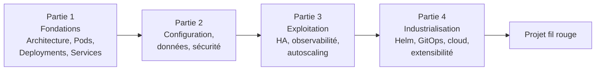
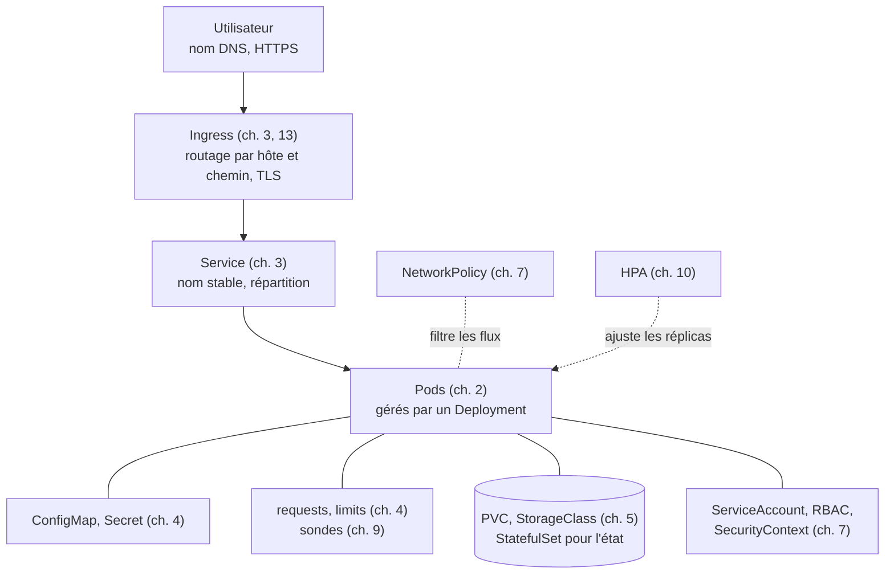
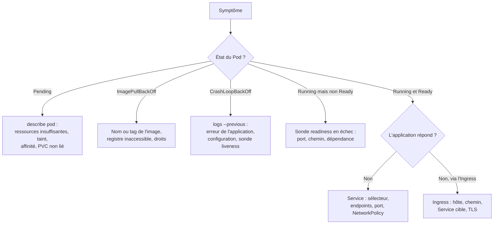

# Synthèse du cours

!!! abstract "Objectifs de la synthèse" - Relier les quinze chapitres dans une vue d'ensemble : du conteneur à l'application industrialisée - Retrouver, pour chaque acquis d'apprentissage (AA1 à AA8), les notions, les objets et les labs correspondants - Disposer d'une méthode de diagnostic et d'une liste de contrôle de mise en production - Préparer l'examen pratique et la soutenance du projet fil rouge - Acquis d'apprentissage visés : **AA1 à AA8**

Cette page ne remplace pas les chapitres : elle sert de **carte** et de **fiche de révision**. Chaque ligne renvoie à un chapitre ou à un lab où le détail est donné.

## 1. La carte du cours

| Partie                                | Question à laquelle elle répond                                                      | Chapitres | Mini-projet                               |
| ------------------------------------- | ------------------------------------------------------------------------------------ | --------- | ----------------------------------------- |
| 1. Fondations                         | Comment Kubernetes fonctionne-t-il, et comment déployer et exposer une application ? | 1 à 3     | MP1 : application à deux niveaux          |
| 2. Configuration, données et sécurité | Comment configurer, persister et protéger une application ?                          | 4 à 7     | MP2 : application trois niveaux sécurisée |
| 3. Exploitation                       | Comment garder l'application disponible, observable et élastique ?                   | 8 à 10    | MP3 : application sous charge             |
| 4. Industrialisation                  | Comment automatiser, évaluer et étendre la plateforme ?                              | 11 à 14   | Projet fil rouge                          |

## 2. Récapitulatif par chapitre

| Chap.                          | Notions essentielles                                                       | Objets et outils                                                   | AA       |
| ------------------------------ | -------------------------------------------------------------------------- | ------------------------------------------------------------------ | -------- |
| 1. Architecture                | Control plane, nœuds, modèle déclaratif, boucle de réconciliation          | `kubectl`, API server, etcd, kubelet                               | AA1      |
| 2. Pods et Deployments         | Cycle de vie du Pod, ReplicaSet, rolling update, labels et sélecteurs      | Pod, ReplicaSet, Deployment                                        | AA1, AA2 |
| 3. Services et réseau          | Découverte de services, DNS interne, routage HTTP                          | Service (ClusterIP, NodePort, LoadBalancer), Ingress, Traefik      | AA3      |
| 4. Configuration et ressources | Configuration externe, requests et limits, quotas                          | ConfigMap, Secret, ResourceQuota, LimitRange                       | AA4      |
| 5. Stockage                    | Persistance, provisionnement dynamique, identité stable                    | PV, PVC, StorageClass, StatefulSet, Service headless               | AA4      |
| 6. Workloads spécialisés       | Tâches ponctuelles ou planifiées, un Pod par nœud, motifs multi-conteneurs | Job, CronJob, DaemonSet, init, sidecar                             | AA2      |
| 7. Sécurité                    | Moindre privilège, durcissement, isolation réseau                          | RBAC, ServiceAccount, SecurityContext, Pod Security, NetworkPolicy | AA4      |
| 8. Administration              | Haute disponibilité, sauvegarde, mise à jour, maintenance                  | etcd embarqué, snapshot, `cordon`, `drain`                         | AA1, AA5 |
| 9. Observabilité et dépannage  | Sondes, journaux, événements, métriques, alertes, méthode de diagnostic    | probes, metrics-server, Prometheus, Grafana                        | AA5, AA6 |
| 10. Autoscaling et scheduling  | Adaptation à la charge, placement, disponibilité pendant les interruptions | HPA, affinités, taints, PodDisruptionBudget                        | AA6      |
| 11. Helm et Kustomize          | Paramétrer et empaqueter une application                                   | chart, values, release, base et overlay                            | AA7      |
| 12. CI/CD et GitOps            | Pipeline, registre d'images, état voulu dans Git                           | GitHub Actions, `ghcr.io`, Argo CD                                 | AA7      |
| 13. Cloud managé et HA         | Responsabilité partagée, coûts, zones, TLS, exposition publique            | zones, Secret TLS, Ingress TLS                                     | AA8      |
| 14. Extensibilité              | Étendre l'API, opérateurs, service mesh                                    | CRD, contrôleur, Middleware, sidecar                               | AA8      |

## 3. Du client au Pod : la vue d'ensemble

Cette vue regroupe les objets vus dans les chapitres 2 à 7. Retrouvez, pour chacun, le chapitre où il est étudié.

## 4. Le cycle de vie d'une application

| Étape              | Questions à se poser                                                     | Chapitres |
| ------------------ | ------------------------------------------------------------------------ | --------- |
| **Concevoir**      | Application sans état ou avec état ? Quels composants, quels flux ?      | 2, 5, 6   |
| **Déployer**       | Image versionnée ? Réplicas ? Stratégie de mise à jour ?                 | 2, 11     |
| **Exposer**        | Service, Ingress, TLS ? Quel nom d'hôte ?                                | 3, 13     |
| **Configurer**     | Configuration séparée de l'image ? Secrets hors de Git ?                 | 4, 12     |
| **Sécuriser**      | Droits minimaux ? Pod durci ? Flux réseau limités ?                      | 7         |
| **Exploiter**      | Sondes ? Métriques ? Alertes ? Sauvegardes ?                             | 8, 9      |
| **Adapter**        | Charge variable ? Répartition ? Disponibilité pendant les maintenances ? | 10        |
| **Industrialiser** | Déploiement reproductible ? Pipeline ? Git comme source de vérité ?      | 11, 12    |
| **Évaluer**        | Fiabilité, coût, sécurité : le compromis est-il justifié ?               | 13, 14    |

## 5. Diagnostiquer : l'arbre de décision

La méthode du chapitre 9 : observer, formuler une hypothèse, vérifier, corriger **une seule chose à la fois**, contrôler.

| Symptôme                | Premier réflexe                                                                      |
| ----------------------- | ------------------------------------------------------------------------------------ |
| `Pending`               | `kubectl describe pod` : lire la section `Events`                                    |
| `CrashLoopBackOff`      | `kubectl logs POD --previous`                                                        |
| Service injoignable     | `kubectl get endpoints SERVICE` : liste vide = sélecteur incorrect ou Pods non prêts |
| Accès refusé            | `kubectl auth can-i VERBE RESSOURCE --as=...`                                        |
| Comportement inexpliqué | `kubectl get events --sort-by=.lastTimestamp`                                        |
| Charge anormale         | `kubectl top pods`, puis métriques Prometheus                                        |

## 6. Commandes à connaître

| Besoin                   | Commande                                                                                                        |
| ------------------------ | --------------------------------------------------------------------------------------------------------------- |
| Lister, décrire          | `kubectl get RESSOURCE -o wide`, `kubectl describe RESSOURCE NOM`                                               |
| Appliquer, supprimer     | `kubectl apply -f FICHIER`, `kubectl delete -f FICHIER`                                                         |
| Documentation d'un champ | `kubectl explain pod.spec.containers`                                                                           |
| Journaux                 | `kubectl logs POD`, `kubectl logs POD --previous`, `kubectl logs -f POD`                                        |
| Entrer dans un conteneur | `kubectl exec -it POD -- sh`                                                                                    |
| Accéder localement       | `kubectl port-forward svc/NOM 8080:80`                                                                          |
| Mises à jour             | `kubectl rollout status\|history\|undo deployment NOM`                                                          |
| Mettre à l'échelle       | `kubectl scale deployment NOM --replicas=N`                                                                     |
| Consommation             | `kubectl top nodes`, `kubectl top pods`                                                                         |
| Maintenance d'un nœud    | `kubectl cordon NŒUD`, `kubectl drain NŒUD --ignore-daemonsets --delete-emptydir-data`, `kubectl uncordon NŒUD` |
| Droits                   | `kubectl auth can-i VERBE RESSOURCE --as=...`                                                                   |
| Sauvegarde etcd (k3s)    | `sudo k3s etcd-snapshot save`, `sudo k3s etcd-snapshot ls`                                                      |
| Helm                     | `helm install\|upgrade\|rollback\|uninstall RELEASE CHART`, `helm template`, `helm lint`                        |
| Kustomize                | `kubectl kustomize DOSSIER`, `kubectl apply -k DOSSIER`                                                         |

!!! tip "Gagner du temps"
Pour générer un manifeste de départ sans l'écrire de zéro : `kubectl create deployment web --image=nginx:1.26-alpine --dry-run=client -o yaml`. Relisez-le toujours avant de l'appliquer.

## 7. Liste de contrôle avant une mise en production

Cette liste sert de **grille d'évaluation** (AA8) pour juger une architecture, la vôtre ou celle d'un autre groupe.

| Domaine           | Points à vérifier                                                                                                                                         |
| ----------------- | --------------------------------------------------------------------------------------------------------------------------------------------------------- |
| **Déploiement**   | Images avec version fixée (jamais `latest`) ; stratégie de mise à jour définie ; manifestes dans Git                                                      |
| **Configuration** | Configuration hors de l'image ; aucun secret en clair dans Git                                                                                            |
| **Ressources**    | `requests` et `limits` justifiés par des mesures ; quotas dans les namespaces partagés                                                                    |
| **Fiabilité**     | Plusieurs réplicas répartis sur des nœuds ou des zones ; sondes readiness et liveness ; PodDisruptionBudget ; données sauvegardées et restauration testée |
| **Sécurité**      | RBAC au moindre privilège ; Pods non root, système de fichiers en lecture seule si possible ; NetworkPolicies ; TLS ; seuls 80 et 443 exposés             |
| **Observabilité** | Métriques collectées ; tableau de bord ; alertes documentées (symptôme, seuil, action)                                                                    |
| **Exploitation**  | Procédures de maintenance, de panne et de restauration écrites et essayées                                                                                |
| **Coût**          | Postes de coût identifiés ; ressources inutilisées supprimées ; dimensionnement proportionné au besoin                                                    |

## 8. Se préparer à l'évaluation

| Modalité                                            | Pondération | Ce qui est attendu                                                                                 |
| --------------------------------------------------- | ----------- | -------------------------------------------------------------------------------------------------- |
| Contrôle continu : TP notés et quiz                 | 30 %        | Régularité, maîtrise des notions de chaque chapitre                                                |
| Projet fil rouge : déploiement, rapport, soutenance | 40 %        | Une application complète, justifiée et exploitée ; voir [le projet fil rouge](projet-fil-rouge.md) |
| Examen pratique chronométré sur cluster             | 30 %        | Savoir-faire autonome sous contrainte de temps                                                     |

Conseils pour l'**examen pratique** :

- Entraînez-vous à partir de manifestes que vous **générez** (`--dry-run=client -o yaml`) et que vous adaptez, plutôt que d'écrire de mémoire.
- Utilisez `kubectl explain` pour retrouver un champ, et la documentation officielle quand elle est autorisée.
- Après chaque modification, **vérifiez** (`get`, `describe`, `curl`) avant de passer à la suite.
- En cas de blocage, appliquez l'arbre de décision de la section 5 plutôt que de modifier au hasard.
- Gérez votre temps : traitez d'abord ce que vous maîtrisez.

Conseils pour la **soutenance** :

- Présentez l'architecture avant les détails : schéma, choix, compromis.
- **Justifiez** chaque choix par un critère (fiabilité, coût, sécurité) et, si possible, par une mesure.
- Montrez le fonctionnement par une démonstration préparée, avec un plan de repli.
- Préparez ce que vous feriez autrement, et les limites de votre solution.

## 9. Pour aller plus loin

- La documentation officielle : [kubernetes.io](https://kubernetes.io/docs/) et [docs.k3s.io](https://docs.k3s.io/).
- Les ouvrages cités dans le syllabus : _Kubernetes in Action_, _Kubernetes Patterns_, _Production Kubernetes_.
- Les certifications de la fondation qui maintient Kubernetes : CKAD (développeur d'applications), CKA (administrateur), CKS (sécurité). Les exercices pratiques de ce cours préparent à ce format de travail en ligne de commande.
- Des sujets non traités ici : Gateway API en profondeur, politiques d'admission, multi-cluster, FinOps, sécurité de la chaîne d'approvisionnement (signature d'images).

!!! tip "À retenir" - Le cours suit un fil : **déployer, exposer, configurer, sécuriser, exploiter, industrialiser, évaluer**. - Tout repose sur le **modèle déclaratif** et la **réconciliation** : vous décrivez l'état voulu, Kubernetes le maintient. - Face à un incident : **observer, hypothèse, vérifier, corriger une chose, contrôler**. - Une architecture se juge sur sa **fiabilité**, son **coût** et sa **sécurité**, avec des choix **justifiés**. - Ce que vous automatisez (Helm, CI/CD, GitOps) doit rester **reproductible** et **versionné**.

## Pour vérifier votre compréhension

??? question "Une application Web a 3 réplicas derrière un Service, mais l'Ingress renvoie `503`. Quelles vérifications, dans quel ordre ?"
Les Pods sont-ils `Ready` (`get pods`) ? Le Service a-t-il des endpoints (`get endpoints`) ? Le sélecteur du Service correspond-il aux labels des Pods ? L'Ingress désigne-t-il le bon Service et le bon port ? Une NetworkPolicy bloque-t-elle le trafic venant de Traefik ?

??? question "Pourquoi les `requests` de CPU sont-ils indispensables à trois fonctions différentes du cours ?"
Le scheduler s'en sert pour placer les Pods (chapitre 4), le HPA calcule l'utilisation en pourcentage des `requests` (chapitre 10), et les quotas les comptabilisent par namespace (chapitre 4).

??? question "Que protège un PodDisruptionBudget, et que ne protège-t-il pas ?"
Il protège contre les interruptions **volontaires** (`drain`, mise à jour de nœud) en limitant le nombre de Pods indisponibles. Il ne protège pas d'une panne de nœud ni d'un `kubectl delete pod`.

??? question "Quelle différence entre un déploiement par pipeline (push) et par GitOps (pull) ?"
Dans le modèle push, le pipeline accède au cluster pour appliquer les manifestes. Dans le modèle pull, un agent installé dans le cluster lit Git et réconcilie : aucun identifiant du cluster n'est confié à l'extérieur, et la dérive est détectée.

??? question "Votre base de données tourne sur un volume `local-path`. Que se passe-t-il si son nœud tombe, et que proposez-vous ?"
Le Pod ne peut pas redémarrer ailleurs, car le volume est lié au nœud. Il faut répliquer les données (base répliquée ou service managé) et sauvegarder régulièrement, en testant la restauration.

??? question "Comparez k3s auto-géré et Kubernetes managé pour une petite équipe sans objectif de haute disponibilité strict."
Le managé délègue le control plane au fournisseur et réduit l'effort d'exploitation, au prix de frais et d'une dépendance au fournisseur. k3s donne la maîtrise totale et un coût de VMs plus bas, mais l'équipe exploite elle-même le control plane. Une petite équipe sans compétence d'exploitation préfère souvent le managé ; un besoin de maîtrise ou de coût minimal préfère k3s. Le choix doit être justifié par les trois critères.

## Pour la suite

- [Projet fil rouge](projet-fil-rouge.md)
