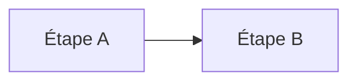

# Chapitre N : Titre du chapitre

!!! abstract "Objectifs du chapitre"
    - Objectif 1 (verbe d'action : expliquer, décrire, comparer…)
    - Objectif 2
    - Acquis d'apprentissage visés : AAx

## 1. Concept clé

Explication courte, avec un exemple concret.

## 2. Autre concept

| Terme | Définition |
|---|---|
| Terme 1 | Définition |

!!! tip "À retenir"
    - Point essentiel 1
    - Point essentiel 2

## Pour vérifier votre compréhension

??? question "Question 1"
    Réponse attendue.

## Labs du chapitre

- [Lab N.1 : Titre](lab-n-1-titre.md)
